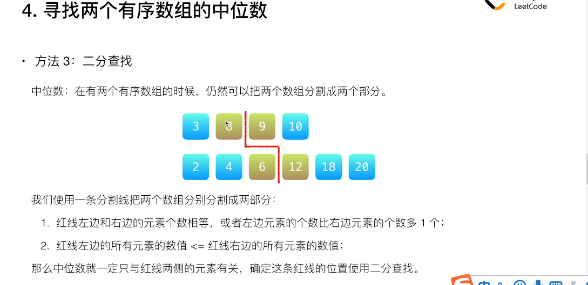
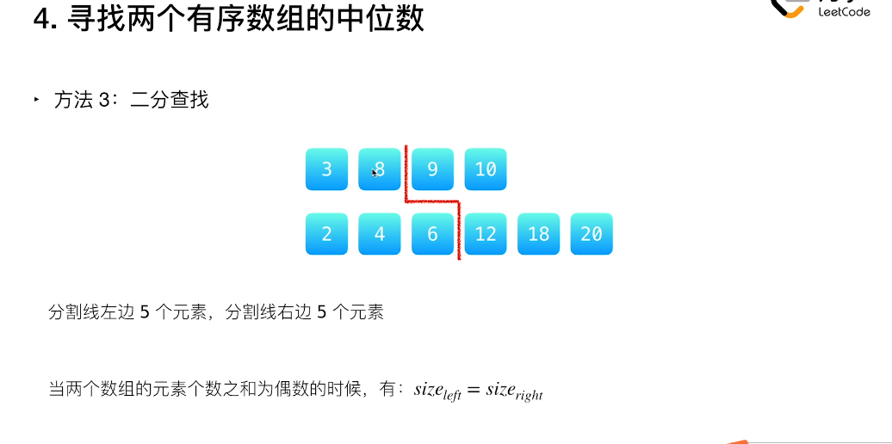
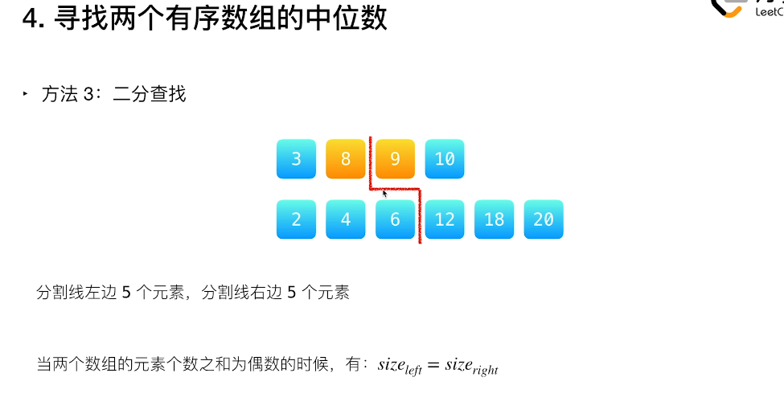
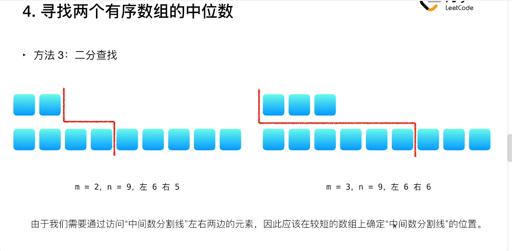
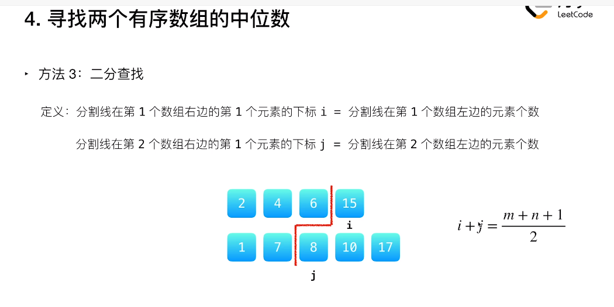
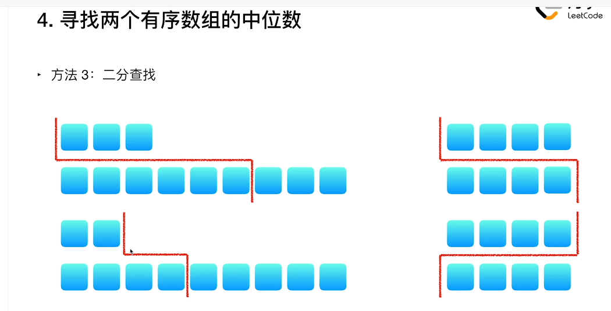
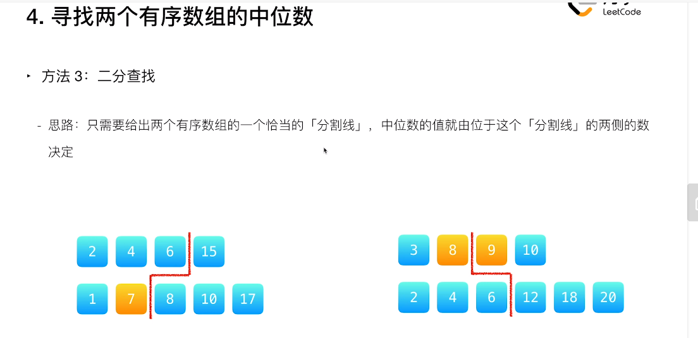
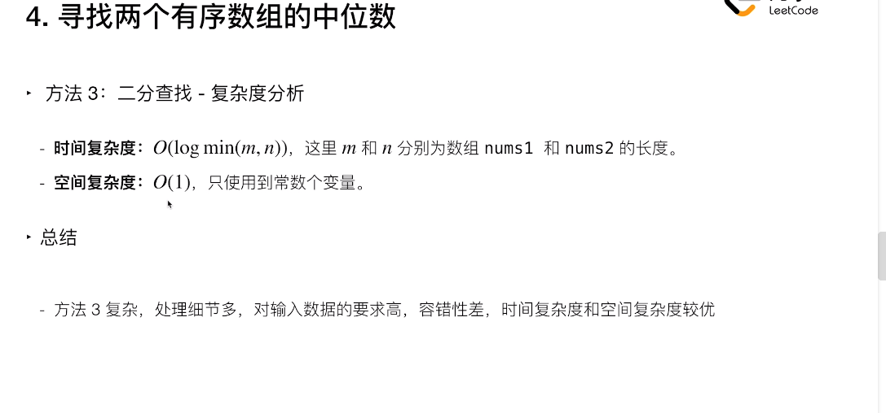

# leetcode [4. 寻找两个正序数组的中位数](https://leetcode-cn.com/problems/median-of-two-sorted-arrays/)

将问题转换为查找划分线的位置，这条划分线由两个数组的划分线组成，由于中位数两边的元素个数是确定的，因此只需要确定一个数组中的划分线的位置就可以直接得到第二个数组中划分线的位置；如何确定第一个数组中元素的划分线的位置呢？使用二分查找。

看了一下官方给出的解题视频，它让我想到了n-sum 问题。

合并两个数组，第 $\frac {m + n} {2}$ 个元素就是中位数。

