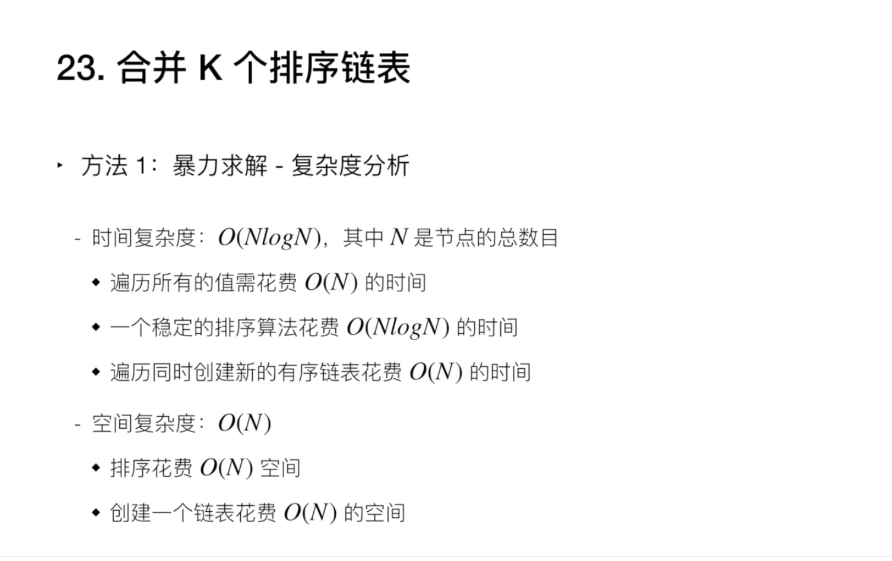

# [LeetCode-23. 合并K个升序链表](https://leetcode.cn/problems/merge-k-sorted-lists/)

1、假设`k`个linked list共有`n`个元素

2、每次从各个linked list 取得它们的 `head`，然后对这个k个`head`进行排序，取得 min、max 元素。

3、然后将min/max插入到output中

4、显然上述过程需要执行n次

## [官方解题](https://leetcode.cn/problems/merge-k-sorted-lists/solution/he-bing-kge-pai-xu-lian-biao-by-leetcode-solutio-2/)

> NOTE: 
>
> 1、下面并没有按照原文的方式组织的，而是结合原文视频中的内容、文字内容进行的组织

### 方式一: 暴力解法

#### 思路

将所有的k个linked list输出到一个array中，然后对array进行排序，然后输出为linked list；


#### 完整程序 Python

```python
class ListNode:
    def __init__(self, val=0, next=None):
        self.val = val
        self.next = next

class Solution:
    def mergeKLists(self, lists: List[ListNode]) -> ListNode:
        self.nodes = []
        head = point = ListNode()
        for l in lists:
            while l:
                self.nodes.append(l.val)
                l = l.next
        for x in sorted(self.nodes):
            point.next = ListNode(x)
            point = point.next
        return head.next
```

> NOTE: 
>
> 1、在 geeksforgeeks [Merge k sorted arrays | Set 1](https://www.geeksforgeeks.org/merge-k-sorted-arrays/) 中，给出了C++ 版的类似代码
>
> 2、上述code中，使用了"dummy node-技巧-create创建linked list"

#### 复杂度分析



上述算法的复杂度是由它的排序算法而决定的。

### 方式二: 顺序合并/ Iterative 2-Way merge

> NOTE: 
>
> 1、在 wanweibaike [k-way merge algorithm](https://en.wanweibaike.com/wiki-K-Way%20Merge%20Algorithms) 中，将这种方式称为 "Iterative 2-Way merge"


#### 完整程序C++


```C++
#include <bits/stdc++.h>

using namespace std;

/**
 * Definition for singly-linked list.
 */
struct ListNode
{
	int val;
	ListNode *next;
	ListNode() :
					val(0), next(nullptr)
	{
	}
	ListNode(int x) :
					val(x), next(nullptr)
	{
	}
	ListNode(int x, ListNode *next) :
					val(x), next(next)
	{
	}
};

class Solution
{
public:
	ListNode* mergeTwoLists(ListNode *a, ListNode *b)
	{
		if ((!a) || (!b))
			return a ? a : b;
		/**
		 * head是"dummy node for create linked list"
		 * 需要注意的是它是automatic variable，使用它为了便于创建新的linked list
		 * 最终返回的 head.next
		 */
		ListNode head, *tail = &head;
		ListNode *aPtr = a, *bPtr = b;
		while (aPtr && bPtr)
		{
			if (aPtr->val < bPtr->val)
			{
				tail->next = aPtr;
				aPtr = aPtr->next; // 迭代
			}
			else
			{
				tail->next = bPtr;
				bPtr = bPtr->next; // 迭代
			}
			tail = tail->next;
		}
		tail->next = (aPtr ? aPtr : bPtr); // 将剩余部分也添加到linked list中
		return head.next;
	}

	ListNode* mergeKLists(vector<ListNode*> &lists)
	{
		ListNode *ans = nullptr;
		for (size_t i = 0; i < lists.size(); ++i)
		{
			ans = mergeTwoLists(ans, lists[i]);
		}
		return ans;
	}

};

ostream& operator<<(ostream &stream, ListNode *Node)
{
	while (Node)
	{
		stream << Node->val << ",";
		Node = Node->next;
	}
	return stream;
}

int main()
{
	ListNode *N1 = new ListNode { 1 };
	N1->next = new ListNode { 4 };
	N1->next->next = new ListNode { 7 };
	N1->next->next->next = new ListNode { 10 };

	ListNode *N2 = new ListNode { 2 };
	N2->next = new ListNode { 5 };
	N2->next->next = new ListNode { 8 };
	N2->next->next->next = new ListNode { 11 };

	ListNode *N3 = new ListNode { 3 };
	N3->next = new ListNode { 6 };
	N3->next->next = new ListNode { 9 };
	N3->next->next->next = new ListNode { 12 };

	Solution s;
	vector<ListNode*> lists { N1, N2, N3 };
	cout << s.mergeKLists(lists) << endl;
}
// g++ test.cpp -pedantic -Wall -Wextra --std=c++11

```


#### 复杂度分析

时间复杂度：假设每个链表的最长长度是 $n$。在第一次合并后，`ans` 的长度为 $n$；第二次合并后，`ans` 的长度为 $2\times n$，第 $i$ 次合并后，`ans` 的长度为 $i\times n$。第 $i$ 次合并的时间代价是 $O(n + (i - 1) \times n) = O(i \times n)$，那么总的时间代价为 $O(\sum_{i = 1}^{k} (i \times n)) = O(\frac{(1 + k)\cdot k}{2} \times n) = O(k^2 n)$，故渐进时间复杂度为 $O(k^2 n)$。

空间复杂度：没有用到与 $k$ 和 $n$ 规模相关的辅助空间，故渐进空间复杂度为 $O(1)$。


### 方法三：分治合并

#### 思路

考虑优化方法一，用分治的方法进行合并。

1、将 $k$ 个链表配对并将同一对中的链表合并；

2、第一轮合并以后， $k$ 个链表被合并成了 $\frac{k}{2}$ 个链表，平均长度为 $\frac{2n}{k}$，然后是 $\frac{k}{4}$个链表， $\frac{k}{8}$个链表等等；

3、重复这一过程，直到我们得到了最终的有序链表


#### 复杂度分析

时间复杂度：考虑递归「向上回升」的过程——第一轮合并 $\frac{k}{2}$ 组链表，每一组的时间代价是 $O(2n)$；

第二轮合并 $\frac{k}{4}$ 组链表，每一组的时间代价是 $O(4n)$;

所以总的时间代价是 $O(\sum_{i = 1}^{\infty} \frac{k}{2^i} \times 2^i n) = O(kn \times \log k)$，故渐进时间复杂度为 $O(kn \times \log k)$。

> NOTE: 
>
> 1、"向上回升"是什么含义？
>
> 2、$O(\sum_{i = 1}^{\infty} \frac{k}{2^i} \times 2^i n) = O(kn \times \log k)$ 是典型的divide-and-conquer算法的复杂度，
>
> `i` 的变化范围是 $[1, \infty]$，表示最终只剩下一个list；
>
> $\frac{k}{2^i}$ 表示的是第 $i$ 论，有 $\frac{k}{2^i}$ 个linked list；
>
> 


#### 完整程序C++

```C++
#include <bits/stdc++.h>

using namespace std;

/**
 * Definition for singly-linked list.
 */
struct ListNode
{
	int val;
	ListNode *next;
	ListNode() :
					val(0), next(nullptr)
	{
	}
	ListNode(int x) :
					val(x), next(nullptr)
	{
	}
	ListNode(int x, ListNode *next) :
					val(x), next(next)
	{
	}
};

class Solution
{
public:
	ListNode* mergeTwoLists(ListNode *a, ListNode *b)
	{
		if ((!a) || (!b))
			return a ? a : b;
		/**
		 * head是"dummy node for create linked list"
		 * 需要注意的是它是automatic variable，使用它为了便于创建新的linked list
		 * 最终返回的 head.next
		 */
		ListNode head, *tail = &head;
		ListNode *aPtr = a, *bPtr = b;
		while (aPtr && bPtr)
		{
			if (aPtr->val < bPtr->val)
			{
				tail->next = aPtr;
				aPtr = aPtr->next; // 迭代
			}
			else
			{
				tail->next = bPtr;
				bPtr = bPtr->next; // 迭代
			}
			tail = tail->next;
		}
		tail->next = (aPtr ? aPtr : bPtr); // 将剩余部分也添加到linked list中
		return head.next;
	}

	ListNode* merge(vector<ListNode*> &lists, int l, int r)
	{
		if (l == r)
			return lists[l];
		if (l > r)
			return nullptr;
		int mid = (l + r) >> 1;
		return mergeTwoLists(merge(lists, l, mid), merge(lists, mid + 1, r));
	}

	ListNode* mergeKLists(vector<ListNode*> &lists)
	{
		return merge(lists, 0, lists.size() - 1);
	}
};

ostream& operator<<(ostream &stream, ListNode *Node)
{
	while (Node)
	{
		stream << Node->val << ",";
		Node = Node->next;
	}
	return stream;
}

int main()
{
	ListNode *N1 = new ListNode { 1 };
	N1->next = new ListNode { 4 };
	N1->next->next = new ListNode { 7 };
	N1->next->next->next = new ListNode { 10 };

	ListNode *N2 = new ListNode { 2 };
	N2->next = new ListNode { 5 };
	N2->next->next = new ListNode { 8 };
	N2->next->next->next = new ListNode { 11 };

	ListNode *N3 = new ListNode { 3 };
	N3->next = new ListNode { 6 };
	N3->next->next = new ListNode { 9 };
	N3->next->next->next = new ListNode { 12 };

	Solution s;
	vector<ListNode*> lists { N1, N2, N3 };
	cout << s.mergeKLists(lists) << endl;
}
// g++ test.cpp -pedantic -Wall -Wextra --std=c++11

```


### 方法四: 使用优先队列合并


#### 完整程序C++

```C++
#include <bits/stdc++.h>

using namespace std;

/**
 * Definition for singly-linked list.
 */
struct ListNode
{
	int val;
	ListNode *next;
	ListNode() :
					val(0), next(nullptr)
	{
	}
	ListNode(int x) :
					val(x), next(nullptr)
	{
	}
	ListNode(int x, ListNode *next) :
					val(x), next(next)
	{
	}
};

class Solution
{
public:
	struct Status
	{
		int val;
		ListNode *ptr;
		bool operator <(const Status &rhs) const
		{
			return val > rhs.val;
		}
	};
	/**
	 * 最小堆
	 */
	priority_queue<Status> q;

	ListNode* mergeKLists(vector<ListNode*> &lists)
	{
		/**
		 * 初始化heap
		 */
		for (auto node : lists)
		{
			if (node)
				q.push( { node->val, node });
		}
		/**
		 * head是"dummy node for create linked list"
		 * 需要注意的是它是automatic variable，使用它为了便于创建新的linked list
		 * 最终返回的 head.next
		 */
		ListNode head, *tail = &head;
		while (!q.empty())
		{
			auto f = q.top();
			q.pop();
			tail->next = f.ptr;
			tail = tail->next;
			if (f.ptr->next)
				q.push( { f.ptr->next->val, f.ptr->next });
		}
		return head.next;
	}
};

ostream& operator<<(ostream &stream, ListNode *Node)
{
	while (Node)
	{
		stream << Node->val << ",";
		Node = Node->next;
	}
	return stream;
}

int main()
{
	ListNode *N1 = new ListNode { 1 };
	N1->next = new ListNode { 4 };
	N1->next->next = new ListNode { 7 };
	N1->next->next->next = new ListNode { 10 };

	ListNode *N2 = new ListNode { 2 };
	N2->next = new ListNode { 5 };
	N2->next->next = new ListNode { 8 };
	N2->next->next->next = new ListNode { 11 };

	ListNode *N3 = new ListNode { 3 };
	N3->next = new ListNode { 6 };
	N3->next->next = new ListNode { 9 };
	N3->next->next->next = new ListNode { 12 };

	Solution s;
	vector<ListNode*> lists { N1, N2, N3 };
	cout << s.mergeKLists(lists) << endl;
}
// g++ test.cpp -pedantic -Wall -Wextra --std=c++11

```


#### 复杂度分析

> NOTE: 
>
> 1、相比于前面，它的复杂度是比较简单的

时间复杂度：考虑优先队列中的元素不超过 $k$ 个，那么插入和删除的时间代价为 $O(\log k)$，这里最多有 $kn$ 个点，对于每个点都被插入删除各一次，故总的时间代价即渐进时间复杂度为 $O(kn \times \log k)$。

空间复杂度：这里用了优先队列，优先队列中的元素不超过 $k$ 个，故渐进空间复杂度为 $O(k)$。


## 我的解答

```C++
#include <bits/stdc++.h>

using namespace std;

/**
 * Definition for singly-linked list.
 */
struct ListNode
{
	int val;
	ListNode *next;
	ListNode() :
					val(0), next(nullptr)
	{
	}
	ListNode(int x) :
					val(x), next(nullptr)
	{
	}
	ListNode(int x, ListNode *next) :
					val(x), next(next)
	{
	}
};

class Solution
{
public:
	struct Status
	{
		int val; // 节点的值
		ListNode *node;
		/**
		 * @brief C++ priority_queue 默认是max heap，下面是使它成为最小堆的方法
		 *
		 * @param r
		 * @return
		 */
		bool operator <(const Status &r) const
		{
			return val > r.val;
		}
		Status(ListNode *N) :
						val { N->val }, node { N }
		{
		}
	};
	/**
	 * 最小堆
	 */
	priority_queue<Status> q;
	ListNode* mergeKLists(vector<ListNode*> &lists)
	{
		/**
		 * 初始化最小堆
		 */
		for (auto &&N : lists)
		{
			q.push(N);
		}
		/**
		 * head是"dummy node for create linked list"
		 * 需要注意的是它是automatic variable，使用它为了便于创建新的linked list
		 * 最终返回的 head.next
		 * tail是iterator、迭代器
		 */
		ListNode head, *tail = &head;
		while (!q.empty())
		{
			auto S = q.top();
			q.pop();
			tail->next = S.node;
			tail = tail->next; // 迭代
			if (S.node->next)
			{
				q.push(S.node->next);
			}
		}
		return head.next;
	}
};

ostream& operator<<(ostream &stream, ListNode *Node)
{
	while (Node)
	{
		stream << Node->val << ",";
		Node = Node->next;
	}
	return stream;
}

int main()
{
	ListNode *N1 = new ListNode { 1 };
	N1->next = new ListNode { 4 };
	N1->next->next = new ListNode { 7 };
	N1->next->next->next = new ListNode { 10 };

	ListNode *N2 = new ListNode { 2 };
	N2->next = new ListNode { 5 };
	N2->next->next = new ListNode { 8 };
	N2->next->next->next = new ListNode { 11 };

	ListNode *N3 = new ListNode { 3 };
	N3->next = new ListNode { 6 };
	N3->next->next = new ListNode { 9 };
	N3->next->next->next = new ListNode { 12 };

	Solution s;
	vector<ListNode*> lists { N1, N2, N3 };
	cout << s.mergeKLists(lists) << endl;
}
// g++ test.cpp -pedantic -Wall -Wextra --std=c++11

```


### 二刷

```c++
// #include <bits/stdc++.h>
#include <iostream>
#include <string>
#include <algorithm>
#include <vector>
#include <bitset>
#include <map>
#include <list>
#include <stack>
#include <unordered_map>
#include <unordered_set>
#include <queue>
#include <cmath>
#include <numeric>
#include <climits>
#include <random>
// example1.cpp
// new-delete-type-mismatch error
#include <memory>
#include <vector>
using namespace std;

/**
 * Definition for singly-linked list.
 * struct ListNode {
 *     int val;
 *     ListNode *next;
 *     ListNode() : val(0), next(nullptr) {}
 *     ListNode(int x) : val(x), next(nullptr) {}
 *     ListNode(int x, ListNode *next) : val(x), next(next) {}
 * };
 */
struct ListNode
{
  int val;
  ListNode *next;
  ListNode() : val(0), next(nullptr) {}
  ListNode(int x) : val(x), next(nullptr) {}
  ListNode(int x, ListNode *next) : val(x), next(next) {}
};
class Solution
{
public:
  ListNode *mergeKLists(vector<ListNode *> &lists)
  {
    ListNode head{};
    auto *tail = &head;
    auto cmp = [](const ListNode *left, const ListNode *right) -> bool
    {
      return left->val > right->val;
    };
    std::priority_queue<ListNode *, std::vector<ListNode *>, decltype(cmp)> q(cmp);
    for (auto &&n : lists)
    {
      q.push(n);
    }
    while (!q.empty())
    {
      auto *n = q.top();
      tail->next = n; // append to tail
      tail = tail->next;
      q.pop();
      if (n->next != nullptr)
      {
        q.push(n->next);
      }
    }
    // tail->next = nullptr; // 这一步骤是可以不需要的，因为最后的一定是原列表的tail node，因此它的next一定是nullptr
    return head.next;
  }
};

int main()
{
  Solution s;
}
// g++ test.cpp --std=c++11 -pedantic -Wall -Wextra -g

```

