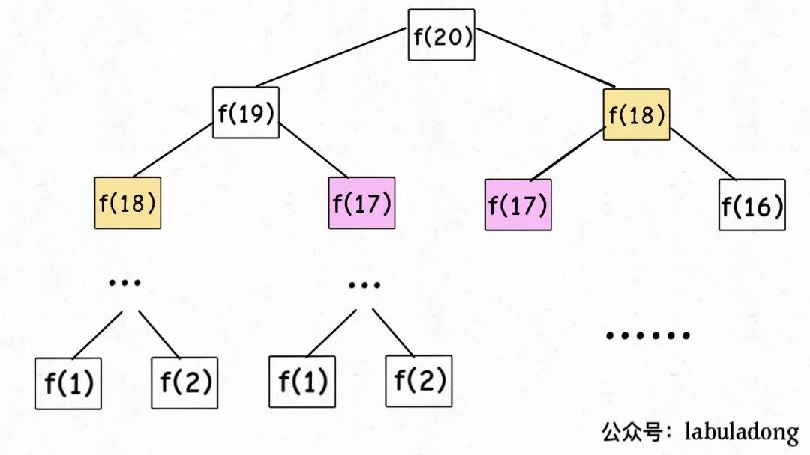

# Overlapping subproblems

一、重叠子问题

二、如何快速判断是否存在"Overlapping subproblems"？以"relation-structure-computation"、"结构化思维" 来思考:

1、在recursion activation tree中，存在着多个值相等的节点、多条到达相同值的path，在下面的"非常形象的说明"章节中，就形象地展示了这样的情形。

2、通过对recurrence relation进行简单的推演，画出其recursion activation tree，通过规则1来进行判断；在下面的"非常形象的说明"章节中，就给出了这样的案例。

## wikipedia [Overlapping subproblems](https://en.wikipedia.org/wiki/Overlapping_subproblems)

In [computer science](https://en.wikipedia.org/wiki/Computer_science), a [problem](https://en.wikipedia.org/wiki/Problem) is said to have **overlapping subproblems** if the problem can be broken down into subproblems which are reused several times or a recursive algorithm for the problem solves the same subproblem over and over rather than always generating new subproblems.[[1\]](https://en.wikipedia.org/wiki/Overlapping_subproblems#cite_note-1)[[2\]](https://en.wikipedia.org/wiki/Overlapping_subproblems#cite_note-2) [[3\]](https://en.wikipedia.org/wiki/Overlapping_subproblems#cite_note-3)

For example, the problem of computing the [Fibonacci sequence](https://en.wikipedia.org/wiki/Fibonacci_sequence) exhibits overlapping subproblems. The problem of computing the *n*th [Fibonacci number](https://en.wikipedia.org/wiki/Fibonacci_number) *F*(*n*), can be broken down into the subproblems of computing *F*(*n* − 1) and *F*(*n* − 2), and then adding the two. The subproblem of computing *F*(*n* − 1) can itself be broken down into a subproblem that involves computing *F*(*n* − 2). Therefore, the computation of *F*(*n* − 2) is reused, and the Fibonacci sequence thus exhibits overlapping subproblems.

A naive [recursive](https://en.wikipedia.org/wiki/Recursive) approach to such a problem generally fails due to an [exponential complexity](https://en.wikipedia.org/wiki/Exponential_time). If the problem also shares an [optimal substructure](https://en.wikipedia.org/wiki/Optimal_substructure) property, [dynamic programming](https://en.wikipedia.org/wiki/Dynamic_programming) is a good way to work it out.


## 非常形象的说明

### labuladong [经动态规划：编辑距离](https://mp.weixin.qq.com/s/uWzSvWWI-bWAV3UANBtyOw) # 暴力破解的重叠子问题

还有点小问题就是，这个解法是暴力解法，存在重叠子问题，需要用动态规划技巧来优化。

**怎么能一眼看出存在重叠子问题呢**？前文 [动态规划之正则表达式](http://mp.weixin.qq.com/s?__biz=MzU0MDg5OTYyOQ==&mid=2247483976&idx=1&sn=c268f7343732e33035cfd75da2d17052&chksm=fb33620acc44eb1ca6d80cf5af2564e7b81fc8ee5ce53cef8f1b159a881aa06796fed3e2a363&scene=21#wechat_redirect) 有提过，这里再简单提一下，需要抽象出本文算法的递归框架：

```Python
def dp(i, j):
    dp(i - 1, j - 1) #1
    dp(i, j - 1)     #2
    dp(i - 1, j)     #3
```

对于子问题`dp(i-1,j-1)`，如何通过原问题`dp(i,j)`得到呢？有不止一条路径，比如`dp(i,j)->#1`和`dp(i,j)->#2->#3`。一旦发现一条重复路径，就说明存在巨量重复路径，也就是重叠子问题。

> NOTE: 
>
> 1、上述是快速的推演方法

### labuladong [动态规划详解](https://mp.weixin.qq.com/s/Cw39C9MY9Wr2JlcvBQZMcA) # 一、斐波那契数列

斐波那契数列的数学形式就是递归的，写成代码就是这样：

```C++
int fib(int N) {
    if (N == 1 || N == 2) return 1;
    return fib(N - 1) + fib(N - 2);
}
```

PS：但凡遇到需要递归的问题，最好都画出递归树，这对你分析算法的复杂度，寻找算法低效的原因都有巨大帮助。



观察递归树，很明显发现了算法低效的原因：存在大量重复计算，比如`f(18)`被计算了两次，而且你可以看到，以`f(18)`为根的这个递归树体量巨大，多算一遍，会耗费巨大的时间。更何况，还不止`f(18)`这一个节点被重复计算，所以这个算法及其低效。

这就是动态规划问题的第一个性质：**重叠子问题**。下面，我们想办法解决这个问题。
