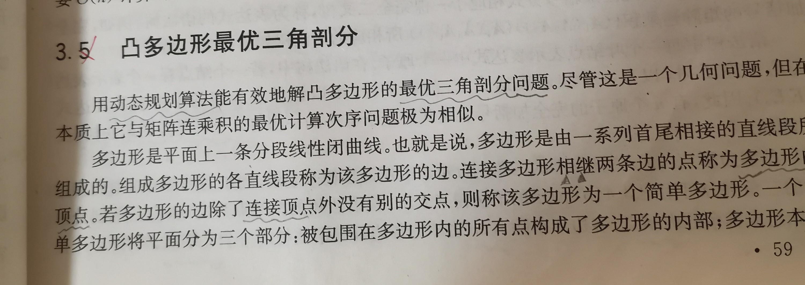
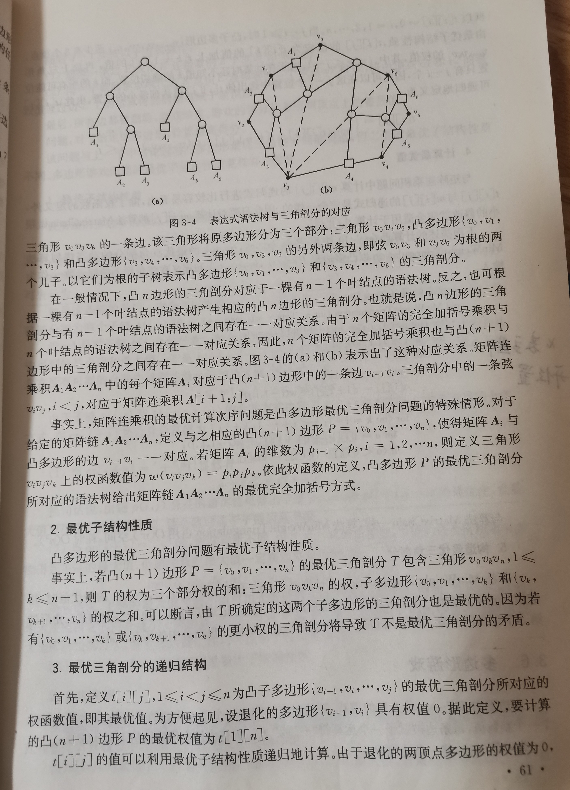

# 凸多边形最优三角剖分

## 计算机算法设计与分析 # 3.5 凸多边形最优三角剖分

## See also

LeetCode [1039. 多边形三角剖分的最低得分](https://leetcode-cn.com/problems/minimum-score-triangulation-of-polygon/) 中等

wikipedia [All nearest smaller values](https://en.wikipedia.org/wiki/All_nearest_smaller_values) 

