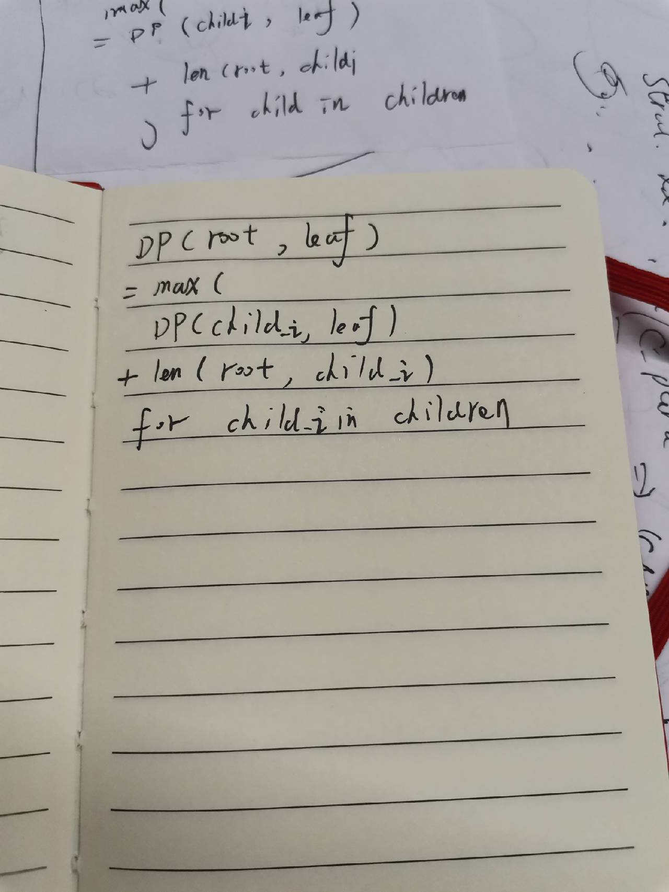

# Tree DP

参考文章:

1、CSDN [树形dp+树形结构总结](https://blog.csdn.net/dcx2001/article/details/78269908)

2、CSDN [ZeroClock](https://blog.csdn.net/woshi250hua) [【DP_树形DP专辑】【9月9最新更新】](https://blog.csdn.net/woshi250hua/article/details/7644959)

3、codeforces [DP on Trees Tutorial](https://codeforces.com/blog/entry/20935)

## geeksforgeeks [Dynamic Programming on Trees | Set-1](https://www.geeksforgeeks.org/dynamic-programming-trees-set-1/)

Dynamic Programming(DP) is a technique to solve problems by breaking them down into **overlapping sub-problems** which follows the **optimal substructure**. There are various problems using DP like **subset sum**, **knapsack**, **coin change** etc. DP can also be applied on trees to solve some specific problems.

Given a tree with N nodes and N-1 edges, calculate the maximum sum of the node values from root to any of the leaves without re-visiting any node. 

> NOTE:
>
> 

Given above is a diagram of a tree with **N=14** nodes and **N-1=13** edges. The values at node being **3, 2, 1, 10, 1, 3, 9, 1, 5, 3, 4, 5, 9 and 8 respectively for nodes 1, 2, 3, 4….14.** 

The diagram below shows all the paths from root to leaves : 

All the paths are marked by different colors : 

Path 1(red, 3-2-1-4) : sum of all node values = 10 

Path 2(orange, 3-2-1-5) : sum of all node values = 11 

Path 3(yellow, 3-2-3) : sum of all node values = 8 

Path 4(green, 3-1-9-9) : sum of all node values = 22 

Path 5(violet, 3-1-9-8) : sum of all node values = 21 

Path 6(pink, 3-10-1) : sum of all node values = 14 

Path 7(blue, 3-10-5) : sum of all node values = 18 

Path 8(brown, 3-10-3) : sum of all node values = 16 

The answer is 22, as Path 4 has the maximum sum of values of nodes in its path from a root to leaves. 

**The greedy approach fails in this case**. Starting from the root and take 3 from the first level, 10 from the next level and 5 from the third level greedily. Result is path-7 if after following the greedy approach, hence do not apply greedy approach over here. 

> NOTE: 
>
> 这是贪心算法不行的一种典型场景

The problem can be solved using **Dynamic Programming on trees.** Start memoizing from the leaves and add the maximum of leaves to the root of every sub-tree. At the last step, there will be root and the sub-tree under it, adding the value at node and maximum of sub-tree will give us the maximum sum of the node values from root to any of the leaves.

## geeksforgeeks [Dynamic Programming on Trees | Set 2](https://www.geeksforgeeks.org/dynamic-programming-trees-set-2/?ref=rp)

