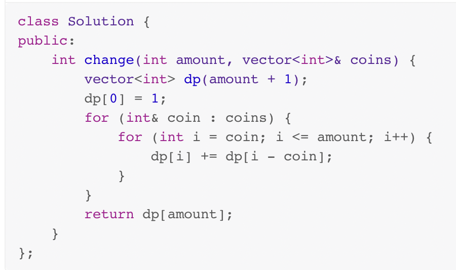
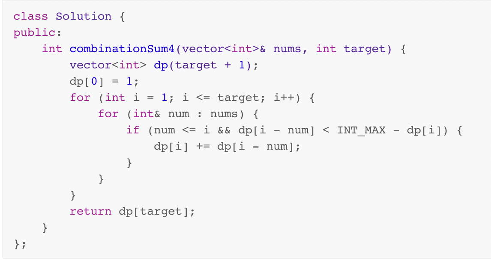

# 背包DP 和 fibonacci DP

一、两者本质上是非常类似的: 可以认为 fibonacci DP 是简化版的 背包DP，背包DP 是泛化的 fibonacci DP ，两者的关联在下面文章中有着非常好的描述:

1、 [徐洲更](https://leetcode.cn/u/xu-zhou-geng/) # [零钱兑换II和爬楼梯问题到底有什么不同？](https://leetcode.cn/problems/coin-change-2/solution/ling-qian-dui-huan-iihe-pa-lou-ti-wen-ti-dao-di-yo/) 


## 完全背包 VS 0-1背包

一、**完全背包**和**0-1背包**的核心差别是前者同一个物品是能够重复选取的，而后者同一个完全最多只能够选取一次，因此**0-1背包**问题其实属于**0-1子集树**，显然是可以使用回溯法来进行解决的

1、完全背包不需要考虑物品，只需要考虑背包容量，因此它是**一维**的；

需要注意的是：在完全背包问题中，我们一次只取一个物品，下次循环的时候，还是从第一个物品开始，因此这样就能够实现重复取同一个物品了，典型的例子就是**零钱兑换问题**，比如 [LeetCode-322. 零钱兑换](https://leetcode.cn/problems/coin-change/) ：

```c++
class Solution
{
public:
  int coinChange(vector<int> &coins, int amount)
  {
    vector<long long> dp(amount + 1, INT_MAX);
    dp[0] = 0;
    for (int i = 0; i <= amount; ++i) 
    {
      for (auto &&coin : coins)
      {
        if (i >= coin)
        {
          dp[i] = min(dp[i], dp[i - coin] + 1);
        }
      }
    }
    return dp[amount] == INT_MAX ? -1 : dp[amount];
  }
};
```


2、0-1背包需要考虑物品，考虑背包容量，因此它是**二维**的；

```c++
class Solution
{
public:
	bool canPartition(vector<int> &nums)
	{
		int sum = accumulate(begin(nums), end(nums), 0);
		if (sum % 2 != 0) // 不是偶数，显然无法划分为两个等份
		{
			return false;
		}
		int count = nums.size();
		int cap = sum / 2; // 背包的容量
		vector<vector<bool>> dp(count + 1, vector<int>(cap + 1, false)); // dp table，一个二维矩阵
		// base case，初始化dp table: 背包容量为0，无论有多少个物品，都认为是能够实现划分为两个等和子集的
		for (int i = 0; i <= count; ++i)
		{
			dp[i][0] = true;
		}

		for (int i = 1; i <= count; ++i)
		{
			for (int j = 1; j <= cap; ++j)
			{
				if (j - nums[i - 1] < 0)
				{
					dp[i][j] = dp[i - 1][j]; //  取决于前i-1个物品是否能够凑足j
				}
				else
				{
					dp[i][j] = dp[i - 1][j] | dp[i - 1][j - nums[i - 1]];
				}
			}
		}
		return dp[count][cap];
	}
};
```


## 完全背包


### 顺序敏感 和 顺序不敏感

一、有的问题是顺序不敏感的，有的是顺序敏感的，因此需要考虑顺序是否对问题的结果产生影响？

1、计数问题: 

可以肯定的是，如果与顺序相关，则组合数会更多，如果与顺序无关，则组合数更少；

据此可以分为**组合计数** 和 **排列计数**。

2、最值问题：


二、资源

在下面的文章中，有描述:

1、[LeetCode-518. 零钱兑换 II](https://leetcode.cn/problems/coin-change-2/) 中等

三、典型例题:

下面这两道题都是完全背包问题，


| [LeetCode-518. 零钱兑换 II](https://leetcode.cn/problems/coin-change-2/) 中等 | LeetCode [377. 组合总和 Ⅳ](https://leetcode.cn/problems/combination-sum-iv/) |
| ------------------------------------------------------------ | ------------------------------------------------------------ |
|                                                              |                                                              |
| 与顺序无关的计数，通过排序来去重。                           | 与顺序有关的计数                                             |
|                  |                   |
| 上述做法不会重复计算不同的排列。因为外层循环是遍历数组 $\textit{coins}$ 的值，内层循环是遍历不同的金额之和，在计算 $\textit{dp}[i]$ 的值时，可以确保金额之和等于 $i$ 的硬币面额的顺序，由于顺序确定，因此不会重复计算。 | 上述做法是否考虑到选取元素的顺序？答案是肯定的。<br>因为外层循环是遍历从 $1$ 到 $\textit{target}$ 的值，<br>内层循环是遍历数组 $\textit{nums}$ 的值，<br>在计算 $\textit{dp}[i]$ 的值时，$\textit{nums}$ 中的每个小于等于 $i$ 的元素都可能作为元素之和等于 $i$ 的排列的最后一个元素。<br>例如，$1$ 和 $3$ 都​在数组 $\textit{nums}$ 中，计算 $\textit{dp}[4]$ 的时候，排列的最后一个元素可以是 $1$ 也可以是 $3$，因此 $\textit{dp}[1]$ 和 $\textit{dp}[3]$ 都会被考虑到，即不同的顺序都会被考虑到。 |

可以看到，两道题的唯一差别就是在于for-循环的不同。

关于顺序的解释，我觉得 [baoya_uncle](https://leetcode.cn/u/baoya_uncle/) 的 [解释](https://leetcode.cn/problems/coin-change-2/solution/ling-qian-dui-huan-ii-by-leetcode-soluti-f7uh/1030746) 不错:
> 解释一下为什么外层要对coins循环：
>
> 假设`coins = {1, 2, 3}`，`amount = 5`。 凑出 `5` 的方案有三类：
>
> 1、组合必须以硬币1结尾，且不能包含硬币1之后的其他硬币2， 3。假设这类方案数量为x1。
>
> 2、组合必须以硬币2结尾，且不能包含硬币2之后的其他硬币3。假设这类方案数量为x2。
>
> 3、组合必须以硬币3结尾。假设这类方案数量为x3。
>
> ```
> 第一轮，我们计算x1。
> 第二轮，我们计算x2。并将x2加到x1上，得到x1 + x2。
> 第三轮，我们计算x3。并将x2加到x1 + x2上，得到x1 + x2 + x3。
> 
> 对amount为5而言
> x1 有 {1, 1, 1, 1, 1}
> x2 有 {1, 1, 1, 2},  {1, 2, 2}
> x3 有 {1, 1, 3}, {2, 3}
> ```
>
> 


## [徐洲更](https://leetcode.cn/u/xu-zhou-geng/) # [零钱兑换II和爬楼梯问题到底有什么不同？](https://leetcode.cn/problems/coin-change-2/solution/ling-qian-dui-huan-iihe-pa-lou-ti-wen-ti-dao-di-yo/)

在LeetCode上有两道题目非常类似，分别是

1、[70.爬楼梯](https://leetcode.cn/problems/climbing-stairs/)

2、[518. 零钱兑换 II](https://leetcode.cn/problems/coin-change-2/)

如果我们把每次可走步数/零钱面额限制为 `[1,2]`，把楼梯高度/总金额限制为 `3`，那么这两道题目就可以抽象成 "给定 `[1,2]`，求组合成3的**组合数**和**排列数**"。

接下来引出本文的核心两段代码:

```c++
class Solution1 {
public:
    int change(int amount, vector<int>& coins) {
        int dp[amount+1];
        memset(dp, 0, sizeof(dp)); //初始化数组为0
        dp[0] = 1;
        for (int j = 1; j <= amount; j++){ //枚举金额
            for (int coin : coins){ //枚举硬币
                if (j < coin) continue; // coin不能大于amount
                dp[j] += dp[j-coin];
            }
        }
        return dp[amount];
    }
};
class Solution2 {
public:
    int change(int amount, vector<int>& coins) {
        int dp[amount+1];
        memset(dp, 0, sizeof(dp)); //初始化数组为0
        dp[0] = 1;
        for (int coin : coins){ //枚举硬币
            for (int j = 1; j <= amount; j++){ //枚举金额
                if (j < coin) continue; // coin不能大于amount
                dp[j] += dp[j-coin];
            }
        }
        return dp[amount];
    }
};

```

如果不仔细看，你会觉得这两个 Solution 似乎是一模一样的代码，但细心一点你会发现他们在嵌套循环上存在了差异。这个差异使得一个求解结果是 **排列数**，一个求解结果是 **组合数**。

因此在不看后面的分析之前，你能分辨出哪个 Solution 是得到**排列**，哪个 Solution 是得到**组合**吗？

> NOTE:
>
> 在看了后面的分析后就能够很快地看出上述两者之间的差异。

### 70. 爬楼梯

这道题目子问题是，`problem(i) = sub(i-1) + sub(i-2)`, 即求解第i阶楼梯等于求解第 `i-1` 阶楼梯和第 `i-2` 阶楼梯之和。

> NOTE:
>
> 一、上述定义是典型的排列数，结合一个具体的例子来说：
>
> ```c++
> 3 = 1 + 2
> 
> 3 = 2 + 1
> ```
>
> 其实这就说明 [70.爬楼梯](https://leetcode.cn/problems/climbing-stairs/) 是排列数问题，而不是组合数问题。
>
> 二、现在想来， [70.爬楼梯](https://leetcode.cn/problems/climbing-stairs/) 其实可以归入完全背包问题，它和 [LeetCode-322. 零钱兑换](https://leetcode.cn/problems/coin-change/) 非常类似
>
> 三、下面的"泛化问题"章节给出的source code是和上面的分析一致的，我们是可以将上述数据代入下面source code的for循环的，这样说能够看出这个source code的本质

状态数组是 `DP[i]`, 状态转移方程是 `DP[i] = DP[i-1] + DP[i-2]`

#### 泛化问题

如果我们把问题泛化，不再是固定的 1，2，而是任意给定台阶数，例如 1,2,5 呢？

我们只需要修改我们的 DP 方程 `DP[i] = DP[i-1] + DP[i-2] + DP[i-5]`, 也就是`DP[i] = DP[i] + DP[i-j] ,j =1,2,5`

在原来的基础上，我们的代码可以做这样子修改

```c++
class Solution {
public:
    int climbStairs(int n) {
        int DP[n+1];
        memset(DP, 0, sizeof(DP));
        DP[0] = 1;
        int steps[2] = {1,2};
        for (int i = 1; i <= n; i++){
            for (int j = 0; j < 2; j++){
                int step = steps[j];
                if ( i < step ) continue;// 台阶少于跨越的步数
                DP[i] = DP[i] + DP[i-step];
            }
        }
        return DP[n];

    }
};

```


### 零钱兑换II

问题描述如下:

> 给定不同面额的硬币和一个总金额。写出函数来计算可以凑成总金额的硬币组合数。假设每一种面额的硬币有无限个。

定义子问题: `problem(i) = sum( problem(i-j) ), j =1,2,5`。含义为凑成总金额i的硬币组合数等于凑成总金额硬币 `i-1`, `i-2`, `i-5`,...的子问题之和。

我们发现这个子问题定义居然和我们之前泛化的爬楼梯问题居然是一样的，那后面的状态数组和状态转移方程也是一样的，所以当前问题的代码可以在之前的泛化爬楼梯问题中进行修改而得。

```c++
class Solution {
public:
    int change(int amount, vector<int>& coins) {
        int dp[amount+1];
        memset(dp, 0, sizeof(dp)); //初始化数组为0
        dp[0] = 1;
        for (int j = 1; j <= amount; j++){ //枚举金额
            for (int i = 0; i < coins.size(): i++){ 
                int coin = coins[i]; //枚举硬币
                if (j < coin) continue; // coin不能大于amount
                dp[j] += dp[j-coin];
            }
        }
        return dp[amount];
    }
};
```

这就是我们之前的 Solution1 代码。

但是当你运行之后，却发现这个代码并不正确，得到的结果比预期的大。究其原因，该代码计算的结果是 **排列数**，而不是 **组合数**，也就是代码会把 `1,2`和 `2,1` 当做两种情况。但更加根本的原因是我们**子问题定义**出现了错误。


#### 正确的字问题定义

正确的 **子问题** 定义应该是，`problem(k,i) = problem(k-1, i) + problem(k, i-k)`

即前 **k** 个硬币凑齐金额 **i** 的组合数 **等于** 前 **k-1** 个硬币凑齐金额 **i** 的组合数 **加上** 在原来 **i-k** 的基础上使用硬币的组合数。说的更加直白一点，那就是用前 `k` 的硬币凑齐金额 `i` ，要分为两种情况开率，一种是没有用前 `k-1` 个硬币就凑齐了，一种是前面已经凑到了 `i-k` ，现在就差第 `k` 个硬币了。

> NOTE:
>
> 上述是典型的使用加分原理

**状态数组**就是 `DP\[k\]\[i\]`, 即前 `k` 个硬币凑齐金额 `i` 的组合数。

这里不再是一维数组，而是**二维**数组。第一个维度用于记录当前组合有没有用到硬币k，第二个维度记录现在凑的金额是多少？如果没有第一个维度信息，当我们凑到金额i的时候，我们不知道之前有没有用到硬币k。

因为这是个**组合**问题，**我们不关心硬币使用的顺序，而是硬币有没有被用到**。是否使用第k个硬币受到之前情况的影响。

> NOTE:
>
> 这段话点明了前面的思想，阐述了 **组合数** 和 **排列数** 的差别

状态转移方程如下

```sh
if 金额数大于硬币
    DP[k][i] = DP[k-1][i] + DP[k][i-k]
else
    DP[k][i] = DP[k-1][i]
```

因此正确代码如下:

```c++
class Solution {
public:
    int change(int amount, vector<int>& coins) {
        int K = coins.size() + 1;
        int I = amount + 1;
        int DP[K][I];
        //初始化数组
        for (int k = 0; k < K; k++){
            for (int i = 0; i < I; i++){
                DP[k][i] = 0;
            }
        }
        //初始化基本状态
        for (int k = 0; k < coins.size() + 1; k++){
            DP[k][0] = 1;
        }
        for (int k = 1; k <= coins.size() ; k++){
            for (int i = 1; i <= amount; i++){  
                if ( i >= coins[k-1]) {
                    DP[k][i] = DP[k][i-coins[k-1]] + DP[k-1][i]; 
                } else{
                    DP[k][i] = DP[k-1][k];
                }
            }
        }
        return DP[coins.size()][amount];
    }
};
```

此时，交换这里面的循环不会影响最终的结果。也就是

```c++
for (int i = 1; i <= amount; i++){  
    for (int k = 1; k <= coins.size() ; k++){ 
        if ( i >= coins[k-1]) {
            DP[k][i] = DP[k][i-coins[k-1]] + DP[k-1][i]; 
         } else{
             DP[k][i] = DP[k-1][k];
         }
     }
}
```

### 状态压缩

之前**爬楼梯问题**中，我们将一维数组降维成点。这里问题能不能也试着降低一个维度，只用一个数组进行表示呢？

这个时候，我们就需要重新定义我们的**子问题**了。此时的**子问题**是:

> 对于硬币从 0 到 k，我们必须使用第k个硬币的时候，当前金额的组合数。

因此 **状态数组** `DP[i]` 表示的是对于第k个硬币能凑的组合数

状态转移方程如下

```
 DP[[i] = DP[i] + DP[i-k]
```

于是得到我们开头的第二个Solution。

```c++
class Solution {
public:
    int change(int amount, vector<int>& coins) {
        int dp[amount+1];
        memset(dp, 0, sizeof(dp)); //初始化数组为0
        dp[0] = 1;
        for (int coin : coins){ //枚举硬币
            for (int i = 1; i <= amount; i++){ //枚举金额
                if (i < coin) continue; // coin不能大于amount
                dp[i] += dp[i-coin];
            }
        }
        return dp[amount];
    }
};

```

#### 正确的字问题定义

显然不能，因为我们这里定义的**子问题**是，必须选择第 $k$ 个硬币时，凑成金额 $i$ 的方案。如果交换了，我们的**子问题**就变了，那就是对于金额 `i`, 我们选择硬币的方案。

同样的，我们回答之前爬楼梯的留下的问题，原循环结构对应的子问题是，对于楼梯数 `i`, 我们的爬楼梯方案。第二种循环结构则是，固定爬楼梯的顺序，我们爬楼梯的方案。


## 资源

1、[LeetCode-一篇文章吃透背包问题！（细致引入+解题模板+例题分析+代码呈现](https://leetcode.cn/problems/partition-equal-subset-sum/solution/yi-pian-wen-zhang-chi-tou-bei-bao-wen-ti-a7dd/) 

2、[LeetCode-希望用一种规律搞定背包问题](https://leetcode.cn/problems/combination-sum-iv/solution/xi-wang-yong-yi-chong-gui-lu-gao-ding-bei-bao-wen-/)


资源：

1、[宫水三叶](https://leetcode.cn/u/ac_oier/) # [【动态规划/背包问题】运用分组背包进行求解](https://leetcode.cn/problems/number-of-dice-rolls-with-target-sum/solution/dong-tai-gui-hua-bei-bao-wen-ti-yun-yong-axtf/)


## 习题汇总


[LeetCode-322. 零钱兑换](https://leetcode.cn/problems/coin-change/) :


```c++
class Solution
{
public:
  int coinChange(vector<int> &coins, int amount)
  {
    vector<long long> dp(amount + 1, INT_MAX);
    dp[0] = 0;
    for (int i = 0; i <= amount; ++i)
    {
      for (auto &&coin : coins)
      {
        if (i >= coin)
        {
          dp[i] = min(dp[i], dp[i - coin] + 1);
        }
      }
    }
    return dp[amount] == INT_MAX ? -1 : dp[amount];
  }
};
```

对于每个amount，会考虑所有的coins，显然它罗列了所有的可能性。


## 计数原理


### 加法原理 和 乘法原理


baidu [两种基础的计数原理](https://baijiahao.baidu.com/s?id=1684072718838161596&wfr=spider&for=pc)

1、加法原理

2、乘法原理


### 组合计数 和 排列计数


不考虑不同顺序: 组合计数

考虑不同顺序: 排列计数


