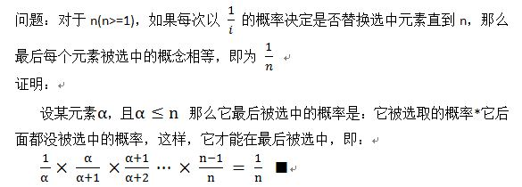
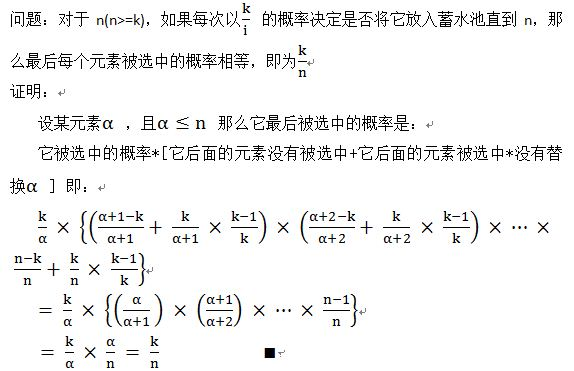

# Reservoir Sampling 

一、在阅读 labuladong [随机算法之水塘抽样算法](https://mp.weixin.qq.com/s/DrBFYAZnPBgNNay2wjNU-A) 时，其中提及了这种算法。

二、"reservoir"的意思是"水库"，它是由"reserve"这个词演变而来。那在这个算法中，"reservoir"有什么样的含义呢？这在下面的文章中进行了解释:

1、cnblogs [Reservoir Sampling - 蓄水池抽样](https://www.cnblogs.com/HappyAngel/archive/2011/02/07/1949762.html) 

## cnblogs [Reservoir Sampling - 蓄水池抽样](https://www.cnblogs.com/HappyAngel/archive/2011/02/07/1949762.html) 

### 抽取一个

问题起源于编程珠玑Column 12中的题目10，其描述如下：

> How could you select one of n objects at random, where you see the objects sequentially but you do not know the value of n beforehand? For concreteness, how would you read a text file, and select and print one random line, when you don’t know the number of lines in advance?

**问题定义可以简化如下：在不知道文件总行数的情况下，如何从文件中随机的抽取一行？**

首先想到的是我们做过类似的题目吗?当然，在知道文件行数的情况下，我们可以很容易的用C运行库的rand函数随机的获得一个行数，从而随机的取出一行，但是，当前的情况是不知道行数，这样如何求呢？我们需要一个概念来帮助我们做出猜想，来使得对每一行取出的概率相等，也即随机。这个概念即 [蓄水池抽样（Reservoir Sampling）](http://en.wikipedia.org/wiki/Reservoir_sampling)。

有了这个概念，我们便有了这样一个解决方案：定义取出的行号为choice，第一次直接以第一行作为取出行 choice ，而后第二次以二分之一概率决定是否用第二行替换 choice ，第三次以三分之一的概率决定是否以第三行替换 choice ……，以此类推，可用伪代码描述如下：

> i = 0
>
> while more input lines
>
> ​      with probability 1.0/++i
>
> ​          choice = this input line
>
> print choice

这种方法的巧妙之处在于成功的构造出了一种方式使得最后可以证明对每一行的取出概率都为1/n（其中n为当前扫描到的文件行数），换句话说对每一行取出的概率均相等，也即完成了随机的选取。

证明如下：



> NOTE: 
>
> 上述证明过程是非常简单的，从它也是可以看出reservoir sample算法的巧妙之处的。

### 抽取K个

> NOTE: 
>
> 显然，这是对前面的抽取一个的推广

回顾这个问题，我们可以对其进行扩展，**即如何从未知或者很大样本空间随机地取k个数？**

类比下即可得到答案，即先把前k个数放入**蓄水池**，对第k+1，我们以k/(k+1)概率决定是否要把它换入**蓄水池**，换入时随机的选取一个作为替换项，这样一直做下去，对于任意的样本空间n，对每个数的选取概率都为**k/n**。也就是说对每个数选取概率相等。

伪代码：

> Init : a reservoir with the size： k // 先把前k个数放入**蓄水池**
>
> for i= k+1 to N
>
>   ​    M=random(1, i);
>
>   ​    if( M < k)
>
>    ​        SWAP the Mth value and ith value
>
> end for 

证明如下：

　　

> NOTE: 
>
> 上述算法真是太精妙了

蓄水池抽样问题是一类问题，在这里总结一下，并由衷的感叹这种方法之巧妙，不过对于这种思想产生的源头还是发觉不够，如果能够知道为什么以及怎么样想到这个解决方法的，定会更加有意义。

## wikipedia [Reservoir sampling](https://en.wikipedia.org/wiki/Reservoir_sampling)

### Simple algorithm

```pseudocode
(* S has items to sample, R will contain the result *)
ReservoirSample(S[1..n], R[1..k])
  // fill the reservoir array
  for i := 1 to k
      R[i] := S[i]

  // replace elements with gradually decreasing probability
  for i := k+1 to n
    (* randomInteger(a, b) generates a uniform integer from the inclusive range {a, ..., b} *)
    j := randomInteger(1, i)
    if j <= k
        R[j] := S[i]
```


### Relation to Fisher-Yates shuffle

Suppose one wanted to draw *k* random cards from a deck of playing cards (i.e., *n=52*). A natural approach would be to shuffle the deck and then take the top *k* cards. In the general case, the shuffle also needs to work even if the number of cards in the deck is not known in advance, a condition which is satisfied by the inside-out version of the [Fisher-Yates shuffle](https://infogalactic.com/info/Fisher-Yates_shuffle):

## Implementation

不同语言的随机数生成算法是不同的，无论如何，都需要保证:

1、对于1概率是1，

2、对于2概率是1/2

3、对于3就是概率1/3

4、一次类推直到1/n为止

> NOTE: 
>
> [LeetCode-382. c++简单易懂的蓄水池解法](https://leetcode.cn/problems/linked-list-random-node/solution/382-cjian-dan-yi-dong-de-xu-shui-chi-jie-222u/)

### iteye [java-蓄水池抽样-要求从N个元素中随机的抽取k个元素，其中N无法确定](https://www.iteye.com/blog/bylijinnan-1468985)

```Java
import java.util.Arrays;  
import java.util.Random;  
  
  
public class ReservoirSampling {  
  
    /** 
     * 题目：给定一个数据流，其中包含无穷尽的搜索关键字（比如，人们在谷歌搜索时不断输入的关键字）。 
     * 如何才能从这个无穷尽的流中随机的选取1000个关键字？ 
     * Reservoir Sampling 
     * I read some proof on the internet,but I found they are hard to understand except this: 
     * http://www.cnblogs.com/HappyAngel/archive/2011/02/07/1949762.html 
     * It's excellent. 
     */  
    public static void main(String[] args) {  
        int k=100;  
        int n=1000;  
        int[] data=new int[n];  
        for(int i=0;i<n;i++){  
            data[i]=i;  
        }  
        int[] sample=reservoirSampling(data,k);  
        System.out.println(Arrays.toString(sample));  
    }  
      
    public static int[] reservoirSampling(int[] data,int k){  
        if(data==null){  
            return new int[0];//In <Effective Java>,it advises to return int[0] instead of null.Am i doing right in this case?  
        }  
        if(data.length<k){  
            return new int[0];  
        }  
        int[] sample=new int[k];  
        int n=data.length;  
        for(int i=0;i<n;i++){  
            if(i<k){  
                sample[i]=data[i];  
            }else{  
                int j=new Random().nextInt(i);  
                if(j<k){  
                    sample[j]=data[i];  
                }  
            }  
        }  
        return sample;  
    }  
}  

```


### [LeetCode-蓄水池抽样算法](https://leetcode.cn/problems/linked-list-random-node/solution/xu-shui-chi-chou-yang-suan-fa-by-jackwener/) Python

```python
import random
class Solution:

    def __init__(self, head: ListNode):
        self.head = head
        
    def getRandom(self) -> int:
        count = 0
        reserve = 0
        cur = self.head
        while cur:
            count += 1
            rand = random.randint(1,count)
            if rand == count:
                reserve = cur.val
            cur = cur.next
        return reserve

```

> NOTE: 
>
> 关于Python `random.randint`，参见 geeksforgeeks [randint() Function in Python](https://www.geeksforgeeks.org/python-randint-function/) 。
>
> 它是返回 `[start, end]` 之间的随机数，如果`start == end` ，它会固定返回这个数，比如 `random.randint(1,1)`，它会一直返回1。
>
> `random.randint(1,2)` 的返回值是1或者2，两者的概率相等
>
> `random.randint(1,3)` 的返回值是1、2、3，三者的概率相等
>
> 

### [LeetCode-382. c++简单易懂的蓄水池解法](https://leetcode.cn/problems/linked-list-random-node/solution/382-cjian-dan-yi-dong-de-xu-shui-chi-jie-222u/)

蓄水池算法，核心就是

1、对于1概率是1，

2、对于2概率是1/2

3、对于3就是概率1/3

4、一次类推直到1/n为止

**代码**

```C++
/**
 * Definition for singly-linked list.
 * struct ListNode {
 *     int val;
 *     ListNode *next;
 *     ListNode() : val(0), next(nullptr) {}
 *     ListNode(int x) : val(x), next(nullptr) {}
 *     ListNode(int x, ListNode *next) : val(x), next(next) {}
 * };
 */
class Solution {
private:
    ListNode* head;
public:
    /** @param head The linked list's head.
        Note that the head is guaranteed to be not null, so it contains at least one node. */
    Solution(ListNode* head) : head(head) {

    }
    
    /** Returns a random node's value. */
    int getRandom() {
        int k = 2;
        int res = head->val;
        ListNode* curr = head->next;
        while (curr != nullptr)
        {
            if (rand() % k == 0) // 生成 [0, k-1] 范围内的随机数，每个数的概率为1/k，显然这是符合要要求的
            {
                res = curr->val;
            }
            curr = curr->next;
            ++k;
        }

        return res;
    }
};

```

> NOTE: 
>
> 下面是等价的写法:
>
> ```C++
> /**
>  * Definition for singly-linked list.
>  * struct ListNode {
>  *     int val;
>  *     ListNode *next;
>  *     ListNode() : val(0), next(nullptr) {}
>  *     ListNode(int x) : val(x), next(nullptr) {}
>  *     ListNode(int x, ListNode *next) : val(x), next(next) {}
>  * };
>  */
> class Solution {
> private:
>     ListNode* head;
> public:
>     /** @param head The linked list's head.
>         Note that the head is guaranteed to be not null, so it contains at least one node. */
>     Solution(ListNode* head) : head(head) {
> 
>     }
>     
>     /** Returns a random node's value. */
>     int getRandom() {
>         int k = 1;
>         int res = 0;
>         ListNode* curr = head;
>         while (curr != nullptr)
>         {
>             if (rand() % k == 0) // 生成 [0, k-1] 范围内的随机数，每个数的概率为1/k，显然`==0`的概率就是1/k，这是符合要要求的
>             {
>                 res = curr->val;
>             }
>             curr = curr->next;
>             ++k;
>         }
> 
>         return res;
>     }
> };
> 
> ```
>
> 


### labuladong [随机算法之水塘抽样算法](https://mp.weixin.qq.com/s/DrBFYAZnPBgNNay2wjNU-A) Java

```Java
/* 返回链表中一个随机节点的值 */
int getRandom(ListNode head) {
    Random r = new Random();
    int i = 0, res = 0;
    ListNode p = head;
    // while 循环遍历链表
    while (p != null) {
        // 生成一个 [0, i) 之间的整数
        // 这个整数等于 0 的概率就是 1/i
        if (r.nextInt(++i) == 0) {
            res = p.val;
        }
        p = p.next;
    }
    return res;
}
```


## LeetCode 习题

[LeetCode-382. 链表随机节点](https://leetcode.cn/problems/linked-list-random-node/) 中等


## TODO

florian [Reservoir Sampling](https://florian.github.io/reservoir-sampling/)

jianshu [蓄水池抽样算法（Reservoir Sampling）](https://www.jianshu.com/p/7a9ea6ece2af)