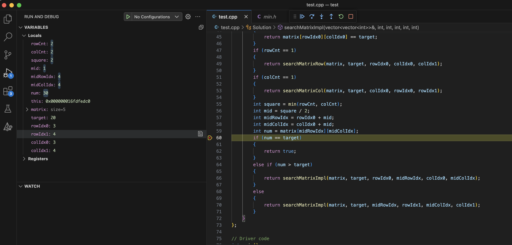

# Binary search matrix serial

[LeetCode-74. Search a 2D Matrix](https://leetcode.cn/problems/search-a-2d-matrix/) 中，整个matrix是递增的，因此使用一次binary search即可。

[LeetCode-240. Search a 2D Matrix II](https://leetcode.cn/problems/search-a-2d-matrix-ii/) 中，整个matrix不是递增的，因此无法使用binary search，但是:

> 将矩阵逆时针旋转 45° ，并将其转化为图形式，发现其类似于 二叉搜索树 ，即对于每个元素，其左分支元素更小、右分支元素更大。因此，通过从 “根节点” 开始搜索，遇到比 target 大的元素就向左，反之向右，即可找到目标值 target 。
>
> 作者：Krahets
> 链接：https://leetcode.cn/problems/search-a-2d-matrix-ii/solutions/2361487/240-sou-suo-er-wei-ju-zhen-iitan-xin-qin-7mtf/
> 来源：力扣（LeetCode）
> 著作权归作者所有。商业转载请联系作者获得授权，非商业转载请注明出处。

## [LeetCode-74. Search a 2D Matrix](https://leetcode.cn/problems/search-a-2d-matrix/) 

### Binary search C++

整个matrix是递增的，因此使用一次binary search即可。

```c++
#include <vector>
#include <iostream>
using namespace std;

class Solution
{
    int rowCnt{0};
    int colCnt{0};

public:
    bool searchMatrix(vector<vector<int>> &matrix, int target)
    {
        rowCnt = matrix.size();
        colCnt = matrix[0].size();
        int left = 0, right = rowCnt * colCnt - 1;
        while (left <= right)
        {
            int midIdx = left + (right - left) / 2;
            int mid = getNum(midIdx, matrix);
            if (mid == target)
            {
                return true;
            }
            else if (mid > target)
            {
                right = midIdx - 1;
            }
            else
            {
                left = midIdx + 1;
            }
        }
        return false;
    }

private:
    int getNum(int idx, vector<vector<int>> &matrix)
    {
        int rowIdx = idx / colCnt;
        int colIdex = idx - rowIdx * colCnt;
        return matrix[rowIdx][colIdex];
    }
};

// Driver code
int main()
{

    Solution s;

    vector<vector<int>> matrix{{1, 3, 5, 7}, {10, 11, 16, 20}, {23, 30, 34, 60}};
    s.searchMatrix(matrix, 3);

    vector<vector<int>> matrix1{{1}, {3}};
    s.searchMatrix(matrix1, 2);
    return 0;
}
// g++ test.cpp --std=c++11 -pedantic -Wall -Wextra

```


## [LeetCode-240. Search a 2D Matrix II](https://leetcode.cn/problems/search-a-2d-matrix-ii/) 

### [Krahets](https://leetcode.cn/u/jyd/) # [240. 搜索二维矩阵 II（贪心，清晰图解）](https://leetcode.cn/problems/search-a-2d-matrix-ii/solutions/2361487/240-sou-suo-er-wei-ju-zhen-iitan-xin-qin-7mtf/)

如下图所示，我们将矩阵逆时针旋转 45° ，并将其转化为图形式，发现其类似于 二叉搜索树 ，即对于每个元素，其左分支元素更小、右分支元素更大。因此，通过从 “根节点” 开始搜索，遇到比 target 大的元素就向左，反之向右，即可找到目标值 `target` 。


“根节点” 对应的是矩阵的 “左下角” 和 “右上角” 元素，本文称之为 标志数 ，以 matrix 中的 左下角元素 为标志数 flag ，则有:

- 若 flag > target ，则 target 一定在 flag 所在 行的上方 ，即 flag 所在行可被消去。

- 若 flag < target ，则 target 一定在 flag 所在 列的右方 ，即 flag 所在列可被消去。

#### 算法流程：

1. 从矩阵 matrix 左下角元素（索引设为 (i, j) ）开始遍历，并与目标值对比：

- 当 `matrix[i][j] > target` 时，执行 `i--` ，即消去第 i 行元素。
- 当 `matrix[i][j] < target` 时，执行 `j++` ，即消去第 j 列元素。
- 当 `matrix[i][j] = target` 时，返回 true ，代表找到目标值。

2. 若行索引或列索引越界，则代表矩阵中无目标值，返回 false 。

#### Python

```python
from typing import *

class Solution:
    def searchMatrix(self, matrix: List[List[int]], target: int) -> bool:
        i, j = len(matrix) - 1, 0
        while i >= 0 and j < len(matrix[0]):
            if matrix[i][j] > target: i -= 1
            elif matrix[i][j] < target: j += 1
            else: return True
        return False


```


### Binary-search

#### dead-loop

```c++
#include <vector>
#include <iostream>
#include <algorithm>

using namespace std;

class Solution {
public:
    bool searchMatrix(vector<vector<int>> &matrix, int target) {
        return searchMatrixImpl(matrix, target, 0, matrix.size() - 1, 0, matrix[0].size() - 1);
    }

private:
    /// @brief 搜索一列
    bool searchMatrixCol(vector<vector<int>> &matrix, int target, int colIdx, int rowIdx0, int rowIdx1) {
        int cnt = rowIdx1 - rowIdx0 + 1;
        int array[cnt];
        for (int arrayIdx = 0, rowIdx = rowIdx0; rowIdx <= rowIdx1; ++arrayIdx, ++rowIdx) {
            array[arrayIdx] = matrix[rowIdx][colIdx];
        }
        return std::binary_search(array, array + cnt, target);
    }

    /// @brief 搜索一行
    bool searchMatrixRow(vector<vector<int>> &matrix, int target, int rowIdx, int colIdx0, int colIdx1) {
        return std::binary_search(matrix[rowIdx].begin() + colIdx0, matrix[rowIdx].begin() + colIdx1 + 1, target);
    }

    /// @brief 搜索一行
    bool
    searchMatrixCrossRowCol(vector<vector<int>> &matrix, int target, int rowIdx, int colIdx, int rowIdx0, int rowIdx1,
                            int colIdx0, int colIdx1) {

    }

    /// @brief
    // [rowIdx0, colIdx0]
    // [rowIdx1, colIdx1]
    bool searchMatrixImpl(vector<vector<int>> &matrix, int target, int rowIdx0, int rowIdx1, int colIdx0, int colIdx1) {
        int rowCnt = rowIdx1 - rowIdx0 + 1;
        int colCnt = colIdx1 - colIdx0 + 1;
        if (rowCnt <= 0 || colCnt <= 0) {
            return false;
        }
        if (rowCnt == 1 && colCnt == 1) {
            return matrix[rowIdx0][colIdx0] == target;
        }
        if (rowCnt == 1) {
            return searchMatrixRow(matrix, target, rowIdx0, colIdx0, colIdx1);
        }
        if (colCnt == 1) {
            return searchMatrixCol(matrix, target, colIdx0, rowIdx0, rowIdx1);
        }
        int square = min(rowCnt, colCnt);
        int mid = square / 2;
        int midRowIdx = rowIdx0 + mid;
        int midColIdx = colIdx0 + mid;
        int num = matrix[midRowIdx][midColIdx];
        if (num == target) {
            return true;
        } else if (num > target) {
            return searchMatrixImpl(matrix, target, rowIdx0, midRowIdx, colIdx0, midColIdx);
        } else {
            return searchMatrixImpl(matrix, target, midRowIdx, rowIdx1, midColIdx, colIdx1);
        }
    }
};

// Driver code
int main() {

    Solution s;

    vector<vector<int>> matrix{{1,  4,  7,  11, 15},
                               {2,  5,  8,  12, 19},
                               {3,  6,  9,  16, 22},
                               {10, 13, 14, 17, 24},
                               {18, 21, 23, 26, 30}};


    std::cout << s.searchMatrix(matrix, 20);

    return 0;
}
// g++ test.cpp --std=c++11 -pedantic -Wall -Wextra

```





#### 通过

```c++
class Solution
{
public:
    bool searchMatrix(vector<vector<int>> &matrix, int target)
    {
        return searchMatrixImpl(matrix, target, 0, matrix.size() - 1, 0, matrix[0].size() - 1);
    }

private:
    /// @brief 搜索一列
    bool searchMatrixCol(vector<vector<int>> &matrix, int target, int colIdx, int rowIdx0, int rowIdx1)
    {
        int cnt = rowIdx1 - rowIdx0 + 1;
        int array[cnt];
        for (int arrayIdx = 0, rowIdx = rowIdx0; rowIdx <= rowIdx1; ++arrayIdx, ++rowIdx)
        {
            array[arrayIdx] = matrix[rowIdx][colIdx];
        }
        return std::binary_search(array, array + cnt, target);
    }

    /// @brief 搜索一行
    bool searchMatrixRow(vector<vector<int>> &matrix, int target, int rowIdx, int colIdx0, int colIdx1)
    {
        return std::binary_search(matrix[rowIdx].begin() + colIdx0, matrix[rowIdx].begin() + colIdx1 + 1, target);
    }

    /// @brief
    // [rowIdx0, colIdx0]
    // [rowIdx1, colIdx1]
    bool searchMatrixImpl(vector<vector<int>> &matrix, int target, int rowIdx0, int rowIdx1, int colIdx0, int colIdx1)
    {
        int rowCnt = rowIdx1 - rowIdx0 + 1;
        int colCnt = colIdx1 - colIdx0 + 1;
        if (rowCnt <= 0 || colCnt <= 0)
        {
            return false;
        }
        if (rowCnt == 1 && colCnt == 1)
        {
            return matrix[rowIdx0][colIdx0] == target;
        }
        if (rowCnt == 1)
        {
            return searchMatrixRow(matrix, target, rowIdx0, colIdx0, colIdx1);
        }
        if (colCnt == 1)
        {
            return searchMatrixCol(matrix, target, colIdx0, rowIdx0, rowIdx1);
        }
        int square = min(rowCnt, colCnt);
        int mid = square / 2;
        int midRowIdx = rowIdx0 + mid;
        int midColIdx = colIdx0 + mid;
        int num = matrix[midRowIdx][midColIdx];
        if (target == num)
        {
            return true;
        }
        else if (target < num) // 比右下的最小的都要小，所以右下可以丢弃
        {

            return searchMatrixImpl(matrix, target, rowIdx0, midRowIdx - 1, colIdx0, midColIdx - 1) || // 左上
                   searchMatrixImpl(matrix, target, rowIdx0, midRowIdx - 1, midColIdx, colIdx1) ||     // 右上
                   searchMatrixImpl(matrix, target, midRowIdx, rowIdx1, colIdx0, midColIdx - 1);       // 左下
        }
        else // target > num // 比左上最大的都要大，所以左上可以丢弃
        {
            return searchMatrixImpl(matrix, target, rowIdx0, midRowIdx, midColIdx + 1, colIdx1) ||   // 右上
                   searchMatrixImpl(matrix, target, midRowIdx + 1, rowIdx1, colIdx0, midColIdx) ||   // 左下
                   searchMatrixImpl(matrix, target, midRowIdx + 1, rowIdx1, midColIdx + 1, colIdx1); // 右下
        }
    }
};

```


