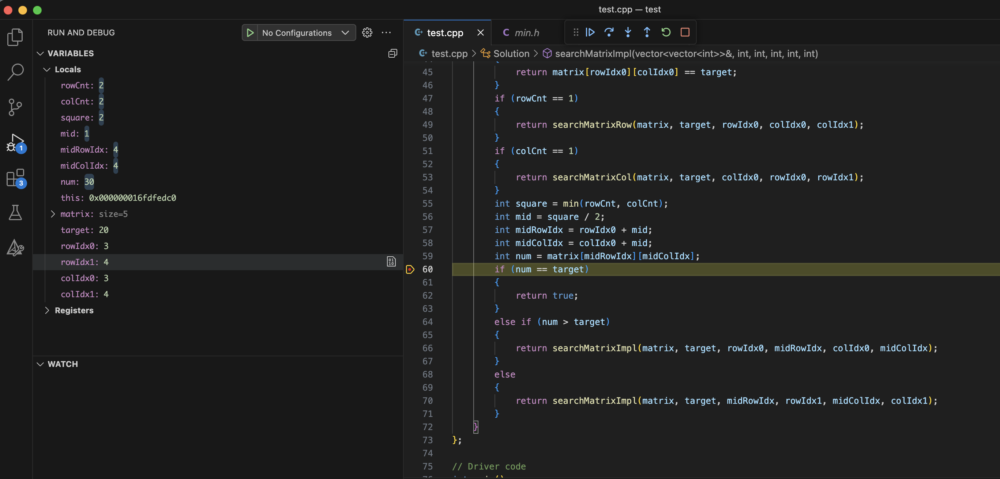

# [LeetCode-240. Search a 2D Matrix II](https://leetcode.cn/problems/search-a-2d-matrix-ii/)


## Binary-search-dead-loop

```c++
#include <vector>
#include <iostream>
#include <algorithm>
using namespace std;

class Solution
{
public:
    bool searchMatrix(vector<vector<int>> &matrix, int target)
    {
        return searchMatrixImpl(matrix, target, 0, matrix.size() - 1, 0, matrix[0].size() - 1);
    }

private:
    /// @brief 搜索一列
    bool searchMatrixCol(vector<vector<int>> &matrix, int target, int colIdx, int rowIdx0, int rowIdx1)
    {
        int cnt = rowIdx1 - rowIdx0 + 1;
        int array[cnt];
        for (int arrayIdx = 0, rowIdx = rowIdx0; rowIdx <= rowIdx1; ++arrayIdx, ++rowIdx)
        {
            array[arrayIdx] = matrix[rowIdx][colIdx];
        }
        return std::binary_search(array, array + cnt, target);
    }

    /// @brief 搜索一行
    bool searchMatrixRow(vector<vector<int>> &matrix, int target, int rowIdx, int colIdx0, int colIdx1)
    {
        return std::binary_search(matrix[rowIdx].begin() + colIdx0, matrix[rowIdx].begin() + colIdx1 + 1, target);
    }
    /// @brief
    // [rowIdx0, colIdx0]
    // [rowIdx1, colIdx1]
    bool searchMatrixImpl(vector<vector<int>> &matrix, int target, int rowIdx0, int rowIdx1, int colIdx0, int colIdx1)
    {
        int rowCnt = rowIdx1 - rowIdx0 + 1;
        int colCnt = colIdx1 - colIdx0 + 1;
        if (rowCnt <= 0 || colCnt <= 0)
        {
            return false;
        }
        if (rowCnt == 1 && colCnt == 1)
        {
            return matrix[rowIdx0][colIdx0] == target;
        }
        if (rowCnt == 1)
        {
            return searchMatrixRow(matrix, target, rowIdx0, colIdx0, colIdx1);
        }
        if (colCnt == 1)
        {
            return searchMatrixCol(matrix, target, colIdx0, rowIdx0, rowIdx1);
        }
        int square = min(rowCnt, colCnt);
        int mid = square / 2;
        int midRowIdx = rowIdx0 + mid;
        int midColIdx = colIdx0 + mid;
        int num = matrix[midRowIdx][midColIdx];
        if (num == target)
        {
            return true;
        }
        else if (num > target)
        {
            return searchMatrixImpl(matrix, target, rowIdx0, midRowIdx, colIdx0, midColIdx);
        }
        else
        {
            return searchMatrixImpl(matrix, target, midRowIdx, rowIdx1, midColIdx, colIdx1);
        }
    }
};

// Driver code
int main()
{

    Solution s;

    vector<vector<int>> matrix{{1, 4, 7, 11, 15}, {2, 5, 8, 12, 19}, {3, 6, 9, 16, 22}, {10, 13, 14, 17, 24}, {18, 21, 23, 26, 30}};


    std::cout << s.searchMatrix(matrix, 20);

    return 0;
}
// g++ test.cpp --std=c++11 -pedantic -Wall -Wextra

```


