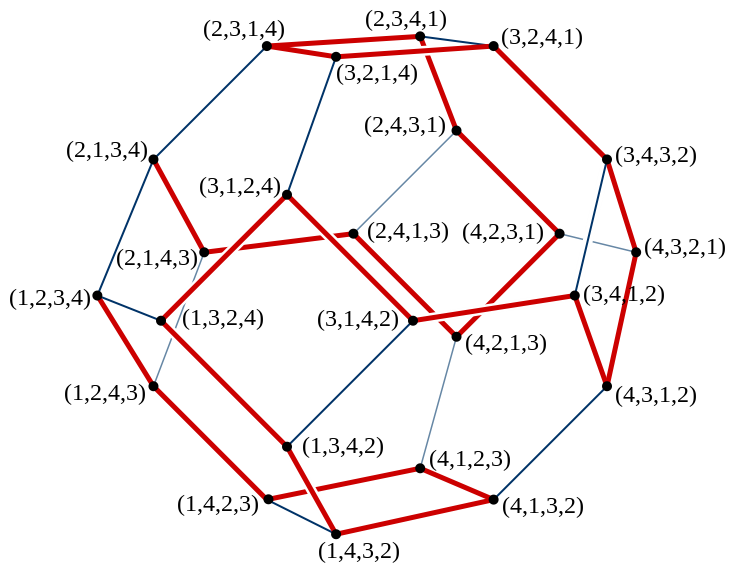

# Generate permutations 

生成排列，需要考虑的问题:

- 全排列还是部分排列

- 次序: 这和 (wikipedia [Permutation](https://en.wikipedia.org/wiki/Permutation) # Numbering permutations)相对应
  - 字典序
  - Lehmer code

- 重复元素
- 全排列还是部分排列


## 鸽笼模型

按照鸽笼模型的思想，将生成全排列看作有 *n* 个并排列成一行的空格(**鸽笼**)，我们需要从左往右依此往这些空格中填入题目给定的 *n* 个数/字符(......)(**鸽子**)，每个数/字符(......)(**鸽子**)只能使用一次。

## [wikipedia-全排列生成算法](https://zh.wikipedia.org/zh-cn/%E5%85%A8%E6%8E%92%E5%88%97%E7%94%9F%E6%88%90%E7%AE%97%E6%B3%95) 


## 全排列: DFS+swap+inplace+不去重

这是最常见的一种算法，我们可以将题目给定的 *n* 个数的数组 *nums* 划分成**左右两个部分**，**左边**的表示已经填过的数，**右边**表示待填的数，我们在回溯的时候只要动态维护这个数组即可(从后面的内容可知: 通过index来进行维护)。

具体来说，假设我们现在要填第 *first* 个位置，那么 *nums* 数组中 [0,*first*−1] 是已填过的数的集合，[*first*,*n*−1] 是待填的数的集合。我们肯定是尝试用 [*first*,*n*−1] 里的数去填第 *first* 个数，假设待填的数的下标为 *i*，那么填完以后我们将第 *i* 个数和第 *first* 个数交换，这样能使得在填第 *first*+1 个数的时候 *nums* 数组的 [0,*first*] 部分为已填过的数，[*first*+1,*n*−1] 为待填的数，回溯的时候交换回来即能完成撤销操作。

> Reference: 上述内容参考自: [LeetCode-46. 全排列](https://leetcode.cn/problems/permutations/) # [官方解题](https://leetcode.cn/problems/permutations/solutions/218275/quan-pai-lie-by-leetcode-solution-2/)


### geeksforgeeks [Write a program to print all permutations of a given string](https://www.geeksforgeeks.org/write-a-c-program-to-print-all-permutations-of-a-given-string/) 

#### 问题描述

A permutation, also called an “arrangement number” or “order,” is a rearrangement of the elements of an ordered list S into a one-to-one correspondence with S itself. A string of length n has n! permutation.
Source: [Mathword](http://mathworld.wolfram.com/Permutation.html) .

Below are the permutations of string ABC.
ABC ACB BAC BCA CBA CAB

#### 算法

 Here is a solution that is used as a basis in backtracking. 


 

> NOTE: 
>
> 上述图已经非常好地展示了[backtracking](https://en.wikipedia.org/wiki/Backtracking)算法的调用过程，结合下面的代码来看的话，对上面的recursion tree进行先序遍历就是下面的函数的调用过程；该函数的目的是生成所有的permutation的，即它需要穷举；
>
> 生成permutation的过程可以简述为：
>
> - 从n个元素中挑选出一个来作为第0个元素
> - 从n-1个元素中挑选出一个来作为第1个元素
> - 从n-2个元素中挑选出一个来作为第2个元素
> - ...
> - 从2个元素中挑选出一个来作为第n-2个元素
> - 从1个元素中挑选出一个来作为第n-1个元素
>
> 
>
> 显然上述过程是一个递归的过程，上述过程如果使用图形化来展示的话，其实和上面的recursion tree是完美对应的：
>
> - recursion tree的第一层节点，对应了从n（n=3）个元素中挑选出一个来作为第0个元素
> - recursion tree的第二层节点，对应了从n-1（n-1=2）个元素中挑选出一个来作为第1个元素
>
> recursion tree中的每一条路径就对应了一个组合；
>
> 所以，共有$n \times (n-1) \times (n-2) \times \ldots \times 2 \times 1$种排列，$n \times (n-1) \times (n-2) \times \ldots \times 2 \times 1$是和上述recursion tree完美对应的:
>
> - 第一个元素选定为`A`，对应了第一棵子树，显然共有n棵类似这样的子树，所以是$n \times$
>
> 由于我们的backtrack算法目的是**穷举**，所以在第一个元素选定为`A`后，还需要去尝试第一个元素选定为`B`的情况，还需要去产生第一个元素选定为`C`的情况；以此类推，在第二个元素选定为`A`后，还需要去尝试第二个元素选定为`B`的情况，还需要去产生第二个元素选定为`C`的情况；所以我们需要回溯，即回退到上一层的状态，这样上一层就能够尝试另外一种情况了；其实这就是[backtracking](https://en.wikipedia.org/wiki/Backtracking)算法的核心思想所在了；
>
> 对上述递归数进行先序遍历就对应了递归函数实际的执行过程，需要注意的是，当第一次由上到下经过一条边的时候，执行swap函数，当第二次由下到上经过该边的时候，执行方向相反的swap函数；这也说明递归调用是深度优先地遍历。
>
> 那上述过程如何使用递归函数来进行实现呢？这就是一个程序员需要考虑的问题了。对于这个问题，我们常常考虑的是使用[backtracking](https://en.wikipedia.org/wiki/Backtracking)算法：
>
> 


### [LeetCode-46. 全排列](https://leetcode.cn/problems/permutations/) 


#### Python

```python
from typing import *


class Solution:
    def permute(self, nums: List[int]) -> List[List[int]]:
        ans = []

        def dfs(left: int, right: int):
            if left == right:
                ans.append(nums[:])
            else:
                for i in range(left, right + 1):
                    nums[left], nums[i] = nums[i], nums[left] # swap
                    dfs(left + 1, right)
                    nums[i], nums[left] = nums[left], nums[i]

        dfs(0, len(nums) - 1)
        return ans

```


#### C++


```C++
//#include <bits/stdc++.h>
#include <vector>

using namespace std;

class Solution {
public:
    void dfs(vector<vector<int>> &res, vector<int> &output, int first, int len) {
        // 所有数都填完了
        if (first == len) {
            res.emplace_back(output);
            return;
        }
        for (int i = first; i < len; ++i) {
            // 动态维护数组
            swap(output[i], output[first]);
            // 继续递归填下一个数
            dfs(res, output, first + 1, len);
            // 撤销操作
            swap(output[i], output[first]);
        }
    }

    vector<vector<int>> permute(vector<int> &nums) {
        vector<vector<int> > res;
        dfs(res, nums, 0, (int) nums.size());
        return res;
    }
};

int main() {
    Solution s;

}
// g++ test.cpp --std=c++11 -pedantic -Wall -Wextra -g

```


## 全排列: DFS+swap+inplace+去重

对于包含重复元素的待排列的数组，如果要去重的话，如何实现呢？


> Reference: [Krahets](https://leetcode.cn/u/jyd/) # [47. 全排列 II（回溯，清晰图解）](https://leetcode.cn/problems/permutations-ii/solutions/2363888/47-quan-pai-lie-iihui-su-qing-xi-tu-jie-7ry7t/) 

在每个鸽笼，保证“每只鸽子只出现一次”，**即遇到重复元素时不交换，直接跳过**，从而将生成重复排列的搜索分支进行“剪枝” 。

### [LeetCode-47. Permutations II](https://leetcode.cn/problems/permutations-ii/) 

#### Python

```python
from typing import *


class Solution:
    def permuteUnique(self, nums: List[int]) -> List[List[int]]:
        ans: List[List[int]] = []

        def dfs(left: int):
            if left == len(nums) - 1:
                ans.append(nums[:])
            else:
                visited = set()
                for right in range(left, len(nums)):
                    if nums[right] in visited:
                        continue
                    visited.add(nums[right])
                    nums[left], nums[right] = nums[right], nums[left]
                    dfs(left + 1)
                    nums[right], nums[left] = nums[left], nums[right]

        dfs(0)
        return ans


if __name__ == "__main__":
    solu = Solution()
    solu.permuteUnique([1, 2, 2])

```


## 全排列: DFS+n-ary tree+visited prunc

将完全N叉树通过剪枝的方式，修建为一颗排列树；

在每个位置处，都可以选择n个元素；如果元素已经被选择，则跳过；

这是比较原始但是简单的方式；

素材:

- CSDN [全排列—含重复元素](https://blog.csdn.net/drawlessonsfrom/article/details/108936498) 


### [LeetCode-46. 全排列](https://leetcode.cn/problems/permutations/) 

#### Python

```python
from typing import *


class Solution:
    def permute(self, nums: List[int]) -> List[List[int]]:
        ans = []
        visited = set()
        track: List[int] = [0] * len(nums)

        def dfs(left: int):
            if left == len(nums):
                ans.append(track[:])
            else:
                for num in nums:
                    if num in visited: # 剪枝
                        continue
                    visited.add(num)
                    track[left] = num
                    dfs(left + 1)
                    visited.remove(num)

        dfs(0)
        return ans


if __name__ == "__main__":
    solu = Solution()
    solu.permute([1, 2, 3])

```


### [LeetCode-47. 全排列 II-中等](https://leetcode.cn/problems/permutations-ii/) 

#### C++

```C++
//#include <bits/stdc++.h>
#include <vector>

using namespace std;

class Solution {
    vector<int> vis; // 元素是否被放入到排列中，1-是、0-否

public:
    void backtrack(vector<int> &nums, vector<vector<int>> &ans, int idx, vector<int> &perm) {
        if (idx == nums.size()) {
            ans.emplace_back(perm);
            return;
        }
        for (int i = 0; i < (int) nums.size(); ++i) {
            /**
             * 1、vis[i] 为 1 ，表示第 i 个元素已经放入到了排列中
             * 2、nums[i] == nums[i - 1] && !vis[i - 1] 对应的是 01 模式，这种模式是需要剪枝的
             */
            if (vis[i] || (i > 0 && nums[i] == nums[i - 1] && !vis[i - 1])) {
                continue;
            }
            perm.emplace_back(nums[i]);
            vis[i] = 1;
            backtrack(nums, ans, idx + 1, perm);
            vis[i] = 0;
            perm.pop_back();
        }
    }

    vector<vector<int>> permuteUnique(vector<int> &nums) {
        vector<vector<int>> ans;
        vector<int> perm;
        vis.resize(nums.size());
        sort(nums.begin(), nums.end());
        backtrack(nums, ans, 0, perm);
        return ans;
    }
};

int main() {
    Solution s;
}
// g++ test.cpp --std=c++11 -pedantic -Wall -Wextra -g

```


## Steinhaus–Johnson–Trotter algorithm

zhihu [全排列-逆序数-排列的奇偶性](https://zhuanlan.zhihu.com/p/405028673) 

### Steinhaus-Johnson-Trotter算法


**Steinhaus-Johnson-Trotter算法**是一种基于最小变换的全排列生成算法，对于排列`a[1...n]`，该算法通过将`a[i]`，与`a[i-1]`（或`a[i+1]`）进行交换，生成下一个排列，直到所有排列生成完毕为止，这样，当前排列与其后继排列只是两个相邻位置的元素发生了调换。当然，为了防止重复生成某一个排列，算法并非随意调换某两个元素之间的位置，其生成全排列的具体规则如下。

1、首先，以**字典序**最小的排列起始，并且为该排列的每个元素赋予一个移动方向，初始所有元素的移动方向都**向左**。

2、在排列中查找这样的元素，该元素按照其对应的**移动方向**移动，可以移动到一个合法位置，且移动方向的元素小于该元素，在所有满足条件的元素中，找到其中的最大者。

3、将该元素与其移动方向所对应的元素交换位置。

4、对于排列中，所有元素值大于该元素的元素，反转其移动方向。

这里有几个概念需要说明一下，所谓合法位置，是指该元素按照其移动方向移动，不会移动到排列数组之外，例如对于<4，<1，<2，<3，此时对于元素4，如果继续向左移动，就会超过数组范围，所以4的下一个移动位置是非法位置。而且，所有元素，都只能向比自己小的元素的方向移动，如上面例子中的元素2，3，而元素1是不能够移动到元素4的位置的。每次移动，都要对可以移动的所有元素中的最大者进行操作，上例中元素1，4不能移动，2，3都存在合法的移动方案，此时需要移动3，而不能移动2。合法移动之后，需要将所有大于移动元素的元素的移动方向反转，上例中的元素3移动后的结果是4>，1<，<3，<2，可以看到，元素4的移动方向改变了。再如此例子<2，<1，3>，4>，对于其中的元素2，4，其对应的下一个移动位置都是非法位置，而对于元素1，3，其下一个移动位置的元素，都比他们要大，对于该排列就找不到一个可以的移动方案，这说明该算法已经达到终态，全排列生成结束。下面是该算法的代码

```c++
inline int SJTNext(unsigned int *index, size_t array_size, int *move)
{
	unsigned int i, j, t;  //j记录的是待交换位置的元素的下标

	//找到最大合法移动的元素索引
	for (i = array_size - 1, j = array_size; i != UINT_MAX; --i)
	{
		if (i + move[i] < array_size && index[i] > index[i + move[i]])
		{
			if (j == array_size)
			{
				j = i;
				continue;
			}

			if (index[i] > index[j])
			{
				j = i;
			}
		}
	}

	//未发现合法的移动策略
	if (j == array_size)
	{
		return 1;
	}

	t = index[j];  //要交换位置的元素
	i = j + move[j];  //发生交换的位置
	swap(index, i, j);
	swap(move, i, j);

	//将所有比t大的元素的移动方向反转
	for (i = 0; i < array_size; ++i)
	{
		if (index[i] > t)
		{
			move[i] = -move[i];
		}
	}

	return 0;
}

/*
 * 基于最小变换的Steinhaus–Johnson–Trotter算法
 */
void FullArray(char *array, size_t array_size)
{
	unsigned int index[array_size];
	int move[array_size];

	for (unsigned int i = 0; i < array_size; ++i)
	{
		index[i] = i;
		move[i] = -1;
	}

	ArrayPrint(array, array_size, index);

	while (!SJTNext(index, array_size, move))
	{
		ArrayPrint(array, array_size, index);
	}
}
```

代码使用了一个伴随数组move标记对应位置元素的移动方向，在元素移动时，move数组中的对应元素也要相应移动。该算法从初始排列<1,<2,<3,<4开始，可以生成4元素的所有排列，直至最终排列<2，<1，3>，4>为止，其状态转移如下图所示，该图片来自于Wiki百科。




实际上该算法是Shimon Even对于Steinhaus-Johnson-Trotter三人提出的全排列生成算法的改进算法，在算法中实际上还有一个问题需要解决，就是对于给定的排列，如何判断其所有元素的移动方向，如果上面所谓终态的移动方向是<2，<1，3>，<4[[KD1\]](#_msocom_1) ，那么这个状态就还存在可行的移动方案。Johnson(1963)给出了判断当前排列各元素移动方向的方法，对于排列中的每个元素，判断所有比该元素小的元素所生成序列的逆序数，如果逆序数为偶，则该元素的移动方向为向左，否则移动方向向右，我们用这条原则来看一下上面的终态2，1，3，4。对于元素1，没有比1小的元素，此时我们认为，空序列的逆序数为偶，所以元素1的移动方向向左；对于元素2，比2小的元素形成的序列为1，单元素序列的逆序数为偶，所以2的移动方向向左；对于元素3，小于3的元素组成的序列为21，逆序数为1，奇数，所以3的移动方向向右；对于元素4，对应序列为213，逆序数为奇数，所以4的移动方向向右。根据该规则就可以知道，给定某一排列，其对应元素的移动方向是确定的。

```C++
void SJT(int *a, int n)
{
	long len = count_factorial(n);
	int b[100] = { 0 };
	int direction[100];
	for (int i = 0; i < n; i++)
		direction[i] = -1;
	int pos = n - 1;
	for (int i = 0; i < len; i++)
	{
		permutation_print(a, n);
		if (direction[pos] == -1 && pos > 0)
		{
			int next_pos = direction[pos] + pos;
			swap(a[pos], a[next_pos]);
			swap(direction[pos], direction[next_pos]);
			pos = next_pos;
		}
		else if (direction[pos] == 1 && pos < n - 1)
		{
			int next_pos = direction[pos] + pos;
			swap(a[pos], a[next_pos]);
			swap(direction[pos], direction[next_pos]);
			pos = next_pos;
		}
		else
		{
			int max_pos = -1, max_num = -1;
			for (int j = 0; j < n; j++)
			{
				int next_pos = j + direction[j];
				if (next_pos < 0 || next_pos >= n)
					continue;
				if (a[next_pos] > a[j])
					continue;
				if (max_pos == -1 || a[max_pos] < a[j])
				{
					max_pos = j;
					max_num = a[max_pos];
				}
			}
			if (max_pos == -1)
				break;
			int next_pos = max_pos + direction[max_pos];
			swap(a[max_pos], a[next_pos]);
			swap(direction[max_pos], direction[next_pos]);
			for (int j = 0; j < n; j++)
			{
				if (a[j] > max_num)
					direction[j] = -direction[j];
			}
		}
	}
	cout << "Total 6:" << len << endl;
}
```


### wikipedia [Steinhaus–Johnson–Trotter algorithm](https://en.wikipedia.org/wiki/Steinhaus%E2%80%93Johnson%E2%80%93Trotter_algorithm)


## Lexicographical order-next permutation-非递归算法

字典序法


### [LeetCode-31. 下一个排列](https://leetcode.cn/problems/next-permutation/)

cppreference [std::next_permutation](https://en.cppreference.com/w/cpp/algorithm/next_permutation) 

以数字序列 `[1,2,3] `为例，其排列按照字典序依次为：

```c++
[1,2,3]
[1,3,2]
[2,1,3]
[2,3,1]
[3,1,2]
[3,2,1]
```


#### [LeetCode-下一个排列算法详解：思路+推导+步骤，看不懂算我输！](https://leetcode.cn/problems/next-permutation/solution/xia-yi-ge-pai-lie-suan-fa-xiang-jie-si-lu-tui-dao-/) 

> NOTE: 
>
> 由将原来的  **升序** 逐步变为 **降序**，下面是一个简单的例子:
>
> ```C++
> 1234
> 1243
> 1324
> 1342
> 1423
> 1432
> 2134
> 2143
> 2314
> 2341
> 2413
> 2431
> 3124
> 3142  
> ```
>
> 升序+降序+分水岭/分界点
>
> 采取贪心思想，思路是: 自**右(低位)**向**左(高位)**进行扫描，一旦发现有相邻两个数是升序的，显然下一个排列的生成就从它开始(显然是最小的，所以符合next要求)，逐步(位)将原来的  **升序** 逐步变为 **降序**
>
> 

##### 算法推导

如何得到这样的排列顺序？这是本文的重点。我们可以这样来分析：

一. 我们希望下一个数比当前数大，这样才满足“下一个排列”的定义。因此只需要将后面的「大数」与前面的「小数」交换，就能得到一个更大的数。比如 123456，将 5 和 6 交换就能得到一个更大的数 123465。

二. 我们还希望下一个数**增加的幅度尽可能的小**，这样才满足“下一个排列与当前排列紧邻“的要求。为了满足这个要求，我们需要：

1. 在**尽可能靠右的低位**进行交换，需要**从后向前**查找

2. 将一个 **尽可能小的「大数」** 与前面的「小数」交换。比如 `123465`，下一个排列应该把 `5` 和 `4` 交换而不是把 `6` 和 `4` 交换
3. 将「大数」换到前面后，需要将「大数」后面的所有数**重置为升序**，**升序排列就是最小的排列**。

以 `123465` 为例：首先按照上一步，交换 `5` 和 `4`，得到 `123564`；然后需要将 `5` 之后的数重置为升序，得到 `123546`。显然 `123546` 比 `123564` 更小，`123546` 就是 `123465` 的下一个排列

##### 算法过程

标准的“下一个排列”算法可以描述为：

1. **从后向前**查找第一个**相邻升序**的元素对 `(i,j)`，满足 `A[i] < A[j]`。此时 `[j,end)` 必然是降序

2. 在 `[j,end)` **从后向前**查找第一个满足 `A[i] < A[k]` 的 `k`。`A[i]`、`A[k]` 分别就是上文所说的「小数」、「大数」

3. 将 `A[i]` 与 `A[k]` 交换

4. 可以断定这时 `[j,end)` 必然是降序，逆置 `[j,end)`，使其升序

5. 如果在步骤 1 找不到符合的相邻元素对，说明当前 `[begin,end)` 为一个降序顺序，则直接跳到步骤 4


##### C++


```C++
// #include <bits/stdc++.h>
#include <algorithm>
#include <vector>
#include <memory>

using namespace std;

class Solution {
public:
    void nextPermutation(vector<int> &nums) {
        int i = nums.size() - 1 - 1;             // 让i指向倒数第二个元素
        //比较第i个元素和第i+1个元素，具体例子 53421，找出 34
        while (i >= 0 && nums[i] >= nums[i + 1]) {
            --i;
        }
        // 如果nums已经是最大的sequence，那么它就是递减的，那么当上述while循环退出的时候，i就是-1
        if (i >= 0) {
            int j = i + 1;
            // 此时 [i+1, -1] 是单调递减的，选择需要找到大于 nums[i]的最小的数，只需要从i+1开始寻找直到最后一个，循环退出的时候，
            while (j < nums.size() && nums[j] >
                                      nums[i]) {                                            // 需要注意:  nums[j] >= nums[i] 是错误的，带一个例子即可知晓：534421，如果带上=，则j会指向2
                ++j;
            }
            std::swap(nums[i], nums[j - 1]); // 注意：交换之后，[i+1, -1] 依然是单调递减的，因为 nums[j] < nums[i]
        } else {
            // 已经是最大的排列了，此时i的值为-1
            // 不需要做什么
        }
        std::reverse(nums.begin() + i + 1, nums.end()); // 将[i+1, -1]reverse一下，这样就是单调递增的了
    }
};

int main() {
    Solution s;
    vector<int> nums{5, 1, 1};
}
// g++ test.cpp --std=c++11 -pedantic -Wall -Wextra -g

```

为什么使用`std::reverse` 而不是 `std::sort` ?

上述算法的最后一步是使用 `reverse(nums.begin() + i + 1, nums.end());` ，而不是 `std::sort` ，为什么呢？

首先需要搞清楚目的: 让 `[nums.begin() + i + 1, nums.end()]` 范围内的元素为增序；显然通过 `std::sort` 是可以实现的；但是，考虑到，此时  `[nums.begin() + i + 1, nums.end()]`  内的元素是降序的，因此，通过复杂的更低的 `std::reverse` 可以实现让 `[nums.begin() + i + 1, nums.end()]` 范围内的元素为增序的目的；


## geeksforgeeks

[geeksforgeeks-Permutations of given String](https://www.geeksforgeeks.org/write-a-c-program-to-print-all-permutations-of-a-given-string/) 

[geeksforgeeks-Print all distinct permutations of a given string with duplicates](https://www.geeksforgeeks.org/print-all-permutations-of-a-string-with-duplicates-allowed-in-input-string/) 

[geeksforgeeks-Write a program to print all permutations of a given string](https://www.geeksforgeeks.org/write-a-c-program-to-print-all-permutations-of-a-given-string/) 

[geeksforgeeks-Iterative program to generate distinct Permutations of a String](https://www.geeksforgeeks.org/iterative-program-to-generate-distinct-permutations-of-a-string/) 

[geeksforgeeks-Print all possible combinations of r elements in a given array of size n](https://www.geeksforgeeks.org/print-all-possible-combinations-of-r-elements-in-a-given-array-of-size-n/) 

[geeksforgeeks-Print all possible strings of length k that can be formed from a set of n characters](https://www.geeksforgeeks.org/print-all-combinations-of-given-length/) 

[geeksforgeeks-Write a program to print all permutations of a given string](https://www.geeksforgeeks.org/write-a-c-program-to-print-all-permutations-of-a-given-string/) 


## Generating all permutations of a given string

stackoverflow [Generating all permutations of a given string](https://stackoverflow.com/questions/4240080/generating-all-permutations-of-a-given-string)

stackoverflow [Generate list of all possible permutations of a string](https://stackoverflow.com/questions/361/generate-list-of-all-possible-permutations-of-a-string)

