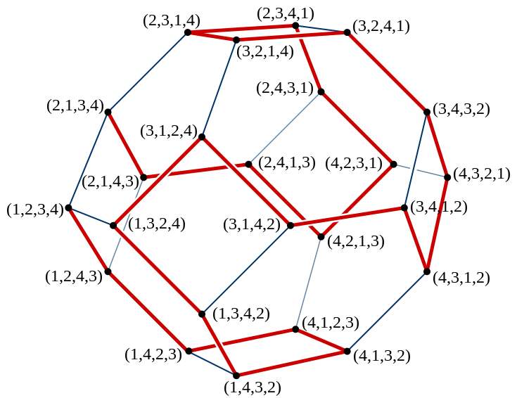

# Permutation 


## wikipedia [Permutation](https://en.wikipedia.org/wiki/Permutation)


### [Permutations in computing](https://en.wikipedia.org/wiki/Permutation#Permutations_in_computing)


## Parity of a permutation

在wikipedia [Leibniz formula for determinants](https://en.wikipedia.org/wiki/Leibniz_formula_for_determinants) 中有如下内容:

> 
> $$
> \det(A)=\sum _{\tau \in S_{n}}\operatorname {sgn}(\tau )\prod _{i=1}^{n}a_{i,\,\tau (i)}=\sum _{\sigma \in S_{n}}\operatorname {sgn}(\sigma )\prod _{i=1}^{n}a_{\sigma (i),\,i}
> $$
> where  is the [sign function](https://en.wikipedia.org/wiki/Even_and_odd_permutations) of [permutations](https://en.wikipedia.org/wiki/Permutation) in the [permutation group](https://en.wikipedia.org/wiki/Permutation_group) , which returns  and  for [even and odd permutations](https://en.wikipedia.org/wiki/Even_and_odd_permutations), respectively.

## Numbering permutations

> NOTE:
>
> 给排列进行编号

One way to represent **permutations** of *n* things is by an integer *N* with 0 ≤ *N* < *n*!, provided convenient methods are given to convert between the **number** and the **representation of a permutation as an ordered arrangement (sequence)**(这段话的意思是number和permutation的相互转换). This gives the most compact representation of arbitrary permutations, and in computing is particularly attractive when *n* is small enough that *N* can be held in a machine word:

- for 32-bit words this means *n* ≤ 12
- for 64-bit words this means *n* ≤ 20. 

The conversion can be done via the intermediate form of a sequence of numbers $d_n, d_{n-1, \dots ,d_2, d_1}$, where $d_i$ is a non-negative integer less than *i* (one may omit *d*1, as it is always 0, but its presence makes the subsequent conversion to a permutation easier to describe): 

1. The first step then is to simply express *N* in the *[factorial number system](https://en.wikipedia.org/wiki/Factorial_number_system)*, which is just a particular [mixed radix](https://en.wikipedia.org/wiki/Mixed_radix) representation, where, for numbers less than *n*!, the bases (place values or multiplication factors) for successive digits are (*n* − 1)!, (*n* − 2)!, ..., 2!, 1!. 
2. The second step interprets this sequence as a [Lehmer code](https://en.wikipedia.org/wiki/Lehmer_code) or (almost equivalently) as an inversion table.


### Lehmer code


#### gpt Lehmer code

The **Lehmer code**, also known as the **Lehmer sequence**, is a way of encoding permutations. It is named after the mathematician Derrick Henry Lehmer. The Lehmer code for a permutation is a sequence of integers that uniquely represents the permutation's position in the lexicographic ordering of all permutations of a given size.

To compute the **Lehmer code** for a permutation, you follow these steps:

1. For each position `i` in the permutation (starting from the leftmost position), count the number of elements to the right of `i` that are smaller than the element at `i`. This count is the `i`-th element of the **Lehmer code**.
2. The **Lehmer code** is then a sequence of these counts.

> NOTE:
>
> 1. 这种count，有什么意义？

For example, consider the **permutation** `[3, 1, 4, 2]` of the set `{1, 2, 3, 4}`. The **Lehmer code** for this permutation is computed as follows:

- Position 1: The value is `3`, and there are two elements to the right that are smaller (`1` and `2`), so the first element of the **Lehmer code** is `2`.
- Position 2: The value is `1`, and there are no elements to the right that are smaller, so the second element of the **Lehmer code** is `0`.
- Position 3: The value is `4`, and there is one element to the right that is smaller (`2`), so the third element of the **Lehmer code** is `1`.
- Position 4: The value is `2`, and there are no elements to the right that are smaller, so the fourth element of the **Lehmer code** is `0`.

Thus, the **Lehmer code** for the permutation `[3, 1, 4, 2]` is `[2, 0, 1, 0]`.

The **Lehmer code** can also be used to convert back to the original permutation, and it is useful in various combinatorial algorithms, including ranking and unranking permutations.

- **Lehmer code => Permutation**: The function `lehmer_code(permutation: List)` iterates through each element of the permutation, counts the number of elements to the right that are smaller, and stores these counts in the corresponding positions of the Lehmer code array.
- **Permutation => Lehmer code**: The function `permutation_from_lehmer_code` starts with a sorted list of numbers from 1 to `n` and then applies the **Lehmer code** to swap elements and reconstruct the original permutation.

```python
from typing import *


def lehmer_code(permutation: List):
    n = len(permutation)
    lehmer_code = [0] * n

    for i in range(n):
        count = 0
        for j in range(i + 1, n):
            if permutation[i] > permutation[j]:
                count += 1
        lehmer_code[i] = count

    return lehmer_code


def permutation_from_lehmer_code(code: List):
    n = len(code)
    permutation = list(range(1, n + 1))

    for i in range(n):
        count = code[i]
        for j in range(i + 1, n):
            if permutation[j] > permutation[i]:
                count -= 1
            if count == 0:
                permutation[i], permutation[j] = permutation[j], permutation[i]
                break

    return permutation


if __name__ == '__main__':
    # Example usage:
    permutation = [3, 1, 4, 2]
    code = lehmer_code(permutation)
    print("Permutation:", permutation)
    print("Lehmer code:", code)
    permutation = permutation_from_lehmer_code(code)
    print("Lehmer code:", code)
    print("Permutation:", permutation)

```


## Generation algorithm

参考文章:

CSDN [全排列—含重复元素](https://blog.csdn.net/drawlessonsfrom/article/details/108936498)

[LeetCode-46. 全排列-中等](https://leetcode.cn/problems/permutations/) 

[LeetCode-47. 全排列 II-中等](https://leetcode.cn/problems/permutations-ii/) 

baike [字典序](https://baike.baidu.com/item/%E5%AD%97%E5%85%B8%E5%BA%8F/7786229?fr=aladdin#5)

baike [全排列](https://baike.baidu.com/item/%E5%85%A8%E6%8E%92%E5%88%97)

baike [中介数](https://baike.baidu.com/item/%E4%B8%AD%E4%BB%8B%E6%95%B0/12796689?fr=aladdin)

csdn [全排列及相关扩展算法（三）——利用中介数求排列在字典序排位算法](https://blog.csdn.net/sm9sun/article/details/77258384)


## Generation algorithm: DFS


### 抽取法

将完全二叉树通过剪枝的方式，修建为一颗排列树；

在每个位置处，都可以选择n个元素；如果元素已经被选择，则跳过；

这是比较原始但是简单的方式；


在下面文章中，描述了这种算法:

1、[LeetCode-47. 全排列 II-中等](https://leetcode.cn/problems/permutations-ii/) 

```C++
#include <bits/stdc++.h>
using namespace std;
class Solution
{
	vector<int> vis; // 元素是否被放入到排列中，1-是、0-否

public:
	void backtrack(vector<int> &nums, vector<vector<int>> &ans, int idx, vector<int> &perm)
	{
		if (idx == nums.size())
		{
			ans.emplace_back(perm);
			return;
		}
		for (int i = 0; i < (int) nums.size(); ++i)
		{
			/**
			 * 1、vis[i] 为 1 ，表示第 i 个元素已经放入到了排列中
			 * 2、nums[i] == nums[i - 1] && !vis[i - 1] 对应的是 01 模式，这种模式是需要剪枝的
			 */
			if (vis[i] || (i > 0 && nums[i] == nums[i - 1] && !vis[i - 1]))
			{
				continue;
			}
			perm.emplace_back(nums[i]);
			vis[i] = 1;
			backtrack(nums, ans, idx + 1, perm);
			vis[i] = 0;
			perm.pop_back();
		}
	}

	vector<vector<int>> permuteUnique(vector<int> &nums)
	{
		vector<vector<int>> ans;
		vector<int> perm;
		vis.resize(nums.size());
		sort(nums.begin(), nums.end());
		backtrack(nums, ans, 0, perm);
		return ans;
	}
};

int main()
{
	Solution s;
	cout << s.myAtoi("-91283472332") << endl;
}
// g++ test.cpp --std=c++11 -pedantic -Wall -Wextra -g


```


2、CSDN [全排列—含重复元素](https://blog.csdn.net/drawlessonsfrom/article/details/108936498) 

```C++
#include <bits/stdc++.h>
using namespace std;
int number = 0;
int vis[15] = { 0 }; //表示未被访问过
void f(string a, int n, char b[], int p)
{
	if (p == n)
	{
		cout << b << endl;
		number++;
		return;
	}
	//在对字符串进行有序排列中，也可以开始就对他进行有序排列，因为在每次进行追加中其vis[i]均会被置为0，回到其初始状态
	for (int i = 0; i < n; i++)
	{
		if (i > 0 && a[i] == a[i - 1] && !vis[i - 1]) //进行去重，在去重需要是原来的字符串有序，同时保证a[i-1]未被访问过
		{
			continue;
		}
		if (!vis[i])
		{
			b[p] = a[i];
			vis[i] = 1;
			f(a, n, b, p + 1);
			vis[i] = 0;
		}
	}
}
int main()
{
	string str = "baba";
	sort(str.begin(), str.end()); //对字符串进行有序排列
	char b[15] = "";
	f(str, str.length(), b, 0);
	cout << number << endl;
	return 0;
}

```


### 交换法

这种算法就相对比较精妙一些，它不需要记录每个字符是否放入到了排列中，它是直接生成排列树的。

在下面文章中，描述了这种算法:

1、[LeetCode-46. 全排列](https://leetcode.cn/problems/permutations/)

```C++
#include <bits/stdc++.h>
using namespace std;
class Solution
{
public:
	void backtrack(vector<vector<int>> &res, vector<int> &output, int first, int len)
	{
		// 所有数都填完了
		if (first == len)
		{
			res.emplace_back(output);
			return;
		}
		for (int i = first; i < len; ++i)
		{
			// 动态维护数组
			swap(output[i], output[first]);
			// 继续递归填下一个数
			backtrack(res, output, first + 1, len);
			// 撤销操作
			swap(output[i], output[first]);
		}
	}
	vector<vector<int>> permute(vector<int> &nums)
	{
		vector<vector<int> > res;
		backtrack(res, nums, 0, (int) nums.size());
		return res;
	}
};

int main()
{
	Solution s;
	cout << s.myAtoi("-91283472332") << endl;
}
// g++ test.cpp --std=c++11 -pedantic -Wall -Wextra -g

```


### 抽取法 VS 交换法

#### 相同点

1、两种方法都是基于回溯法的

#### 不同点

1、

**抽取法**是将完全二叉树通过剪枝的方式，修建为一颗排列树；

```C++
for (int i = 0; i < (int) nums.size(); ++i)
```

它需要记录每个元素是否在排列中；


**交换法**是直接生成排列树，它没有剪枝的过程；

```C++
for (int i = first; i < len; ++i)
```


## Generation algorithm: Steinhaus–Johnson–Trotter algorithm

zhihu [全排列-逆序数-排列的奇偶性](https://zhuanlan.zhihu.com/p/405028673) 

### Steinhaus-Johnson-Trotter算法


**Steinhaus-Johnson-Trotter算法**是一种基于最小变换的全排列生成算法，对于排列`a[1...n]`，该算法通过将`a[i]`，与`a[i-1]`（或`a[i+1]`）进行交换，生成下一个排列，直到所有排列生成完毕为止，这样，当前排列与其后继排列只是两个相邻位置的元素发生了调换。当然，为了防止重复生成某一个排列，算法并非随意调换某两个元素之间的位置，其生成全排列的具体规则如下。

1、首先，以**字典序**最小的排列起始，并且为该排列的每个元素赋予一个移动方向，初始所有元素的移动方向都**向左**。

2、在排列中查找这样的元素，该元素按照其对应的**移动方向**移动，可以移动到一个合法位置，且移动方向的元素小于该元素，在所有满足条件的元素中，找到其中的最大者。

3、将该元素与其移动方向所对应的元素交换位置。

4、对于排列中，所有元素值大于该元素的元素，反转其移动方向。

这里有几个概念需要说明一下，所谓合法位置，是指该元素按照其移动方向移动，不会移动到排列数组之外，例如对于<4，<1，<2，<3，此时对于元素4，如果继续向左移动，就会超过数组范围，所以4的下一个移动位置是非法位置。而且，所有元素，都只能向比自己小的元素的方向移动，如上面例子中的元素2，3，而元素1是不能够移动到元素4的位置的。每次移动，都要对可以移动的所有元素中的最大者进行操作，上例中元素1，4不能移动，2，3都存在合法的移动方案，此时需要移动3，而不能移动2。合法移动之后，需要将所有大于移动元素的元素的移动方向反转，上例中的元素3移动后的结果是4>，1<，<3，<2，可以看到，元素4的移动方向改变了。再如此例子<2，<1，3>，4>，对于其中的元素2，4，其对应的下一个移动位置都是非法位置，而对于元素1，3，其下一个移动位置的元素，都比他们要大，对于该排列就找不到一个可以的移动方案，这说明该算法已经达到终态，全排列生成结束。下面是该算法的代码

```c++
inline int SJTNext(unsigned int *index, size_t array_size, int *move)
{
	unsigned int i, j, t;  //j记录的是待交换位置的元素的下标

	//找到最大合法移动的元素索引
	for (i = array_size - 1, j = array_size; i != UINT_MAX; --i)
	{
		if (i + move[i] < array_size && index[i] > index[i + move[i]])
		{
			if (j == array_size)
			{
				j = i;
				continue;
			}

			if (index[i] > index[j])
			{
				j = i;
			}
		}
	}

	//未发现合法的移动策略
	if (j == array_size)
	{
		return 1;
	}

	t = index[j];  //要交换位置的元素
	i = j + move[j];  //发生交换的位置
	swap(index, i, j);
	swap(move, i, j);

	//将所有比t大的元素的移动方向反转
	for (i = 0; i < array_size; ++i)
	{
		if (index[i] > t)
		{
			move[i] = -move[i];
		}
	}

	return 0;
}

/*
 * 基于最小变换的Steinhaus–Johnson–Trotter算法
 */
void FullArray(char *array, size_t array_size)
{
	unsigned int index[array_size];
	int move[array_size];

	for (unsigned int i = 0; i < array_size; ++i)
	{
		index[i] = i;
		move[i] = -1;
	}

	ArrayPrint(array, array_size, index);

	while (!SJTNext(index, array_size, move))
	{
		ArrayPrint(array, array_size, index);
	}
}
```

代码使用了一个伴随数组move标记对应位置元素的移动方向，在元素移动时，move数组中的对应元素也要相应移动。该算法从初始排列<1,<2,<3,<4开始，可以生成4元素的所有排列，直至最终排列<2，<1，3>，4>为止，其状态转移如下图所示，该图片来自于Wiki百科。




实际上该算法是Shimon Even对于Steinhaus-Johnson-Trotter三人提出的全排列生成算法的改进算法，在算法中实际上还有一个问题需要解决，就是对于给定的排列，如何判断其所有元素的移动方向，如果上面所谓终态的移动方向是<2，<1，3>，<4[[KD1\]](#_msocom_1) ，那么这个状态就还存在可行的移动方案。Johnson(1963)给出了判断当前排列各元素移动方向的方法，对于排列中的每个元素，判断所有比该元素小的元素所生成序列的逆序数，如果逆序数为偶，则该元素的移动方向为向左，否则移动方向向右，我们用这条原则来看一下上面的终态2，1，3，4。对于元素1，没有比1小的元素，此时我们认为，空序列的逆序数为偶，所以元素1的移动方向向左；对于元素2，比2小的元素形成的序列为1，单元素序列的逆序数为偶，所以2的移动方向向左；对于元素3，小于3的元素组成的序列为21，逆序数为1，奇数，所以3的移动方向向右；对于元素4，对应序列为213，逆序数为奇数，所以4的移动方向向右。根据该规则就可以知道，给定某一排列，其对应元素的移动方向是确定的。

```C++
void SJT(int *a, int n)
{
	long len = count_factorial(n);
	int b[100] = { 0 };
	int direction[100];
	for (int i = 0; i < n; i++)
		direction[i] = -1;
	int pos = n - 1;
	for (int i = 0; i < len; i++)
	{
		permutation_print(a, n);
		if (direction[pos] == -1 && pos > 0)
		{
			int next_pos = direction[pos] + pos;
			swap(a[pos], a[next_pos]);
			swap(direction[pos], direction[next_pos]);
			pos = next_pos;
		}
		else if (direction[pos] == 1 && pos < n - 1)
		{
			int next_pos = direction[pos] + pos;
			swap(a[pos], a[next_pos]);
			swap(direction[pos], direction[next_pos]);
			pos = next_pos;
		}
		else
		{
			int max_pos = -1, max_num = -1;
			for (int j = 0; j < n; j++)
			{
				int next_pos = j + direction[j];
				if (next_pos < 0 || next_pos >= n)
					continue;
				if (a[next_pos] > a[j])
					continue;
				if (max_pos == -1 || a[max_pos] < a[j])
				{
					max_pos = j;
					max_num = a[max_pos];
				}
			}
			if (max_pos == -1)
				break;
			int next_pos = max_pos + direction[max_pos];
			swap(a[max_pos], a[next_pos]);
			swap(direction[max_pos], direction[next_pos]);
			for (int j = 0; j < n; j++)
			{
				if (a[j] > max_num)
					direction[j] = -direction[j];
			}
		}
	}
	cout << "Total 6:" << len << endl;
}
```


### wikipedia [Steinhaus–Johnson–Trotter algorithm](https://en.wikipedia.org/wiki/Steinhaus%E2%80%93Johnson%E2%80%93Trotter_algorithm)

