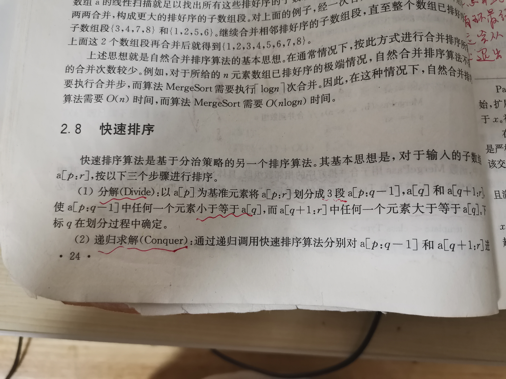
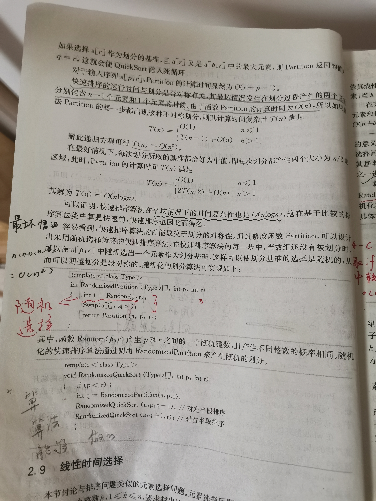

# Quick sort


## wikipedia [Quicksort](https://en.wikipedia.org/wiki/Quicksort) 

**Quicksort** (sometimes called **partition-exchange sort**) is an [efficient](https://en.wikipedia.org/wiki/Algorithm_efficiency) [sorting algorithm](https://en.wikipedia.org/wiki/Sorting_algorithm), serving as a systematic method for placing the elements of a [random access](https://en.wikipedia.org/wiki/Random_access) [file](https://en.wikipedia.org/wiki/Computer_file) or an [array](https://en.wikipedia.org/wiki/Array_data_structure) in order. 

Developed by British computer scientist [Tony Hoare](https://en.wikipedia.org/wiki/Tony_Hoare) in 1959[[1\]](https://en.wikipedia.org/wiki/Quicksort#cite_note-1) and published in 1961,[[2\]](https://en.wikipedia.org/wiki/Quicksort#cite_note-alg64-2) it is still a commonly used algorithm for sorting. 

When implemented well, it can be about two or three times faster than its main competitors, [merge sort](https://en.wikipedia.org/wiki/Merge_sort) and [heapsort](https://en.wikipedia.org/wiki/Heapsort). 

Quicksort is a [comparison sort](https://en.wikipedia.org/wiki/Comparison_sort), meaning that it can sort items of any type for which a "less-than" relation (formally, a [total order](https://en.wikipedia.org/wiki/Total_order)) is defined. 

Efficient implementations of Quicksort are not a [stable sort](https://en.wikipedia.org/wiki/Stable_sort), meaning that the relative order of equal sort items is not preserved. 

Quicksort can operate [in-place](https://en.wikipedia.org/wiki/In-place_algorithm) on an array, requiring small additional amounts of [memory](https://en.wikipedia.org/wiki/Main_memory) to perform the sorting. It is very similar to [selection sort](https://en.wikipedia.org/wiki/Selection_sort), except that it does not always choose worst-case partition.

[Mathematical analysis](https://en.wikipedia.org/wiki/Analysis_of_algorithms) of quicksort shows that, [on average](https://en.wikipedia.org/wiki/Best,_worst_and_average_case), the algorithm takes [O](https://en.wikipedia.org/wiki/Big_O_notation)(*n* log *n*) comparisons to sort *n* items. In the [worst case](https://en.wikipedia.org/wiki/Best,_worst_and_average_case), it makes $O(n^2)$ comparisons, though this behavior is rare.

### Algorithm

Quicksort is a [divide and conquer algorithm](https://en.wikipedia.org/wiki/Divide_and_conquer_algorithm). Quicksort first divides a large array into two smaller sub-arrays: the low elements and the high elements. Quicksort can then recursively sort the sub-arrays. The steps are:

1. Pick an element, called a *pivot*（基准）, from the array.

2. *Partitioning*: reorder the array so that all elements with values less than the pivot come before the pivot, while all elements with values greater than the pivot come after it (equal values can go either way). After this partitioning, the pivot is in its final position. This is called the *partition* operation.

3. [Recursively](https://en.wikipedia.org/wiki/Recursion_(computer_science)) apply the above steps to the sub-array of elements with smaller values and separately to the sub-array of elements with greater values.

The base case of the recursion is arrays of size zero or one, which are in order by definition, so they never need to be sorted.

The choice of partition routine (including the **pivot selection**) and other details not entirely specified above can affect the algorithm's performance, possibly to a great extent for specific input arrays. In discussing the efficiency of quicksort, it is therefore necessary to specify these choices first. Here we mention two specific partition methods.

#### Lomuto partition scheme

> NOTE:
>
> 一、double pointer: fast pointer+slow pointer


#### Hoare partition scheme

> NOTE:
>
> 一、double pointer: left pointer+right pointer


#### Implementation issues


##### Choice of pivot

> NOTE:
>
> 一. 这在后面进行了说明


##### Repeated elements


##### Parallelization

Quicksort's divide-and-conquer formulation makes it amenable to [parallelization](https://en.wikipedia.org/wiki/Parallel_algorithm) using [task parallelism](https://en.wikipedia.org/wiki/Task_parallelism). The partitioning step is accomplished through the use of a [parallel prefix sum](https://en.wikipedia.org/wiki/Prefix_sum) algorithm to compute an index for each array element in its section of the partitioned array.[[23\]](https://en.wikipedia.org/wiki/Quicksort#cite_note-23)[[24\]](https://en.wikipedia.org/wiki/Quicksort#cite_note-24) Given an array of size *n*, the partitioning step performs O(*n*) work in *O*(log *n*) time and requires O(*n*) additional scratch space. After the array has been partitioned, the two partitions can be sorted recursively in parallel. Assuming an ideal choice of pivots, parallel quicksort sorts an array of size *n* in O(*n* log *n*) work in O(log² *n*) time using O(*n*) additional space.


### Relation to other algorithms

**Quicksort** is a space-optimized version of the [binary tree sort](https://en.wikipedia.org/wiki/Binary_tree_sort). Instead of inserting items sequentially into an explicit tree, quicksort organizes them concurrently into a tree that is implied by the recursive calls. The algorithms make exactly the same comparisons, but in a different order. 

> NOTE: 
>
> 一、quick sort隐式地构造了一颗BST，更多内容参见 `Quicksort&BST` 章节

An often desirable property of a [sorting algorithm](https://en.wikipedia.org/wiki/Sorting_algorithm) is **stability** – that is the order of elements that compare equal is not changed, allowing controlling order of multikey tables (e.g. directory or folder listings) in a natural way. This property is hard to maintain for in situ（原位） (or in place) quicksort (that uses only constant additional space for pointers and buffers, and *O*(log *n*) additional space for the management of explicit or implicit recursion). For variant quicksorts involving extra memory due to representations using pointers (e.g. lists or trees) or files (effectively lists), it is trivial to maintain stability. The more complex, or disk-bound, data structures tend to increase time cost, in general making increasing use of virtual memory or disk.

The most direct competitor of quicksort is [heapsort](https://en.wikipedia.org/wiki/Heapsort). Heapsort's running time is *O*(*n* log *n*), but heapsort's average running time is usually considered slower than in-place quicksort. This result is debatable; some publications indicate the opposite.[[28\]](https://en.wikipedia.org/wiki/Quicksort#cite_note-28)[[29\]](https://en.wikipedia.org/wiki/Quicksort#cite_note-29) [Introsort](https://en.wikipedia.org/wiki/Introsort) is a variant of quicksort that switches to heapsort when a bad case is detected to avoid quicksort's worst-case running time.

Quicksort also competes with [merge sort](https://en.wikipedia.org/wiki/Merge_sort), another *O*(*n* log *n*) sorting algorithm. Mergesort is a [stable sort](https://en.wikipedia.org/wiki/Stable_sort), unlike standard in-place quicksort and heapsort, and can be easily adapted to operate on [linked lists](https://en.wikipedia.org/wiki/Linked_list) and very large lists stored on slow-to-access media such as [disk storage](https://en.wikipedia.org/wiki/Disk_storage) or [network-attached storage](https://en.wikipedia.org/wiki/Network-attached_storage). Although quicksort can be implemented as a stable sort using linked lists, it will often suffer from poor pivot choices without random access. The main disadvantage of mergesort is that, when operating on arrays, efficient implementations require *O*(*n*) auxiliary space, whereas the variant of quicksort with in-place partitioning and tail recursion uses only *O*(log *n*) space. (When operating on linked lists, mergesort only requires a small, constant amount of auxiliary storage.)

[Bucket sort](https://en.wikipedia.org/wiki/Bucket_sort) with two buckets is very similar to quicksort; the pivot in this case is effectively the value in the middle of the value range, which does well on average for uniformly distributed inputs.


## Implementation

divide-and-conquer

partition-and-exchange

## Partition scheme

两种partition scheme，其实都使用了double pointer，两者本质上所所实现的是给定pivot，将array划分为两个部分(partition)，下面是对它们的总结:  

| Partition scheme        | Double pointer |               |                                                              |
| ----------------------- | -------------- | ------------- | ------------------------------------------------------------ |
| Lomuto partition scheme | fast slow      | 简单/耗时更大 |                                                              |
| Hoare partition scheme  | left right     | 复杂/耗时更小 | 根据labuladong [快排亲兄弟：快速选择算法详解](https://mp.weixin.qq.com/s/TRO3FOKT90Mpvn3hQWVBAQ) 中的解释可知，这种写法是源自《算法4》的 |

test case:

1. 无序

2. 正序

3. 逆序

4. 等值


### Lomuto partition scheme/Fast slow double pointer

参考: 

- hackerearth [Quick Sort](https://www.hackerearth.com/zh/practice/algorithms/sorting/quick-sort/tutorial/)


```c++
int partition ( int A[],int start ,int end) {
    int i = start + 1;
    int piv = A[start] ;            //make the first element as pivot element.
    for(int j =start + 1; j <= end ; j++ )  {
    /*rearrange the array by putting elements which are less than pivot
       on one side and which are greater that on other. */

          if ( A[ j ] < piv) {
                 swap (A[ i ],A [ j ]);
            i += 1;
        }
   }
   swap ( A[ start ] ,A[ i-1 ] ) ;  //put the pivot element in its proper place.
   return i-1;                      //return the position of the pivot
}
```

`i`是用于定界的。

函数的返回值是分割位置。

##### 使用fast、slow pointer来解释partition

```C++
/**
 * @brief
 * 我们让慢指针`slow`走在后面，快指针`fast`走在前面探路，找到一个不重复的元素就告诉`slow`并让`slow`前进一步。
 * 这样当`fast`指针遍历完整个数组`nums`后，**`nums[0..slow]`就是不重复元素**。
 * slow指向的是右侧大于pivot的第一个元素，显然，它记录的是右半段的左侧边界；
 * pivot的过程其实是不断地将右侧区间中的不属于它的元素、即属于左侧区间的元素拿到左侧区间，
 * 那么它如何实现呢？其实方法非常简答: 让出一个位置的元素给左侧区间来存放刚刚找到的这个元素
 * 这个函数，被调用的前提是 start > end，因此最少的情况: end = start + 1
 * 刚开始的时候，fast 和 slow的值是相等的，这是必须的，因为可能只有start、end两个元素，如果让end指向start后的一个元素，则存在如下可能性:
 * 1、数组越界
 * 2、无法进入到后面的交换环节，即使只有两个元素，这也是需要进行交换的
 * @param A
 * @param start
 * @param end
 * @return
 */
int partition(int A[], int start, int end)
{
	int slow = start + 1;
	int piv = A[start];            //make the first element as pivot element.
	for (int fast = start + 1; fast <= end; fast++)
	{
		/*rearrange the array by putting elements which are less than pivot
		 on one side and which are greater that on other. */
		if (A[fast] < piv)
		{
			swap(A[slow], A[fast]);
			slow += 1;
		}
	}
	swap(A[start], A[slow - 1]);  //put the pivot element in its proper place.
	return slow - 1;                      //return the position of the pivot
}


```

#### 完整程序

Now, let us see the recursive function Quick_sort :


```c++
void quick_sort ( int A[ ] ,int start , int end ) {
   if( start < end ) {
        //stores the position of pivot element
         int piv_pos = partition (A,start , end ) ;     
         quick_sort (A,start , piv_pos -1);    //sorts the left side of pivot.
         quick_sort ( A,piv_pos +1 , end) ; //sorts the right side of pivot.
   }
}
```


完整程序如下：

```c
#include <stdio.h>
#include <stdlib.h>

/*Displays the array, passed to this method*/
void display(int arr[], int n)
{

    int i;
    for (i = 0; i < n; i++)
    {
        printf("%d ", arr[i]);
    }

    printf("\n");
}

/*Swap function to swap two values*/
void swap(int *first, int *second)
{

    int temp = *first;
    *first = *second;
    *second = temp;
}


int partition ( int A[],int start ,int end) {
    int i = start + 1;
    int piv = A[start] ;            //make the first element as pivot element.
    for(int j =start + 1; j <= end ; j++ )  {
    /*rearrange the array by putting elements which are less than pivot
       on one side and which are greater that on other. */

          if ( A[ j ] < piv) {
                 swap (A[ i ],A [ j ]);
            i += 1;
        }
   }
   swap ( A[ start ] ,A[ i-1 ] ) ;  //put the pivot element in its proper place.
   return i-1;                      //return the position of the pivot
}

/*This is where the sorting of the array takes place
	arr[] --- Array to be sorted
	lower --- Starting index
	upper --- Ending index
*/
void quickSort(int arr[], int lower, int upper)
{

    if (upper > lower)
    {

        // partitioning index is returned by the partition method , partition element is at its correct poition

        int partitionIndex = partition(arr, lower, upper);

        // Sorting elements before and after the partition index
        quickSort(arr, lower, partitionIndex - 1);
        quickSort(arr, partitionIndex + 1, upper);
    }
}

int main()
{

    int n;
    printf("Enter size of array:\n");
    scanf("%d", &n); // E.g. 8

    printf("Enter the elements of the array\n");
    int i;
    int *arr = (int *)malloc(sizeof(int) * n);
    for (i = 0; i < n; i++)
    {
        scanf("%d", &arr[i]);
    }

    printf("Original array: ");
    display(arr, n); // Original array : 10 11 9 8 4 7 3 8

    quickSort(arr, 0, n - 1);

    printf("Sorted array: ");
    display(arr, n); // Sorted array : 3 4 7 8 8 9 10 11
    getchar();
    return 0;
}
```


### Double pointer: left pointer+right pointer

1. 由两端向中间走(双端)

   需要注意极端情况: 一端直接走到底，所以需要加上越界保护

2. stop when left meet right

3. 循环体内部不断地调整

#### Java

```C++
package com.company;

class Foo {
    /**
     * 快速排序主函数
     *
     * @param nums
     */
    void sort(int[] nums) {
        // 一般要在这用洗牌算法将 nums 数组打乱，
        // 以保证较高的效率，我们暂时省略这个细节
        sort(nums, 0, nums.length - 1);
    }

    /**
     * 快速排序核心逻辑
     *
     * @param nums
     * @param lo
     * @param hi
     */
    void sort(int[] nums, int lo, int hi) {
        if (lo >= hi) return;
        // 通过交换元素构建分界点索引 p
        int p = partition(nums, lo, hi);
        // 现在 nums[lo..p-1] 都小于 nums[p]，
        // 且 nums[p+1..hi] 都大于 nums[p]
        sort(nums, lo, p - 1);
        sort(nums, p + 1, hi);
    }

    int partition(int[] nums, int lo, int hi) {
        if (lo == hi) return lo; // base case, // 必须加这个判定，否则当nums只有一个元素的时候，则必然会导致nums[++left]发生越界访问
        // 将 nums[lo] 作为默认分界点 pivot
        int pivot = nums[lo];
        // right = hi + 1 因为 while 中会先执行 --
        int left = lo, right = hi + 1;
        while (true) {
            // 保证 nums[lo..left] 都小于 pivot
            while (nums[++left] < pivot) {
                if (left == hi) break; // 越界保护: 保证left不越界
            }
            // 保证 nums[right..hi] 都大于 pivot
            while (nums[--right] > pivot) {
                if (right == lo) break; // 越界保护: 保证right不越界
            }
            if (left >= right) break; // 这里退出while (true)
            // 如果走到这里，一定有：
            // nums[left] > pivot && nums[right] < pivot
            // 所以需要交换 nums[left] 和 nums[right]，
            // 保证 nums[lo..left] < pivot < nums[right..hi]
            swap(nums, left, right);
        }
        swap(nums, right, lo); // 将 pivot 值交换到正确的位置
        // 现在 nums[lo..j-1] < nums[j] < nums[j+1..hi]
        return right;
    }

    // 交换数组中的两个元素
    void swap(int[] nums, int i, int j) {
        int temp = nums[i];
        nums[i] = nums[j];
        nums[j] = temp;
    }


    public static void main(String[] args) {

    }
}

```

一、上述代码参考自: labuladong [快排亲兄弟：快速选择算法详解](https://mp.weixin.qq.com/s/TRO3FOKT90Mpvn3hQWVBAQ) 	

> 熟悉快速排序逻辑的读者应该可以理解这段代码的含义了，这个`partition`函数细节较多，上述代码参考《算法4》，是众多写法中最漂亮简洁的一种，所以建议背住，这里就不展开解释了。

2、由于循环体内一定会执行`--right`，因此虽然 `right` 的初始值是 `hi + 1`，实际执行过程中是不会发生越界的

3、由于`a[lo]`会被选做pivot，因此第一次 `++left` 顺利地pass掉它了，这是非常合理的

4、通过2、3的总结可知，`left`、`right`的初始化选择的妙处，并且第一次执行的时候，它们都能够pass掉无效值 

二、为什么最终执行的 `swap(nums, right, lo)`？

以排序 `5,1,6,2,7,4,8` 为例

当退出 `while(true)` 的时候，`left`和`right`肯定都过界了，即此时 `left` 指向的大于pivot的，`right` 指向的是小于pivot的，partition的要求是小于它的要在它的左边，因此要和 `right` 进行交换

三、思考: 何时因为 `left == right` 而break？

比如数组是有序递减的: `6,5,4,5,2,1`，显然，循环退出是由于`i == j`，此时进行 `swap(nums, j, lo)` 也是合理的

四、和pivot的比较能否包含等号？显然是不能的，因为我们的目的是将数组分为三部分(<pivot、pivot、>pivot)，下面是一些反例:

反例1

4444445

此时如果包含等号，则left pointer、right pointer会在相遇后仍然往相反方向走而导致两者错过了。

3333333

五、算法如何处理等值的情况？

显然会执行很多的无用的替换。


#### C++

《计算机算法设计与分析》






```c++
#include <algorithm>
#include <random>
#include <iostream>

/**
 * 参考自:
 * https://stackoverflow.com/a/20136256
 * @param rangeFrom
 * @param rangeTo
 * @return
 */
int random(int rangeFrom, int rangeTo) {
    std::random_device rand_dev;
    std::mt19937 generator(rand_dev());
    std::uniform_int_distribution<> distr(rangeFrom, rangeTo);
    return distr(generator);
}


/**
 * 对a进行划分，以a[low]作为基准，进行划分后a[low]左边的元素都比它小，右边的元素都比它大
 * @tparam T
 * @param array
 * @param low
 * @param high
 * @return
 */
template<typename T>
int randomizedPartition(T array[], int low, int high) {
    if (low == high) { // base case, // 必须加这个判定，否则当nums只有一个元素的时候，则必然会导致nums[++left]发生越界访问
        return low;
    }
    std::swap(array[low], array[random(low, high)]); // 随机选择一个来作为pivot
    T pivot = array[low];
    int left = low, right = high + 1;
    while (true) {
        while (array[++left] < pivot) {
            if (left == high) break; // 越界保护: 保证left不越界
        }
        while (array[--right] > pivot) {
            if (right == low) break; // 越界保护: 保证right不越界
        }
        if (left >= right) break;
        std::swap(array[left], array[right]);
    }
    std::swap(array[low], array[right]);
    return right;
}

template<typename T>
void quickSort(T array[], int low, int high) {
    if (low < high) {
        int p = randomizedPartition(array, low, high); // pivot index
        quickSort(array, low, p - 1); // 对左半段排序
        quickSort(array, p + 1, high); // 对右半段排序
    }
}


/*Displays the array, passed to this method*/
template<typename T>
void display(T arr[], int n) {
    int i;
    for (i = 0; i < n; i++) {
        std::cout << arr[i] << ",";
    }
    std::cout << "\n";
}


int main() {

    int n;
    std::cout << "Enter size of array:\n";
    std::cin >> n; // E.g. 8

    std::cout << "Enter the elements of the array\n";
    int i;
    int *arr = new int[n];
    for (i = 0; i < n; i++) {
        std::cin >> arr[i];
    }

    std::cout << "Original array: ";
    display(arr, n); // Original array : 10 11 9 8 4 7 3 8

    quickSort(arr, 0, n - 1);

    std::cout << "Sorted array: ";
    display(arr, n); // Sorted array : 3 4 7 8 8 9 10 11
    getchar();
    return 0;

}

// g++ test.cpp --std=c++11 -pedantic -Wall -Wextra -Werror

```


### Choice of pivot

当原数组本身是有序的时候，如果每次都选择第一个元素作为pivot，那么将导致quick sort退化，下面是源自 [LeetCode-912. 排序数组](https://leetcode.cn/problems/sort-an-array/) 的一个 [test case](https://leetcode.cn/submissions/detail/194476777/testcase/) :

```C++
[1,2,3,4,5,6,7,8,9,10,11,12,13,14,15,16,17,18,19,20,21,22,23,24,25,26,27,28,29,30,31,32,33,34,35,36,37,38,39,40,41,42,43,44,45,46,47,48,49,50,51,52, ......50000]
```

这种情况下是会超时的。这跟choice of pivot有关，本节对此进行介绍。


#### Random

一种常见的策略是随机化的选择pivot，有如下两种实现随机化选择pivot都方式:

一、提前shuffle待排序的数组

stackoverflow [Is it possible to random_shuffle an array of int elements?](https://stackoverflow.com/questions/14720134/is-it-possible-to-random-shuffle-an-array-of-int-elements)


```c++
#include <random>
#include <algorithm>
#include <iterator>
#include <iostream>

int main() {
    int array[]{1, 2, 3, 4, 5, 6, 7, 8, 9, 10};

    std::random_device rd;
    std::mt19937 g(rd());

    std::shuffle(std::begin(array), std::end(array), g);

    std::copy(std::begin(array), std::end(array), std::ostream_iterator<int>(std::cout, " "));
    std::cout << "\n";
}
```


二、在partition的时候随机选择

在前面已经展示了这种写法。


#### Median-of-three(Mo3)

三数取中

一、wikipedia [Quicksort](https://en.wikipedia.org/wiki/Quicksort) # [Choice of pivot](https://en.wikipedia.org/wiki/Quicksort#Choice_of_pivot)

Median-of-three code snippet for Lomuto partition:

```pseudocode
mid := ⌊(lo + hi) / 2⌋
if A[mid] < A[lo]
    swap A[lo] with A[mid]
if A[hi] < A[lo]
    swap A[lo] with A[hi]
if A[mid] < A[hi]
    swap A[mid] with A[hi]
pivot := A[hi]
```

> NOTE:
>
> 一、上述算法乍一看有点不知所云，它实现的是取三个数的median，显然它使用了三次比较，其实只需要三次比较就能够将三个数排好序，所以三次比较足以找到median，它的前两次比较将 最小值存放到 `A[lo]` 中，显然 median 就不在 `A[mid]`、`A[hi]` 中产生了，最后一次比较就说取两者中的较小者即 median 。

It puts a median into `A[hi]` first, then that new value of `A[hi]` is used for a pivot, as in a basic algorithm presented above.

