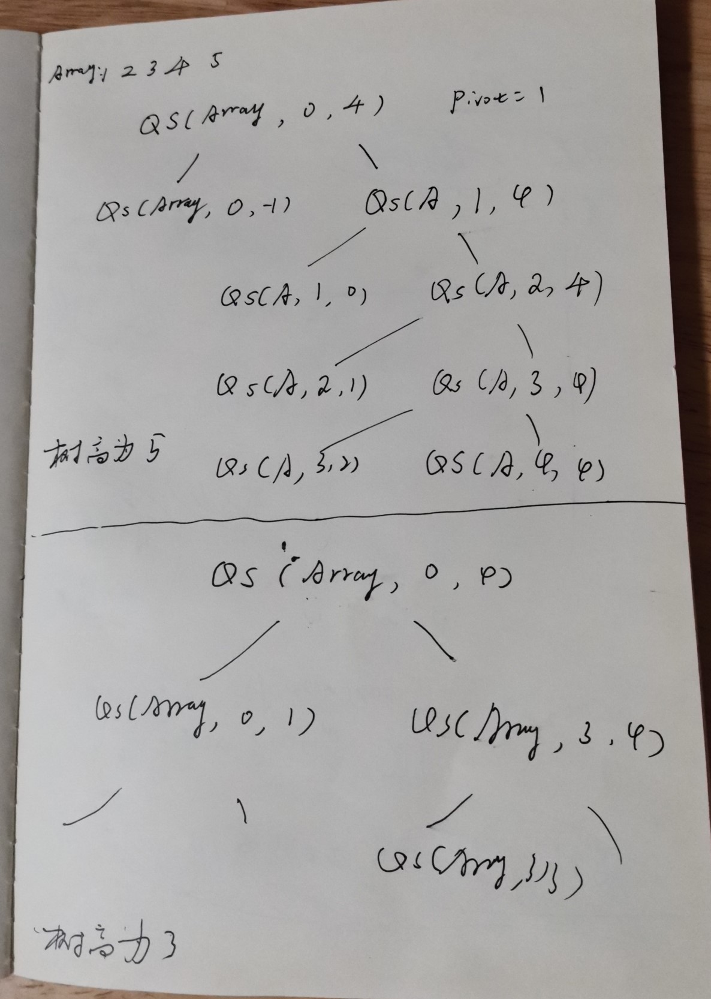
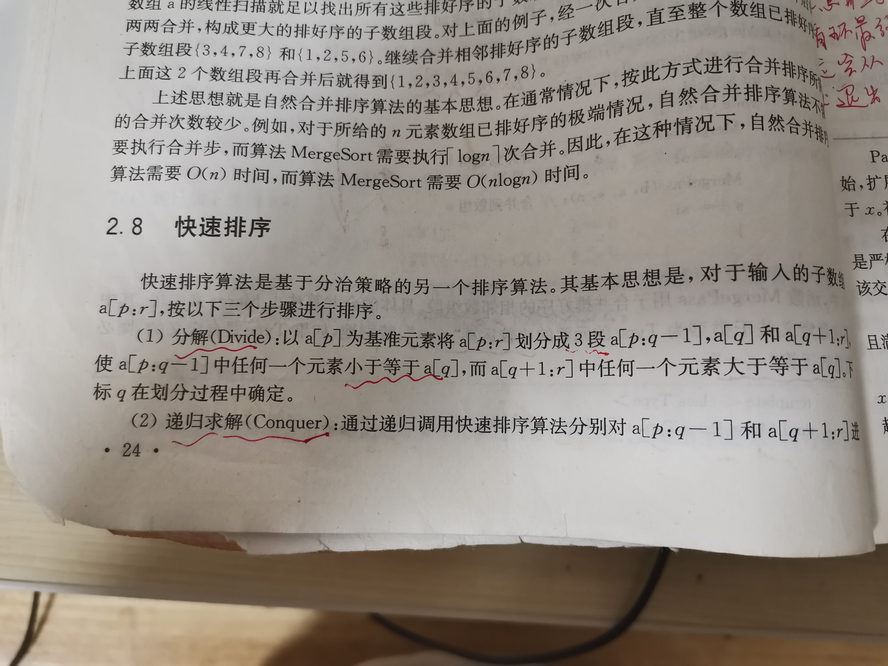
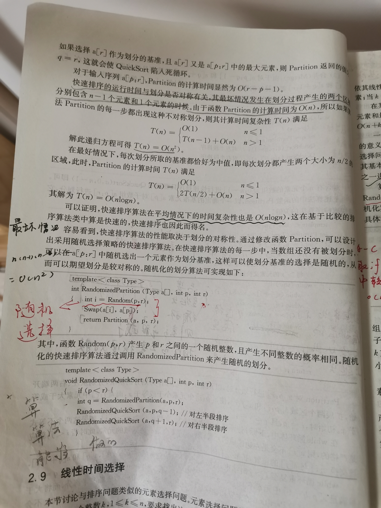

# Quick sort


## wikipedia [Quicksort](https://en.wikipedia.org/wiki/Quicksort)

**Quicksort** (sometimes called **partition-exchange sort**) is an [efficient](https://en.wikipedia.org/wiki/Algorithm_efficiency) [sorting algorithm](https://en.wikipedia.org/wiki/Sorting_algorithm), serving as a systematic method for placing the elements of a [random access](https://en.wikipedia.org/wiki/Random_access) [file](https://en.wikipedia.org/wiki/Computer_file) or an [array](https://en.wikipedia.org/wiki/Array_data_structure) in order. 

Developed by British computer scientist [Tony Hoare](https://en.wikipedia.org/wiki/Tony_Hoare) in 1959[[1\]](https://en.wikipedia.org/wiki/Quicksort#cite_note-1) and published in 1961,[[2\]](https://en.wikipedia.org/wiki/Quicksort#cite_note-alg64-2) it is still a commonly used algorithm for sorting. 

When implemented well, it can be about two or three times faster than its main competitors, [merge sort](https://en.wikipedia.org/wiki/Merge_sort) and [heapsort](https://en.wikipedia.org/wiki/Heapsort). 

Quicksort is a [comparison sort](https://en.wikipedia.org/wiki/Comparison_sort), meaning that it can sort items of any type for which a "less-than" relation (formally, a [total order](https://en.wikipedia.org/wiki/Total_order)) is defined. 

Efficient implementations of Quicksort are not a [stable sort](https://en.wikipedia.org/wiki/Stable_sort), meaning that the relative order of equal sort items is not preserved. 

Quicksort can operate [in-place](https://en.wikipedia.org/wiki/In-place_algorithm) on an array, requiring small additional amounts of [memory](https://en.wikipedia.org/wiki/Main_memory) to perform the sorting. It is very similar to [selection sort](https://en.wikipedia.org/wiki/Selection_sort), except that it does not always choose worst-case partition.

[Mathematical analysis](https://en.wikipedia.org/wiki/Analysis_of_algorithms) of quicksort shows that, [on average](https://en.wikipedia.org/wiki/Best,_worst_and_average_case), the algorithm takes [O](https://en.wikipedia.org/wiki/Big_O_notation)(*n* log *n*) comparisons to sort *n* items. In the [worst case](https://en.wikipedia.org/wiki/Best,_worst_and_average_case), it makes $O(n^2)$ comparisons, though this behavior is rare.

### Algorithm

Quicksort is a [divide and conquer algorithm](https://en.wikipedia.org/wiki/Divide_and_conquer_algorithm). Quicksort first divides a large array into two smaller sub-arrays: the low elements and the high elements. Quicksort can then recursively sort the sub-arrays. The steps are:

1、Pick an element, called a *pivot*（基准）, from the array.

2、*Partitioning*: reorder the array so that all elements with values less than the pivot come before the pivot, while all elements with values greater than the pivot come after it (equal values can go either way). After this partitioning, the pivot is in its final position. This is called the *partition* operation.

3、[Recursively](https://en.wikipedia.org/wiki/Recursion_(computer_science)) apply the above steps to the sub-array of elements with smaller values and separately to the sub-array of elements with greater values.

The base case of the recursion is arrays of size zero or one, which are in order by definition, so they never need to be sorted.

The **pivot selection** and partitioning steps can be done in several different ways; the choice of specific implementation schemes greatly affects the algorithm's performance.

### Implementation issues

#### Parallelization

Quicksort's divide-and-conquer formulation makes it amenable to [parallelization](https://en.wikipedia.org/wiki/Parallel_algorithm) using [task parallelism](https://en.wikipedia.org/wiki/Task_parallelism). The partitioning step is accomplished through the use of a [parallel prefix sum](https://en.wikipedia.org/wiki/Prefix_sum) algorithm to compute an index for each array element in its section of the partitioned array.[[23\]](https://en.wikipedia.org/wiki/Quicksort#cite_note-23)[[24\]](https://en.wikipedia.org/wiki/Quicksort#cite_note-24) Given an array of size *n*, the partitioning step performs O(*n*) work in *O*(log *n*) time and requires O(*n*) additional scratch space. After the array has been partitioned, the two partitions can be sorted recursively in parallel. Assuming an ideal choice of pivots, parallel quicksort sorts an array of size *n* in O(*n* log *n*) work in O(log² *n*) time using O(*n*) additional space.

### Formal analysis

> NOTE: 
>
> 一、以下分析是使用quicksort中所执行的比较的次数来作为复杂性计算的单位的；
>
> 其实quicksort的比较都是发生在`partition`函数中；
>
> 二、为了便于分析，可以以quick sort一个长度为5的array为例来进行说明
>
> 
>
> 

#### Worst-case analysis

The most unbalanced partition occurs when one of the **sublists** returned by the partitioning routine is of size *n* − 1.[[27\]](https://en.wikipedia.org/wiki/Quicksort#cite_note-unbalanced-27) This may occur if the **pivot** happens to be the smallest or largest element in the list, or in some implementations (e.g., the Lomuto partition scheme as described above) when all the elements are equal.

If this happens repeatedly in every partition, then each recursive call processes a list of size one less than the previous list. Consequently, we can make *n* − 1 nested calls before we reach a list of size 1. This means that the [call tree](https://en.wikipedia.org/wiki/Call_stack) is a linear chain of *n* − 1 nested calls. The *i*th call does *O*(*n* − *i*) work to do the partition, and $ \textstyle \sum _{i=0}{n}(n-i)=O(n^{2}) $, so in that case Quicksort takes *O*(*n*²) time.

> NOTE: 
>
> 一、其实这种情况本质上是BST退化为了linked list，此时树的高度为$n$。
>
> 第0次调用quicksort需要进行n此比较，第1次调用quicksort需要进行n-1次比较，依次类推，所以总的耗费为n此调用之和；所以就是$ \textstyle \sum _{i=0}{n}(n-i)=O(n^{2}) $；
>
> 这种情况其实就是[Bubble sort](https://en.wikipedia.org/wiki/Bubble_sort)，算法复杂度就是$O(n^{2})$
>
> 二、以quick sort一个长度为5的array为例来进行说明
>
> 

#### Best-case analysis

In the most **balanced** case, each time we perform a partition we divide the list into two nearly equal pieces. This means each recursive call processes a list of half the size. Consequently, we can make only $log_2{n}$ nested calls before we reach a list of size 1. This means that the depth of the [call tree](https://en.wikipedia.org/wiki/Call_stack) is $log_2{n}$. But no two calls at the same level of the call tree process the same part of the original list; thus, each level of calls needs only *O*(*n*) time all together (each call has some constant overhead, but since there are only *O*(*n*) calls at each level, this is subsumed in the *O*(*n*) factor). The result is that the algorithm uses only *O*(*n* log *n*) time.

> NOTE: 
>
> 一、上述分析是能够帮助我们理解quick sort的computation complexity的，它是非常简单易懂的
>
> 二、上述complexity analysis，使用到了 binary search 的 computation complexity analysis: 
>
> 在均衡的情况下，树的高度为$logn$，每层的比较次数为$n$，因此总的computation complexity为: *O*(*n* log *n*) 
>
> 三、best-case其实是非常类似于balanced binary search tree的；
>
> 

#### Average-case analysis

> NOTE: 下面设计了很多的数学推导，比较难以理解，我们重点关注"Using a binary search tree"

To sort an array of *n* distinct elements, quicksort takes *O*(*n* log *n*) time in expectation, averaged over all *n*! permutations of *n* elements with [equal probability](https://en.wikipedia.org/wiki/Uniform_distribution_(discrete)). We list here three common proofs to this claim providing different insights into quicksort's workings.

##### Using percentiles百分位数值

##### Using recurrences


##### Using a binary search tree

> NOTE: 
>
> 一、quick sort隐式地构造了一颗BST

To each execution of **quicksort** corresponds the following [binary search tree](https://en.wikipedia.org/wiki/Binary_search_tree) (BST): 

the **initial pivot** is the **root node**; 

the **pivot of the left half** is the **root of the left subtree**, 

the **pivot of the right half** is the **root of the right subtree**, and so on. 

The number of comparisons of the execution of quicksort equals the number of comparisons during the construction of the BST by a sequence of insertions. So, the average number of comparisons for randomized quicksort equals the average cost of constructing a BST when the values inserted $ (x_{1},x_{2},\ldots ,x_{n}) $ form a random permutation.

Consider a BST created by insertion of a sequence $ (x_{1},x_{2},\ldots ,x_{n}) $ of values forming a random permutation. Let *C* denote the cost of creation of the BST. We have $ C=\sum *{i}\sum \*{j<i}c\*{i,j} $, where $ c*{i,j} $ is an binary random variable expressing whether during the insertion of $ x_{i} $ there was a comparison to $ x_{j} $.

By [linearity of expectation](https://en.wikipedia.org/wiki/Expected_value#Linearity), the expected value $ \operatorname {E} [C] $ of *C* is $ \operatorname {E} [C]=\sum _{i}\sum *{j<i}\Pr(c*{i,j}) $.

Fix *i* and *j*<*i*. The values $ {x_{1},x_{2},\ldots ,x_{j}} $, once sorted, define *j*+1 intervals. The core structural observation is that $ x_{i} $ is compared to $ x_{j} $ in the algorithm if and only if $ x_{i} $ falls inside one of the two intervals adjacent to $ x_{j} $.

Observe that since $ (x_{1},x_{2},\ldots ,x_{n}) $ is a random permutation, $ (x_{1},x_{2},\ldots ,x_{j},x_{i}) $ is also a random permutation, so the probability that $ x_{i} $ is adjacent to $ x_{j} $ is exactly $ {\frac {2}{j+1}} $.

We end with a short calculation:

$ \operatorname {E} [C]=\sum _{i}\sum _{j<i}{\frac {2}{j+1}}=O\left(\sum _{i}\log i\right)=O(n\log n). $

### Relation to other algorithms

**Quicksort** is a space-optimized version of the [binary tree sort](https://en.wikipedia.org/wiki/Binary_tree_sort). Instead of inserting items sequentially into an explicit tree, quicksort organizes them concurrently into a tree that is implied by the recursive calls. The algorithms make exactly the same comparisons, but in a different order. 

> NOTE: 
>
> 一、quick sort隐式地构造了一颗BST

An often desirable property of a [sorting algorithm](https://en.wikipedia.org/wiki/Sorting_algorithm) is **stability** – that is the order of elements that compare equal is not changed, allowing controlling order of multikey tables (e.g. directory or folder listings) in a natural way. This property is hard to maintain for in situ（原位） (or in place) quicksort (that uses only constant additional space for pointers and buffers, and *O*(log *n*) additional space for the management of explicit or implicit recursion). For variant quicksorts involving extra memory due to representations using pointers (e.g. lists or trees) or files (effectively lists), it is trivial to maintain stability. The more complex, or disk-bound, data structures tend to increase time cost, in general making increasing use of virtual memory or disk.

The most direct competitor of quicksort is [heapsort](https://en.wikipedia.org/wiki/Heapsort). Heapsort's running time is *O*(*n* log *n*), but heapsort's average running time is usually considered slower than in-place quicksort. This result is debatable; some publications indicate the opposite.[[28\]](https://en.wikipedia.org/wiki/Quicksort#cite_note-28)[[29\]](https://en.wikipedia.org/wiki/Quicksort#cite_note-29) [Introsort](https://en.wikipedia.org/wiki/Introsort) is a variant of quicksort that switches to heapsort when a bad case is detected to avoid quicksort's worst-case running time.

Quicksort also competes with [merge sort](https://en.wikipedia.org/wiki/Merge_sort), another *O*(*n* log *n*) sorting algorithm. Mergesort is a [stable sort](https://en.wikipedia.org/wiki/Stable_sort), unlike standard in-place quicksort and heapsort, and can be easily adapted to operate on [linked lists](https://en.wikipedia.org/wiki/Linked_list) and very large lists stored on slow-to-access media such as [disk storage](https://en.wikipedia.org/wiki/Disk_storage) or [network-attached storage](https://en.wikipedia.org/wiki/Network-attached_storage). Although quicksort can be implemented as a stable sort using linked lists, it will often suffer from poor pivot choices without random access. The main disadvantage of mergesort is that, when operating on arrays, efficient implementations require *O*(*n*) auxiliary space, whereas the variant of quicksort with in-place partitioning and tail recursion uses only *O*(log *n*) space. (When operating on linked lists, mergesort only requires a small, constant amount of auxiliary storage.)

[Bucket sort](https://en.wikipedia.org/wiki/Bucket_sort) with two buckets is very similar to quicksort; the pivot in this case is effectively the value in the middle of the value range, which does well on average for uniformly distributed inputs.


## Implementation

一、下面两种实现方式，其实都使用了double pointer: 

1、double pointer: left、right pointer: 由两端向中间扩展

labuladong [快排亲兄弟：快速选择算法详解](https://mp.weixin.qq.com/s/TRO3FOKT90Mpvn3hQWVBAQ) 	

“计算机算法设计与分析”

相比之下，这种方法是更加容易理解的，根据labuladong [快排亲兄弟：快速选择算法详解](https://mp.weixin.qq.com/s/TRO3FOKT90Mpvn3hQWVBAQ) 中的解释可知，这种写法是源自《算法4》的。

2、double pointer: fast、slow pointer

“hackerearth [Quick Sort](https://www.hackerearth.com/zh/practice/algorithms/sorting/quick-sort/tutorial/)”中的实现方式的思路是：自左向右进行扩展、fast-slow double pointer。

二、分三段，只需要两个boundary，分别对应`i`和`j`。


### double pointer: left、right pointer


#### labuladong [快排亲兄弟：快速选择算法详解](https://mp.weixin.qq.com/s/TRO3FOKT90Mpvn3hQWVBAQ) 	

```C++
int partition(int[] nums, int lo, int hi) {
    if (lo == hi) return lo;
    // 将 nums[lo] 作为默认分界点 pivot
    int pivot = nums[lo];
    // j = hi + 1 因为 while 中会先执行 --
    int i = lo, j = hi + 1;
    while (true) {
        // 保证 nums[lo..i] 都小于 pivot
        while (nums[++i] < pivot) {
            if (i == hi) break;
        }
        // 保证 nums[j..hi] 都大于 pivot
        while (nums[--j] > pivot) {
            if (j == lo) break;
        }
        if (i >= j) break;
        // 如果走到这里，一定有：
        // nums[i] > pivot && nums[j] < pivot
        // 所以需要交换 nums[i] 和 nums[j]，
        // 保证 nums[lo..i] < pivot < nums[j..hi]
        swap(nums, i, j);
    }
    // 将 pivot 值交换到正确的位置
    swap(nums, j, lo);
    // 现在 nums[lo..j-1] < nums[j] < nums[j+1..hi]
    return j;
}

// 交换数组中的两个元素
void swap(int[] nums, int i, int j) {
    int temp = nums[i];
    nums[i] = nums[j];
    nums[j] = temp;
}
```

> NOTE: 
>
> 一、注意: 
>
> 1、上述 `i` 是left，`j`是right
>
> 2、由于循环体内一定会执行`--j`，因此虽然j的初始值是 `hi + 1`，实际执行过程中是不会
>
> 3、由于`a[lo]`会被选做pivot，因此第一次 `++i` 顺利地pass掉它了，这是非常合理的
>
> 4、通过2、3的总结可知，`i`、`j`的初始化选择的妙处，并且第一次执行的时候，它们都能够pass掉无效值 
>
> 二、为什么最终执行的 `swap(nums, j, lo)`？
>
> 以排序 `5,1,6,2,7,4,8` 为例
>
> 当退出 `while(true)` 的时候，`i`和`j`肯定都过界了，即此时 `i` 指向的大于pivot的，`j` 指向的是小于pivot的，partition的要求是小于它的要在它的左边，因此要和 `j` 进行交换
>
> 三、思考: 何时因为 `i == j` 而break？
>
> 比如数组是有序递减的: `6,5,4,5,2,1`，显然，循环退出是由于`i == j`，此时进行 `swap(nums, j, lo)` 也是合理的

熟悉快速排序逻辑的读者应该可以理解这段代码的含义了，这个`partition`函数细节较多，上述代码参考《算法4》，是众多写法中最漂亮简洁的一种，所以建议背住，这里就不展开解释了。

#### 计算机算法设计与分析





##### 完整程序


```c++
#include <cstdio>
#include <iostream>
#include <algorithm>
/**
 * 此算法采用的是分治策略，divide：将a分成三段a[start]< a[start],<a[start];,conquer: 递归地求解各个字段
 * @param start 数组起始下标
 * @param end 数组终止下标
 **/
template<typename T>
void QuickSort(T a[], int start, int end);
// 对a进行划分，以a[start]作为基准，进行划分后a[start]左边的元素都比它小，右边的元素都比它大
template<typename T>
int Partition(T a[], int start, int end);

/*Displays the array, passed to this method*/
template<typename T>
void display(T arr[], int n);

int main()
{

	int n;
	std::cout << "Enter size of array:\n";
	std::cin >> n; // E.g. 8

	std::cout << "Enter the elements of the array\n";
	int i;
	int *arr = new int[n];
	for (i = 0; i < n; i++)
	{
		std::cin >> arr[i];
	}

	std::cout << "Original array: ";
	display(arr, n); // Original array : 10 11 9 8 4 7 3 8

	QuickSort(arr, 0, n - 1);

	std::cout << "Sorted array: ";
	display(arr, n); // Sorted array : 3 4 7 8 8 9 10 11
	getchar();
	return 0;
}

/**
 * @param start 数组起始下标
 * @param end 数组终止下标
 **/
template<typename T>
void QuickSort(T a[], int start, int end)
{
	if (start < end)
	{
		int p = Partition(a, start, end); // pivot index
		QuickSort(a, start, p - 1); // 对左半段排序
		QuickSort(a, p + 1, end); // 对右半段排序
	}
}
template<typename T>
int Partition(T a[], int start, int end)
{
	int i = start, j = end + 1; //i指向数组头，j指向数组尾
	T pivot = a[start]; //x是基准
	while (true)
	{
        // 因为选择a[start]为pivot，因此不需要比较第一个数，可以直接++i
        // 直到a[i]〉=x才跳出循环，这时候是需要进行置换的
		while (a[++i] < pivot && i < end) 
			;
		while (a[--j] > pivot && j > start)
			;
        //这是本循环退出的唯一途径，循环退出时，i指向的是右段的第一个元素，j指向的是左段的最后一个元素，显然，x最终要插在这两个元素之间
		if (i >= j)
			break;
		std::swap(a[i], a[j]); // 使用标准库的swap函数

	}
	swap(a[start], a[j]);
	return j;
}

/*Displays the array, passed to this method*/
template<typename T>
void display(T arr[], int n)
{

	int i;
	for (i = 0; i < n; i++)
	{
		std::cout << arr[i] << " ";
	}

	std::cout << "\n";
}

```

测试用例：`[5, 4, 3, 2, 1]`

使用上述算法对`[5, 4, 3, 2, 1]`进行排序：`while(a[++i]<x and i<end);`退出时，`i`的值为`end`即4；`while(a[--j]>x);`退出时，`j`的值为`4`。

测试用例：`[10, 11, 9, 8, 4, 7, 3, 8]`


### double pointer: fast、slow pointer

#### hackerearth [Quick Sort](https://www.hackerearth.com/zh/practice/algorithms/sorting/quick-sort/tutorial/)

讲解地非常不错。

##### `partition`

```c++
int partition ( int A[],int start ,int end) {
    int i = start + 1;
    int piv = A[start] ;            //make the first element as pivot element.
    for(int j =start + 1; j <= end ; j++ )  {
    /*rearrange the array by putting elements which are less than pivot
       on one side and which are greater that on other. */

          if ( A[ j ] < piv) {
                 swap (A[ i ],A [ j ]);
            i += 1;
        }
   }
   swap ( A[ start ] ,A[ i-1 ] ) ;  //put the pivot element in its proper place.
   return i-1;                      //return the position of the pivot
}
```

`i`是用于定界的。

函数的返回值是分割位置。

##### 使用fast、slow pointer来解释partition

```C++
/**
 * @brief
 * 我们让慢指针`slow`走在后面，快指针`fast`走在前面探路，找到一个不重复的元素就告诉`slow`并让`slow`前进一步。
 * 这样当`fast`指针遍历完整个数组`nums`后，**`nums[0..slow]`就是不重复元素**。
 * slow指向的是右侧大于pivot的第一个元素，显然，它记录的是右半段的左侧边界；
 * pivot的过程其实是不断地将右侧区间中的不属于它的元素、即属于左侧区间的元素拿到左侧区间，
 * 那么它如何实现呢？其实方法非常简答: 让出一个位置的元素给左侧区间来存放刚刚找到的这个元素
 * 这个函数，被调用的前提是 start > end，因此最少的情况: end = start + 1
 * 刚开始的时候，fast 和 slow的值是相等的，这是必须的，因为可能只有start、end两个元素，如果让end指向start后的一个元素，则存在如下可能性:
 * 1、数组越界
 * 2、无法进入到后面的交换环节，即使只有两个元素，这也是需要进行交换的
 * @param A
 * @param start
 * @param end
 * @return
 */
int partition(int A[], int start, int end)
{
	int slow = start + 1;
	int piv = A[start];            //make the first element as pivot element.
	for (int fast = start + 1; fast <= end; fast++)
	{
		/*rearrange the array by putting elements which are less than pivot
		 on one side and which are greater that on other. */
		if (A[fast] < piv)
		{
			swap(A[slow], A[fast]);
			slow += 1;
		}
	}
	swap(A[start], A[slow - 1]);  //put the pivot element in its proper place.
	return slow - 1;                      //return the position of the pivot
}


```

#### 完整程序

Now, let us see the recursive function Quick_sort :


```c++
void quick_sort ( int A[ ] ,int start , int end ) {
   if( start < end ) {
        //stores the position of pivot element
         int piv_pos = partition (A,start , end ) ;     
         quick_sort (A,start , piv_pos -1);    //sorts the left side of pivot.
         quick_sort ( A,piv_pos +1 , end) ; //sorts the right side of pivot.
   }
}
```


完整程序如下：

```c
#include <stdio.h>
#include <stdlib.h>

/*Displays the array, passed to this method*/
void display(int arr[], int n)
{

    int i;
    for (i = 0; i < n; i++)
    {
        printf("%d ", arr[i]);
    }

    printf("\n");
}

/*Swap function to swap two values*/
void swap(int *first, int *second)
{

    int temp = *first;
    *first = *second;
    *second = temp;
}


int partition ( int A[],int start ,int end) {
    int i = start + 1;
    int piv = A[start] ;            //make the first element as pivot element.
    for(int j =start + 1; j <= end ; j++ )  {
    /*rearrange the array by putting elements which are less than pivot
       on one side and which are greater that on other. */

          if ( A[ j ] < piv) {
                 swap (A[ i ],A [ j ]);
            i += 1;
        }
   }
   swap ( A[ start ] ,A[ i-1 ] ) ;  //put the pivot element in its proper place.
   return i-1;                      //return the position of the pivot
}

/*This is where the sorting of the array takes place
	arr[] --- Array to be sorted
	lower --- Starting index
	upper --- Ending index
*/
void quickSort(int arr[], int lower, int upper)
{

    if (upper > lower)
    {

        // partitioning index is returned by the partition method , partition element is at its correct poition

        int partitionIndex = partition(arr, lower, upper);

        // Sorting elements before and after the partition index
        quickSort(arr, lower, partitionIndex - 1);
        quickSort(arr, partitionIndex + 1, upper);
    }
}

int main()
{

    int n;
    printf("Enter size of array:\n");
    scanf("%d", &n); // E.g. 8

    printf("Enter the elements of the array\n");
    int i;
    int *arr = (int *)malloc(sizeof(int) * n);
    for (i = 0; i < n; i++)
    {
        scanf("%d", &arr[i]);
    }

    printf("Original array: ");
    display(arr, n); // Original array : 10 11 9 8 4 7 3 8

    quickSort(arr, 0, n - 1);

    printf("Sorted array: ");
    display(arr, n); // Sorted array : 3 4 7 8 8 9 10 11
    getchar();
    return 0;
}
```


### `randomized_partition` 避免退化

当原数组本身是有序的时候，如果每次都选择第一个元素作为pivot，那么将导致quick sort退化，下面是源自: https://leetcode-cn.com/submissions/detail/194476777/testcase/ 

```C++
[1,2,3,4,5,6,7,8,9,10,11,12,13,14,15,16,17,18,19,20,21,22,23,24,25,26,27,28,29,30,31,32,33,34,35,36,37,38,39,40,41,42,43,44,45,46,47,48,49,50,51,52, ......50000]
```

这种情况下是会超时的。


源自: LeetCode [912. 排序数组](https://leetcode-cn.com/problems/sort-an-array/) # [官方解题](https://leetcode-cn.com/problems/sort-an-array/solution/pai-xu-shu-zu-by-leetcode-solution/)

```C++
class Solution {
    int partition(vector<int>& nums, int l, int r) {
        int pivot = nums[r];
        int i = l - 1;
        for (int j = l; j <= r - 1; ++j) {
            if (nums[j] <= pivot) {
                i = i + 1;
                swap(nums[i], nums[j]);
            }
        }
        swap(nums[i + 1], nums[r]);
        return i + 1;
    }
    int randomized_partition(vector<int>& nums, int l, int r) {
        int i = rand() % (r - l + 1) + l; // 随机选一个作为我们的主元
        swap(nums[r], nums[i]);
        return partition(nums, l, r);
    }
    void randomized_quicksort(vector<int>& nums, int l, int r) {
        if (l < r) {
            int pos = randomized_partition(nums, l, r);
            randomized_quicksort(nums, l, pos - 1);
            randomized_quicksort(nums, pos + 1, r);
        }
    }
public:
    vector<int> sortArray(vector<int>& nums) {
        srand((unsigned)time(NULL));
        randomized_quicksort(nums, 0, (int)nums.size() - 1);
        return nums;
    }
};


```

#### 写法二

```C++
#include <vector>
#include <algorithm>
#include <random>
#include <iostream>
#include <cstdlib>
#include <ctime>
using namespace std;

class Solution {
public:
	vector<int> sortArray(vector<int>& nums) {
		shuffleArray(nums);
		sortArrayImpl(nums, 0, nums.size() - 1);
		return nums;

	}
	void sortArrayImpl(vector<int>& nums, int start, int end) {
		if (start >= end) {
			return;
		}
		int p = partition(nums, start, end);
		sortArrayImpl(nums, start, p - 1);
		sortArrayImpl(nums, p + 1, end);
	}
	int partition(vector<int>& nums, int start, int end) {
		int left = start, right = end + 1;
		int pivot = nums[start];
		while (true) {
			while (nums[++left] < pivot && left < end);
			while (nums[--right] > pivot && right > start);
			if (left >= right)
				break;
			swap(nums[left], nums[right]);
		}
		swap(nums[start], nums[right]);
		return right;
	}
	// 采用Fisher–Yates-shuffle算法
	void shuffleArray(vector<int>& nums) {
		srand(time(0));
		int len = nums.size();
		for (int i = 0; i < len; ++i) {
			int j = rand() % (len - i);
			swap(nums[i], nums[j]);
		}
	}
};

int main()
{
	vector<int> nums{ 5,2,3,1 };
	Solution s;
	s.sortArray(nums);
}

// g++ test.cpp --std=c++11 -pedantic -Wall -Wextra -Werror

```


## TODO

developer.51cto [坐在马桶上看算法：快速排序](https://developer.51cto.com/art/201403/430986.htm)