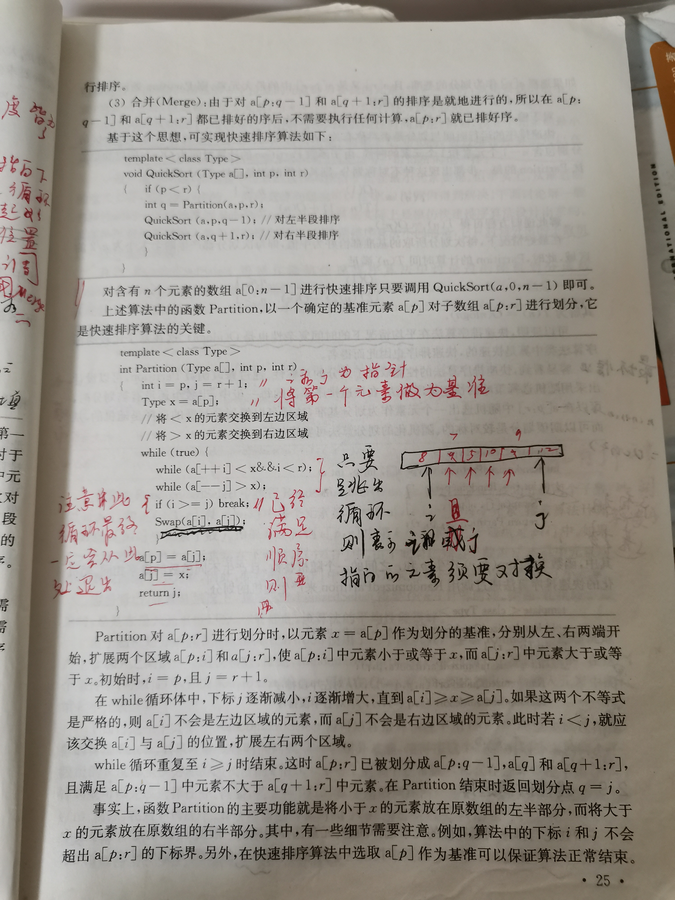

# Quick sort

## 计算机算法设计与分析





```c++
#include <cstdio>
#include <iostream>
#include <algorithm>
/**
 * @param start 数组起始下标
 * @param end 数组终止下标
 **/
template<typename T>
void QuickSort(T a[], int start, int end);

template<typename T>
int Partition(T a[], int start, int end);

template<typename T>
void Swap(T& a, T& b)
{
	T tmp = a;
	a = b;
	b = tmp;


}
/*Displays the array, passed to this method*/
template<typename T>
void display(T arr[], int n);

int main()
{

	int n;
	std::cout << "Enter size of array:\n";
	std::cin >> n; // E.g. 8

	std::cout << "Enter the elements of the array\n";
	int i;
	int *arr = new int[n];
	for (i = 0; i < n; i++)
	{
		std::cin >> arr[i];
	}

	std::cout << "Original array: ";
	display(arr, n); // Original array : 10 11 9 8 4 7 3 8

	QuickSort(arr, 0, n - 1);

	std::cout << "Sorted array: ";
	display(arr, n); // Sorted array : 3 4 7 8 8 9 10 11
	getchar();
	return 0;
}

/**
 * @param start 数组起始下标
 * @param end 数组终止下标
 **/
template<typename T>
void QuickSort(T a[], int start, int end)
{
	if (start < end)
	{
		int p = Partition(a, start, end); // pivot index
		QuickSort(a, start, p - 1); // 对左半段排序
		QuickSort(a, p + 1, end); // 对右半段排序
	}
}
template<typename T>
int Partition(T a[], int start, int end)
{
	int i = start, j = end + 1;
	T pivot = a[start];
	while (true)
	{
		while (a[++i] < pivot and i < end)
			;
		while (a[--j] > pivot)
			;
		if (i >= j)
			break;
		std::swap(a[i], a[j]); // 使用标准库的swap函数

	}
	a[start] = a[j];
	a[j] = pivot;
	return j;
}

/*Displays the array, passed to this method*/
template<typename T>
void display(T arr[], int n)
{

	int i;
	for (i = 0; i < n; i++)
	{
		std::cout << arr[i] << " ";
	}

	std::cout << "\n";
}

```

测试用例：`[5, 4, 3, 2, 1]`

使用上述算法对`[5, 4, 3, 2, 1]`进行排序：`while(a[++i]<x and i<end);`退出时，`i`的值为`end`即4；`while(a[--j]>x);`退出时，`j`的值为`4`。

测试用例：`[10, 11, 9, 8, 4, 7, 3, 8]`

## hackerearth [Quick Sort](https://www.hackerearth.com/zh/practice/algorithms/sorting/quick-sort/tutorial/)

讲解地非常不错。

### `partition`

```c++
int partition ( int A[],int start ,int end) {
    int i = start + 1;
    int piv = A[start] ;            //make the first element as pivot element.
    for(int j =start + 1; j <= end ; j++ )  {
    /*rearrange the array by putting elements which are less than pivot
       on one side and which are greater that on other. */

          if ( A[ j ] < piv) {
                 swap (A[ i ],A [ j ]);
            i += 1;
        }
   }
   swap ( A[ start ] ,A[ i-1 ] ) ;  //put the pivot element in its proper place.
   return i-1;                      //return the position of the pivot
}
```

`i`是用于定界的。

函数的返回值是分割位置。

#### 使用fast、slow pointer来解释partition

```C++
/**
 * @brief
 * 我们让慢指针`slow`走在后面，快指针`fast`走在前面探路，找到一个不重复的元素就告诉`slow`并让`slow`前进一步。
 * 这样当`fast`指针遍历完整个数组`nums`后，**`nums[0..slow]`就是不重复元素**。
 * slow指向的是右侧大于pivot的第一个元素，显然，它记录的是右半段的左侧边界；
 * pivot的过程其实是不断地将右侧区间中的不属于它的元素、即属于左侧区间的元素拿到左侧区间，
 * 那么它如何实现呢？其实方法非常简答: 让出一个位置的元素给左侧区间来存放刚刚找到的这个元素
 * 这个函数，被调用的前提是 start > end，因此最少的情况: end = start + 1
 * 刚开始的时候，fast 和 slow的值是相等的，这是必须的，因为可能只有start、end两个元素，如果让end指向start后的一个元素，则存在如下可能性:
 * 1、数组越界
 * 2、无法进入到后面的交换环节，即使只有两个元素，这也是需要进行交换的
 * @param A
 * @param start
 * @param end
 * @return
 */
int partition(int A[], int start, int end)
{
	int slow = start + 1;
	int piv = A[start];            //make the first element as pivot element.
	for (int fast = start + 1; fast <= end; fast++)
	{
		/*rearrange the array by putting elements which are less than pivot
		 on one side and which are greater that on other. */
		if (A[fast] < piv)
		{
			swap(A[slow], A[fast]);
			slow += 1;
		}
	}
	swap(A[start], A[slow - 1]);  //put the pivot element in its proper place.
	return slow - 1;                      //return the position of the pivot
}


```

### 完整程序

Now, let us see the recursive function Quick_sort :


```c++
void quick_sort ( int A[ ] ,int start , int end ) {
   if( start < end ) {
        //stores the position of pivot element
         int piv_pos = partition (A,start , end ) ;     
         quick_sort (A,start , piv_pos -1);    //sorts the left side of pivot.
         quick_sort ( A,piv_pos +1 , end) ; //sorts the right side of pivot.
   }
}
```


完整程序如下：

```c
#include <stdio.h>
#include <stdlib.h>

/*Displays the array, passed to this method*/
void display(int arr[], int n)
{

    int i;
    for (i = 0; i < n; i++)
    {
        printf("%d ", arr[i]);
    }

    printf("\n");
}

/*Swap function to swap two values*/
void swap(int *first, int *second)
{

    int temp = *first;
    *first = *second;
    *second = temp;
}


int partition ( int A[],int start ,int end) {
    int i = start + 1;
    int piv = A[start] ;            //make the first element as pivot element.
    for(int j =start + 1; j <= end ; j++ )  {
    /*rearrange the array by putting elements which are less than pivot
       on one side and which are greater that on other. */

          if ( A[ j ] < piv) {
                 swap (A[ i ],A [ j ]);
            i += 1;
        }
   }
   swap ( A[ start ] ,A[ i-1 ] ) ;  //put the pivot element in its proper place.
   return i-1;                      //return the position of the pivot
}

/*This is where the sorting of the array takes place
	arr[] --- Array to be sorted
	lower --- Starting index
	upper --- Ending index
*/
void quickSort(int arr[], int lower, int upper)
{

    if (upper > lower)
    {

        // partitioning index is returned by the partition method , partition element is at its correct poition

        int partitionIndex = partition(arr, lower, upper);

        // Sorting elements before and after the partition index
        quickSort(arr, lower, partitionIndex - 1);
        quickSort(arr, partitionIndex + 1, upper);
    }
}

int main()
{

    int n;
    printf("Enter size of array:\n");
    scanf("%d", &n); // E.g. 8

    printf("Enter the elements of the array\n");
    int i;
    int *arr = (int *)malloc(sizeof(int) * n);
    for (i = 0; i < n; i++)
    {
        scanf("%d", &arr[i]);
    }

    printf("Original array: ");
    display(arr, n); // Original array : 10 11 9 8 4 7 3 8

    quickSort(arr, 0, n - 1);

    printf("Sorted array: ");
    display(arr, n); // Sorted array : 3 4 7 8 8 9 10 11
    getchar();
    return 0;
}
```


## 对比两种实现方式

上述两种实现方式，其实都使用了double pointer: 

1、“计算机算法设计与分析”中的实现的思路是：由两端向中间扩展

2、“hackerearth [Quick Sort](https://www.hackerearth.com/zh/practice/algorithms/sorting/quick-sort/tutorial/)”中的实现方式的思路是：自左向右进行扩展、fast-slow double pointer。

分三段，只需要两个boundary，分别对应`i`和`j`。


## TODO

developer.51cto [坐在马桶上看算法：快速排序](https://developer.51cto.com/art/201403/430986.htm)