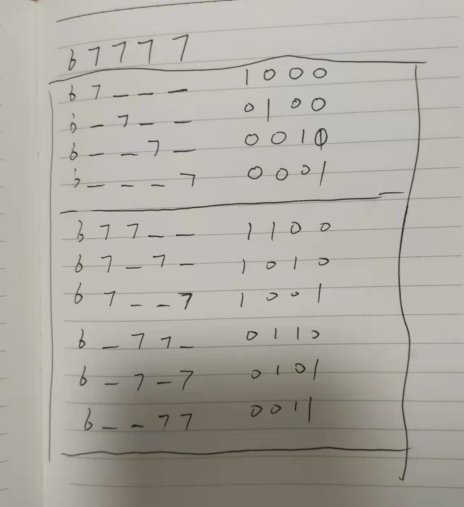

# 子集问题

LeetCode [78. 子集](https://leetcode-cn.com/problems/subsets/)

LeetCode [90. 子集 II](https://leetcode-cn.com/problems/subsets-ii/)

需要考虑去重

LeetCode [491. 递增子序列](https://leetcode-cn.com/problems/increasing-subsequences/) 中等

需要考虑去重

## 去重

在使用DFS的时候，有如下情况是需要考虑去重:

### circle-circular、dead loop

TODO: 需要补充例子

### 重复元素导致相同序列

在进行枚举的时候，如果包含重复的元素，则需要考虑去重，典型的例子就是 

一、[491. 递增子序列](https://leetcode-cn.com/problems/increasing-subsequences/) # [官方解题](https://leetcode-cn.com/problems/increasing-subsequences/solution/di-zeng-zi-xu-lie-by-leetcode-solution/) # 方法二：递归枚举 + 减枝

1、无需进行排序，它只选择01模式，剪掉了所有的10模式

2、它对应的是子序列，因为它没有让所有的相同元素处在一起，通过last记录已经选择的元素的末尾元素，通过与last进行对比，从而判断是否重复

二、LeetCode [90. 子集 II](https://leetcode-cn.com/problems/subsets-ii/)

1、需要进行排序，它只选择10模式，剪掉了所有的01模式

2、对应的子数组，因为它通过排序让所有的相同元素处在一起

#### 技巧总结

结合一个例子就找到了技巧：

通过上述例子可真，去重的本质就是在上述可能的情况中，只选择一个，通过观察可知，无论是通过`01`模式还是`10`模式都能够达到去重的目的。