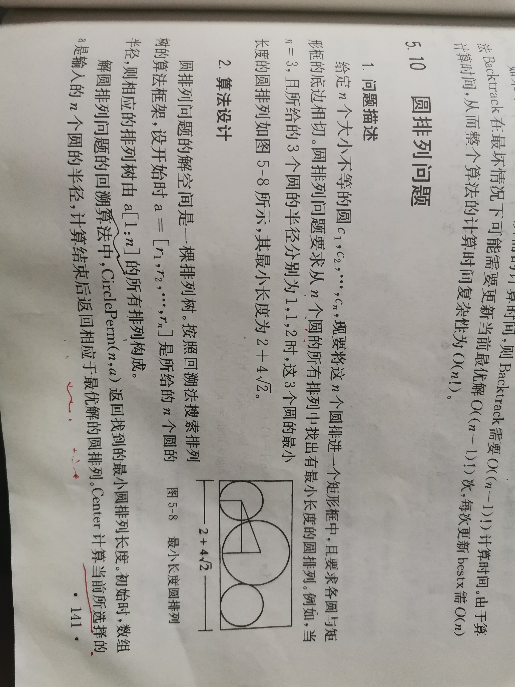

# Permutation of circle

圆排列问题。

## 问题描述 与 算法设计




## 实现


```c++
#include <algorithm> // std::copy_n

/**
 * @brief 圆排列器
 *
 */
class CirclePermutator
{
public:
	/**
	 * @brief
	 *
	 * @param n 圆个数
	 * @param a 圆半径
	 */
	CirclePermutator(int n, float *a) :
			n { n }, r { new float[n] }, x { new float[n] }
	{
		std::copy_n(a, n, r);
	}
	/**
	 * @brief 圆排列
	 *
	 * @param n 圆个数
	 * @param a 圆半径
	 * @return
	 */
	friend float CirclePerm(int n, float *a)
	{

	}
private:
	/**
	 * @brief 回溯
	 *
	 * @param t 第t个解、第t个圆
	 */
	void Backtrack(int t)
	{

	}
private:
	float min { 0.0 }; // 当前最优值
	float *x { nullptr }; //当前圆排列对应的每个圆心横坐标
	float *r { nullptr }; //当前圆排列对应的每个圆的半径
	int n { 0 }; //待排列的圆的个数
};

```

