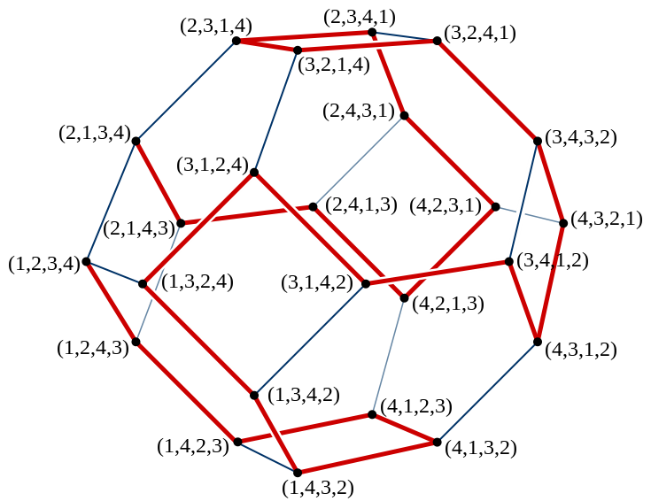

# 生成排列数的算法

## 1.    生成全排列

### 1.1.    回溯法

### 1.2.    Steinhaus-Johnson-Trotter算法

**Steinhaus-Johnson-Trotter算法**是一种基于最小变换的全排列生成算法，对于排列`a[1...n]`，该算法通过将`a[i]`，与`a[i-1]`（或`a[i+1]`）进行交换，生成下一个排列，直到所有排列生成完毕为止，这样，当前排列与其后继排列只是两个相邻位置的元素发生了调换。当然，为了防止重复生成某一个排列，算法并非随意调换某两个元素之间的位置，其生成全排列的具体规则如下。

1、首先，以**字典序**最小的排列起始，并且为该排列的每个元素赋予一个移动方向，初始所有元素的移动方向都**向左**。

2、在排列中查找这样的元素，该元素按照其对应的**移动方向**移动，可以移动到一个合法位置，且移动方向的元素小于该元素，在所有满足条件的元素中，找到其中的最大者。

3、将该元素与其移动方向所对应的元素交换位置。

4、对于排列中，所有元素值大于该元素的元素，反转其移动方向。

这里有几个概念需要说明一下，所谓合法位置，是指该元素按照其移动方向移动，不会移动到排列数组之外，例如对于<4，<1，<2，<3，此时对于元素4，如果继续向左移动，就会超过数组范围，所以4的下一个移动位置是非法位置。而且，所有元素，都只能向比自己小的元素的方向移动，如上面例子中的元素2，3，而元素1是不能够移动到元素4的位置的。每次移动，都要对可以移动的所有元素中的最大者进行操作，上例中元素1，4不能移动，2，3都存在合法的移动方案，此时需要移动3，而不能移动2。合法移动之后，需要将所有大于移动元素的元素的移动方向反转，上例中的元素3移动后的结果是4>，1<，<3，<2，可以看到，元素4的移动方向改变了。再如此例子<2，<1，3>，4>，对于其中的元素2，4，其对应的下一个移动位置都是非法位置，而对于元素1，3，其下一个移动位置的元素，都比他们要大，对于该排列就找不到一个可以的移动方案，这说明该算法已经达到终态，全排列生成结束。下面是该算法的代码

```c++
inline int SJTNext(unsigned int *index, size_t array_size, int *move)
{
	unsigned int i, j, t;  //j记录的是待交换位置的元素的下标

	//找到最大合法移动的元素索引
	for (i = array_size - 1, j = array_size; i != UINT_MAX; --i)
	{
		if (i + move[i] < array_size && index[i] > index[i + move[i]])
		{
			if (j == array_size)
			{
				j = i;
				continue;
			}

			if (index[i] > index[j])
			{
				j = i;
			}
		}
	}

	//未发现合法的移动策略
	if (j == array_size)
	{
		return 1;
	}

	t = index[j];  //要交换位置的元素
	i = j + move[j];  //发生交换的位置
	swap(index, i, j);
	swap(move, i, j);

	//将所有比t大的元素的移动方向反转
	for (i = 0; i < array_size; ++i)
	{
		if (index[i] > t)
		{
			move[i] = -move[i];
		}
	}

	return 0;
}

/*
 * 基于最小变换的Steinhaus–Johnson–Trotter算法
 */
void FullArray(char *array, size_t array_size)
{
	unsigned int index[array_size];
	int move[array_size];

	for (unsigned int i = 0; i < array_size; ++i)
	{
		index[i] = i;
		move[i] = -1;
	}

	ArrayPrint(array, array_size, index);

	while (!SJTNext(index, array_size, move))
	{
		ArrayPrint(array, array_size, index);
	}
}
```

代码使用了一个伴随数组move标记对应位置元素的移动方向，在元素移动时，move数组中的对应元素也要相应移动。该算法从初始排列<1,<2,<3,<4开始，可以生成4元素的所有排列，直至最终排列<2，<1，3>，4>为止，其状态转移如下图所示，该图片来自于Wiki百科。




实际上该算法是Shimon Even对于Steinhaus-Johnson-Trotter三人提出的全排列生成算法的改进算法，在算法中实际上还有一个问题需要解决，就是对于给定的排列，如何判断其所有元素的移动方向，如果上面所谓终态的移动方向是<2，<1，3>，<4[[KD1\]](#_msocom_1) ，那么这个状态就还存在可行的移动方案。Johnson(1963)给出了判断当前排列各元素移动方向的方法，对于排列中的每个元素，判断所有比该元素小的元素所生成序列的逆序数，如果逆序数为偶，则该元素的移动方向为向左，否则移动方向向右，我们用这条原则来看一下上面的终态2，1，3，4。对于元素1，没有比1小的元素，此时我们认为，空序列的逆序数为偶，所以元素1的移动方向向左；对于元素2，比2小的元素形成的序列为1，单元素序列的逆序数为偶，所以2的移动方向向左；对于元素3，小于3的元素组成的序列为21，逆序数为1，奇数，所以3的移动方向向右；对于元素4，对应序列为213，逆序数为奇数，所以4的移动方向向右。根据该规则就可以知道，给定某一排列，其对应元素的移动方向是确定的。

```C++
void SJT(int *a, int n)
{
	long len = count_factorial(n);
	int b[100] = { 0 };
	int direction[100];
	for (int i = 0; i < n; i++)
		direction[i] = -1;
	int pos = n - 1;
	for (int i = 0; i < len; i++)
	{
		permutation_print(a, n);
		if (direction[pos] == -1 && pos > 0)
		{
			int next_pos = direction[pos] + pos;
			swap(a[pos], a[next_pos]);
			swap(direction[pos], direction[next_pos]);
			pos = next_pos;
		}
		else if (direction[pos] == 1 && pos < n - 1)
		{
			int next_pos = direction[pos] + pos;
			swap(a[pos], a[next_pos]);
			swap(direction[pos], direction[next_pos]);
			pos = next_pos;
		}
		else
		{
			int max_pos = -1, max_num = -1;
			for (int j = 0; j < n; j++)
			{
				int next_pos = j + direction[j];
				if (next_pos < 0 || next_pos >= n)
					continue;
				if (a[next_pos] > a[j])
					continue;
				if (max_pos == -1 || a[max_pos] < a[j])
				{
					max_pos = j;
					max_num = a[max_pos];
				}
			}
			if (max_pos == -1)
				break;
			int next_pos = max_pos + direction[max_pos];
			swap(a[max_pos], a[next_pos]);
			swap(direction[max_pos], direction[next_pos]);
			for (int j = 0; j < n; j++)
			{
				if (a[j] > max_num)
					direction[j] = -direction[j];
			}
		}
	}
	cout << "Total 6:" << len << endl;
}
```


## TODO

baike [字典序](https://baike.baidu.com/item/%E5%AD%97%E5%85%B8%E5%BA%8F/7786229?fr=aladdin#5)

baike [全排列](https://baike.baidu.com/item/%E5%85%A8%E6%8E%92%E5%88%97)


baike [中介数](https://baike.baidu.com/item/%E4%B8%AD%E4%BB%8B%E6%95%B0/12796689?fr=aladdin)

csdn [全排列及相关扩展算法（三）——利用中介数求排列在字典序排位算法](https://blog.csdn.net/sm9sun/article/details/77258384)

