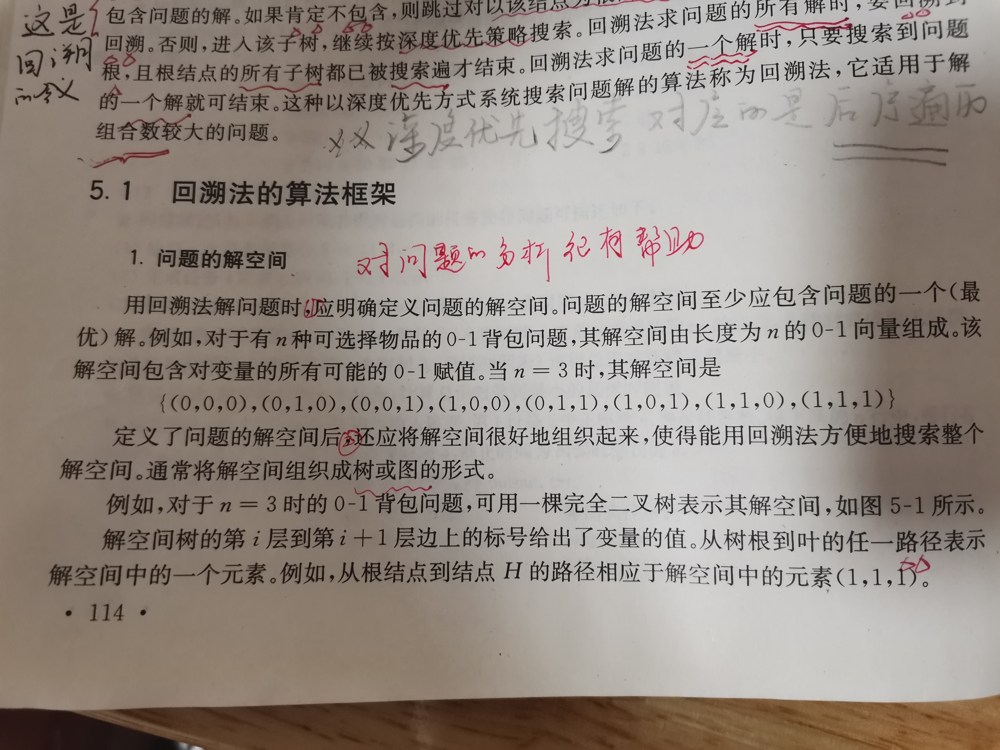
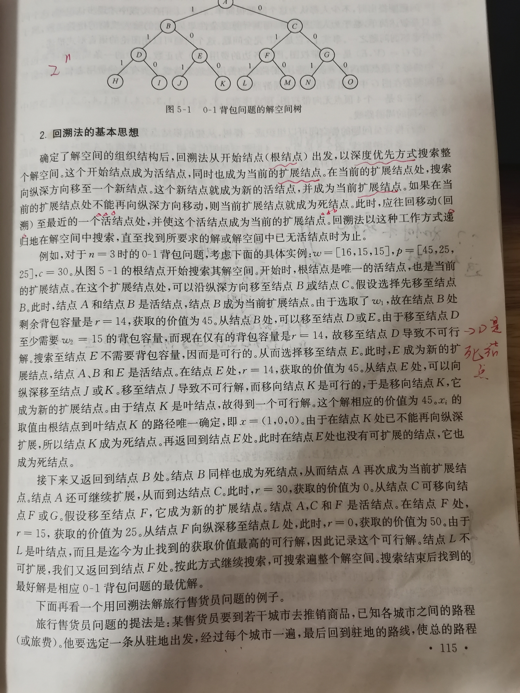
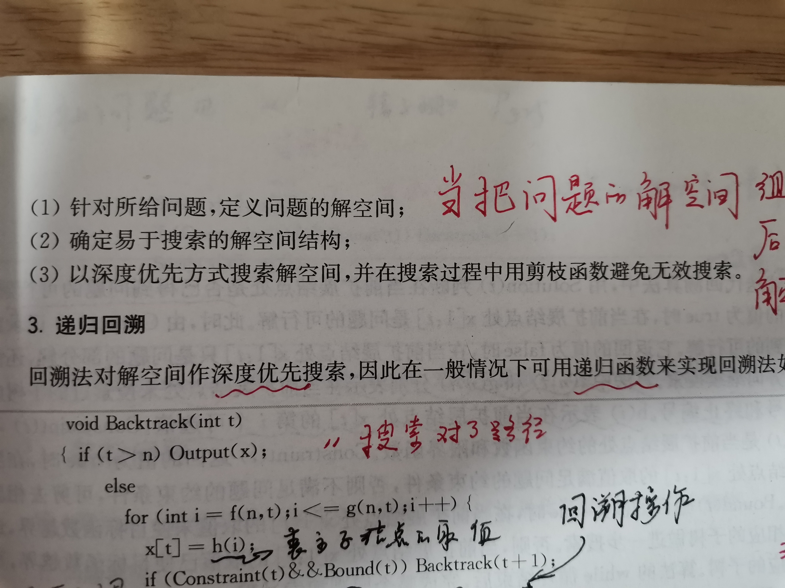
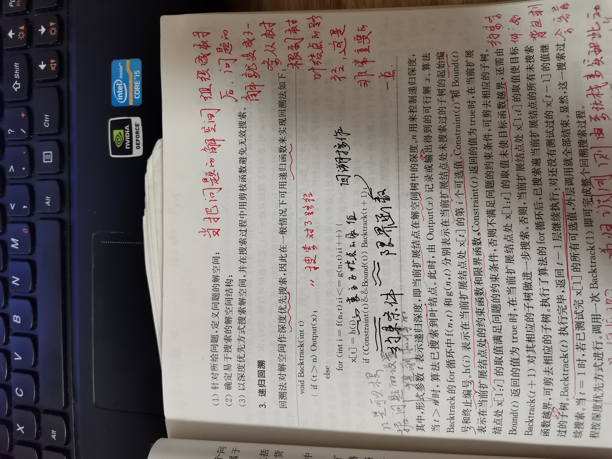
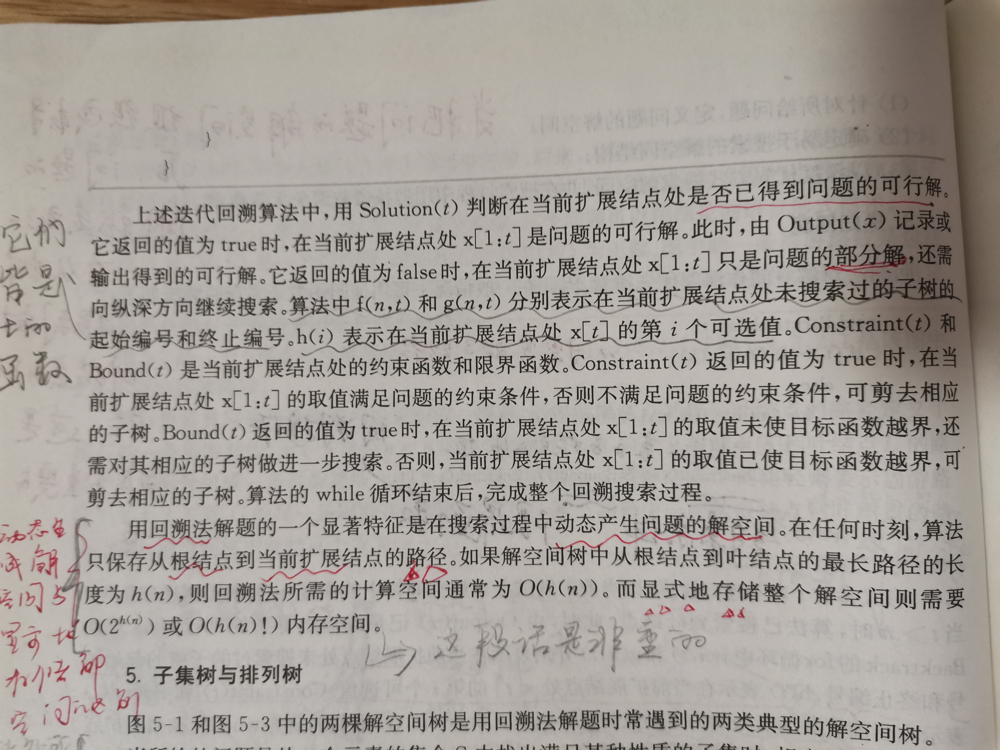

# Backtracking 回溯法

书写思路：

1、从search algorithm的角度来描述Backtrack：对接空间进行deep-first search

2、从relation-based algorithmd的角度

> TODO: Google: is backtracking algorithm a kind of search

## 解 与 解空间


从以下几个方面来进行描述：

1、逐步（one-by-one）构造出完整的解，完整解的长度$n$

2、使用**nesting关系**来进行描述：第$1$步包含$x_1$个选择、第$2$步包含$x_2$个选择, ..., 第$n$步包含$x_n$个选择，因此，整个**解空间**的$size = x_1 * x_2 * \dots * x_n $，后面所有的例子，都会使用这个关系来进行描述

3、nesting关系 `->` 解空间呈现出tree structure

4、如果每一步的选择的个数相同，~~则对应的是**组合**，~~对应的解空间是**complete n-ary tree(完全n叉树)**；如果每一步的选择个数逐个递减，则对应的是**排列**，对应的解空间是**排列树**

5、解空间是一种virtual search space，后续为了说明分别，我们统一使用state space来表示解空间

6、问题的解$X$：对应的是解空间树的一条**路径**，一般可以使用 **动态数组** 来实现

7、$n$决定了**解空间树**的深度

8、解空间的size决定了算法的时间复杂度

9、问题的解$X$影响了算法的时间复杂度

> 上面这种描述思想是符合 结构化思维的

### 推广

对于解空间满足nesting关系的的问题，都可以使用Backtrack来进行求解。





## Backtrack: a kind of systematic search algorithm

本节标题的含义是：回溯法，一种系统性地搜索算法。


### 对解空间树进行系统性地搜索

系统性的含义是：每种可能的路径都会去尝试，因为每一条路径都可能是一个**可能解**。

一般可以使用combination、permutation来描述一个问题的所有可能解，即问题的解空间，这就对应了combination tree、permutation tree。


那如何实现呢？

#### Deep-first order（深度优先）

这种策略的优势有：

- 尽可能地搜索到一个完整的解
- 提高搜索效率：及时发现无效解，进行prune（剪枝）

#### Prune

wikipedia [Backtracking](https://en.wikipedia.org/wiki/Backtracking)关于这一点描述非常好：

运用backtracking解决问题的关键是：能否高效、及时地prune，如果无法达到，则它无异于brute-force search。及时进行prune，进行回溯，尝试下一个解，可以大大加速搜索。

#### 回溯

尝试所有的可能性





剪枝函数:

1、用约束函数在扩展节点处剪去不满足约束的子树 constrain

2、用限界函数剪去得不到最优解的子树 bound




### One-by-one

典型的one-by-one computation，逐步计算得到完整解，完整解的长度`N`是可以提前确定的，用`t`来控制计算步骤，当`t==N`时，则表示已经计算得到了完整解。

- `N`对应的是解空间树的深度

- `t`对应的是当前扩展节点的树深度

### 搜索顺序

深度优先搜索，对应的是树的先序遍历

> 在n-queue问题中，对这个问题进行了思考

### 实现


#### 递归回溯

```c++
void BackTrack(int t)
{
    // 得到了一个完整解
	if (t > n)
    {
        Output(x);
    }
    // 解不完整
	else
    {
		for (int i = f(n, t); i < g(n, t); i++)
        {
			x[t] = h(i);
			if (Constraint(t) && Bound(t))
            {
                BackTrack(t + 1);
            }
            // 及时剪枝
		}
	}
}

/*
1.t表示递归深度
2.x[]用来记录可行解
3.f(n, t)和 g(n, t)分别表示当前开展结点处，未搜索过的子树的起始编号和终止编号
4.h（i）表示在当前扩展结点处，x[t]的第i可选值
*/
```





#### 迭代回溯


```C++
void IterativeBacktrack(void)
{
	int t = 1;
	while (t > 0)
	{
		if (f(n, t) <= g(n, t))
		{
			for (int i = f(n, t); i < g(n, t); i++)
			{
				x[t] = h(i);
				if (Constraint(t) && Bound(t))
				{
					// 得到了一个完整解
					if (Solution(t))
					{
						Output (x); //此时已经得到了完整解，则可以进行输出了
					}
					// 解不完整
					else
					{
						t++; //还没有求得完整解，则往下一层迭代，这是深度优先的遍历算法
					}
				}
				//此处会剪去相应的子树
				else
				{
					--t;
				}
			}

		}
	}
}
/*
 1.t表示递归深度
 2.x[]用来记录可行解
 3.f(n, t)和 g(n, t)分别表示当前开展结点处，未搜索过的子树的起始编号和终止编号,比如m着色问题中为图的颜色总数
 4.h（i）表示在当前扩展结点处，x[t]的第i可选值，比如m着色中的各种颜色
 5.Solution(t)判断当前扩展结点是否已经得到问题的可行解，如果得到了完整解，则由Output(x)输出完整解，否则在当前扩展结点处得到的只是部分解，需要继续向纵深方向继续搜索
 */

```





#### 递归回溯 VS 迭代回溯

递归回溯利用call stack，当`Constrain(t) && Bound(t)`不满足的时候，它不往下一层递归（`t=t+1`），函数直接返回（剪枝），则call stack会弹出当前frame，回到上一层(`t=t-1`)，即**回溯**，然后接着尝试其他的可选值。

迭代回溯，需要由programmer来维护在各层次的搜索，直观来说，是维护`t`值：

- 当进入下一层时：`t++`
- 当**回溯**，即返回上一层时：`t--`


## complete n-ary tree、subset tree子集树、permutation tree排列树、combination tree组合树


一、原文中，关于子集树、排列树的命名，其实是根据**解空间**的构成、结构来命名的。

二、

1、complete n-ary tree是最最常见的；

2、**子集树(subset tree)**，其实属于**complete n-ary tree(n=2)**，并且结合后面的很多例子来说：相比子集树，**complete n-ary tree**是更加能够体现解空间的构成的。

3、permutation tree

4、combination tree


三、

|                     | expand                                                       | 例子                      |
| ------------------- | ------------------------------------------------------------ | ------------------------- |
| complete n-ary tree | `for(int i = 1; i <= k; i++)` <br>对 8皇后问题，上述`k`等于8 <br>对装置问题，上述`k`等于2 <br> | 图的m着色<br>n-皇后       |
| subset tree         |                                                              | 最最典型的就是0-1背包问题 |
| 排列树              | `for(int i = t; i <= n; i++)`                                |                           |


### 排列树的回溯法算法框架

用回溯法搜索排列树的算法框架可描述如下：

```C++
void Backtrack(int t)
{
	if( t > n )
	{
		Output(x);
	}
	else
	{
		for(int i = t; i <= n; i++)
		{
			Swap(x[t], x[i]);
			if( Constrain(t) && Bound(t) )
			{
				Backtrack( t+1 );
			}
			Swap(x[t], x[i]);
		}
	}
}
```


