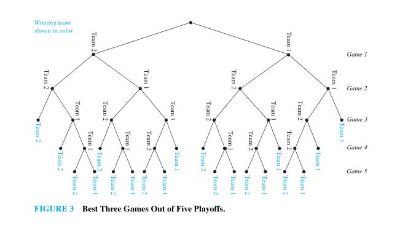

# 6 Counting

Combinatorics, the study of arrangements of objects, is an important part of discrete mathematics. This subject was studied as long ago as the seventeenth century, when combinatorial questions arose in the study of gambling games. Enumeration, the counting of objects with certain properties, is an important part of combinatorics. We must count objects to solve many different types of problems. For instance, counting is used to determine the complexity of algorithms. Counting is also required to determine whether there are enough telephone numbers or Internet protocol addresses to meet demand. Recently,it has played a key role in mathematical biology, especially in sequencing DNA. Furthermore, counting techniques are used extensively when probabilities of events are computed.

## 6.1 The Basics of Counting

### Tree Diagrams

**Counting problems** can be solved using tree diagrams. A tree consists of a root, a number of branches leaving the root, and possible additional branches leaving the endpoints of other branches. (We will study trees in detail in Chapter 11.)To use trees in counting, we use a branch to represent each possible choice. We represent the possible outcomes by the **leaves**, which are the endpoints of branches not having other branches starting at them.

Note that when a tree diagram is used to solve a counting problem, the number of choices of which branch to follow to reach a leaf can vary (see Example 21, for example).

**EXAMPLE 22** A play off between two teams consists of at most five games. The first team that wins three games wins the playoff. In how many different ways can the playoff occur?

**Solution**: The tree diagram in Figure 3 displays all the ways the playoff can proceed, with the winner of each game shown. We see that there are 20 different ways for the playoff to occur.

