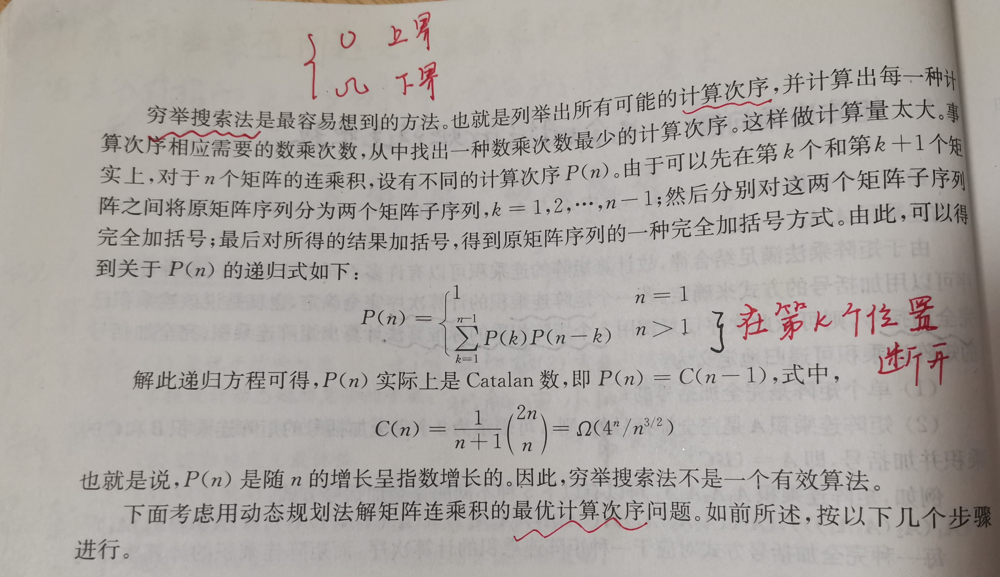

# Catalan number

## 计算机算法设计与分析 # 3.1 矩阵连乘问题

> NOTE: 
>
> 1、是在阅读这篇文章的时候，其中提及了Catalan number，并且结合"矩阵连乘问题"，Catalan number的递归方程是非常容易理解的。
>
> 

## 如何解Catalan问题？

1、使用dynamic programming，参见`Dynamic-Programming`的`Catalan`章节。

## 如何理解、分析Catalan ？

1、expression tree、Parenthese-and-tree

2、noncrossing partition

