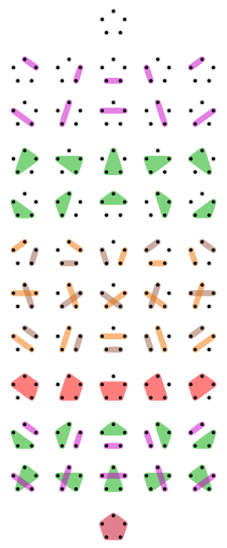

# Partition of a set

对于"partition of a set"，可以添加如下限制条件:

1、Noncrossing partition

参见 "wikipedia [Noncrossing partition](https://en.wikipedia.org/wiki/Noncrossing_partition)"

## wikipedia [Partition of a set](https://en.wikipedia.org/wiki/Partition_of_a_set)

> NOTE: 
>
> 1、这篇文章进行了系统的分析

The [52](https://en.wikipedia.org/wiki/Bell_number) partitions of a set with 5 elements. A colored region indicates a subset of X, forming a member of the enclosing partition. Uncolored dots indicate single-element subsets. The first shown partition contains five single-element subsets; the last partition contains one subset having five elements.

> NOTE: 
>
> 1、上述其实就是[bell number](https://en.wikipedia.org/wiki/Bell_number)

### Counting partitions

The total number of partitions of an *n*-element set is the [Bell number](https://en.wikipedia.org/wiki/Bell_numbers) *Bn*. The first several Bell numbers are *B*0 = 1, *B*1 = 1, *B*2 = 2, *B*3 = 5, *B*4 = 15, *B*5 = 52, and *B*6 = 203 (sequence [A000110](https://oeis.org/A000110) in the [OEIS](https://en.wikipedia.org/wiki/On-Line_Encyclopedia_of_Integer_Sequences)). Bell numbers satisfy the [recursion](https://en.wikipedia.org/wiki/Recursion)
$$
B_{n+1}=\sum _{k=0}^{n}{n \choose k}B_{k}
$$

> NOTE: 
>
> 一、上述式子中的 ${n \choose k}$ 表示的是combination？比如 $C^4_9$，从9个里面选4个？
>
> 应该不是的
>
> 二、关于它的递归公式的推导，参见:
>
> 1、cnblogs [集合划分问题](https://www.cnblogs.com/dolphin0520/archive/2011/07/12/2103917.html)
>
> 2、`计算机算法设计与分析-习题-2-7&2-8集合划分问题` 章节
>
> 

#### The number of noncrossing partitions

The number of noncrossing partitions of an *n*-element set is the [Catalan number](https://en.wikipedia.org/wiki/Catalan_number) *Cn*.

> NOTE: 下面会进行说明

## wikipedia [Noncrossing partition](https://en.wikipedia.org/wiki/Noncrossing_partition)

> NOTE: 
>
> 对于这种，等价于"tree and 括号-Nested parentheses"
>
> 对应的是Catalan number。
>
> 

