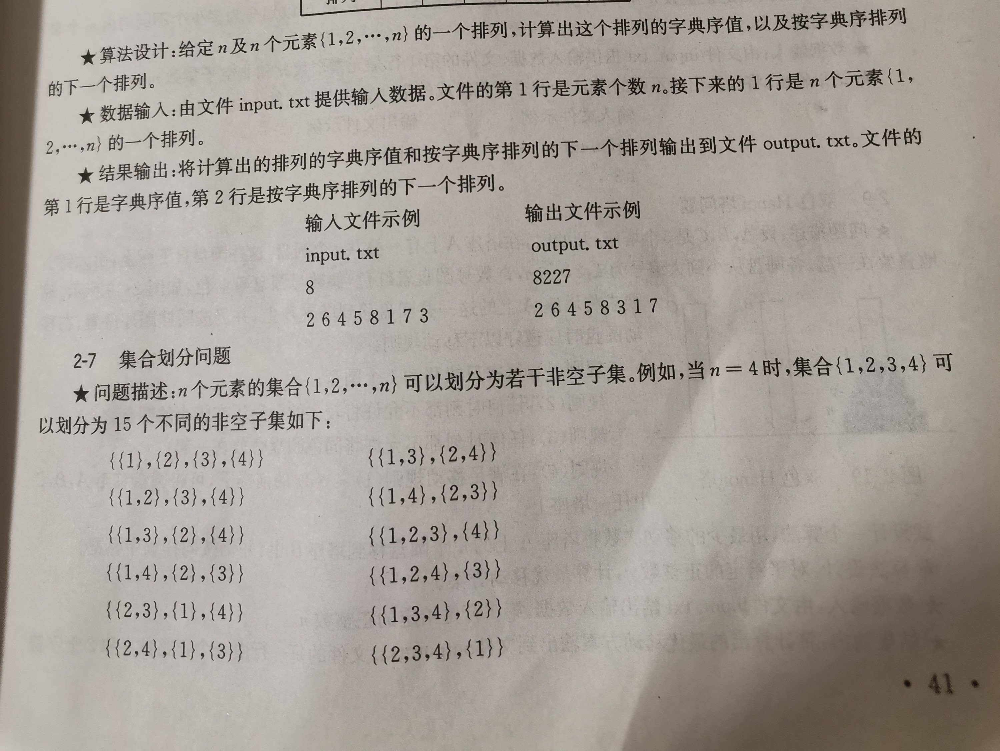
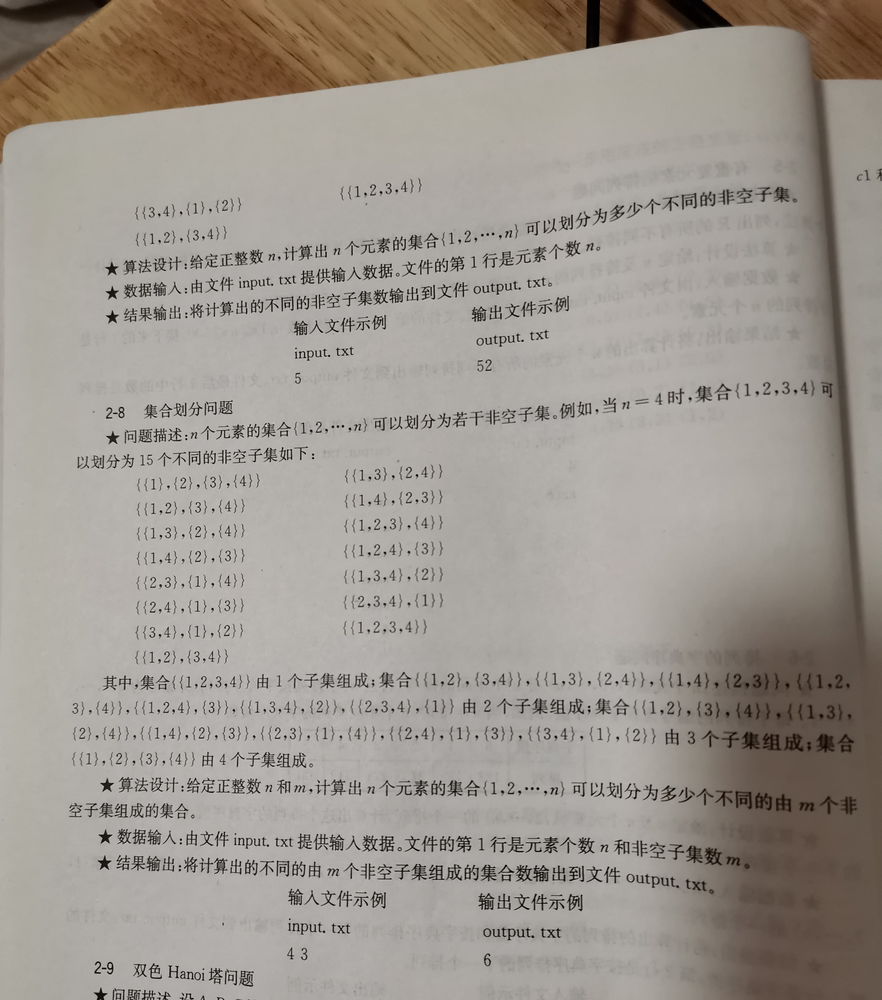

# 集合划分问题

## 2-7



## 2-8



## 2-7 解题

1、divide-and-conquer，

### cnblogs [集合划分问题](https://www.cnblogs.com/dolphin0520/archive/2011/07/12/2103917.html)

思路：对于n个元素的集合，可以划分成由m(1<=m<=n)个子集构成的子集，如 {{1}，{2}，{3}，{4}}就是由4个子集构成的非空子集。假设f(n,m)表示将n个元素的集合划分成由m个子集构成的集合的个数，那么可以这样来看：

   1)若$m==1$，则$f(n,m)=1$;

   2)若$n==m$，则$f(n,m)=1$;

   3)若非以上两种情况，$f(n,m)$可以由下面两种情况构成

​    a.向n-1个元素划分成的m个集合里面添加一个新的元素，则有$m*f(n-1,m)$种方法；

​    b.向n-1个元素划分成的m-1个集合里添加一个由一个元素形成的独立的集合，则有$f(n-1,m-1)$种方法。

因此：

$1   (m==1||n==m) $

$f(n,m)=f(n-1,m-1)+m*f(n-1,m)    (m<n \&\&m!=1)$

#### 递归实现

```c++
#include<stdio.h>
/**
 * @brief 将元素个数为n的结合，划分为包含m个子集的
 *
 * @param n 元素个数
 * @param m 子集个数
 * @return
 */
int f(int n, int m)
{
	if (m == 1 || n == m)
		return 1;
	else
		return f(n - 1, m - 1) + f(n - 1, m) * m;
}

int main(void)
{
	int n;
	while (scanf("%d", &n) == 1 && n >= 1)
	{
		int i;
		int sum = 0;
		for (i = 1; i <= n; i++)
		{
			sum += f(n, i);
		}
		printf("%d\n", sum);
	}
	return 0;
}
// gcc test.cpp


```


### DP实现

#### csdn [集合划分问题](https://littlede.blog.csdn.net/article/details/105167906)

> NOTE: 
>
> 1、给出的code非常好

```C++
/*
 Name: 集合划分问题
 Copyright:
 Author:
 Date: 01-06-18 10:29
 Description: 集合划分问题
 题目描述
 设S是一个具有n个元素的集合，S＝?a1，a2，……，an?S＝?a1，a2，……，an?，
 现将S划分成k个满足下列条件的子集合S1，S2，……，SkS1，S2，……，Sk ，且满足：
 1．Si ≠ ?
 2．Si ∩ Sj ＝ ?            (1≤i，j≤k  i≠j)
 3．S1 ∪ S2 ∪ S3 ∪ … ∪ Sk ＝ S
 则称S1，S2，……，SkS1，S2，……，Sk是集合S的一个划分。它
 相当于把S集合中的n个元素a1，a2，……，ana1，a2，……，an 放入k个(0＜k≤n＜30)无标号的盒子中，使得没有一个盒子为空。
 请你确定n个元素a1，a2，……，ana1，a2，……，an 放入k个无标号盒子中去的划分数S(n,k)。
 输入
 给出n和k。
 输出
 n个元素a1，a2，……，ana1，a2，……，an 放入k个无标号盒子中去的划分数S(n,k)。
 样例输入
 10 6
 样例输出
 22827
 例如，当n=4,k=3时，集合{1，2，3，4}可以划分为S(4,3)=6：
 {{1，2}，{3}，{4}}，
 {{1，3}，{2}，{4}}，
 {{1，4}，{2}，{3}}，
 {{2，3}，{1}，{4}}，
 {{2，4}，{1}，{3}}，
 {{3，4}，{1}，{2}}
 算法分析：
 假设f(k,n)表示将n个元素的集合划分成由k个子集构成的集合的个数，那么可以这样来看：
 1)若k==0或n<k，则f(k,n)=0;
 2)若k==1或n==k，则f(k,n)=1;
 3)若非以上两种情况，f(n,m)可以由下面两种情况构成
 a.向n-1个元素划分成的k个集合里面添加一个新的元素，则有k*f(k,n-1)种方法；
 b.向n-1个元素划分成的k-1个集合里添加一个由一个元素形成的独立的集合，则有f(k-1,n-1)种方法。
 即 f(k,n)=f(k-1,n-1)+k*f(k,n-1)       (k<n&&k!=1)
 有了上述递推式，我们就分别可以用递归，记忆化搜索和动态规划算法来实现它。
 */
#include<iostream>
#include<cstring>

using namespace std;

const int MAXK = 10; //子集最大数量
const int MAXN = 200; //元素最大个数

int B2[MAXK + 1][MAXN + 1]; //备忘录，记录将n个元素的集合划分成由k个子集构成的集合的个数
int B3[MAXK + 1][MAXN + 1]; //备忘录，记录将n个元素的集合划分成由k个子集构成的集合的个数

int pre[MAXN + 1]; //记录上一行元素值
int cur[MAXN + 1]; //记录当前行元素值

int S(int k, int n); //递归算法：返回将n个元素的集合划分成由k个子集构成的集合的个数
int S2(int k, int n); //记忆化搜索：返回将n个元素的集合划分成由k个子集构成的集合的个数
int S3(int k, int n); //动态规划：返回将n个元素的集合划分成由k个子集构成的集合的个数
int S4(int k, int n); //优化的动态规划：返回将n个元素的集合划分成由k个子集构成的集合的个数

int main()
{
	int n, k;
	cin >> n >> k;

	cout << S(k, n) << endl;

	memset(B2, -1, sizeof(B2)); //先初始化B2的值全为-1
	cout << S2(k, n) << endl;

	cout << S3(k, n) << endl;
	cout << S4(k, n) << endl;

	return 0;
}

/**
 * @brief 递归算法：返回将n个元素的集合划分成由k个子集构成的集合的个数
 *
 * @param k
 * @param n
 * @return
 */
int S(int k, int n)
{
	if (k == 0 || n < k)
		return 0;
	if (k == 1 || n == k)
		return 1;
	return S(k - 1, n - 1) + k * S(k, n - 1);
}

/**
 * @brief 记忆化搜索：返回将n个元素的集合划分成由k个子集构成的集合的个数
 *
 * @param k
 * @param n
 * @return
 */
int S2(int k, int n)
{
	if (B2[k][n] != -1)
		return B2[k][n];
	if (k == 0 || n < k)
		B2[k][n] = 0;
	else if (k == 1 || n == k)
		B2[k][n] = 1;
	else
		B2[k][n] = S2(k - 1, n - 1) + k * S2(k, n - 1);

	return B2[k][n];
}

/**
 * @brief 动态规划：返回将n个元素的集合划分成由k个子集构成的集合的个数
 *
 * @param k
 * @param n
 * @return
 */
int S3(int k, int n)
{
	for (int j = 1; j <= n; j++)
		B3[j][j] = B3[1][j] = 1;

	for (int i = 2; i <= k; i++) // 集合个数
	{
		for (int j = i + 1; j <= n; j++) // 元素个数
		{
			B3[i][j] = B3[i - 1][j - 1] + i * B3[i][j - 1];
		}
	}

	return B3[k][n];
}

/**
 * @brief 优化的动态规划：返回将n个元素的集合划分成由k个子集构成的集合的个数
 *
 * @param k
 * @param n
 * @return
 */
int S4(int k, int n)
{
	for (int j = 1; j <= n; j++) //记录第一行数据，即只包含一个集合
	{
		pre[j] = 1;
	}
	for (int i = 2; i <= k; i++) // 集合个数
	{
		cur[i] = 1; //相当于B3[j][j] = 1;
		for (int j = i + 1; j <= n; j++) // 元素个数
		{
			/**
			 * 对比来看:
			 * B3[i][j] = B3[i - 1][j - 1] + i * B3[i][j - 1];
			 *
			 * B3[i - 1][j - 1] 表示的上一行
			 * B3[i][j - 1] 表示的是当前行
			 */
			cur[j] = pre[j - 1] + i * cur[j - 1];
		}
		/**
		 * 迭代
		 */
		for (int j = 1; j <= n; j++)
		{
			pre[j] = cur[j];
		}
	}

	return pre[n];
}

// g++ test.cpp


```


