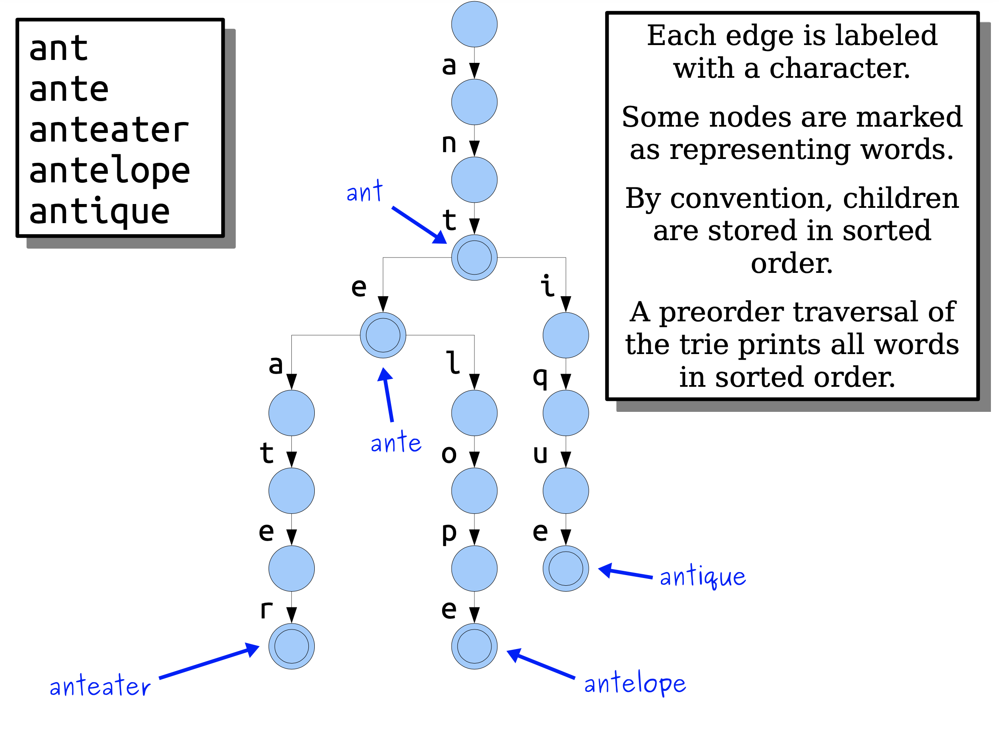
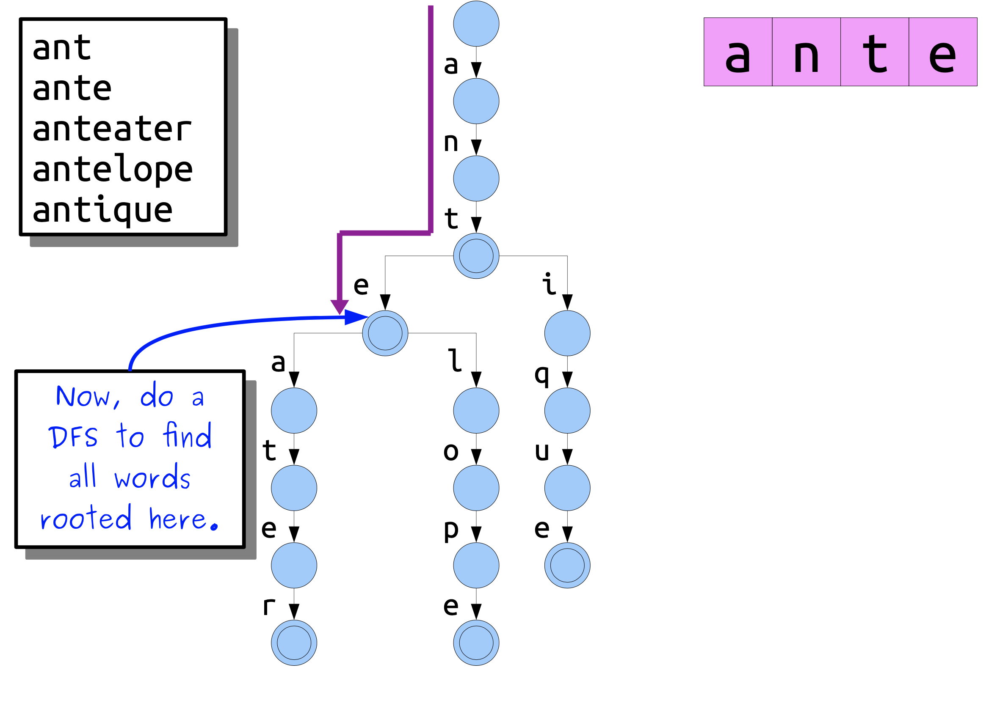
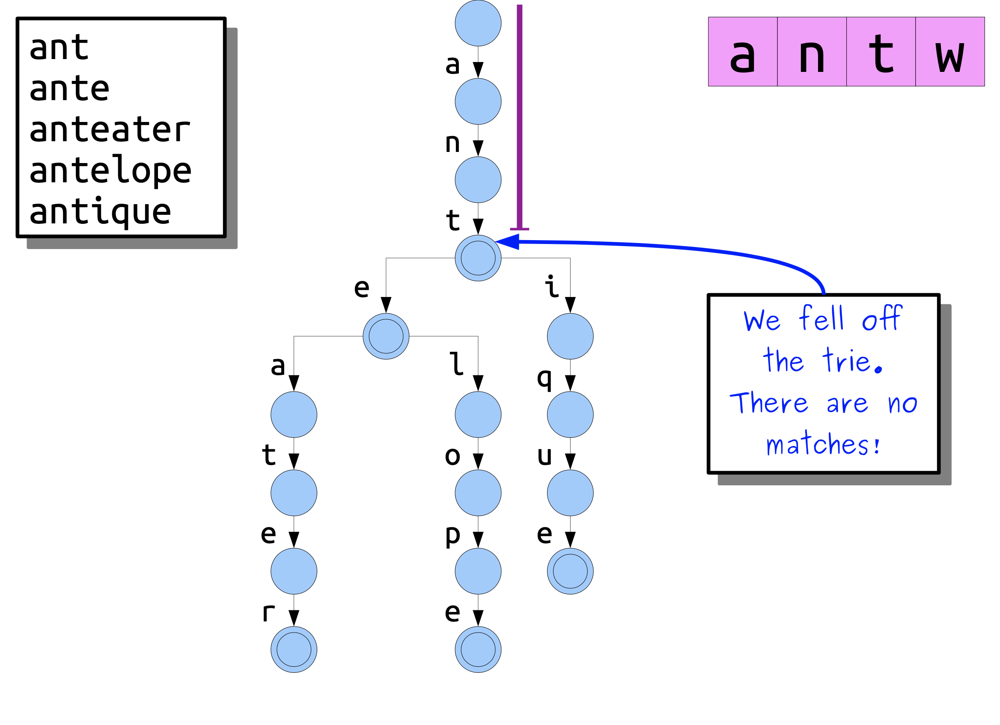
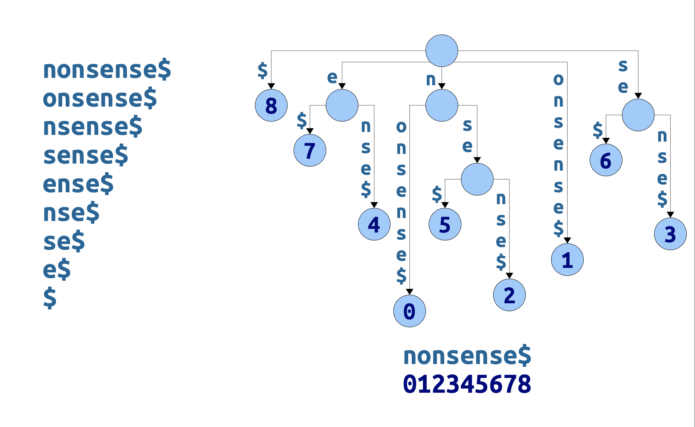

# [Tries and Suffix Trees](https://web.stanford.edu/class/cs166/lectures/04/Slides04.pdf) 

## String Data Structures

Our next topic for the quarter is the wonderful world of string data structures.

Why are they worth studying?

**They’re practical**. These data structures were developed to meet practical needs in data processing. Lots of important data can be encoded as strings.

**They’re different**. The questions typically asked about strings involve properties of sequences, not individual elements, in a way that you don’t normally otherwise see.

> NOTE:
>
> 一、翻译如下: "关于字符串的问题通常涉及序列的属性，而不是单个元素，以一种你通常不会看到的方式"

**They’re algorithmically interesting**. The techniques that power these data structures involve some truly beautiful connections and observations.

## Where We’re Going

Today, we’ll cover [**tries**](https://en.wikipedia.org/wiki/Trie) and **suffix trees**, two powerful data structures for exposing **shared structures** in strings.

> NOTE:
>
> 一、翻译如下: "今天，我们将介绍trie和suffix tree，这是两种用于在字符串中公开共享结构的强大数据结构。"
>
> 上面这段话中用到了 "**shared structures**" 这个词，显然 trie 和 suffix tree 能够在多个strings中描述它们的 "**shared structures**"

On Thursday, we’ll see the [**suffix array**](https://en.wikipedia.org/wiki/Suffix_array) and [**LCP array**](https://en.wikipedia.org/wiki/LCP_array), which are a more space- efficient way of encoding [suffix trees](https://en.wikipedia.org/wiki/Suffix_tree).

## Part I: **Tries and Patricia Tries**

### A Motivating Problem

We have a series of text strings $T_1, T_2, \dots, T_k$ of total length $m$. ($\norm{T_1} + \norm{T_2} + \dots + \norm{T_k} = m$)

We have a pattern string **P** of length **n**. ($\norm{p} = n$​).

**Goal:** Find all text strings that start with **P**.

If we just do a single query, then we can solve this pretty easily: Just scan over all the strings and see which ones start with **P**.

**Question:** If we have a set of fixed text strings and varying patterns, can we speed this up?

### A Naive Solution

We’re spending a lot of time scanning shared prefixes. Is there a way to avoid this?

### Trie

 

 

#### Complexity

**Recall:** The total length of our text strings is **m**, and the length of our pattern string is **n**.

Q: How long does it take to build our trie?

A: **Claim:** Ignoring the size of the alphabet, the runtime is O(**m**).

Q: How long does it take to check if the pattern is a prefix of any string?

A: **Claim:** Ignoring the size of the alphabet, the runtime is O(**n**).

Q: How long does it take to find all text strings that start with the pattern?

A: That’s a trickier question.

### Patricia trie

> NOTE:
>
> 一、压缩能够带来时间和空间的优势
>
> 二、gpt-4-vision: Patricia tree
>
> > A Patricia tree (Practical Algorithm to Retrieve Information Coded in Alphanumeric), also known as a radix tree or compact prefix tree, is a space-optimized trie data structure where each node that is the only child is merged with its parent. The name "Patricia" is derived from the acronym PATRICIA, which stands for "Practical Algorithm To Retrieve Information Coded In Alphanumeric."
> > The Patricia tree is used in situations where the trie is expected to have a large number of nodes with a single child, which is common in applications like IP routing, where the tree is used to store and search for IP addresses, or in dictionary implementations, where the tree stores a large set of strings (like words).
> > Key features of a Patricia tree:
> >
> >
> > Path Compression: Nodes with only one child are merged with their parents, which reduces the height of the tree and saves space.
> >
> >
> > Edge Labels: Instead of storing characters on nodes, Patricia trees store them on the edges (or links) between nodes. Each edge represents a non-empty string, which could be a single character or a longer string.(和trie是一致的)
> >
> >
> > Binary or Multi-way: Patricia trees can be binary, where each node has at most two children (used for bit strings like IP addresses), or multi-way, where nodes can have many children (used for alphanumeric strings).
> >
> >
> > Prefix Sharing: Nodes in the tree share common prefixes, which is a property inherited from the trie. This makes Patricia trees efficient for prefix searches and autocomplete features.
> >
> >
> > Search Efficiency: The search operation in a Patricia tree is efficient because it takes advantage of the compact structure and skips over nodes that have been merged due to having only one child.
> >
> >
> > Here's a simplified example of how a Patricia tree might look with the words "trie", "tree", "try", "tried", and "trick":
> >           (root)
> >            /  \
> >         (tr)  (trie)
> >         /  \
> >      (ee)  (y)
> >      /  \
> >  (d)    (ick)
> >
> > In this example, the edge from the root to the "tr" node represents the common prefix "tr" for the words "tree", "try", "tried", and "trick". The "trie" node represents the word "trie". The "tr" node has two children, one for the "ee" suffix (leading to "tree") and one for the "y" suffix (leading to "try"). The "ee" node further branches into "d" (completing the word "tried") and "ick" (completing the word "trick").
> > Patricia trees are particularly useful in applications where memory efficiency is important and where the data set has many common prefixes. They are widely used in networking for longest prefix matching, which is essential for IP routing.

#### Sentinel or endmarker(Page-22)

The `$` symbol is called the ***sentinel*** or ***endmarker***. It’s a special character that can only appear at the ends of words. (Think “null 
terminator,” Theoryland edition.)

By convention, the sentinel `$` precedes all other characters.(It really is like a null terminator!)

Nodes now fall into one of two classes:

- Leaf nodes correspond to words in the trie.
- Internal nodescorrespond to routing structure.

#### Silly node(Page-25)

A node is a silly nodeif it is a non-root node that only has one child.

#### Patricia trie(Page-26)

A **Patricia trie** is a trie where silly nodes are merged into their parents.

Observation 1: Every internal node in a Patricia trie (except possibly the root) has  two or more children.

Observation 2:Leaves correspond to words; internal nodes are there for routing purposes.

#### Theorem(Page-31)

Theorem: The number of nodes in a Patricia trie with k words is always O(k), regardless of what those words are.

##### Proof Sketch(Page-38)

There are k leaves, one per word. Remove all internal nodes, leaving a forest of k trees.Add the internal nodes back one at 
a time. Each addition (except possibly root) decreases the number of trees in the forest by at least one, since each (non-root) 
internal node has at least two children. This means there are at most k internal nodes, for a total of O(k) nodes.

## Part II: Suffix Trees(Page-42)

### Two Motivating Problems

**Patricia tries** are great tools for finding **prefixes**. These problems involve looking for **substrings**. Can we use what we’ve developed so far?(Page-46)

### A Fundamental Theorem(Page-47)

The **fundamental theorem of stringology** says that, given two strings *w* and *x*, that

> w **is a substring of** x if and only if **w** **is a prefix of a suffix of** **x**

> NOTE:
>
> 一、上述定理将substring、prefix、suffix结合在一起了

To find all matches of *w* in *x*, we just need to find all suffixes of *x* that start with *w*.(Page-53)

> NOTE:
>
> 一、这是核心思路

### Suffix Trees

A **suffix tree** for a string *T* is a **Patricia trie** of all suffixes of T.

Each leaf is labeled with the starting index of that suffix.

Two facts:

- It’s possible to build a **suffix tree** from a string of length **m** in time O(**m**). (Yes, really!) 
- It’s possible to store a **suffix tree** for a string of length **m** using O(**m**) words of memory. (Yes, really!)

> NOTE:
>
> 一、这些在 [Suffix and LCP Arrays](https://web.stanford.edu/class/cs166/lectures/05/Slides05.pdf) 中会进行介绍

### Substring Search

**Claim:** Once we have a suffix tree for a string *T*, we canfindall matches of a pattern*P*oflength **n** in time O(**n** + **z**), where **z** is the number of matches.

**Idea:** Use the **standard Patricia trie search** from before!

**Algorithm:** Use the **standard Patricia trie search**!

Look up the pattern in the **suffix tree**, then use a DFS to find all matches.

Looking up the pattern takes time O(**n**).

Finding all matches takes time O(**z**).

### [Longest repeated substring problem](https://en.wikipedia.org/wiki/Longest_repeated_substring_problem)

> NOTE:
>
> 一、这个问题属于 [Longest repeated substring problem](https://en.wikipedia.org/wiki/Longest_repeated_substring_problem). 作者在这里引出这个问题，后面的一大段内容都是围绕它而展开。

### The Anatomy(解剖) of a Suffix Tree

Think back to **Cartesian trees**. We can describe them in two ways.

- **Mechnically:** Hoist(提升) the minimum element up to the root, then recursively process the two subarrays.
- **Operationally:** It’s a min-heap whose inorder traversal gives the original array.

**Question:** We now have a **mechanical** definition of a suffix tree. Can we get can **operational** one?

**A:** The leaves of a suffix tree correspond to the suffixes of the text string *T*.

**Question:** What do the *internal* nodes of the suffix tree correspond to?

**A:** In this **suffix tree**, there are **internal nodes** for the substrings `e`, `n`, `nse` and `se`. All these substrings appear at least twice in the original string! More generally: if there is an internal node for a substring $\alpha$ then $\alpha$ appears at least twice in the original text.

> NOTE:
>
> 一、从后面的内容可知，它们是 **branching word**

**Question:** why is there an **internal node** for the substring `n`, but isn’t there an internal node for the substring `ns`?

**A:** *Every* occurrence of **ns**canbeextendedby appending the same character (**e**). *Not all* occurrences of **n** can be extended by appending the same character.

### **Branching word**

A **branching word** in `T$` is a string ω such that there are characters *a*≠*b* where ω*a* and ω*b* are substrings of `T$`.

Edge case:the empty string is always considered branching.

**Theorem:** The **suffix tree** for a string *T* has an **internal node** for a string ω if and only if ω is a **branching word** in `T$`.

### Operational definition of a suffix tree

The leaves of a suffix tree for T correspond to suffixes of `T$`, and the internal nodes of a suffix tree for T correspond to branching words of `T$`.

We’ll make extensive use of this fact going forward.

### Longest Repeated Substrings

**Theorem:** The longest repeated substring of a string *T* must be a branching word in `T$`.

**Proof idea:** If ω isn’t branching, it can’t be the **longest repeated substring**.

To find the **longest repeated substring** of a string *T*, we just need to find the **internal node** with the longest label!

#### Algorithm

Given a suffix tree for a string *T* of length **m**, there is an O(**m**)-time algorithm for finding the longest repeated substring of *T*.

**Basic idea:** Run a DFS over the tree and find the **internal node** with the longest string on its path from the root.

There are some subtle details required to get this to run in time O(**m**). Think this over! See what you find.

## More to Explore

We’ve barely scratched the surface of suffix trees. They can be used for tons of other problems.

A sampling:

[**Generalized suffix trees**](https://en.wikipedia.org/wiki/Generalized_suffix_tree): Solves fast substring searching over multiple text strings, not just a single text string.

[**Approximate string matching**](https://en.wikipedia.org/wiki/Approximate_string_matching): Given a text string *T* and a pattern *P*, see the closest match to *P* in *T*.

**Fast matrix multiplication**: The matrix multiplications needed in computing word embeddings can, amazingly, be optimized using suffix trees.

This is a rich space to explore – and I encourage you to do so!
