# [Suffix and LCP Arrays](https://web.stanford.edu/class/cs166/lectures/05/Slides05.pdf)

> NOTE:
>
> 使用suffix array和LCP array来存储suffix tree

## Suffix Tree Space Usage

### Space complexity of suffix tree(Page-8)

We know that a suffix tree has O(**m**) nodes, where **m** is the number of characters in the input string. This means that there are O(**m**) edges. 

**Question:** Why can’t we immediately claim that the space usage of the suffix tree is O(**m**)?

**Claim:** Writing out all suffixes of a string of length **m** requires Θ(**m**2) characters.

**Proof idea:** Those suffixes have length 1+2+...+(**m**+1), factoring in the special **$** character.

**Problem:** It is indeed possible to build a suffix tree with Θ(**m**2) total letters on the edges.

### New representation(Page-12)

By being clever with our representation, we can guarantee that a **suffix tree** uses only Θ(**m**) space, regardless of the input string.

**Observation:** Each edge is labeled with a substring of the original input string.

**Idea:** Don’t actually write out the labels on the edges. Just write down the start and end index!

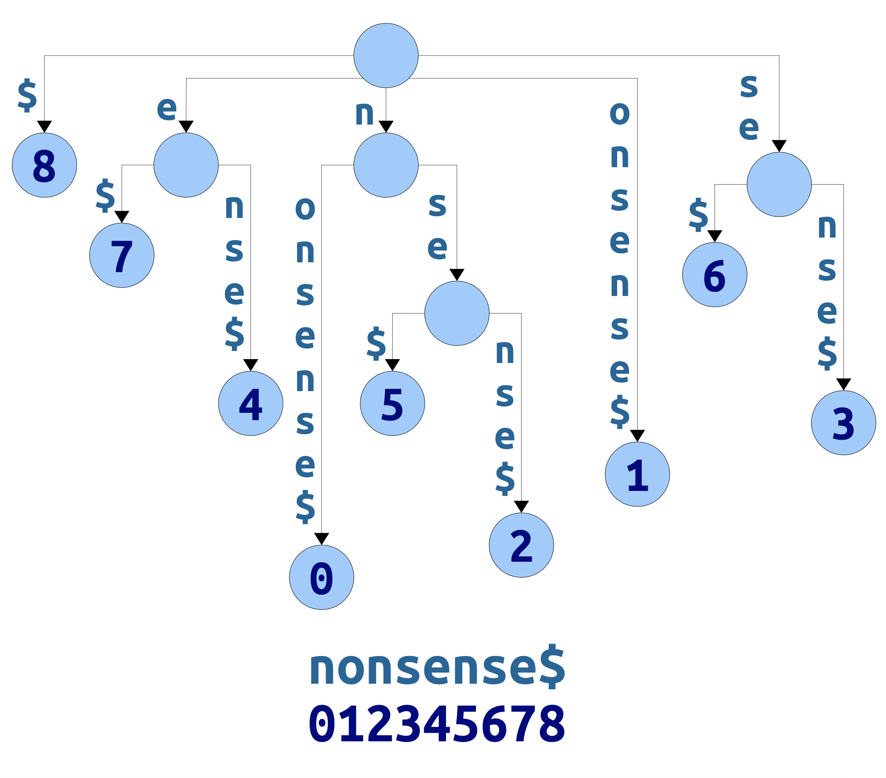

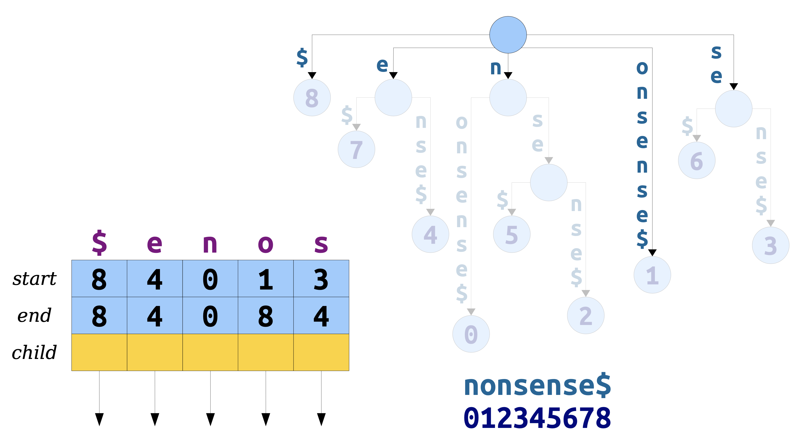

#### Space usage for new representation(Page-12)

Space usage required for a suffix tree: 

- O(**m**) space for all the nodes.

- O(**m**) space for a copy of the original string.
- O(**m**) space for the edges.

Total space: O(**m**).

### Suffix Tree Space Usage(Page-13)

Suffix tree edges take up a *lot* of space.

- Two machine words per edge to denote the range of characters visited.
- One machine word per edge for the pointer itself.
- Number of edges ranges from *m* to 2*m* – 1, so this is between 3*m* and 6*m* machine words for the whole string!

Example: a human genome is about three billion characters long.

- With clever techniques, that can be packed into about 800MB.

- On a 32-bit machine, the suffix tree needs about 48GB – too big to fit into memory!

- On a 64-bit machine, the suffix tree needs about 96GB – way more than a typical machine can hold!

## Key Question(Page-14)

**Key Question:** Can we get the benefits of a suffix tree without the space penalty?

## What is it about suffix trees that make them so useful algorithmically?

### Theorem

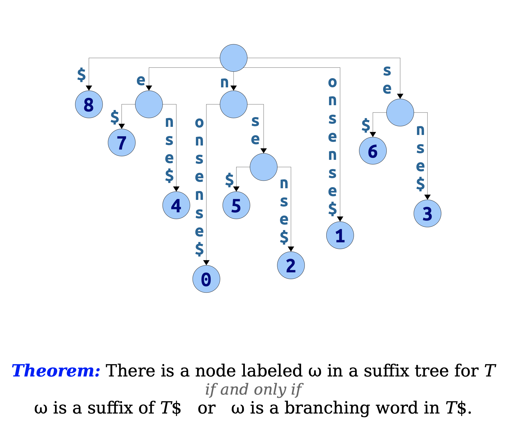

### Suffix

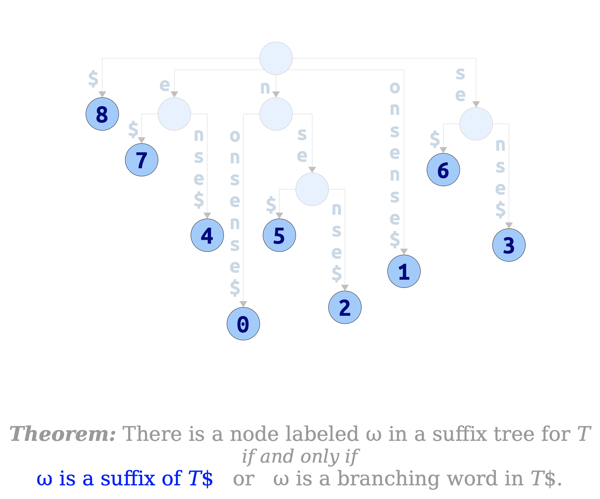

### Branching word

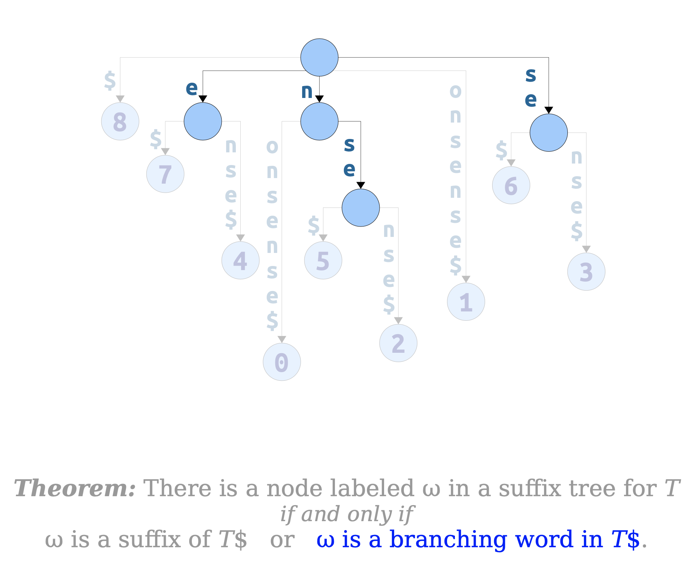

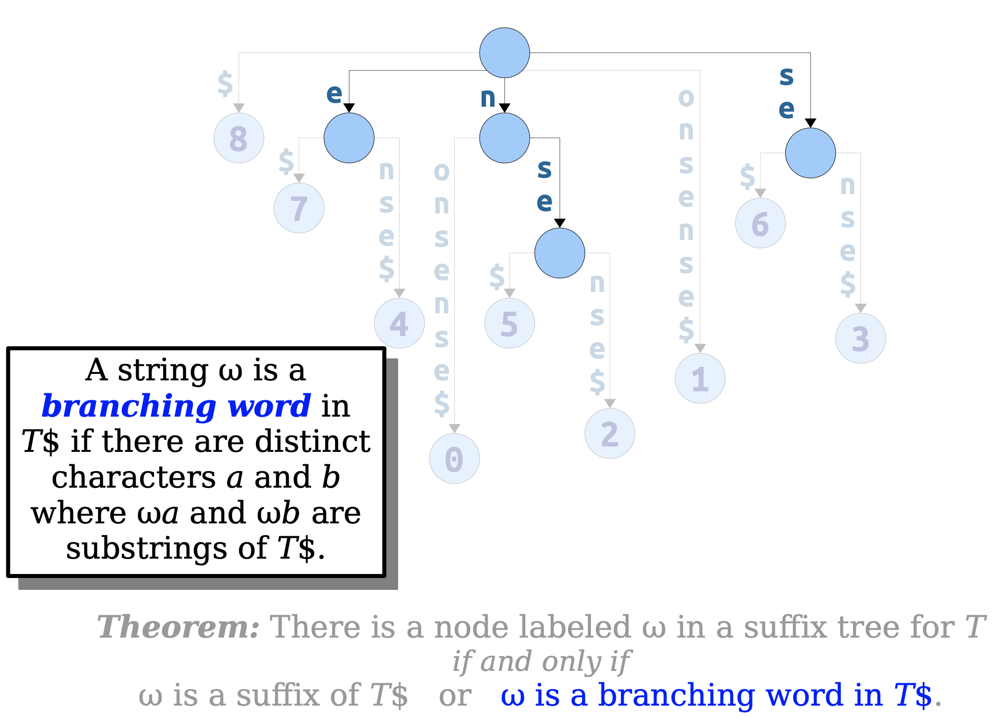

### Key Intuition(Page-21)

The efficiency in a suffix tree is largely due to 

1. keeping the suffixes in sorted order, and
2. exposing branching words.

## Where We’re Going(Page-22)

Today, we’ll see two data structures that encode much of the same information as **suffix trees**, but in much less space.

- The **suffix array** stores information about the ordering of the suffixes of a string.
- The **LCP array** stores information about the branching words of a string.

Together, they’ll provide algorithms that match or are comparable to the time bounds from last time.

## Suffix Arrays

A **suffix array** for a string *T* is a sorted array of the suffixes of the string `T$`.

**Suffix arrays** distill out(提炼出) just the first component of suffix trees: they store suffixes in sorted order.

**Non-obvious fact:** Suffix arrays can be built in time O(**m**). We can cover this later in the quarter if you’re interested.

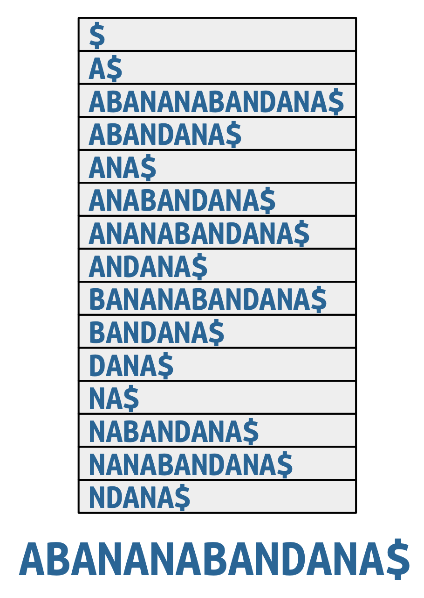

The way we’ve drawn suffix arrays is terribly space-inefficient. It always uses space Θ(**m**2), since that’s how many total characters occur in all suffixes. Can we do better?

We reduced the space usage of suffix trees by representing substrings, implicitly, as ranges within the original string.

**Idea:** Don’t store the suffixes themselves. Just store the starting positions of the suffixes.

Space: Θ(**m**), and with only one machine word used per character of input.

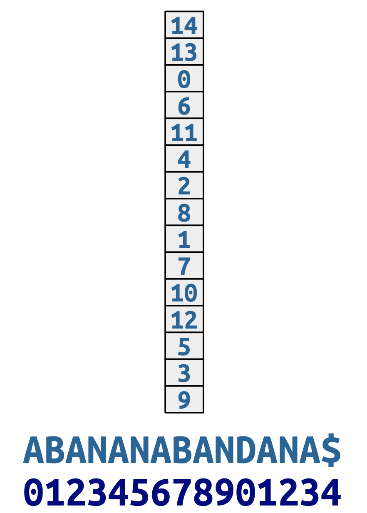

## Using Suffix Arrays(Page-33)

> NOTE:
>
> 一、主要使用binary-search

## The Story So Far

**Suffix array**s store all the suffixes of a string in sorted order.

They provide an: ⟨O(**m**), O(**n** log **m** + **z**)⟩ solution to the substring search problem.

**Intuition:** Suffix trees are valuable in large part because they just keep the suffixes sorted.

What else are suffix trees doing?

## Branching Words And LCP

Notice that, by sorting suffixes, we’ve made it easier to spot branching words.

Specifically, all suffixes starting with a branching word will be adjacent in the suffix array.

The branching word will be the **longest common prefix** (or **LCP**) of those adjacent suffixes.

### Theorem

**Theorem:** A string ω is a branching word in string `T$` if and only if it’s the longest common prefix of two adjacent suffixes in *T*’s suffix array.

**Proof idea:** If ω is the longest common prefix of two adjacent suffixes, let *a* and *b* be the characters immediately following ω in those two suffixes. Then ω*a* and ω*b* are substrings of `T$`.

If ω is branching, choose the lexicographically smallest *a* and *b* making the definition work. Then the last suffix starting with ω*a* and the first suffix starting with ω*b* are adjacent in the suffix array.

.png)

### Key Intuition

**Key Intuition:** Adjacent suffixes with long shared prefixes correspond to subtrees of the suffix tree.

## Harnessing this Connection

### Longest Repeated Substring

#### Suffix tree

Last time, we saw how to solve repeated substring problem by using suffix trees. 

- **Algorithm:** Find the internal node in the suffix tree with the longest label.
- **Question:** Can we do this with just a suffix array?

#### Suffix array

##### Worst-case bound

We can list all branching words from a suffix array in time $\mathcal{O}(m^2)$: O(**m**) pairs; each pair takes time O(**m**) to process.

This worst-case bound can be realized.

Contrast this with O(**m**) for a suffix tree. Can we do better?

##### Better

**Observation:** We don’t actually need to know what all the branching words are to find the longest repeated substring. We just need to know how long they are. That way, we can figure out which is longest. Is there some nice way to do this?

## LCP Arrays

The **LCP array**, often denoted **H**, is an array where `H[i]` is the length of the LCP of the *i*th and (*i*+1)st suffixes in

(The letter *H* comes 2 from “height.”)

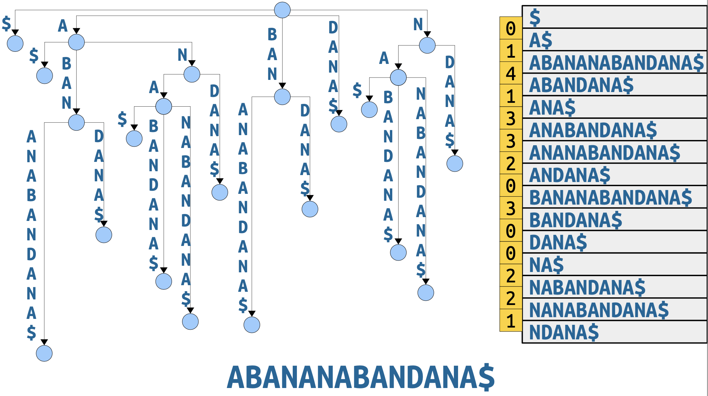

**Key intuition:** The **suffix array** gives the leaves of the **suffix tree**. The **LCP array** gives the internal nodes of the **suffix tree**.

> NOTE:
>
> 一、使用suffix array和LCP array来存储suffix tree

### Using LCP Arrays

If you already have a suffix array and LCP array, you can solve longest repeated substring in time O(**m**): 

- Find the largest element in the LCP array.
- Return the string it corresponds to.

**Question:** How fast can we construct an LCP array?

## Building LCP Arrays

### Naive algorithm

It never hurts to start with the naive algorithm and see what happens!

**Algorithm:** For each consecutive pair of strings in the suffix array, compute the length of their **longest common prefix**.

We can upper-bound the runtime at O(**m**2).

**Question:** Can we realize this upper bound?

Why is our naive algorithm slow?

**Intuition:** We aren’t able to carry work from one suffix over to the next.

**Key intuition:** Suffixes overlap one another! It should be possible to share LCP information across suffixes.

#### Example1(Page-95)

For example, suppose we compute the **LCP entry** shown here.

Look at the suffixes formed by dropping the first letter of these two suffixes.

|                                        |                                        |
| -------------------------------------- | -------------------------------------- |
| 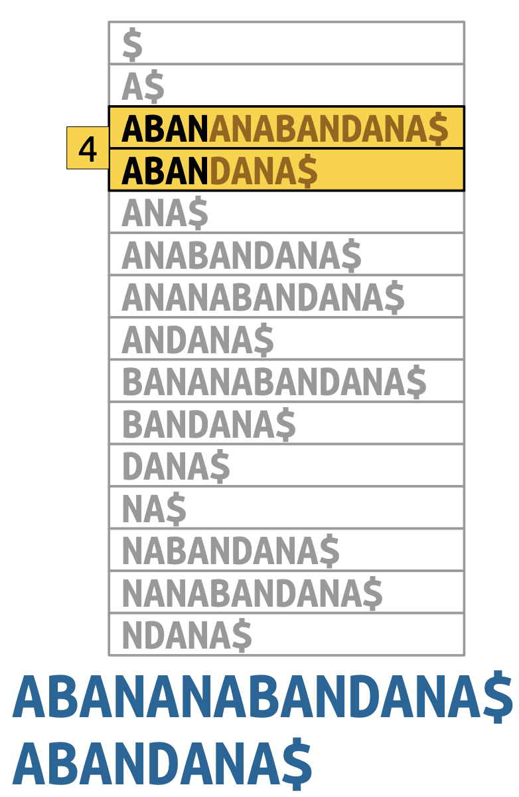 | 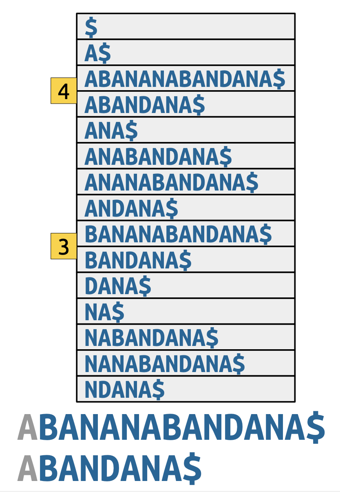 |

What do we know about their LCP?

#### Example2(Page-96)

Let’s do another example. Suppose we know the LCP of these suffixes.

As before, drop the first letter from each suffix.

What can we say about the LCP of the resulting suffixes?

|                                        |                                        |
| -------------------------------------- | -------------------------------------- |
| 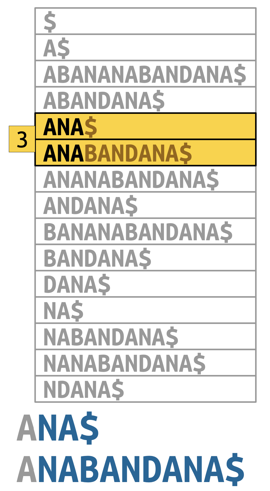 | 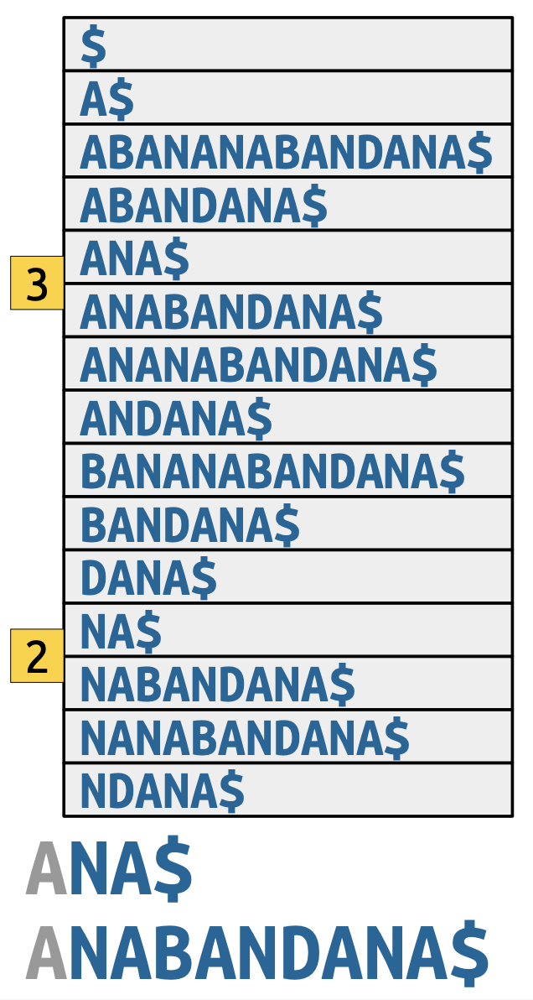 |

Sometimes, in dropping the first letter, two adjacent suffixes get spread out.

> NOTE:
>
> 一、翻译如下: "有时，在省略第一个字母时，两个相邻的后缀会分散开来。"

**Claim:** Look at the second suffix in the pair. Its LCP with the suffix before it is at least the previous LCP minus one.

Think about the **suffix tree**. The two shorter suffixes are in the same **subtree**, so everything between them is also in that **subtree**.

We know that these two new suffixes must have an LCP of at least 1, because the two old suffixes have an LCP of 2.

However, the LCP may be longer than 1, since we’ve never seen one of these two suffixes.

We still need to some some scanning, but we won’t necessarily have to rescan the entire suffix.

## Kasai’s Algorithm

## More to Explore

We could easily spend a whole quarter talking about suffix arrays. Here’s what we didn’t cover:

**Bottom-up tree simulations:** Using **LCP arrays**, you can simulate any O(**m**)-time suffix tree algorithm that works with a bottom-up DFS in time O(**m**).

**Faster substring searching:** Using LCP arrays, plus RMQ, you can improve the cost of a substring search to O(**n** + **z** + log **m**).

**Burrows-Wheeler transforms:** Suffix arrays, plus LCP arrays, can be used to significantly improve the performance of text compressors.
