# [stanford-cs166.1166-Aho-Corasick Automata](https://web.stanford.edu/class/archive/cs/cs166/cs166.1166/lectures/02/Slides02.pdf)

> 这是我在阅读 [cp-algorithms-Aho-Corasick algorithm](https://cp-algorithms.com/string/aho_corasick.html) 的时候发现的。

其中关于string search的定义非常好。

## Use case

### use case 1

**Pattern Strings**

```
ab
about
at
ate
be
bed
edge
get
```


**Text**

```
abedgetab
```

### use case 2

**Pattern Strings**

```
a
aa
aaa
aaaa

```

**Text**

```
aaaaaaaa
```


### use case 3

```
at
art
oars
soar
```

这是非常好的一个例子

```
soat
oart
```


## 行文思路

从最简单的naive approach介绍如何实现string search，然后介绍Aho-Corasick Automata是如何做的。

## The String Searching Problem

Consider the following problem:

> Given a string $T$ and $k$ nonempty strings $P_1, \dots , P_k$, find all occurrences of $P_1, \dots , P_k$ in $T$​.

*T* is called the **text string** and $P_1, \dots , P_k$​ are called **pattern strings**.

This problem was originally studied in the context of **compiling indexes**, but has found applications in **computer security** and **computational genomics**.

## Some Terminology

Let $m = |T|$​, the length of the string to be searched.

Let $n = |P_1| + |P_2| + \dots + |P_k$​| be the total length of all the pattern strings.

Let $L_{max}$​ be the length of the longest pattern string.

Assume that strings are drawn from an alphabet $\Sigma$, where $|\Sigma|$​ is some constant.

We'll use these terms when talking about the runtime of the algorithms and data structures we'll explore over the next couple of days.


## Naïve approach(Page-9)

> Let's start with a naïve approach.

```pseudocode
For each position in T:
     For each pattern string Pᵢ:
          Check if Pᵢ appears at that position
```

### Analyzing Our Approach(Page-38)

let *m* be the length of the text and *n* the total length of the pattern strings.

For each character of the text string *T*, in the worst case, we scan over all *n* total characters in the patterns.

Time complexity: $\mathcal{O}(mn)$.

## Can we do better?(Page-40~54)

> NOTE:
>
> 一、从Page-40到Page-54，所描述的其实就是后面即将介绍的 "Parallel Searching"，仔细看作者的配图可以发现端倪:
>
> - 比如Page-43匹配字符 `a`，它一次性得匹配了所有的以 `a` 打头的字符串，通过后面的内容可知，我们可以通过trie来实现类似的效果

## Parallel Searching(Page-60)

**Idea:** Rather than searching the pattern strings in *serial*, try searching them in *parallel*.

Intuitively, this should cut down on a lot of the unnecessary rescanning that we're doing.

> NOTE:
>
> 一、如何理解标题的 "Parallel Searching" 的含义？
>
> - 下面是chatGPT对 Aho-Corasick Automata 的解释中的一段，其中的"simultaneous matching of multiple patterns against an input text"就是 "parallel"
>
> > It allows for simultaneous matching of multiple patterns against an input text in linear time relative to the length of the input plus the number of matched entries.
>
> - "Can we do better?" 章节的例子就是最好的展示 


### Trie

这一节以trie为例，非常好的展示了finite-state-based-automata-string-search-algorithm的思路: 将text输入到Aho-Corasick Automata，text的每个character都将导致transition。


### Analyzing our New Algorithm(Page-77)

Let's suppose we've already constructed the **trie**. How much work is required to perform the match? 

For each character of *T*, we inspect as most as many characters as exist in the deepest branch of the trie.

Time complexity: $\mathcal{O}(mL_{max})$ , where $L_{max}$ is the length of the longest pattern string. *(Do you see why?)*

> NOTE:
>
> 一、[trie](https://en.wikipedia.org/wiki/Trie) 又称为 prefix tree，显然前缀相同的patterns会位于同一个树枝上，这样的结构是有益于multiple string search的，因为对于前缀相同的多个patterns，长的pattern可以在短的pattern的基础上继续匹配，无需从头开始，显然这能够提高品牌效率，这就是上面所说的"parallel"。 

In the (reasonable) case where $L_{max}$ is much smaller than *n*, this is a huge win over before. If $L_{max}$ is “objectively” small, this is a pretty good runtime.


### Building a Trie(Page-78)

**Claim:** Given a set of strings *P*1, ..., *Pₖ* of total length *n*, it's possible to build a trie for those strings in time $\mathcal{O}(n)$.

> NOTE:
>
> 一、此处省略

## Our Strategies(Page-102)

Following our foray into [RMQ](https://en.wikipedia.org/wiki/Range_minimum_query), we'll say that a solution to multi-string matching runs in time $\langle p(m, n), q(m, n)\rangle$ if the preprocessing time is $p(m, n)$ and the matching time is $q(m, n)$.

> NOTE:
>
> 一、RMQ是 [Range minimum query](https://en.wikipedia.org/wiki/Range_minimum_query) 

We now have two approaches:

- No preprocessing: $\langle \mathcal{O}(1), \mathcal{O}(mn)\rangle$.
- Trie searching: $\langle \mathcal{O}(n), \mathcal{O}(mL_{max})\rangle$.

**Can we do better?**

## Aho-Corasick Automata

## Suffix link

#### Suffix link example1(Page-103~121)

patterns: 

```
at
art
oars
soar
```

text:

```
soars
```


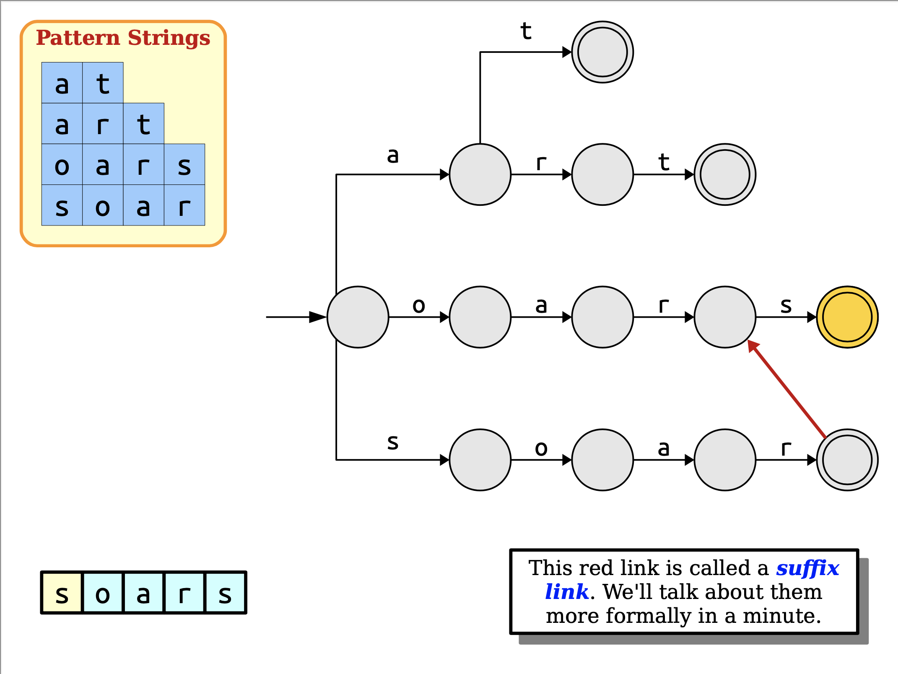


#### Suffix link example2(Page-122~132)

patterns: 

```
at
art
oars
soar
```

text:

```
oart
```


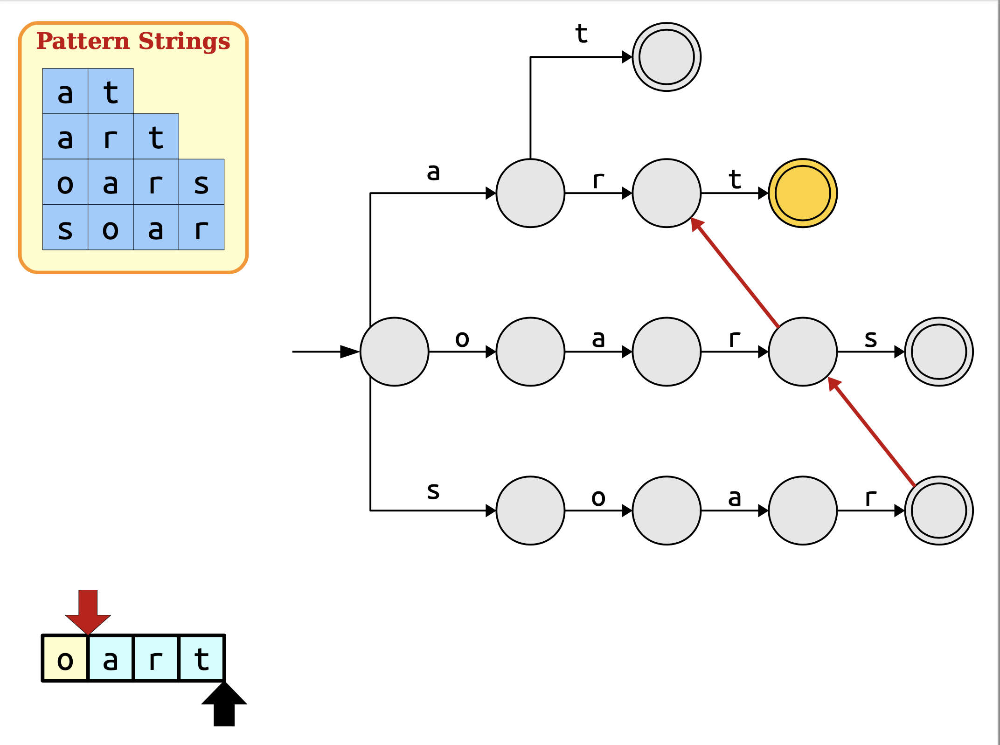

#### Suffix link example3(Page-134~147)

patterns: 

```
at
art
oars
soar
```

text:

```
soat
```


#### Suffix link example4(Page-149~171)

patterns: 

```
at
art
oars
soar
```

text:

```
soarsoars
```


In general, suffix links might jump the red cursor forward more than one step. The number of steps taken is equal to the change of depth in the trie.


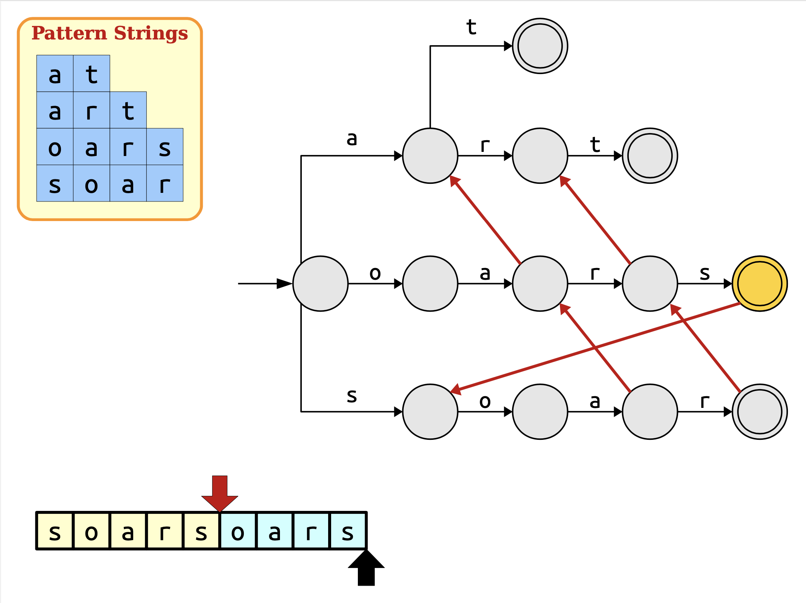

#### Suffix link example5(Page-172~189)

patterns: 

```
at
art
oars
soar
```

text:

```
sotat
```


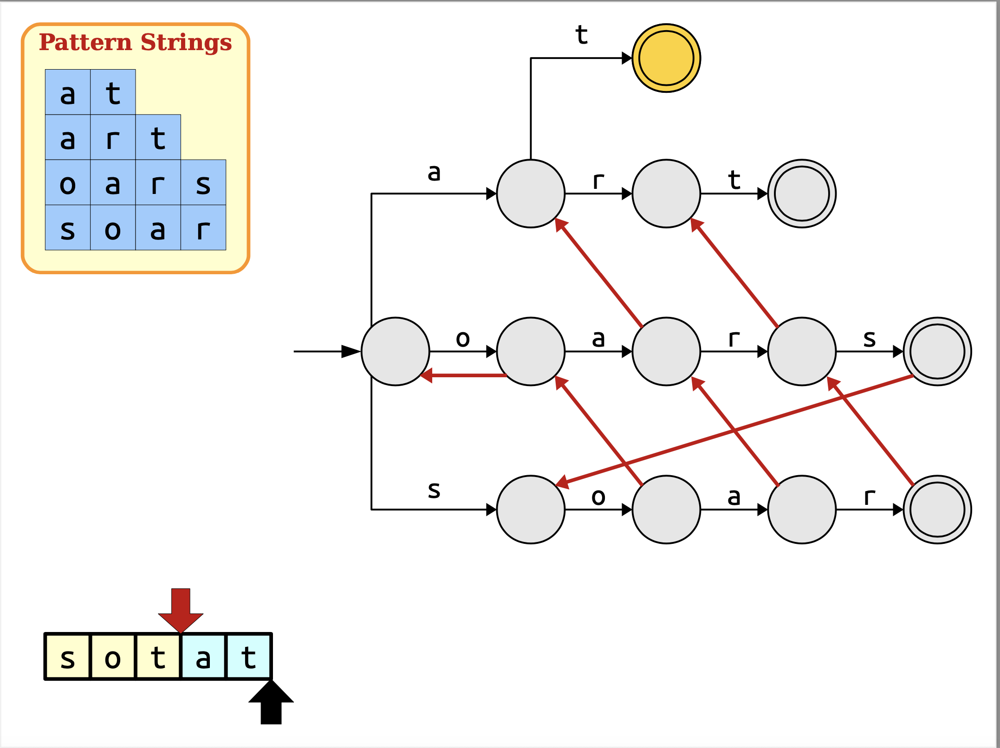


### A Problem with our Optimization(Page-192)

> NOTE:
>
> 一、这一节是为了引出output link

patterns: 

```
i
in
tin
sting
```

text:

```
sting
```


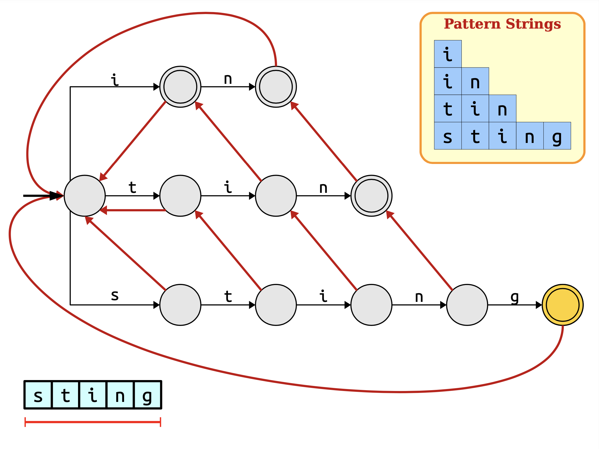

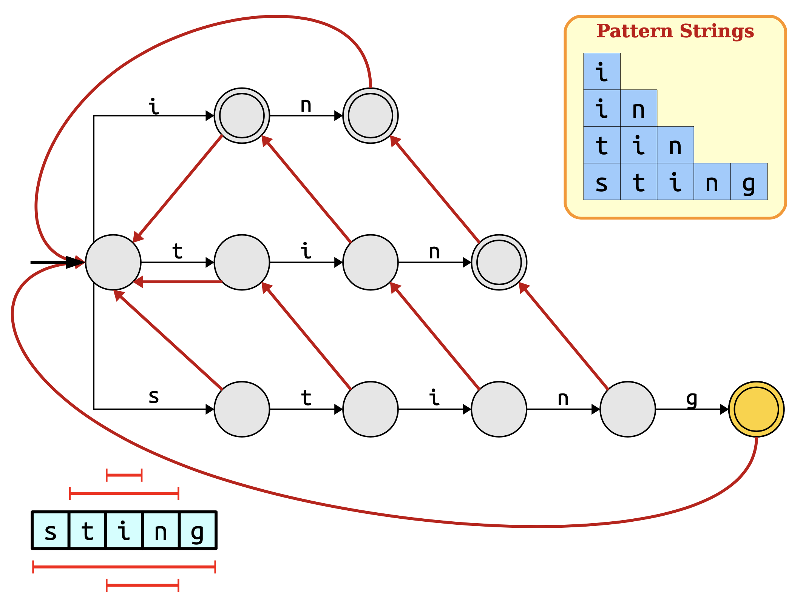

### What Happened?(Page-206)

Our heavily optimized string searcher no longer starts searching from each position in the string. As a result, we now might forget to output matches in certain cases. We need to figure out

- when this happens, and
- how to correct for it.

> NOTE:
>
> 一、由于每个node有多条out edge，所以需要尝试所有的path才能够找出所有的match，但是这种方式存在的问题是低效，这在后面的"The Problem"章节中进行了说明


### How do we address this?(Page-209)

> NOTE:
>
> 一、原文这里只给出了一堆的图，并没有配上文字说明，所以它的具体的解决方式我也不能够百分之百地确定，但是根据graph的知识和"The Problem"章节的内容可知，它应该就是采用的BFS、DFS

### The Problem

The approach described previously will ensure that we don't miss any patterns, but it increases the complexity of the search. Specifically, we do $\mathcal{O}(L_{max})$ additional work at each character following suffix links backwards. This brings our search cost back up to $\mathcal{O}(L_{max})$ again – and that's too slow. **Can we do better?**

> NOTE:
>
> 一、承上启下，引出output link


### Output link(Page-240)


#### Output link example1(Page-243)

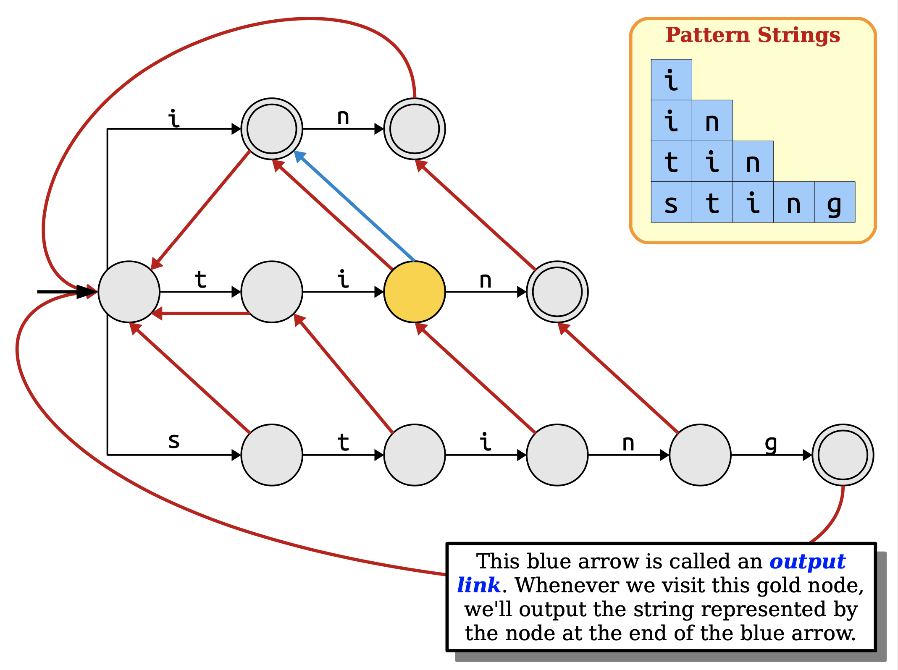

#### Output link example2(Page-246)


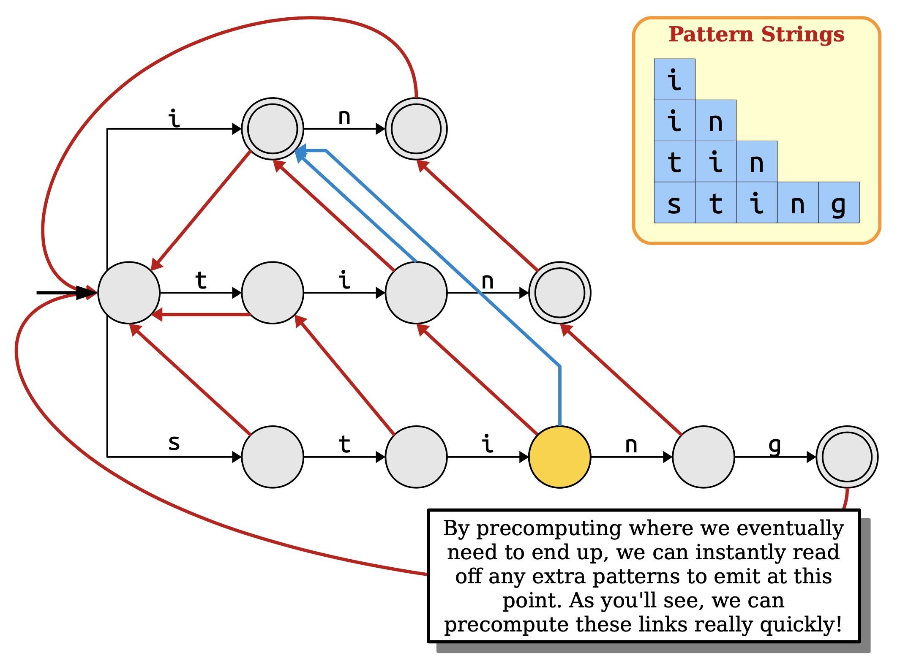

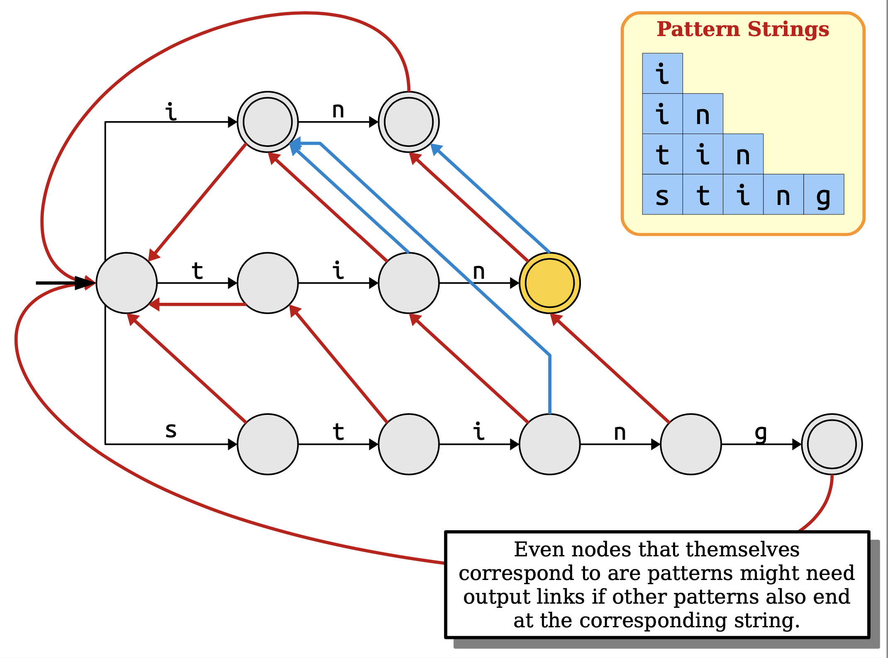

Even nodes that themselves correspond to are patterns might need output links if other patterns also end at the corresponding string.

> NOTE:
>
> 一、上面这段话的意思是: 即使node是terminal node，它也可以有output link

#### Output link example2(Page-252)

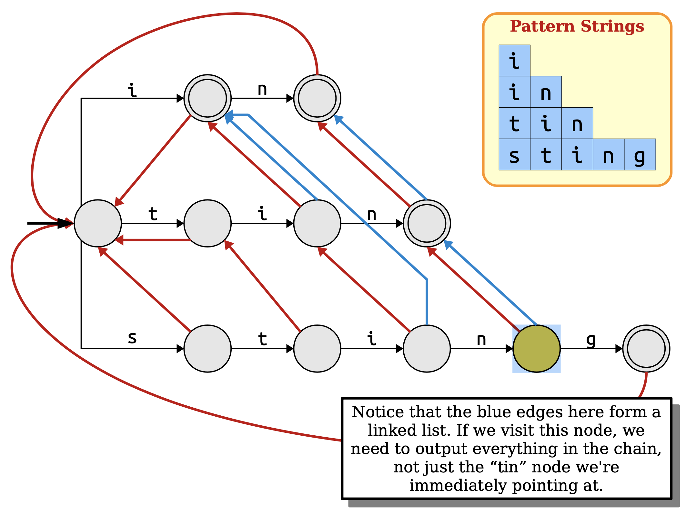

Notice that the blue edges here form a linked list. If we visit this node, we need to output everything in the chain, not just the “tin” node we're immediately pointing at.


### The Final Matching Algorithm(Page-270)

```pseudocode
Start at the root node in the trie.
For each character c in the string:
    While there is no edge labeled c:
        If you're at the root, break out of this loop.
        Otherwise, follow a suffix link.
    If there is an edge labeled c, follow it.
    If the current node corresponds to a pattern, output that pattern.
    Output all words in the chain of output links originating at this node.
```


### The Runtime Impact(Page-271)

> NOTE:
>
> 一、本节给出了一个非常极端的例子来说明 AC automaton的runtime受**output**个数的影响，即它是 [Output-sensitive algorithm](https://en.wikipedia.org/wiki/Output-sensitive_algorithm) 

patterns: 

```
a
aa
aaa
aaaa
```

text:

```
aaaaaaaa
```


### The Runtime(Page-303)

In the worst case, we may have to spend a *huge* amount of time listing off all the matches in the string. This isn't the fault of the algorithm – *any* algorithm that matches strings this way would have to spend the time reporting matches. To account for this, let **z** denote the number of matches reported by our algorithm. The runtime of the match phase is then $\mathcal{O}(m + z)$, with the *m* term coming from the string scanning and the *z* term coming from the matches.

You sometimes hear algorithms whose runtime depends on how much output is generated referred to as [**output-sensitive algorithms**](https://en.wikipedia.org/wiki/Output-sensitive_algorithm).


### Where We Are(Page-304)

Given the matching automaton (which is called an **Aho-Corasick automaton** or an **AC automaton**), we can find all occurrences of the pattern strings in any text of length *m* in time $\mathcal{O}(m + z)$.

To see whether this is worthwhile, we need to see how quickly we can build the automaton.


## Building the Aho-Corasick Automaton(Page-311)

To construct the Aho-Corasick automaton, we need to

- construct the trie,
- construct suffix links, and
- construct output links.

We know we can build the trie in time $\mathcal{O}(n)$ using our logic from before.

How quickly can we construct suffix and output links?


## Constructing Suffix Links(Page-312)


### An Initial Algorithm(Page-327)

Here is a simple, brute-force approach for computing suffix links:

```pseudocode
For each node in the trie
    Let α be the string that this particular node corresponds to.
    For each proper suffix ω of α:
        Look up ω in the trie.
        If the search ends up at some trie node, point the suffix link there and stop.
```

This approach is not very efficient – that doubly- nested loop is exactly the sort of thing we're trying to avoid.

**Can we do better?**


### Fast Suffix Link Construction(Page-331)

> NOTE:
>
> 一、这一段作者没有对于一些符合进行专门的解释，容易造成混淆: 
>
> - $x$: 其实结合图和"Page-335-Constructing Suffix Links"的内容是可以知道: $x$ 是沿着 $w$​ 的suffix link到达的node。
> - $wa$ : 从graph的角度来看，它是一个节点，更加准确的说它是 $w$ 的子节点
>
> 二、原文的这一段讲得比较一般，作者没有阐述核心思想，下面内容源自 gpt-4-vision，我对它进行了稍微的整理:
>
> > The construction of **suffix links** (also known as **failure links** in the context of the **Aho-Corasick automaton**) is a crucial step in building the **Aho-Corasick trie** data structure. These links allow the automaton to fail gracefully when a character match is not found in the current node's children during pattern matching.
> >
> > The construction of **suffix links** is typically done in a **breadth-first** manner after the trie has been built from the set of patterns. Here's a high-level overview of the process:
> >
> > 1. **Initialize**: Start by creating a **root node**. All nodes at depth 1 (the children of the root) have their **suffix link** pointing back to the root because there's no proper non-empty suffix for them that's also a prefix of another pattern.
> > 2. **Breadth-First Search (BFS)**: Perform a **BFS** starting from the **root node**. For each node, compute its **suffix link** based on the **suffix link** of its parent.
> >
> > 3. **Suffix Link Construction**:
> >    - For the current node `u` with a parent `p`, let `c` be the character on the edge from `p` to `u`. 
> >    - Find the suffix link of `p`, which is another node `q`. (`q` 是 `p` 沿着 suffix link 到达的node) 
> >    - While `q` has no child with the character `c` and `q` is not the root, follow the **suffix link** of `q` to find such a child. 
> >    - If `q` has a child `v` with the character `c`, then the **suffix link** of `u` should point to `v`. 
> >    - If no such child exists and `q` is the root, then the suffix link of `u` points back to the root. 
> > 4. **Output Link Construction** (optional, for pattern matching):
> >    - In addition to the **suffix link**, an output link can be added to each node that represents the end of a pattern. This link points to the next node in the trie that also represents the end of a pattern. This is used to report all patterns that end at a given node.
> >
> > The construction of suffix links ensures that the Aho-Corasick automaton can quickly transition between states when mismatches occur, without having to restart the pattern matching process from the beginning of the text or the root of the trie.
>
> Fast Suffix Link Construction可以归入DP范畴，下面是 gpt-4-vision 对于 "Is Aho-Corasick automaton's Fast Suffix Link Construction a dynamic programing algorithm?" 的回答: 
>
> > The construction of **suffix links** in the **Aho-Corasick automaton** can be seen as an application of dynamic programming principles. Dynamic programming is a method for solving complex problems by breaking them down into simpler subproblems, solving each of these subproblems just once, and storing their solutions.
> >
> > In the context of the **Aho-Corasick automaton**, the construction of **suffix links** involves solving the problem of finding the longest proper suffix for each node in the trie that is also a prefix of another pattern. This is done by utilizing previously computed suffix links of parent nodes to efficiently compute the suffix link of the current node.
> >
> > Here's how the process aligns with dynamic programming principles:
> >
> > 1. **Optimal Substructure**: The problem of finding the longest proper suffix for a node that is also a prefix of another pattern can be broken down into finding the longest proper suffix for its parent node. This demonstrates the optimal substructure property, where the solution to a problem can be constructed from the solutions of its subproblems.
> > 2. **Overlapping Subproblems**: As we traverse the trie to compute suffix links, we encounter overlapping subproblems. The suffix link of a parent node is used multiple times to compute the suffix links of its children. By storing the suffix links of the parent nodes, we avoid recomputing them, which is a hallmark of dynamic programming.
> > 3. **Memoization**: The suffix links for each node are computed once and stored (or "memoized") for future use. This stored information is then used to compute the suffix links of descendant nodes more efficiently.
> > 4. **Bottom-Up Approach**: The construction of suffix links typically follows a breadth-first search, which is a bottom-up approach. We start from the root (the base case, where the suffix link points to itself) and compute the suffix links level by level, using the information from the previous level (parent nodes) to inform the current level (child nodes).
> >
> > While the construction of suffix links in the **Aho-Corasick automaton** shares similarities with **dynamic programming**, it is not always explicitly categorized as such. It is more commonly described as a clever use of trie data structure properties and failure transitions to achieve efficient pattern matching. Nonetheless, the principles of dynamic programming are clearly at work in the algorithm's design.
>
> 将这种范式称为: graph-BFS-DP- optimization

**Key insight**: Suppose we know the **suffix link** for a node labeled *w*. After following a trie edge labeled *a*, there are two possibilities.

**Case 1**: $xa$ exists.

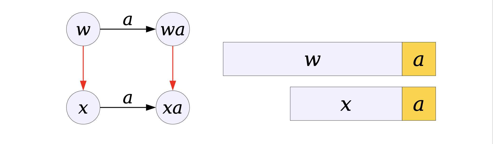

**Case 2**: $xa$ does not exist.

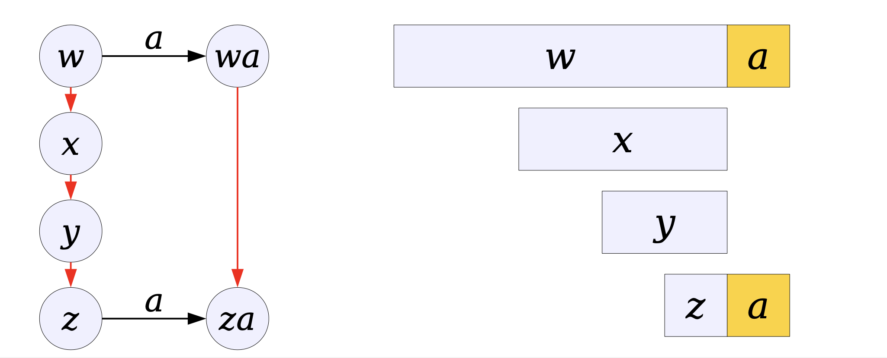


To construct the suffix link for a node *wa*:

- Follow *w*'s suffix link to node *x*.
- If node *xa* exists, *wa* has a suffix link to *xa*.
- Otherwise, follow *x*'s suffix link and repeat.
- If you need to follow backwards from the root, then *wa*'s suffix link points to the root.


**Observation 1:** **Suffix links** point from longer strings to shorter strings.

> NOTE:
>
> 一、沿着suffix link，公共后缀前缀的长度逐步缩短

**Observation 2:** If we precompute **suffix links** for nodes in ascending order of string length, all of the information needed for the above approach will be available at the time we need it.

> NOTE:
>
> 一、自底向上

### Example

省略

### Constructing Suffix Links

Do a **breadth-first search** of the **trie**, performing the following operations:

- If the node is the root, it has no **suffix link**.
- If the node is one hop away from the root, its **suffix link** points to the root. 
- Otherwise, the node corresponds to some string *wa*.
- Let *x* be the node pointed at by *w*'s suffix link. Then, do the following:
  - If the node *xa* exists, *wa*'s suffix link points to *xa*.
  - Otherwise, if *x* is the root node, *wa*'s suffix link points to the root.
  - Otherwise, set *x* to the node pointed at by *x*'s suffix link and repeat.


## Computing Output Links
