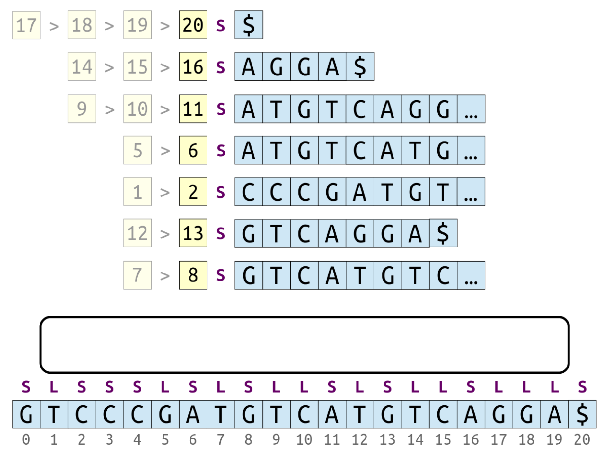
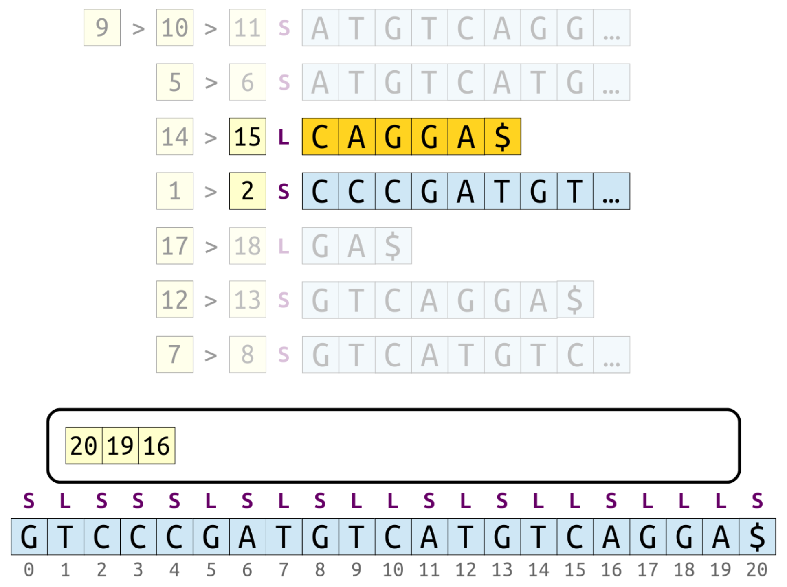

# cs166.1196 [Building Suffix Arrays](https://web.stanford.edu/class/archive/cs/cs166/cs166.1196/lectures/04/Small04.pdf) 

[Slides04](https://web.stanford.edu/class/archive/cs/cs166/cs166.1196/lectures/04/Slides04.pdf)

[Small04](https://web.stanford.edu/class/archive/cs/cs166/cs166.1196/lectures/04/Small04.pdf)

## Key Intuition(Page-3)

The efficiency in a suffix tree is largely due to 

1. keeping the suffixes in sorted order, and 
2. exposing branching words.

## New Stuff!(Page-8)

## Suffix tree = suffix array + LCP array(Page-10~16)

> NOTE:
>
> 一、原文的这一大段所讲述的是suffix tree和suffix array + LCP array的对应关系，结论在 Page11 中

> NOTE:
>
> 一、DFS Patricia tree
>
> 上图非常地揭示了suffix tree 和 suffix array+LCP array的对应关系，细致入微。

### Suffix tree和suffix array + LCP array的相互转换(Page11)

#### Page-12~16

原文这一大段是在结合具体的例子说明suffix tree = suffix array + LCP array。

## A Linear-Time Algorithm(Page-17)

> NOTE:
>
> 一、原文这一段所描述的是从 suffix array + LCP array 构建 suffix tree:
>
> suffix array->LCP array->Cartesian tree

- Construct the **LCP array** for the **suffix array**.
- Construct a **Cartesian tree** from that **LCP array**.
- Run a DFS over the **Cartesian tree**, adding in the suffixes in the order they appear whenever a node has a missing child.
- Fuse together any parent and child nodes with the same number in them.
- Assign labels to the edges based on the LCP values.
- Total time: O(m).

## Constructing Suffix Arrays(Page-18)

### The Timeline(Page-19~28)

原文这里按照时间顺序罗列了关于suffix tree、suffix array、LCP array的各种算法。

### Some Observations about Suffix Arrays(Page-29~42)

Observation: We can partition the suffix array into ***buckets***, where each bucket consists of all suffixes starting with the same first character

### S-type suffix(Page-43)

We'll call the suffix at position 4 an S-type suffix (S for smaller), since it lexicographically precedes the suffix at the position immediately after it.

### L-type suffix(Page-51)

### Base case: sentinel(Page-73)

By definition, the suffix starting at the sentinel is considered an **S-type suffix**. 

### S-type suffix、L-type suffix definition(Page-75~96)

We can tag each suffix as **S-type** or **L-type** in time O(m) by scanning Text from **right-to-left** and applying the above rules.

>  NOTE:
>
> 一、典型的recursive definition。

### Sort bucket by S-type、L-type

> NOTE:
>
> 一、
>
> inter-bucket sorting: 根据starting character即可
>
> inner-bucket sorting: 根据S-type、L-type可以大致排出相对位置

> NOTE:
>
> 一、在同一个bucket内，显然它们的starting character是相同的，那么大小就由后面的substring决定了，S-type、L-type所表示的就是starting character和它后面的character 之间的大小关系，显然:
>
> - 如果是L-type，那么显然后面的character比starting character要小，显然在bucket内部要排在前面
> - 如果是S-type，那么显然后面的character比starting character要大，显然在bucket内部要排在后面

#### Example1(Page-113)

#### Example2(Page-120)

## Where We Stand(Page-128)

1. We can efficiently classify each suffix as either S-type or L-type in time O(m).
2. We know a good amount about the relative positioning of the suffixes:
   1. All suffixes are bucketed by their first character.
   2. All L-type suffixes come before all S-type suffixes.
3. If we can get everything relatively positioned within its group, we’re done!

## SA-IS at a Glance(Page-129)

There are three core insights that collectively give us the SA-IS algorithm.

First: There is a proper subset of the suffixes that, if sorted, can be used to recover the order of all the remaining suffixes.

> NOTE:
>
> 一、从后面的内容可知: LMS suffixes

Second: Those suffixes can be broken apart into **blocks** of characters such that the order of the suffixes depends purely on the order of the **blocks**.

Third: With the proper preprocessing, those suffixes can be sorted via a recursive call on a smaller input string.

### First(Page-133)

#### LMS suffixes(Page-133)

These suffixes are called LMS suffixes (LeftMost S-type). A suffix is an LMS suffix if it’s S-type and the suffix before it is L-type.

#### Induced sorting(Page-134)

Key Theorem: If we can get the **LMS suffixes** - and just the **LMS suffixes** - in sorted order, then we can, in time O(m), get all the other suffixes in order as well.

The algorithm for doing this is called **induced sorting**. This is the "IS" in SA-IS.

> NOTE:
>
> 一、通过LMS，将原来的字符串切分位多段 ，然后使用  **induced sorting** ，将它们排序成前面提到的 bucket 的形式。

#### LMS suffixes induced sorting(Page-155)

> NOTE:
>
> 一、上面这段话中的list指的是左侧的、用`>`串联起来的部分，它们是有序的，显然这部分是可以通过K-way merge的方式进行排序的。需要注意的是: 为了便于理解后的example，首先引入 **当前列(current column)** 的概念，后面的操作始终是集中在 **当前列(current column)** ，它会同时显示 current column 的index、suffix label。
>
> 
>
> 

#### Induced sorting example(Page-158~208)

##### Page-161

##### Page-167

These other suffixes starting with A are S-type, but suffix 19 is L-type. Therefore, suffix 19 wins on tiebreaks.

##### Page-169~170

This needs to go with the other G suffixes. Suffix 18 is L-type and the others are S-type, so suffix 18 wins on tiebreaks.

##### Page-171~177

Suffix 15 needs to go with the other C suffixes. Again, it's L-type and the others are S-type, so suffix 15 winson tiebreaks.

##### Page-179~

###### Dynamic programming(Page-192)

#### Some Observations(Page-209)

- All the new suffixes we uncover are L-type.
- Whenever we uncover a new suffix:
  - that suffix comes before all S-type suffixes in the list with the same first character, and
  - that suffix comes after all L-type suffixes in the list with the same first character.
- Notice that we never make any string comparisons in the course of carrying out this multiway merge!
- If we can maintain these buckets efficiently, we could complete this merge in time O(m).

#### Maintain these buckets efficiently(Page-209)

> NOTE:
>
> 一、通过LMS来构建bucket boundary

Okay, this next part is pretty cool. Props to Ko and Aluru for figuring it out.

We can compute the bucket boundaries in time O(m) by just counting up how frequently each character appears in the string. If we store those boundaries in an array indexed by character, we can put each element in the right place in time O(1).

#### To Recap(Page-341)

-  Suppose that - somehow - we can sort the LMS suffixes.
-  We can then make three linear scans to sort all the suffixes:
  - one reverse pass over the sorted LMS suffixes, placing them at the ends of their buckets;
  - one forward pass over the suffix array, placing L-type suffixes at the fronts of their buckets; and
  - one reverse pass over the suffix array, placing S-type suffix at the ends of their buckets (making sure to reset
    the end positions of each bucket first.)
- This runs in time O(m) and has excellent locality of reference. It's incredibly fast in practice.

### Second(Page-347)