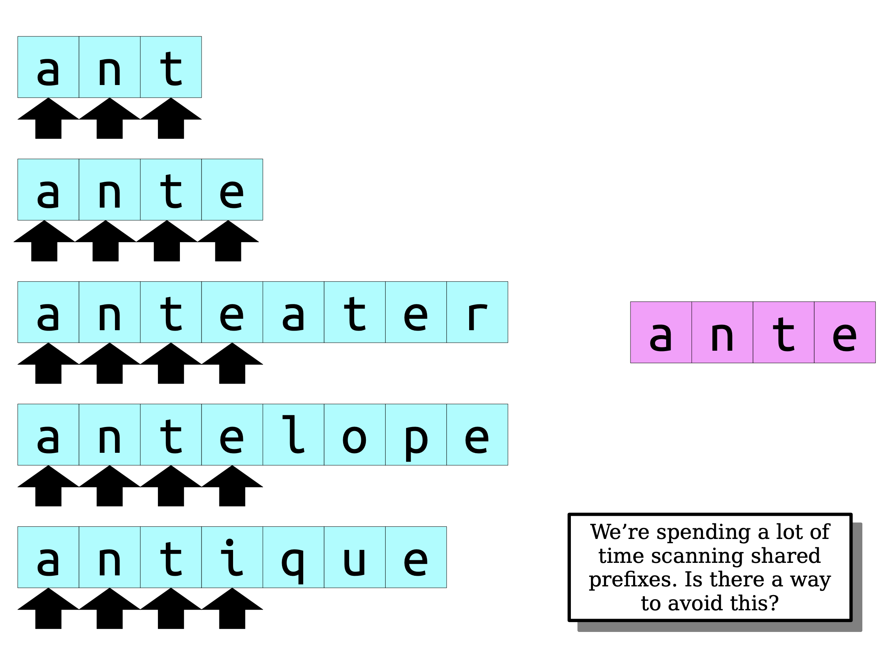
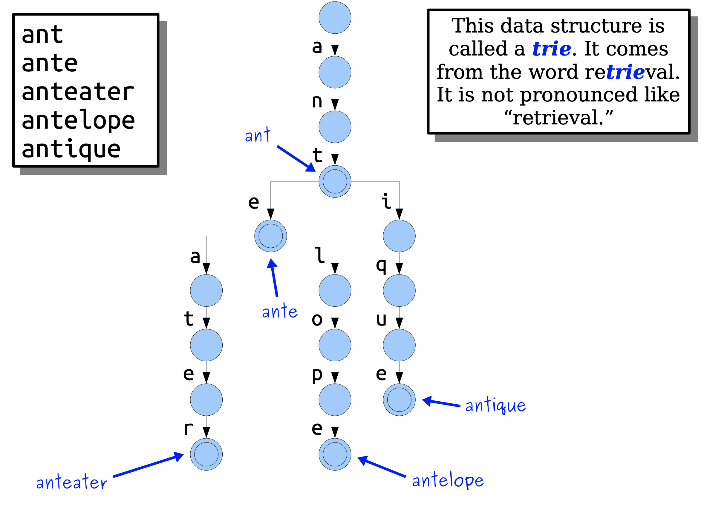
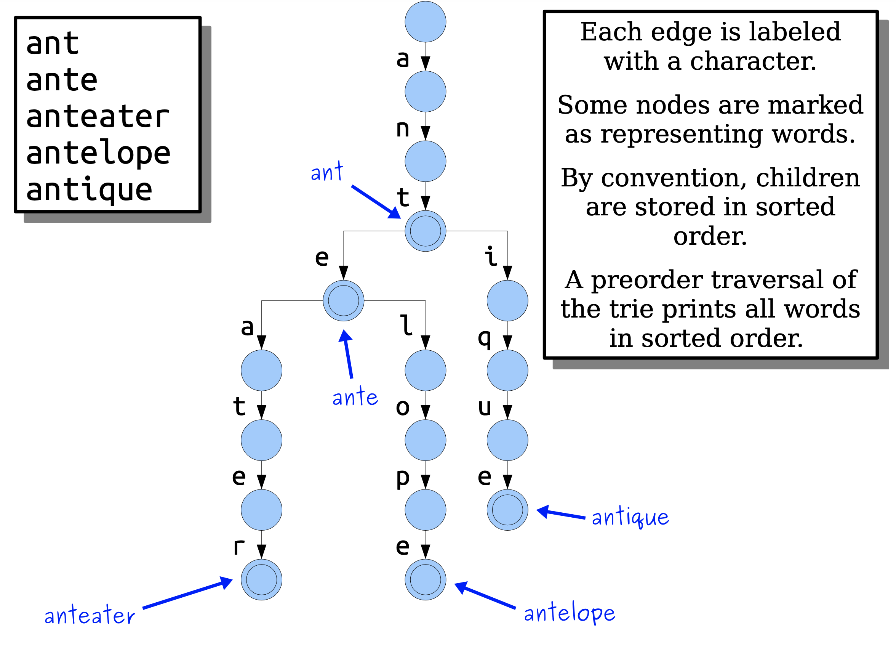
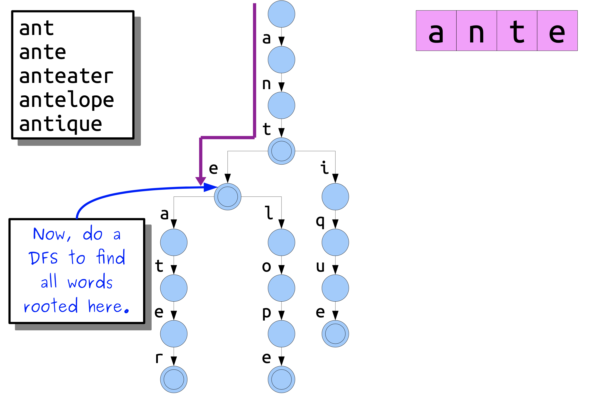
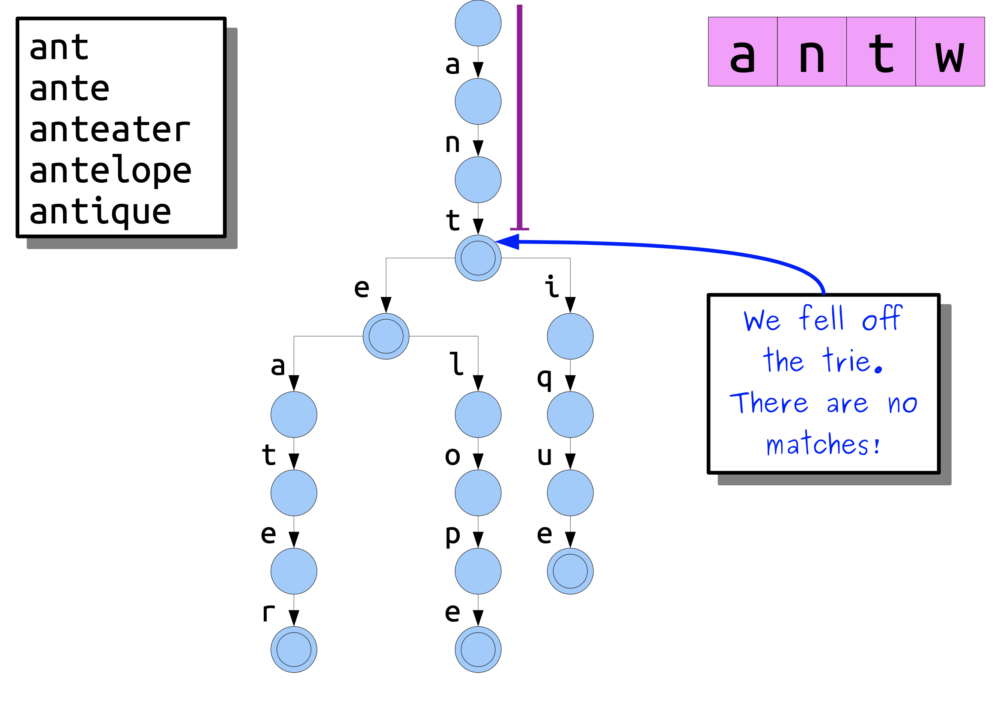

# [Tries and Suffix Trees](https://web.stanford.edu/class/cs166/lectures/04/Slides04.pdf) 

## String Data Structures

Our next topic for the quarter is the wonderful world of string data structures.

Why are they worth studying?

**They’re practical**. These data structures were developed to meet practical needs in data processing. Lots of important data can be encoded as strings.

**They’re different**. The questions typically asked about strings involve properties of sequences, not individual elements, in a way that you don’t normally otherwise see.

> NOTE:
>
> 一、翻译如下: "关于字符串的问题通常涉及序列的属性，而不是单个元素，以一种你通常不会看到的方式"

**They’re algorithmically interesting**. The techniques that power these data structures involve some truly beautiful connections and observations.

## Where We’re Going

Today, we’ll cover [**tries**](https://en.wikipedia.org/wiki/Trie) and **suffix trees**, two powerful data structures for exposing **shared structures** in strings.

> NOTE:
>
> 一、翻译如下: "今天，我们将介绍trie和suffix tree，这是两种用于在字符串中公开共享结构的强大数据结构。"
>
> 上面这段话中用到了 "**shared structures**" 这个词，显然 trie 和 suffix tree 能够在多个strings中描述它们的 "**shared structures**"

On Thursday, we’ll see the [**suffix array**](https://en.wikipedia.org/wiki/Suffix_array) and [**LCP array**](https://en.wikipedia.org/wiki/LCP_array), which are a more space- efficient way of encoding [suffix trees](https://en.wikipedia.org/wiki/Suffix_tree).

## Part I: **Tries and Patricia Tries**

### A Motivating Problem

We have a series of text strings $T_1, T_2, \dots, T_k$ of total length $m$. ($\norm{T_1} + \norm{T_2} + \dots + \norm{T_k} = m$)

We have a pattern string **P** of length **n**. ($\norm{p} = n$​).

**Goal:** Find all text strings that start with **P**.

If we just do a single query, then we can solve this pretty easily: Just scan over all the strings and see which ones start with **P**.

**Question:** If we have a set of fixed text strings and varying patterns, can we speed this up?

### A Naive Solution

We’re spending a lot of time scanning shared prefixes. Is there a way to avoid this?

### Trie

 

 

## Part II: **Suffix Trees**

### Two Motivating Problems

**Patricia tries** are great tools for finding **prefixes**. These problems involve looking for **substrings**. Can we use what we’ve developed so far?

### A Fundamental Theorem

The **fundamental theorem of stringology** says that, given two strings *w* and *x*, that

> w **is a substring of** x if and only if **w** **is a prefix of a suffix of** **x**