# [stanford-cs166.1166-Aho-Corasick Automata](https://web.stanford.edu/class/archive/cs/cs166/cs166.1166/lectures/02/Slides02.pdf)

> 这是我在阅读 [cp-algorithms-Aho-Corasick algorithm](https://cp-algorithms.com/string/aho_corasick.html) 的时候发现的。

其中关于string search的定义非常好。

## Use case

### use case 1

**Pattern Strings**

```
ab
about
at
ate
be
bed
edge
get
```


**Text**

```
abedgetab
```

### use case 2

**Pattern Strings**

```
a
aa
aaa
aaaa

```

**Text**

```
aaaaaaaa
```


### use case 3

```
at
art
oars
soar
```

这是非常好的一个例子

```
soat
oart
```


## 行文思路

从最简单的naive approach介绍如何实现string search，然后介绍Aho-Corasick Automata是如何做的。


## Naïve approach(Page-9)

> Let's start with a naïve approach.

```pseudocode
For each position in T:
     For each pattern string Pᵢ:
          Check if Pᵢ appears at that position
```

### Analyzing 

let *m* be the length of the text and *n* the total length of the pattern strings.

For each character of the text string *T*, in the worst case, we scan over all *n* total characters in the patterns.

Time complexity: $\mathcal{O}(mn)$.


## Parallel Searching(Page-60)

**Idea:** Rather than searching the pattern strings in *serial*, try searching them in *parallel*.

Intuitively, this should cut down on a lot of the unnecessary rescanning that we're doing.

> NOTE:
>
> 一、如何理解标题的 "parallel" 的含义？下面是chatGPT对 Aho-Corasick Automata 的解释中的一段，其中的"simultaneous matching of multiple patterns against an input text"就是 "parallel"
>
> > It allows for simultaneous matching of multiple patterns against an input text in linear time relative to the length of the input plus the number of matched entries.

### Trie

这一节以trie为例，非常好的展示了finite-state-based-automata-string-search-algorithm的思路: 将text输入到Aho-Corasick Automata，text的每个character都将导致transition。


### Analyzing our New Algorithm(Page-77)

Let's suppose we've already constructed the **trie**. How much work is required to perform the match? 

For each character of *T*, we inspect as most as many characters as exist in the deepest branch of the trie.

Time complexity: $\mathcal{O}(mL_{max})$ , where $L_{max}$ is the length of the longest pattern string. *(Do you see why?)*

> NOTE:
>
> 一、[trie](https://en.wikipedia.org/wiki/Trie) 又称为 prefix tree，显然前缀相同的patterns会位于同一个树枝上，这样的结构是有益于multiple string search的，因为对于前缀相同的多个patterns，长的pattern可以在短的pattern的基础上继续匹配，无需从头开始，显然这能够提高品牌效率，这就是上面所说的"parallel"。 

In the (reasonable) case where $L_{max}$ is much smaller than *n*, this is a huge win over before. If $L_{max}$ is “objectively” small, this is a pretty good runtime.


### Building a Trie(Page-78)

**Claim:** Given a set of strings *P*1, ..., *Pₖ* of total length *n*, it's possible to build a trie for those strings in time $\mathcal{O}(n)$.


## Our Strategies(Page-102)

Following our foray into [RMQ](https://en.wikipedia.org/wiki/Range_minimum_query), we'll say that a solution to multi-string matching runs in time $\langle p(m, n), q(m, n)\rangle$ if the preprocessing time is $p(m, n)$ and the matching time is $q(m, n)$.

> NOTE:
>
> 一、RMQ是 [Range minimum query](https://en.wikipedia.org/wiki/Range_minimum_query) 

We now have two approaches:

- No preprocessing: $\langle \mathcal{O}(1), \mathcal{O}(mn)\rangle$.
- Trie searching: $\langle \mathcal{O}(n), \mathcal{O}(mL_{max})\rangle$.

**Can we do better?**


## Suffix link example1(Page-103~121)

patterns: 

```
at
art
oars
soar
```

text:

```
soars
```


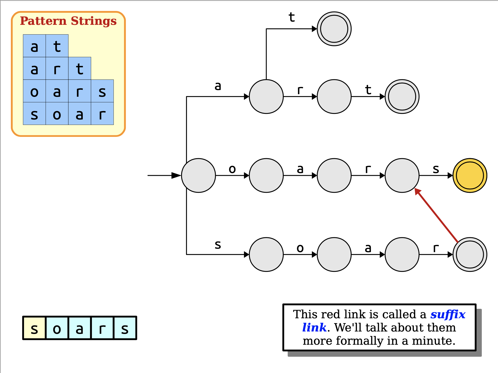


## Suffix link example2(Page-122~132)

patterns: 

```
at
art
oars
soar
```

text:

```
oart
```


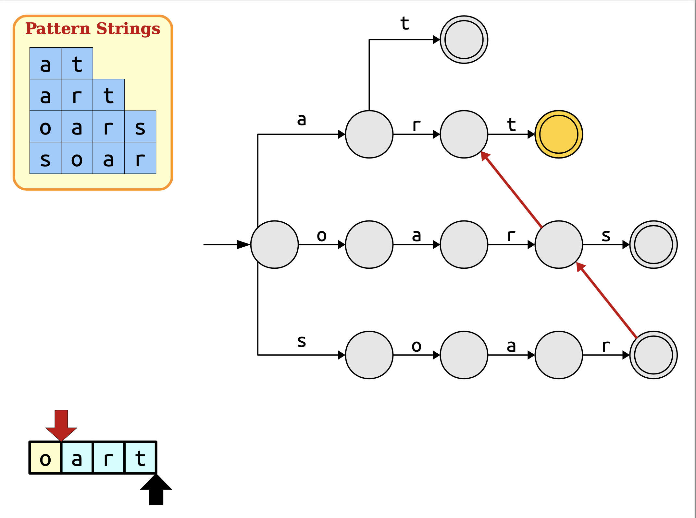

## Suffix link example3(Page-134~147)

patterns: 

```
at
art
oars
soar
```

text:

```
soat
```


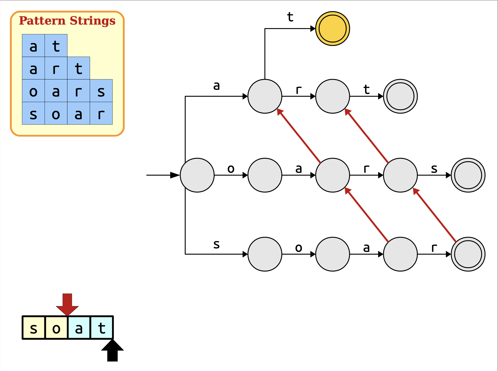

## Suffix link example4(Page-149~171)

patterns: 

```
at
art
oars
soar
```

text:

```
soarsoars
```


In general, suffix links might jump the red cursor forward more than one step. The number of steps taken is equal to the change of depth in the trie.


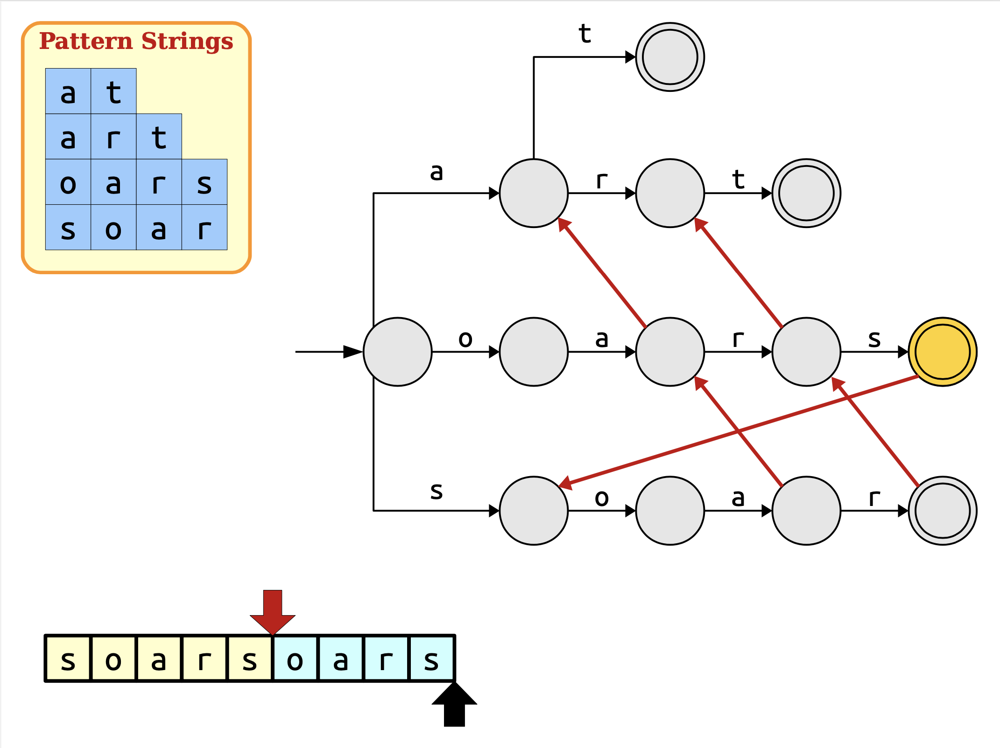

## Suffix link example5(Page-172~189)

patterns: 

```
at
art
oars
soar
```

text:

```
sotat
```


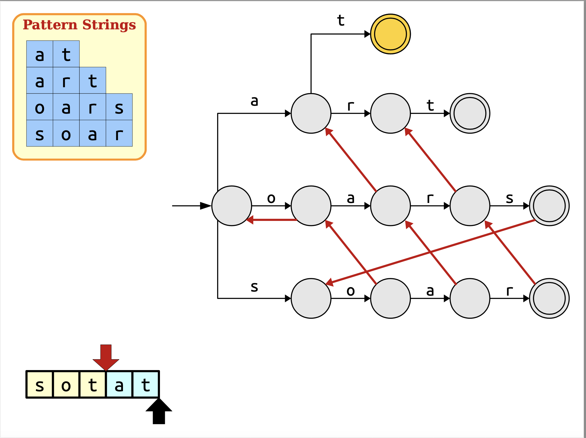


## A Problem with our Optimization(Page-192)

> NOTE:
>
> 一、这一节是为了引出output link

patterns: 

```
i
in
tin
sting
```

text:

```
sting
```


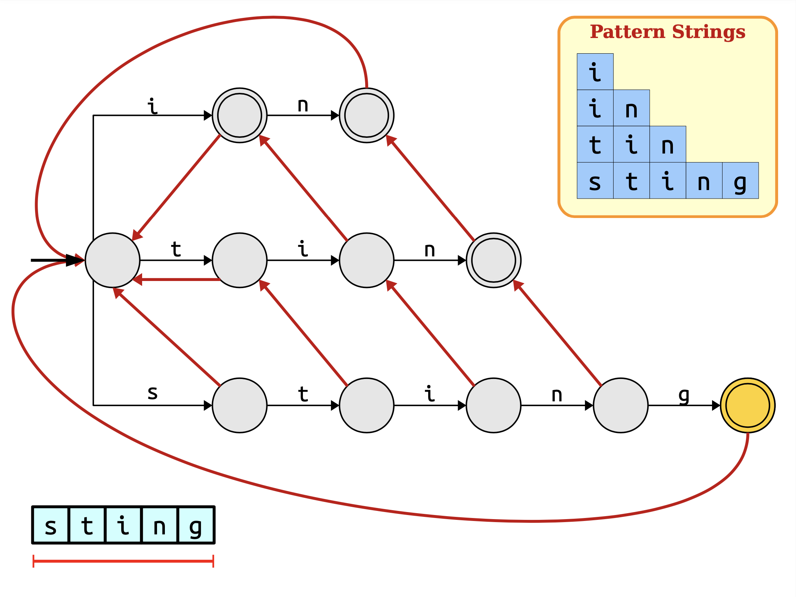

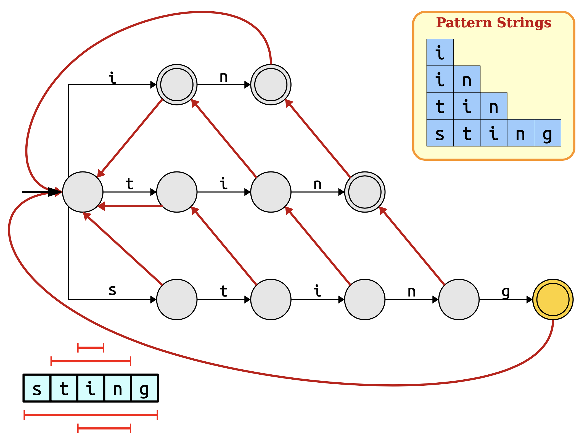

### What Happened?(Page-206)

Our heavily optimized string searcher no longer starts searching from each position in the string. As a result, we now might forget to output matches in certain cases. We need to figure out

- when this happens, and
- how to correct for it.

> NOTE:
>
> 一、由于每个node有多条out edge，所以需要尝试所有的path才能够找出所有的match，但是这种方式存在的问题是低效，这在后面的"The Problem"章节中进行了说明


### How do we address this?(Page-209)

> NOTE:
>
> 一、原文这里只给出了一堆的图，并没有配上文字说明，所以它的具体的解决方式我也不能够百分之百地确定，但是根据graph的知识和"The Problem"章节的内容可知，它应该就是采用的BFS、DFS

### The Problem

The approach described previously will ensure that we don't miss any patterns, but it increases the complexity of the search. Specifically, we do $\mathcal{O}(L_{max})$ additional work at each character following suffix links backwards. This brings our search cost back up to $\mathcal{O}(L_{max})$ again – and that's too slow. **Can we do better?**

> NOTE:
>
> 一、承上启下，引出output link


## Output link(Page-240)


### Output link example1(Page-243)

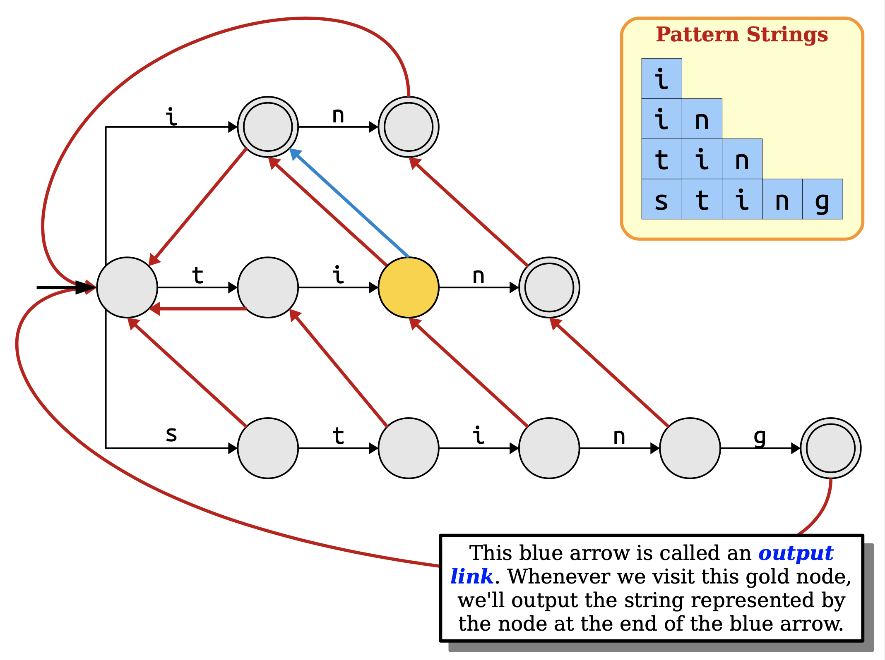

### Output link example2(Page-246)


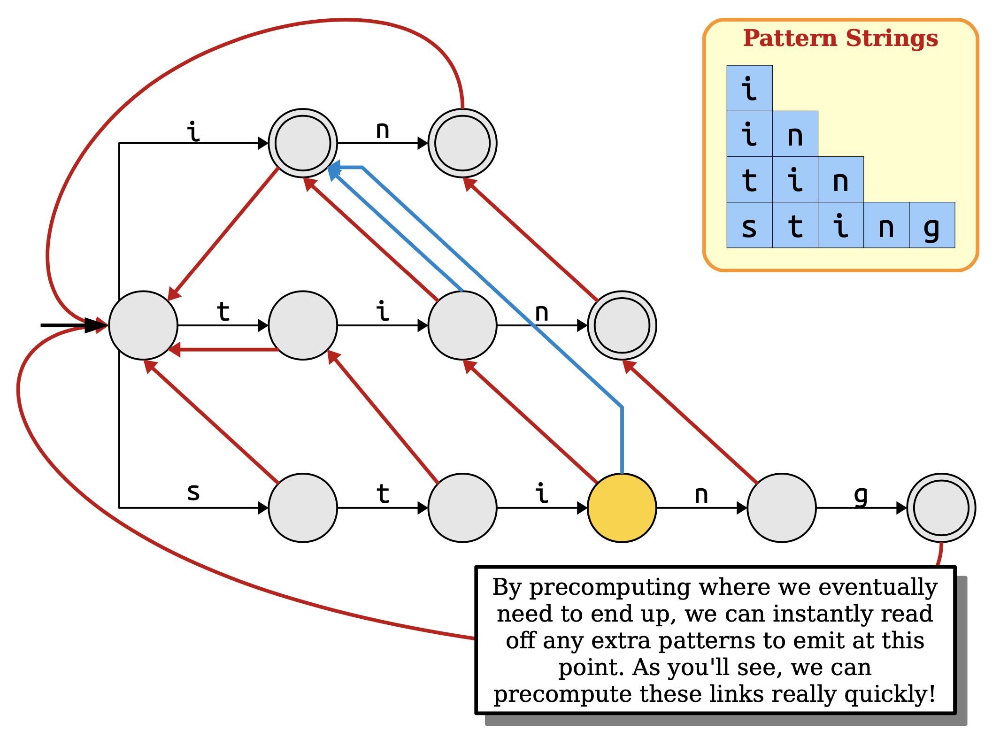

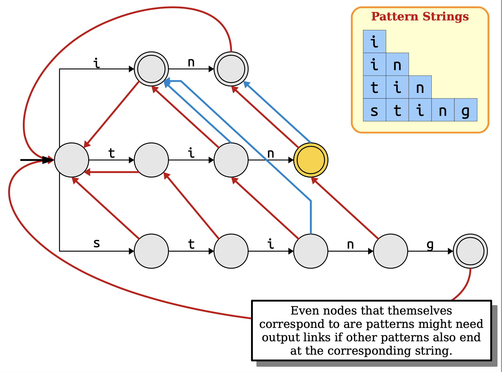

Even nodes that themselves correspond to are patterns might need output links if other patterns also end at the corresponding string.

> NOTE:
>
> 一、上面这段话的意思是: 即使node是terminal node，它也可以有output link

### Output link example2(Page-252)

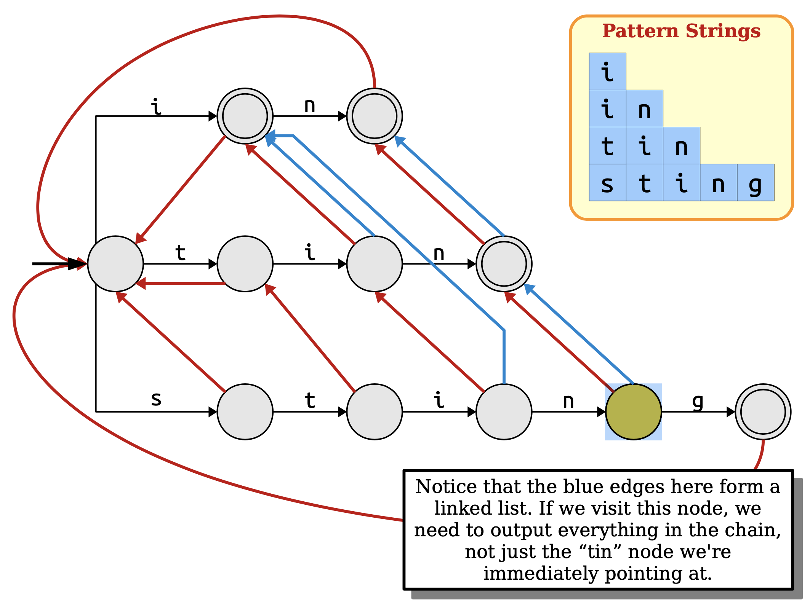

Notice that the blue edges here form a linked list. If we visit this node, we need to output everything in the chain, not just the “tin” node we're immediately pointing at.


## The Final Matching Algorithm(Page-270)

```pseudocode
Start at the root node in the trie.
For each character c in the string:
    While there is no edge labeled c:
        If you're at the root, break out of this loop.
        Otherwise, follow a suffix link.
    If there is an edge labeled c, follow it.
    If the current node corresponds to a pattern, output that pattern.
    Output all words in the chain of output links originating at this node.
```


## The Runtime Impact(Page-271)

> NOTE:
>
> 一、本节给出了一个非常极端的例子来说明 AC automaton的runtime受**output**个数的影响，即它是 [Output-sensitive algorithm](https://en.wikipedia.org/wiki/Output-sensitive_algorithm) 

patterns: 

```
a
aa
aaa
aaaa
```

text:

```
aaaaaaaa
```


## The Runtime(Page-303)

In the worst case, we may have to spend a *huge* amount of time listing off all the matches in the string. This isn't the fault of the algorithm – *any* algorithm that matches strings this way would have to spend the time reporting matches. To account for this, let **z** denote the number of matches reported by our algorithm. The runtime of the match phase is then $\mathcal{O}(m + z)$, with the *m* term coming from the string scanning and the *z* term coming from the matches.

You sometimes hear algorithms whose runtime depends on how much output is generated referred to as [**output-sensitive algorithms**](https://en.wikipedia.org/wiki/Output-sensitive_algorithm).


## Where We Are(Page-304)

Given the matching automaton (which is called an **Aho-Corasick automaton** or an **AC automaton**), we can find all occurrences of the pattern strings in any text of length *m* in time $\mathcal{O}(m + z)$.

To see whether this is worthwhile, we need to see how quickly we can build the automaton.


## Building the Aho-Corasick Automaton(Page-311)

To construct the Aho-Corasick automaton, we need to

- construct the trie,
- construct suffix links, and
- construct output links.

We know we can build the trie in time $\mathcal{O}(n)$ using our logic from before.

How quickly can we construct suffix and output links?


## Constructing Suffix Links(Page-312)


### An Initial Algorithm(Page-327)

Here is a simple, brute-force approach for computing suffix links:

```pseudocode
For each node in the trie
    Let α be the string that this particular node corresponds to.
    For each proper suffix ω of α:
        Look up ω in the trie.
        If the search ends up at some trie node, point the suffix link there and stop.
```

This approach is not very efficient – that doubly- nested loop is exactly the sort of thing we're trying to avoid.

**Can we do better?**


### Fast Suffix Link Construction(Page-331)

**Key insight**: Suppose we know the **suffix link** for a node labeled *w*. After following a trie edge labeled *a*, there are two possibilities.

**Case 1**: $xa$ exists.

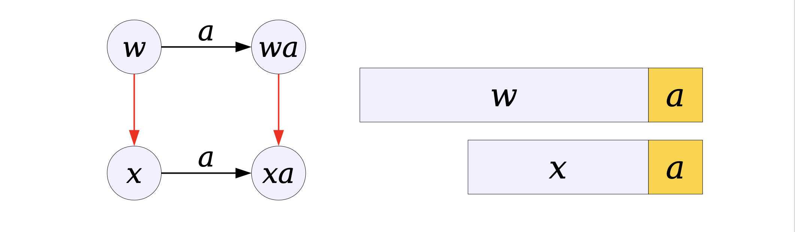

**Case 2**: $xa$ does not exist.

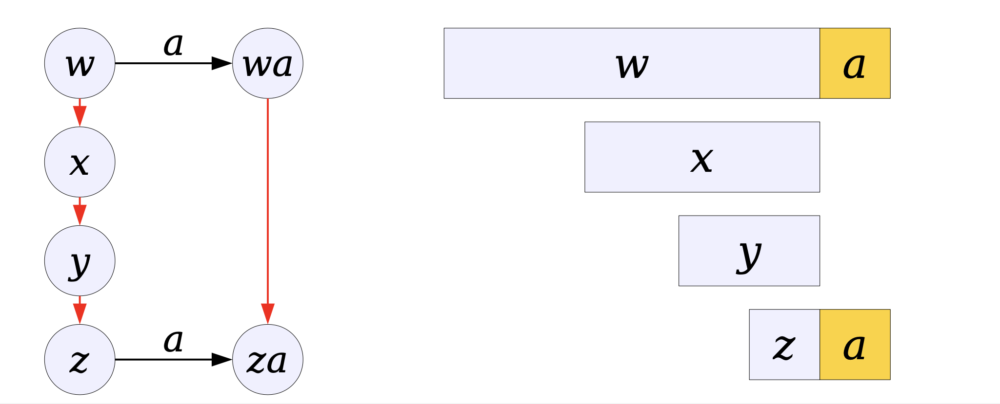
