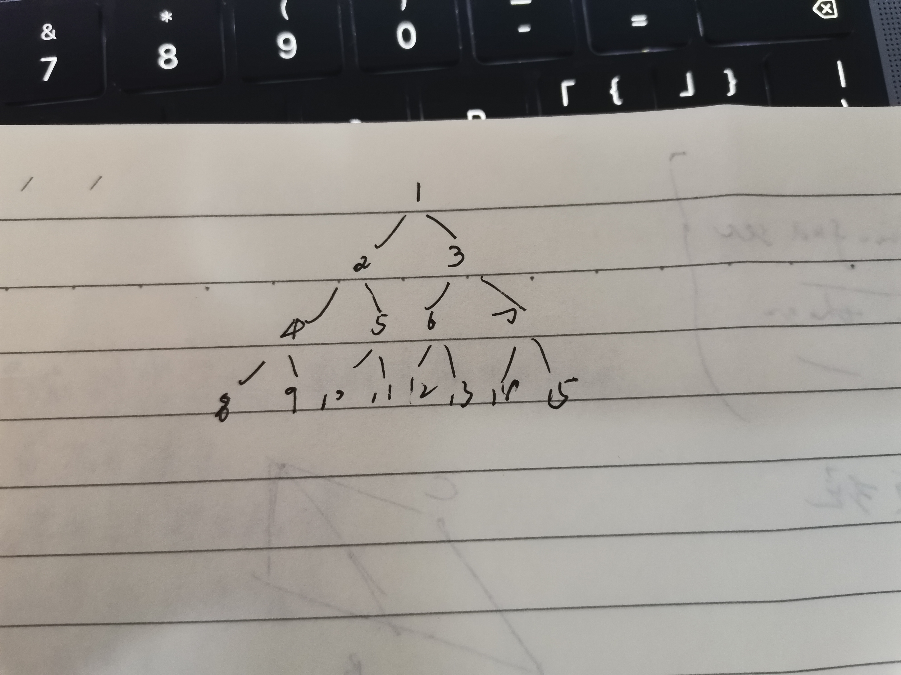

# Binary heap

一、binary heap是基于数学的data structure，binary heap通过数学关系保存parent、children关系，swim的时候，使用的parent关系，sink的时候，使用的children关系；

二、通过 binary heap 的实现原理来理解max heap、min heap 和 comparator 之间的关系

在 labuladong [图文详解二叉堆，实现优先级队列](https://mp.weixin.qq.com/s/o7tdyLiYm668dpUWd-x7Lg) 中，对 binary heap 的实现原理进行了非常好的介绍。

binary heap 所强调的是 parent node 和 children node之间的关系，所以它的comparator是基于 parent node 和 children node 的；

binary heap 的原理是: 

1、在insert的时候，首先将元素插入到末尾，然后swim(上浮)；显然，对于max heap，我们总是需要将max放到堆顶，当 `less(parent, children)` 的时候，就将元素换到parent的位置，从而实现swim(上浮)；

stop condition: root node

2、在delete的时候，首先将末尾元素换到头，然后sink；

stop condition: leaf node

总的来说，

1、对于max heap，无论是swim(上浮)还是sink(下沉)，都是当`less(parent, children)`的时候；

2、对于min heap，无论是swim(上浮)还是sink(下沉)，都是当`great(parent, children)`的时候；

三、

level order

[transitive relation](https://en.wikipedia.org/wiki/Transitive_relation)

四、在数组中的存储方式

geeksforgeeks [Building Heap from Array](https://www.geeksforgeeks.org/building-heap-from-array/) 

> *Also, the array representation of the complete binary tree contains the level order traversal of the tree.*

按照level的方式，自左到右、自上而下顺序存储于array中。

五、

*heapify-up*:  

*heapify-down*: 简称 *heapify* 

六、[Floyd](https://en.wikipedia.org/wiki/Robert_W._Floyd)'s build heap method 充分运用了heap在array中的存储方式来设计算法，geeksforgeeks [Building Heap from Array](https://www.geeksforgeeks.org/building-heap-from-array/) 

> *Also, the array representation of the complete binary tree contains the level order traversal of the tree.*

按照level的方式，自左到右、自上而下顺序存储于array中。[Floyd](https://en.wikipedia.org/wiki/Robert_W._Floyd)'s method  其实就是reverse-BFS，由于知道last node，因此last non-leaf node(last node 的parent node)也是知道的，知道了last non-leaf node，就知道了所有的internal node，从last non-leaf node开始，以reverse-BFS的方式逐个处理所有的internal node。

## wikipedia [Binary heap](https://en.wikipedia.org/wiki/Binary_heap)

A **binary heap** is a [heap](https://en.wikipedia.org/wiki/Heap_(data_structure)) [data structure](https://en.wikipedia.org/wiki/Data_structure) that takes the form of a [binary tree](https://en.wikipedia.org/wiki/Binary_tree). Binary heaps are a common way of implementing [priority queues](https://en.wikipedia.org/wiki/Priority_queue).[[1\]](https://en.wikipedia.org/wiki/Binary_heap#cite_note-clrs-1): 162–163  The binary heap was introduced by [J. W. J. Williams](https://en.wikipedia.org/wiki/J._W._J._Williams) in 1964, as a data structure for [heapsort](https://en.wikipedia.org/wiki/Heapsort).

A binary heap is defined as a binary tree with two additional constraints:[[3\]](https://en.wikipedia.org/wiki/Binary_heap#cite_note-3)

1、**Shape property**: a binary heap is a *[complete binary tree](https://en.wikipedia.org/wiki/Complete_binary_tree)*; that is, all levels of the tree, except possibly the last one (deepest) are fully filled, and, if the last level of the tree is not complete, the nodes of that level are filled from left to right.

2、**Heap property**: the key stored in each node is either greater than or equal to (≥) or less than or equal to (≤) the keys in the node's children, according to some [total order](https://en.wikipedia.org/wiki/Total_order).


Heaps：

1、where the parent key is greater than or equal to (≥) the child keys are called *max-heaps*; 

2、where it is less than or equal to (≤) are called *min-heaps*. 

Efficient ([logarithmic time](https://en.wikipedia.org/wiki/Logarithmic_time)) algorithms are known for the two operations needed to implement a priority queue on a binary heap: inserting an element, and removing the smallest or largest element from a min-heap or max-heap, respectively. 

Binary heaps are also commonly employed in the [heapsort](https://en.wikipedia.org/wiki/Heapsort) [sorting algorithm](https://en.wikipedia.org/wiki/Sorting_algorithm), which is an in-place algorithm because binary heaps can be implemented as an [implicit data structure](https://en.wikipedia.org/wiki/Implicit_data_structure), storing keys in an array and using their relative positions within that array to represent child–parent relationships.


### Heap operations

Both the insert and remove operations modify the heap to conform to the **shape property** first, by adding or removing from the end of the heap. Then the **heap property** is restored by traversing up or down the heap. Both operations take O(log *n*) time.

> NOTE:
>
> 一、这段话总结得非常好，它其实给出了编码实现的一个重要的思路
>
> 二、它的complexity是由树高所决定的


#### Insert

To add an element to a heap, we can perform this algorithm:

1、Add the element to the bottom level of the heap at the leftmost open space.

2、Compare the added element with its parent; if they are in the correct order, stop.

3、If not, swap the element with its parent and return to the previous step.

Steps 2 and 3, which restore the heap property by comparing and possibly swapping a node with its parent, are called *the up-heap* operation (also known as *bubble-up*, *percolate-up*, *sift-up*, *trickle-up*, *swim-up*, *heapify-up*, or *cascade-up*).

> NOTE:
>
> 一、当**新node**和它的**parent node**不符合 **Heap property** 的时候，需要将换它和它的parent node的位置，把它换上去，然后去比较它和它的parent node的parent node是否符合 **Heap property** ，如果不符合的话，需要将它的 grand parent node给换下来，可以看到，这个过程一直是up的，那是否需要考虑: 换下来的grand parent node 和 它下面的node是否符合  **Heap property** 呢？答案是不需要: 因为grand parent node和 parent node是符合  **Heap property** 的，使用 grand parent node替换 parent node是肯定能够维持 **Heap property**的；
>
> 上爬的过程只和parent进行比较，并且从上换下来的node值是更优值，显然是天然符合 **Heap property** 的。
>
> 它符合"append to tail"模式。
>
> 下面给出了它的pseudocode:

```pseudocode
Max-Heapify-Up(A, i):
    parent ← 2/i
    
    if parent >=1 and A[i] > A[parent] then: // 从下标1开始
        swap A[i] and A[parent]
        Max-Heapify-Up(A, parent)  
```


#### Extract

The procedure for deleting the root from the heap (effectively extracting the ***maximum*** element in a **max-heap** or the ***minimum*** element in a **min-heap**) while retaining the heap property is as follows:

1、Replace the root of the heap with the last element on the last level.

2、Compare the new root with its children; if they are in the correct order, stop.

3、If not, swap the element with one of its children and return to the previous step. (Swap with its smaller child in a min-heap and its larger child in a max-heap.)

Steps 2 and 3, which restore the heap property by comparing and possibly swapping a node with one of its children, are called the *down-heap* (also known as *bubble-down*, *percolate-down*, *sift-down*, *sink-down*, *trickle down*, *heapify-down*, *cascade-down*, *extract-min* or *extract-max*, or simply *heapify*) operation.

> NOTE:
>
> 一、显然去除了之前的root，就需要从它的两个children中选择一个来接替它，显然这个过程是需要从上到下一直进行的，上述算法比较巧妙: 它先随便拿一个node来做新root，然后执行替换过程，这相当于probe。
>
> 下面的两个 *heapify* 是最最基础的操作

```pseudocode
// Perform a down-heap or heapify-down operation for a max-heap
// A: an array representing the heap, indexed starting at 1
// i: the index to start at when heapifying down
Max-Heapify(A, i):
    left ← 2×i
    right ← 2×i + 1
    largest ← i
    
    if left ≤ length(A) and A[left] > A[largest] then:
        largest ← left

    if right ≤ length(A) and A[right] > A[largest] then:
        largest ← right
    
    if largest ≠ i then:
        swap A[i] and A[largest]
        Max-Heapify(A, largest)
      
```


#### Insert then extract

Inserting an element then extracting from the heap can be done more efficiently than simply calling the insert and extract functions defined above, which would involve both an `upheap` and `downheap` operation. Instead, we can do just a `downheap` operation, as follows:


#### Search

Finding an arbitrary element takes O(n) time.

#### Delete

TODO

#### Decrease or increase key

TODO

### Building a heap

#### Williams' method

Building a heap from an array of *n* input elements can be done by starting with an empty heap, then successively **inserting** each element. This approach, called Williams' method after the inventor of binary heaps, is easily seen to run in *O*(*n* log *n*) time: it performs *n* insertions at *O*(log *n*) cost each.

#### [Floyd](https://en.wikipedia.org/wiki/Robert_W._Floyd)'s method

Williams' method is suboptimal. A faster method (due to [Floyd](https://en.wikipedia.org/wiki/Robert_W._Floyd)[[8\]](https://en.wikipedia.org/wiki/Binary_heap#cite_note-heapbuildjalg-8)) starts by arbitrarily putting the elements on a **binary tree**, respecting the **shape property** (the tree could be represented by an array, see below). Then starting from the **lowest level** and moving upwards, sift(落下、下坠) the root of each subtree downward as in the deletion algorithm until the **heap property** is restored. More specifically if all the subtrees starting at some height $h$ have already been "heapified" (the bottommost level corresponding to $h=0$), the trees at height $h+1$ can be heapified by sending their root down along the path of maximum valued children when building a **max-heap**, or minimum valued children when building a **min-heap**. This process takes $O(h)$ operations (swaps) per node. 

> NOTE:
>
> 一、上面描述的过程在下面文章中有着很好的说明:
>
> 1、https://courses.cs.washington.edu/courses/cse373/18wi/files/slides/lecture-14-6up.pdf 
>
> 2、geeksforgeeks [Building Heap from Array](https://www.geeksforgeeks.org/building-heap-from-array/) 
>
> 概括来说先upwards然后downward:
>
> 1、reverse level order
>
> 2、heapify(sink)


### Heap implementation

Heaps are commonly implemented with an [array](https://en.wikipedia.org/wiki/Array_data_structure). Any binary tree can be stored in an array, but because a binary heap is always a **complete binary tree**, it can be stored compactly. No space is required for [pointers](https://en.wikipedia.org/wiki/Pointer_(computer_programming)); instead, the parent and children of each node can be found by arithmetic on array indices. These properties make this heap implementation a simple example of an [implicit data structure](https://en.wikipedia.org/wiki/Implicit_data_structure) or [Ahnentafel](https://en.wikipedia.org/wiki/Ahnentafel) list. 


> NOTE:
>
> binary heap的"Shape property"决定它是完全二叉树-> $2^n$ ，从下面的例子可以看出它们具有非常好的数学对应关系。
>
> 一、binary heap在array中的存储方式: 从上到下，从左到右 逐个存放: 
>
> 
>
> 
>
> 这是方式有如下优势: 
>
> 1、通过简单的运算就能够得到parent node、children node、能够非常容易计算出level、leaf等，参见 geeksforgeeks [Building Heap from Array](https://www.geeksforgeeks.org/building-heap-from-array/) ，这些都为heap的各种algorithm提供了非常便捷的操作，这简单而强大正是计算机科学所追求的
>
> 2、compact
>
> 二、heap的complexity也是由它的"Shape property"而决定的
>
> 三、heap的"shape property"保证了heap是"balanced"


Details depend on the root position, which in turn may depend on constraints of a [programming language](https://en.wikipedia.org/wiki/Programming_language) used for implementation, or programmer preference. Specifically, sometimes the root is placed at index 1, in order to simplify arithmetic.


### Derivation of index equations


## Code

### Java

labuladong [图文详解二叉堆，实现优先级队列](https://mp.weixin.qq.com/s/o7tdyLiYm668dpUWd-x7Lg)

其中对heap的实现，进行了非常好的描述，完整的Java代码如下:

```Java
public class MaxPQ < Key extends Comparable < Key >> {
    // 存储元素的数组
    private Key[] pq;
    // 当前priority queue中的元素个数
    private int N = 0;
    public MaxPQ(int cap) {
        pq = (Key[]) new Comparable[cap + 1];
    }
    /**
     * 返回当前队列中的最大元素
     */
    public Key max() {
        return pq[1];
    }
    /**
     * 插入元素e
     */
    public void insert(Key e) {
        N++;
        // 先把新元素加到最后
        pq[N] = e;
        // 然后让它上浮到正确的位置
        swim(N);
    }
    /**
     * 删除并返回当前队列中的最大元素
     */
    public Key delMax() {
        // 最大堆的堆顶就是最大元素
        Key max = pq[1];
        // 把这个最大元素换到最后，删除之
        exch(1, N);
        pq[N] = null;
        N--;
        // 让 pq[1] 下沉到正确位置
        sink(1);
        return max;
    }
    /**
     * 上浮第k个元素，以维护最大堆性质
     */
    private void swim(int k) {
        // 如果浮到栈顶，就不能再上浮了
        while (k > 1 && less(parent(k), k)) {
            // 如果第k个元素比上层大
            // 将k换上去
            exch(parent(k), k);
            k = parent(k); // 迭代
        }
    }
    /**
     * 下沉第k个元素，以维护最大堆性质
     */
    private void sink(int k) {
        // 如果沉到堆底，就沉不下去了
        while (left(k) <= N) {
            // 先假设左边的节点较大
            int older = left(k);
            // 如果右边的节点存在，比一下大小
            if (right(k) <= N && less(older, right(k)))
                older = right(k);
            // 节点 k 比俩孩子都大，就不必下沉了
            if (less(older, k)) break;
            // 否则，不符合最大堆的结构，下沉 k 节点
            exch(k, older);
            k = older; // 迭代
        }
    }
    /**
     * 交换数组中的两个元素
     */
    private void exch(int i, int j) {
        Key temp = pq[i];
        pq[i] = pq[j];
        pq[j] = temp;
    }
    /**
     * pq[i] 是否比 pq[j] 小
     */
    private boolean less(int i, int j) {
        return pq[i].compareTo(pq[j]) < 0;
    }
    // 父节点的索引
    private int parent(int root) {
        return root / 2;
    }
    // 左孩子的索引
    private int left(int root) {
        return root * 2;
    }
    // 右孩子的索引
    private int right(int root) {
        return root * 2 + 1;
    }
};

```


### C++


```C++
#include <vector>
#include <iostream>

using namespace std;

class BinaryHeap {
public:
    /**
     * 对以idx为root的sub tree执行sink
     * @param arr
     * @param root
     * @param n arr中用于build heap的元素的个数，即对 arr[0] ~ arr[n-1]中的元素构建heap
     */
    static void heapifyRecursively(std::vector<int> &arr, int root, int n) {
        int left = root * 2 + 1;
        int right = root * 2 + 2;
        int largest = root;
        if (left < n && arr[left] > arr[largest]) {
            largest = left;
        }
        if (right < n && arr[right] > arr[largest]) {
            largest = right;
        }
        if (largest != root) {
            std::swap(arr[largest], arr[root]);
            heapifyRecursively(arr, largest, n);
        }
    }

    /**
     * 上述heapifyRecursively涉及尾递归，所以可以使用迭代进行消除: 
     * 1、上述递归的iterator是root，所以需要将root作为iterator
     * 2、上述递归的stop condition是root的子树都满足heap property，所以下面的while也是如此
     * @param arr
     * @param root
     * @param n
     */
    static void heapifyIteratively(std::vector<int> &arr, int root, int n) {
        while (true) {
            int largest = root;
            int left = root * 2 + 1;
            int right = root * 2 + 2;
            if (left < n && arr[left] > arr[largest]) {
                largest = left;
            }
            if (right < n && arr[right] > arr[largest]) {
                largest = right;
            }
            if (largest != root) {
                std::swap(arr[largest], arr[root]);
                root = largest;
            } else {
                break;
            }
        }
    }

    static void heapifyUp(std::vector<int> &arr) {

    }

    /**
     *
     * @param arr 从index=0开始存放元素
     * left  child: 2*i+1
     * right child: 2*i+2
     *      parent: (i-1)/2
     * @param n arr中用于build heap的元素的个数，即对 arr[0] ~ arr[n-1]中的元素构建heap
     */
    static void buildHeapByFloydMethod(std::vector<int> &arr, int n) {
        int lastNoneLeafNodeIdx = (n - 2) / 2;
        for (int i = lastNoneLeafNodeIdx; i >= 0; --i) {
            heapifyRecursively(arr, i, n);
        }
    }

    static void printHeap(std::vector<int> &arr, int n) {
        for (int i = 0; i < n; ++i) {
            std::cout << arr[i] << ",";
        }
        std::cout << std::endl;
    }
};

int main() {
    std::vector<int> arr{1, 2, 3, 4, 5, 6, 7};
    BinaryHeap::buildHeapByFloydMethod(arr, arr.size());
    BinaryHeap::printHeap(arr, arr.size());

    arr = {6, 10, 1, 3, 7, 1, 1, 8, 100};
    BinaryHeap::buildHeapByFloydMethod(arr, arr.size());
    BinaryHeap::printHeap(arr, arr.size());
}
// g++ test.cpp --std=c++11 -pedantic -Wall -Wextra

```

