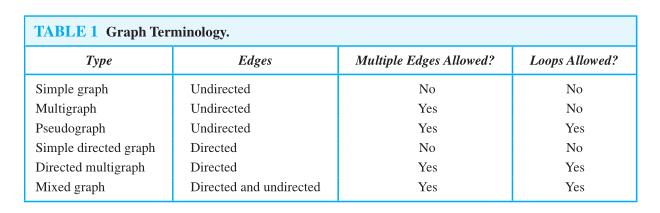

# [Graph (discrete mathematics)](https://en.wikipedia.org/wiki/Graph_(discrete_mathematics)) and [Graph theory](https://en.wikipedia.org/wiki/Graph_theory)

## graph terminology

### undirected graph

First, we give some terminology that describes the vertices and edges of **undirected graphs**.

#### DEFINITION

> Two vertices `u` and `v` in an undirected graph `G` are called *adjacent* (or *neighbors*) in `G` if `u` and `v` are endpoints of an edge `e` of `G`. Such an edge `e` is called *incident* with the vertices `u` and `v` and `e` is said to *connect* `u` and `v`.

#### DEFINITION

> The set of all **neighbors** of a vertex `v` of `G = (V,E)`, denoted by `N(v)`, is called the *neighborhood* of `v`. If `A` is a subset of `V`, we denote by `N(A)` the set of all vertices in `G` that are adjacent to at least one vertex in `A`. So, `N(A) =U v∈A N(v)`.

> NOTE: 上诉定义其实定义的是一个点的*neighborhood*和一个点集的*neighborhood*。

#### DEFINITION

> The degree of a vertex in an undirected graph is the number of edges incident with it, except that a loop at a vertex contributes twice to the degree of that vertex. The degree of the vertex `v` is denoted by `deg(v)`.

#### THE HANDSHAKING THEOREM

> Let `G = (V,E)` be an undirected graph with `m` edges. Then
> $$
> 2m = \sum_{v \in V} deg(v)
> $$
> (Note that this applies even if multiple edges and loops are present.)

#### THEOREM

> An undirected graph has an even number of vertices of odd degree.

> NOTE: 翻译成中文是：一个无向图有偶数个奇数度的点。

### directed graph

Terminology for graphs with directed edges reflects the fact that edges in directed graphs have directions.

#### DEFINITION

> When `(u,v)` is an edge of the graph `G` with directed edges, `u` is said to be *adjacent to* `v` and `v` is said to be *adjacent from* `u`. The vertex `u` is called the *initial vertex* of `(u,v)`, and `v` is called the *terminal* or *end* vertex of `(u,v)`. The initial vertex and terminal vertex of a loop are the same.

#### DEFINITION

> In a graph with directed edges the *in-degree of a vertex v*, denoted by `deg − (v)`, is the number
> of edges with `v` as their terminal vertex. The *out-degree of v*, denoted by `deg + (v)`, is the number of edges with `v` as their initial vertex. (Note that a loop at a vertex contributes 1 to both the **in-degree** and the **out-degree** of this vertex.)

#### THEOREM

> Let `G = (V,E)` be a graph with directed edges. Then
> $$
> \sum_{v \in V} deg^-(v) = \sum_{v \in V} deg^+(v)=|E|
> $$

There are many properties of a graph with directed edges that do not depend on the direction of its edges.Consequently, it is often useful to ignore these directions. The undirected graph that results from ignoring directions of edges is called the *underlying undirected graph*. A graph with directed edges and its underlying undirected graph have the same number of edges.

> NOTE: 这些属于在后文中会大量出现，有必要先熟悉熟悉。

## Some Special Simple Graphs

### Complete Graphs

> A *complete graph* on `n` vertices, denoted by $K_n$ , is a simple graph that contains exactly one edge between each pair of distinct vertices. The graphs $K_n$ , for n = 1,2,3,4,5,6, are displayed in Figure 3. A simple graph for which there is at least one pair of distinct vertex not connected by an edge is called **noncomplete**.

### Cycles

> A cycle $C_n$ , n ≥ 3, consists of `n` vertices $v_1 ,v_2 ,...,v_n$ and edges $\{v_1 ,v_2 \}$, $\{v_2 ,v_3 \}$,...,$\{v_{n−1} ,v_n \}$, and ${v_n ,v_1 }$. The cycles $C_3$ , $C_4$ , $C_5$ , and $C_6$ are displayed in Figure 4.

### Wheels

> We obtain a wheel $W_n$ when we add an additional vertex to a cycle $C_n$ , for n ≥ 3, and connect this new vertex to each of the n vertices in $C_n$ , by new edges. The wheels $W_3$ , $W_4$ , $W_5$ , and $W_6$ are displayed in Figure 5.

### n-Cubes

> An n-dimensional hypercube,or n-cube,denoted by $Q_n$ ,is a graph that has vertices representing the $2^n$ bit strings of length `n`. Two vertices are adjacent if and only if the bit strings that they represent differ in exactly one bit position. We display $Q_1$ ,$ Q_2$ , and $Q_3$ in Figure 6.

Note that you can construct the (n + 1)-cube $Q_{n+1}$ from the n-cube $Q_n$ by making two copies of $Q_n$ , prefacing the labels on the vertices with a 0 in one copy of $Q_n$ and with a 1 in the other copy of $Q_n$ , and adding edges connecting two vertices that have labels differing only in the first bit. In Figure 6, $Q_ 3$ is constructed from $Q_2$ by drawing two copies of $Q_2$ as the top and bottom faces of $Q_3$ , adding 0 at the beginning of the label of each vertex in the bottom face and 1 at the beginning of the label of each vertex in the top face. (Here, by face we mean a face of a cube in three-dimensional space. Think of drawing the graph $Q_3$ in three-dimensional space with copies of $Q_2$ as the top and bottom faces of a cube and then drawing the projection of the resulting depiction in the plane.)

> NOTE: How about $Q_4$? see the wikipedia entry [Hypercube](https://en.wikipedia.org/wiki/Hypercube).

### Bipartite Graphs

Sometimes a graph has the property that its vertex set can be divided into two disjoint subsets such that each edge connects a vertex in one of these subsets to a vertex in the other subset. For example, consider the graph representing marriages between men and women in a village, where each person is represented by a vertex and a marriage is represented by an edge. In this graph, each edge connects a vertex in the subset of vertices representing males and a vertex in the subset of vertices representing females. This leads us to Definition 5.

#### DEFINITION

> A simple graph `G` is called *bipartite* if its vertex set `V` can be partitioned into two disjoint sets $V_1$ and $V_2$ such that every edge in the graph connects a vertex in $V_1$ and a vertex in $V_2$ (so that no edge in `G` connects either two vertices in $V_1$ or two vertices in $V_2$ ). When this condition holds, we call the pair $(V_1 ,V_2 )$ a bipartition of the vertex set V of G.

In Example 9 we will show that $C_6$ is bipartite, and in Example 10 we will show that $K_3$ is not bipartite.

Theorem below provides a useful criterion for determining whether a graph is bipartite.

#### THEOREM 4

> A simple graph is bipartite if and only if it is possible to assign one of two different colors to
> each vertex of the graph so that no two adjacent vertices are assigned the same color.

Theorem 4 is an example of a result in the part of graph theory known as **graph colorings**. **Graph colorings** is an important part of graph theory with important applications. We will study graph colorings further in Section 10.8.

Another useful criterion for determining whether a graph is bipartite is based on the notion of a **path**, a topic we study in Section 10.4. A graph is bipartite if and only if it is not possible to start at a vertex and return to this vertex by traversing an odd number of distinct edges. We will make this notion more precise when we discuss paths and circuits in graphs in Section 10.4 (see Exercise 63 in that section).

#### Complete Bipartite Graphs

#### Bipartite Graphs and Matchings

## [boost graph library#Review of Elementary Graph Theory](https://www.boost.org/doc/libs/1_73_0/libs/graph/doc/graph_theory_review.html)