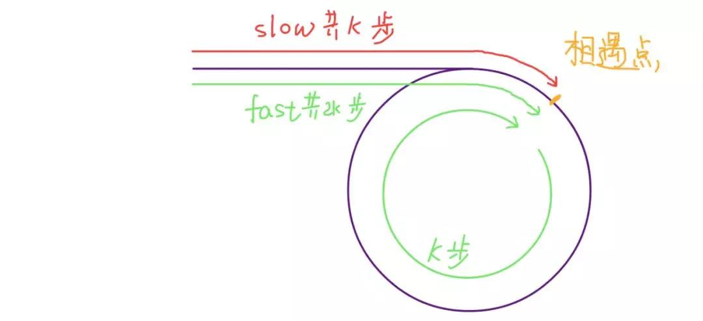

# Circle-detection

## wikipedia [Cycle detection](https://en.wikipedia.org/wiki/Cycle_detection)

> NOTE: 是在LeetCode上刷linked list的circle detection的时候发现的 [Robert W. Floyd](https://en.wikipedia.org/wiki/Robert_W._Floyd)'s [tortoise and hare algorithm](https://en.wikipedia.org/wiki/Cycle_detection#Floyd's_tortoise_and_hare) ，看了这篇文章，发现circle detection其实并不仅仅局限于concrete data structure，其实还包括abstract structure，正如下面所说的 "a [sequence](https://en.wikipedia.org/wiki/Sequence) of [iterated function](https://en.wikipedia.org/wiki/Iterated_function) values"、" [pseudorandom number generators](https://en.wikipedia.org/wiki/Pseudorandom_number_generator) "

In [computer science](https://en.wikipedia.org/wiki/Computer_science), **cycle detection** or **cycle finding** is the [algorithmic](https://en.wikipedia.org/wiki/Algorithm) problem of finding a cycle in a [sequence](https://en.wikipedia.org/wiki/Sequence) of [iterated function](https://en.wikipedia.org/wiki/Iterated_function) values.

> NOTE: 
>
> 一、linked list其实就是可以看作是由一个 [iterated function](https://en.wikipedia.org/wiki/Iterated_function) 形成的

Several algorithms for finding cycles quickly and with little memory are known. [Robert W. Floyd](https://en.wikipedia.org/wiki/Robert_W._Floyd)'s [tortoise and hare algorithm](https://en.wikipedia.org/wiki/Cycle_detection#Floyd's_tortoise_and_hare) moves two pointers at different speeds through the sequence of values until they both point to equal values.

> NOTE:
>
> 思路非常简单: 不断地迭代直至两者相等，这就说明它们存在环

The applications of cycle detection include testing the quality of [pseudorandom number generators](https://en.wikipedia.org/wiki/Pseudorandom_number_generator) and [cryptographic hash functions](https://en.wikipedia.org/wiki/Cryptographic_hash_function), [computational number theory](https://en.wikipedia.org/wiki/Computational_number_theory) algorithms, detection of [infinite loops](https://en.wikipedia.org/wiki/Infinite_loop) in computer programs and periodic configurations in [cellular automata](https://en.wikipedia.org/wiki/Cellular_automaton), automated [shape analysis](https://en.wikipedia.org/wiki/Shape_analysis_(software)) of [linked list](https://en.wikipedia.org/wiki/Linked_list) data structures, and detection of [deadlocks](https://en.wikipedia.org/wiki/Deadlock) for [transactions management](https://en.wikipedia.org/wiki/Transaction_manager) in [DBMS](https://en.wikipedia.org/wiki/Database).

> NOTE: 从上面的描述可以看出，circle detection包括:
>
> 一、concrete data structure
>
> 1、linked list
>
> 二、abstract structure
>
> 1、[pseudorandom number generators](https://en.wikipedia.org/wiki/Pseudorandom_number_generator) 
>
> 2、 [cryptographic hash functions](https://en.wikipedia.org/wiki/Cryptographic_hash_function), 

## floyd判环(圈)算法

1、在阅读 [labuladong](javascript:void(0);) [双指针技巧汇总](https://mp.weixin.qq.com/s/yLc7-CZdti8gEMGWhd0JTg) 时，其中提及了快慢指针，其实它就是"floyd判环(圈)算法"

2、在 中，对它也有介绍。

### csdn [算法-floyd判环(圈)算法](https://blog.csdn.net/u012534831/article/details/74231581)

### 思考: 快慢指针是否一定会相遇？

> NOTE: 
>
> 1、上图源自:  [labuladong](javascript:void(0);) [双指针技巧汇总](https://mp.weixin.qq.com/s/yLc7-CZdti8gEMGWhd0JTg) 

是否存在一种情况，两个pointer永远无法相遇？如何进行论证？

1、设环中节点个数为N，fast的出发位置为F，slow的出发位置为L，当两者相遇的时候fast pointer走的长度一定是slow pointer走的长度的2倍。

2、假设fast pointer和slow pointer都从head出发，相遇的时候slow pointer走了k，则fast pointer走了2k，则环的长度为k？即fast pointer多走了circle长度？两者相遇的时候，fast pointer一定绕了circle？

在  [labuladong](javascript:void(0);) [双指针技巧汇总](https://mp.weixin.qq.com/s/yLc7-CZdti8gEMGWhd0JTg) 中，给出了非常好的图示:

> NOTE: 
> 1、需要注意的是，两个pointer是从同一个位置出发的

## Linked list

linked-list中存在环说明这个linked-list没有tail-node，也就是说没有stop-condition。

### [LeetCode-141. 环形链表](https://leetcode.cn/problems/linked-list-cycle/) # [官方解题](https://leetcode.cn/problems/linked-list-cycle/solution/huan-xing-lian-biao-by-leetcode-solution/ )

#### 方法一：哈希表

> NOTE: 这种方式其实就是visited-set，这是非常常见的一种方法。这是在graph中常用的一种technique。

#### 方法二：快慢指针

> NOTE: 后面会进行介绍

## Graph

geeksforgeeks [Detect Cycle in a Directed Graph](https://www.geeksforgeeks.org/detect-cycle-in-a-graph/)

