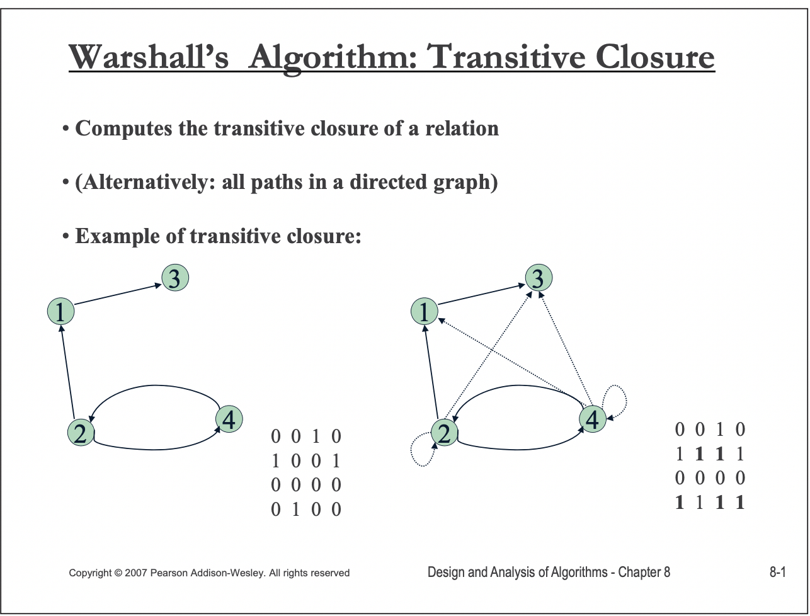
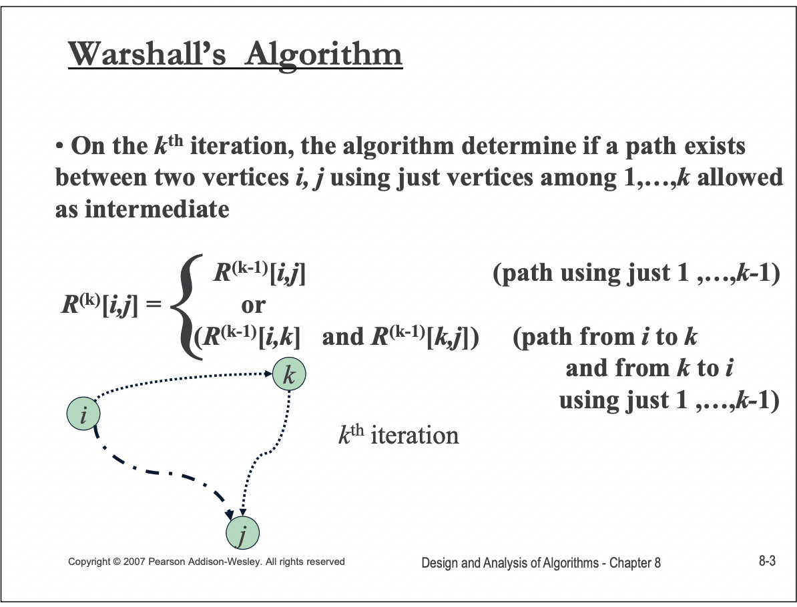
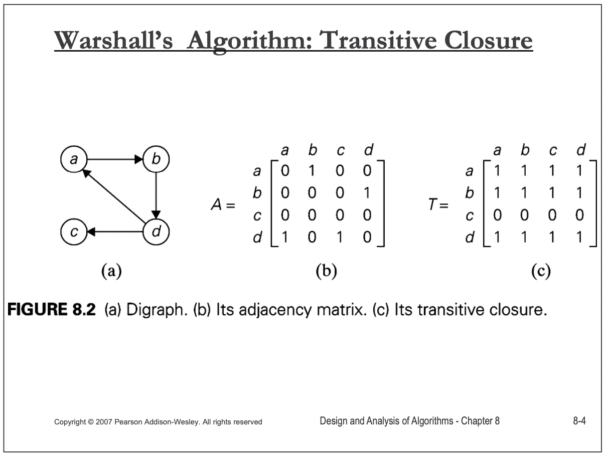
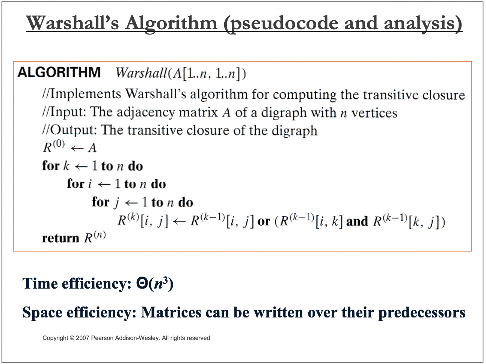

# Transitive closure

“closure"是”close“的名词形式。这个词在阅读过程中经常碰到，本文对它进行总结:

1、需要注意的是 [Closure (mathematics)](https://en.wikipedia.org/wiki/Closure_(mathematics)) 和 [Closure (computer programming)](https://en.wikipedia.org/wiki/Closure_(computer_programming)) 是两个完全不同的概念，不能够弄混。 

## Closure (mathematics)

1、龙书

2、离散数学的关系章节中有闭包的描述

3、[Kleene star](https://en.wikipedia.org/wiki/Kleene_star)

4、[Context-free grammar](https://en.wikipedia.org/wiki/Context-free_grammar#Closure_properties)中也有关于closure的描述

5、从[Formation rule](https://en.wikipedia.org/wiki/Formation_rule)/[Production rule](https://en.wikipedia.org/wiki/Production_(computer_science))的角度来看待闭包

6、从逻辑学推导的角度来看待闭包

我一直想要搞清楚的closure就是基于逻辑推导和集合论的。

[Set theory](https://en.wikipedia.org/wiki/Set_theory)是数学的基石所在，很多其他数学学科都是建立在它的基础之上。


### wikipedia [Closure (mathematics)](https://en.wikipedia.org/wiki/Closure_(mathematics))

> NOTE: 下面是我的一些理解:
>
> 1、重复运用一个relation，从而形成一条path。
>
> 

A [set](https://en.wikipedia.org/wiki/Set_(mathematics)) is **closed** under an [operation](https://en.wikipedia.org/wiki/Operation_(mathematics)) if performance of that operation on members of the set always produces a member of that set. 

#### Examples

1、[Recursive definition](https://en.wikipedia.org/wiki/Recursive_definition)

2、The [transitive closure](https://en.wikipedia.org/wiki/Transitive_set#Transitive_closure) of a [set](https://en.wikipedia.org/wiki/Set_(mathematics)).

3、In [formal languages](https://en.wikipedia.org/wiki/Formal_language), the [Kleene closure](https://en.wikipedia.org/wiki/Kleene_closure) of a language


## Transitive closure

一、在 [**TensorFlow: Large-Scale Machine Learning on Heterogeneous Distributed Systems**](http://download.tensorflow.org/paper/whitepaper2015.pdf) 中提及了**transitive closure：** 

> the TensorFlow implementation can compute the **transitive closure** of all nodes that must be executed in order to compute the outputs that were requested

二、在 https://cwiki.apache.org/confluence/display/ZOOKEEPER/PoweredBy 中也是用了transitive closure这个词语

三、Closures of Relations(从relation-structure的角度来进行分析)

1、沿着relation不断地进行expand

2、one-by-one

### wikipedia [Transitive_closure](https://en.wikipedia.org/wiki/Transitive_closure)


#### Algorithms

The problem can also be solved by the [Floyd–Warshall algorithm](https://en.wikipedia.org/wiki/Floyd–Warshall_algorithm), or by repeated [breadth-first search](https://en.wikipedia.org/wiki/Breadth-first_search) or [depth-first search](https://en.wikipedia.org/wiki/Depth-first_search) starting from each node of the graph.

> NOTE: 
>
> 一、"repeated [breadth-first search](https://en.wikipedia.org/wiki/Breadth-first_search) or [depth-first search](https://en.wikipedia.org/wiki/Depth-first_search) starting from each node of the graph"
>
> 注意，需要为每个node都执行一次。
>
> 二、关于 Warshall’s Algorithm 的详细内容，winona [CS 440 Theory of Algorithms / CS 468 Algorithms in Bioinformatics](https://cs.winona.edu/lin/cs440/ch08-2.pdf) 中有着更好的描述
>
> 


## winona [CS 440 Theory of Algorithms / CS 468 Algorithms in Bioinformatics](https://cs.winona.edu/lin/cs440/ch08-2.pdf)

> NOTE: 
>
> 一、在javatpoint [Warshall's Algorithm](https://www.javatpoint.com/warshalls-algorithm) 中，对这个PPT的内容进行了整理

### What is transitive closure?



> NOTE: 在下一页中对path有着更好的说明


> NOTE: 
>
> 一、简而言之: 两个节点之间存在path有两种情况:
>
> 1、两个节点直接相连
>
> 2、两个节点间接相连: 通过其它中间节点连接，上述"going through"描述的就是间接链接
>
> 这两种情况，只要满足一个即可，因此逻辑关系使用 `OR` 。
>
> 

### Warshall’s Algorithm



> NOTE: 第一次看上述公式会对$R^{(k)}$ 、$R^{(k-1)}$ 中的 $k$ 、$k-1$ 不理解，其实结合后面"Implementation"章节的例子后就能够很好地理解了，加上 $k$ 、$k-1$ 的目的是表达本轮、上一轮的状态值，或者说是为了表达: 本轮的值是基于之前的值计算而来的。




### Warshall’s Algorithm (pseudocode and analysis)




## Warshall’s algorithm code


```c++
// #include <bits/stdc++.h>
#include <iostream>
#include <string>
#include <algorithm>
#include <vector>
#include <bitset>
#include <map>
#include <set>
#include <list>
#include <stack>
#include <unordered_map>
#include <unordered_set>
#include <queue>
#include <deque>
#include <cmath>
#include <numeric>
#include <climits>
#include <random>
#include <memory>

using namespace std;

void warshal(std::vector<std::vector<bool>> &graph, int n)
{
  for (int k = 0; k < n; k++)
  {
    for (int i = 0; i < n; i++)
    {
      for (int j = 0; j < n; j++)
      {
        graph[i][j] = graph[i][j] || (graph[i][k] && graph[k][j]);
      }
    }
  }
}
void print_graph(std::vector<std::vector<bool>> &graph)
{
  for (auto &&row : graph)
  {
    for (auto &&col : row)
    {
      std::cout << col << ",";
    }
    std::cout << std::endl;
  }
}
int main()
{
  std::vector<std::vector<bool>> g{
      {0, 1, 0, 0},
      {0, 0, 0, 1},
      {0, 0, 0, 0},
      {1, 0, 1, 0} //
  };
  std::cout << "before:" << std::endl;
  print_graph(g);

  warshal(g, g[0].size());

  std::cout << "after:" << std::endl;
  print_graph(g);
}
// g++ test.cpp --std=c++11 -pedantic -Wall -Wextra

```

上述代码源自: scanftree [C Program to implement Warshall’s Algorithm](https://scanftree.com/programs/c/c-program-to-implement-warshalls-algorithm/)


## BFS algorithm code


```java

import java.util.*;

public class GraphTransitiveClosure<T> {
    private Map<T, Set<T>> adjacencyList; // 图的adjacent list表示方式
    private List<Set<T>> closures; // 传递闭包

    /**
     * @param edges 图的边
     */
    public GraphTransitiveClosure(List<List<T>> edges) {
        adjacencyList = edges.parallelStream().collect(
                HashMap::new,
                (Map<T, Set<T>> map, List<T> edge) -> {
                    final Set<T> groups1 = map.getOrDefault(edge.get(0), new HashSet<>());
                    groups1.add(edge.get(1));
                    map.put(edge.get(0), groups1);

                    final Set<T> groups2 = map.getOrDefault(edge.get(1), new HashSet<>());
                    groups2.add(edge.get(0));
                    map.put(edge.get(1), groups2);
                },
                (Map<T, Set<T>> map1, Map<T, Set<T>> map2) -> {
                    map2.forEach((index, otherIndexes) -> {
                        if (map1.containsKey(index)) {
                            map1.get(index).addAll(otherIndexes);
                        } else {
                            map1.put(index, otherIndexes);
                        }
                    });
                });
        initClosures();
    }

    private void initClosures() {
        final Set<T> visitedSet = new HashSet<>();
        closures = new ArrayList<>();
        for (T node : adjacencyList.keySet()) {
            if (!visitedSet.contains(node)) {
                closures.add(initClosure(node, visitedSet));
            }
        }
    }

    /**
     * BFS
     * @param node
     * @param visitedSet
     * @return
     */
    private Set<T> initClosure(T node, Set<T> visitedSet) {
        Set<T> closure = new HashSet<>();
        Queue<T> queue = new LinkedList<>();
        queue.add(node);
        visitedSet.add(node);

        while (!queue.isEmpty()) {
            final T curNode = queue.remove();
            closure.add(curNode);
            for (T otherNode : adjacencyList.getOrDefault(curNode, new HashSet<>())) {
                if (!visitedSet.contains(otherNode)) {
                    visitedSet.add(otherNode);
                    queue.add(otherNode);
                }
            }
        }

        return closure;
    }

    public List<Set<T>> getClosures() {
        return closures;
    }
}

```

