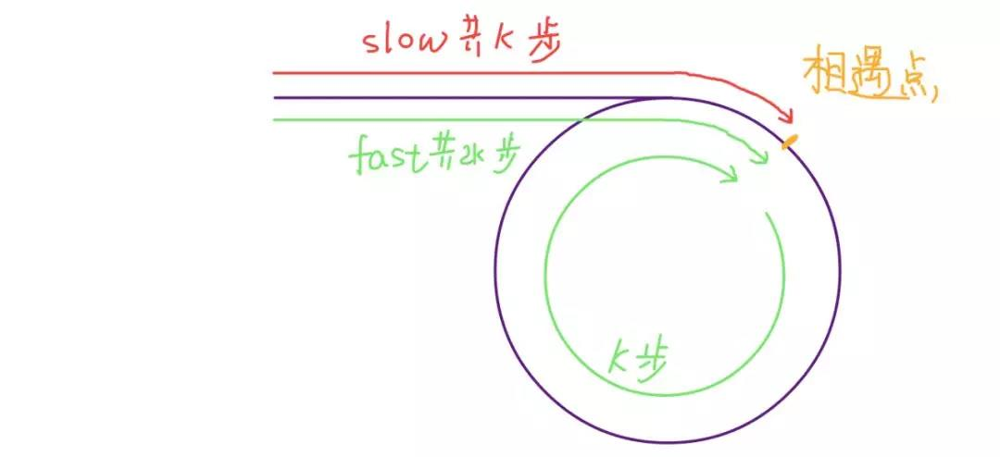

# Cycle-detection


## wikipedia [Cycle detection](https://en.wikipedia.org/wiki/Cycle_detection)

> NOTE: 
>
> 一、是在LeetCode上刷linked list的circle detection的时候发现的 [Robert W. Floyd](https://en.wikipedia.org/wiki/Robert_W._Floyd)'s [tortoise and hare algorithm](https://en.wikipedia.org/wiki/Cycle_detection#Floyd's_tortoise_and_hare) ，看了这篇文章，发现circle detection其实并不仅仅局限于concrete data structure，其实还包括abstract structure，正如下面所说的 "a [sequence](https://en.wikipedia.org/wiki/Sequence) of [iterated function](https://en.wikipedia.org/wiki/Iterated_function) values"、" [pseudorandom number generators](https://en.wikipedia.org/wiki/Pseudorandom_number_generator) "

In [computer science](https://en.wikipedia.org/wiki/Computer_science), **cycle detection** or **cycle finding** is the [algorithmic](https://en.wikipedia.org/wiki/Algorithm) problem of finding a cycle in a [sequence](https://en.wikipedia.org/wiki/Sequence) of [iterated function](https://en.wikipedia.org/wiki/Iterated_function) values.

> NOTE: 
>
> 一、linked list其实就是可以看作是由一个 [iterated function](https://en.wikipedia.org/wiki/Iterated_function) 形成的

Several algorithms for finding cycles quickly and with little memory are known. [Robert W. Floyd](https://en.wikipedia.org/wiki/Robert_W._Floyd)'s [tortoise and hare algorithm](https://en.wikipedia.org/wiki/Cycle_detection#Floyd's_tortoise_and_hare) moves two pointers at different speeds through the sequence of values until they both point to equal values.

> NOTE:
>
> 思路非常简单: 不断地迭代直至两者相等，这就说明它们存在环

The applications of cycle detection include testing the quality of [pseudorandom number generators](https://en.wikipedia.org/wiki/Pseudorandom_number_generator) and [cryptographic hash functions](https://en.wikipedia.org/wiki/Cryptographic_hash_function), [computational number theory](https://en.wikipedia.org/wiki/Computational_number_theory) algorithms, detection of [infinite loops](https://en.wikipedia.org/wiki/Infinite_loop) in computer programs and periodic configurations in [cellular automata](https://en.wikipedia.org/wiki/Cellular_automaton), automated [shape analysis](https://en.wikipedia.org/wiki/Shape_analysis_(software)) of [linked list](https://en.wikipedia.org/wiki/Linked_list) data structures, and detection of [deadlocks](https://en.wikipedia.org/wiki/Deadlock) for [transactions management](https://en.wikipedia.org/wiki/Transaction_manager) in [DBMS](https://en.wikipedia.org/wiki/Database).

> NOTE: 从上面的描述可以看出，circle detection包括:
>
> 一、concrete data structure
>
> 1、linked list
>
> 二、abstract structure
>
> 1、[pseudorandom number generators](https://en.wikipedia.org/wiki/Pseudorandom_number_generator) 
>
> 2、 [cryptographic hash functions](https://en.wikipedia.org/wiki/Cryptographic_hash_function)
>
> 3、deadlock

### Algorithms

If the input is given as a subroutine for calculating *f*, the cycle detection problem may be trivially solved using only *λ* + *μ* function applications, simply by computing the sequence of values *xi* and using a [data structure](https://en.wikipedia.org/wiki/Data_structure) such as a [hash table](https://en.wikipedia.org/wiki/Hash_table) to store these values and test whether each subsequent value has already been stored. However, the **space complexity** of this algorithm is proportional to *λ* + *μ*, unnecessarily large. Additionally, to implement this method as a [pointer algorithm](https://en.wikipedia.org/wiki/Pointer_algorithm) would require applying the equality test to each pair of values, resulting in quadratic(二次方) time overall. Thus, research in this area has concentrated on two goals: using less space than this naive algorithm, and finding pointer algorithms that use fewer equality tests.

> NOTE:
>
> 一、上面描述的算法可以总结为"visited set"，通过上述内容可以看出"visited set"的弊端:
>
> 1、space complexity
>
> 2、time complexity
>
> 二、寻找新算法的目标:
>
> 1、使用更少的space
>
> 2、使用更少的equality test


#### Floyd's tortoise and hare

The key insight in the algorithm is as follows. If there is a cycle, then, for any integers *i* ≥ *μ* and *k* ≥ 0, 
$$
x_i = x_i + k \times \lambda
$$
where $\lambda$ is the length of the loop to be found, $\mu$ is the index of the first element of the cycle, and *k* is a whole integer representing the number of loops.

> NOTE: 上述是使用数学语言来进行描述，非常的简洁


> NOTE:
>
> 一、这个算法的原理可以简单的按照如下思路进行理解:
>
> 如何如果存在环，那么tortoise走一圈的时候，hare肯定走了两圈，此时两者肯定能够相遇。
>
> 二、"period λ"


```python
def floyd(f, x0):
    # Main phase of algorithm: finding a repetition x_i = x_2i.
    # The hare moves twice as quickly as the tortoise and
    # the distance between them increases by 1 at each step.
    # Eventually they will both be inside the cycle and then,
    # at some point, the distance between them will be
    # divisible by the period λ.
    tortoise = f(x0) # f(x0) is the element/node next to x0.
    hare = f(f(x0))
    while tortoise != hare:
        tortoise = f(tortoise)
        hare = f(f(hare))
  
    # At this point the tortoise position, ν, which is also equal
    # to the distance between hare and tortoise, is divisible by
    # the period λ. So hare moving in circle one step at a time, 
    # and tortoise (reset to x0) moving towards the circle, will 
    # intersect at the beginning of the circle. Because the 
    # distance between them is constant at 2ν, a multiple of λ,
    # they will agree as soon as the tortoise reaches index μ.

    # Find the position μ of first repetition.    
    mu = 0
    tortoise = x0
    while tortoise != hare:
        tortoise = f(tortoise)
        hare = f(hare)   # Hare and tortoise move at same speed
        mu += 1
 
    # Find the length of the shortest cycle starting from x_μ
    # The hare moves one step at a time while tortoise is still.
    # lam is incremented until λ is found.
    lam = 1
    hare = f(tortoise)
    while tortoise != hare:
        hare = f(hare)
        lam += 1
 
    return lam, mu
```

> NOTE:
>
> 一、上述:
>
>  `mu` 表示的是 $\mu$
>
> `lam` 表示的是 $\lambda$ 
>
> 二、通过上述python code可以看出，它能够求解出  $\mu$、 $\lambda$ 
>
> 三、需要注意的是: 上述算法的运行前提是: cycle是存在的，如果这个前提不满足，那么上述算法是会陷入deadloop的:
>
> ```python
>     tortoise = f(x0) # f(x0) is the element/node next to x0.
>     hare = f(f(x0))
>     while tortoise != hare:
>         tortoise = f(tortoise)
>         hare = f(f(hare))
> ```
>
> 它的stop condition是 `tortoise == hare`，但是如果不存在circle，那么上述code就会陷入deadloop。
>
> 在 [LeetCode-141. 环形链表](https://leetcode.cn/problems/linked-list-cycle/) 中，展示了检测是否存在环的code，它检测的concrete data structure，可以使用它的结构特性tail node来作为stop condition。
>
> 那对于abstract structure，如果要判定是否存在loop，要如何来实现呢？它的stop condition要如何来设计呢？
>
> 

## floyd判环(圈)算法

1、在阅读 [labuladong](javascript:void(0);) [双指针技巧汇总](https://mp.weixin.qq.com/s/yLc7-CZdti8gEMGWhd0JTg) 时，其中提及了快慢指针，其实它就是"floyd判环(圈)算法"

2、在 中，对它也有介绍。


### csdn [算法-floyd判环(圈)算法](https://blog.csdn.net/u012534831/article/details/74231581)


### 思考: 快慢指针是否一定会相遇？


> NOTE: 
>
> 1、上图源自:  [labuladong](javascript:void(0);) [双指针技巧汇总](https://mp.weixin.qq.com/s/yLc7-CZdti8gEMGWhd0JTg) 

是否存在一种情况，两个pointer永远无法相遇？如何进行论证？

1、设环中节点个数为N，fast的出发位置为F，slow的出发位置为L，当两者相遇的时候fast pointer走的长度一定是slow pointer走的长度的2倍。

2、假设fast pointer和slow pointer都从head出发，相遇的时候slow pointer走了k，则fast pointer走了2k，则环的长度为k？即fast pointer多走了circle长度？两者相遇的时候，fast pointer一定绕了circle？

在  [labuladong](javascript:void(0);) [双指针技巧汇总](https://mp.weixin.qq.com/s/yLc7-CZdti8gEMGWhd0JTg) 中，给出了非常好的图示:

> NOTE: 
> 1、需要注意的是，两个pointer是从同一个位置出发的




## Linked list

linked-list中存在环说明这个linked-list没有tail-node，也就是说没有stop-condition。

### [LeetCode-141. 环形链表](https://leetcode.cn/problems/linked-list-cycle/) # [官方解题](https://leetcode.cn/problems/linked-list-cycle/solution/huan-xing-lian-biao-by-leetcode-solution/ )


#### 方法一：哈希表

> NOTE: 这种方式其实就是visited-set，这是非常常见的一种方法。这是在graph中常用的一种technique。

#### 方法二：快慢指针

> NOTE: 后面会进行介绍


## Graph

geeksforgeeks [Detect Cycle in a Directed Graph](https://www.geeksforgeeks.org/detect-cycle-in-a-graph/)

