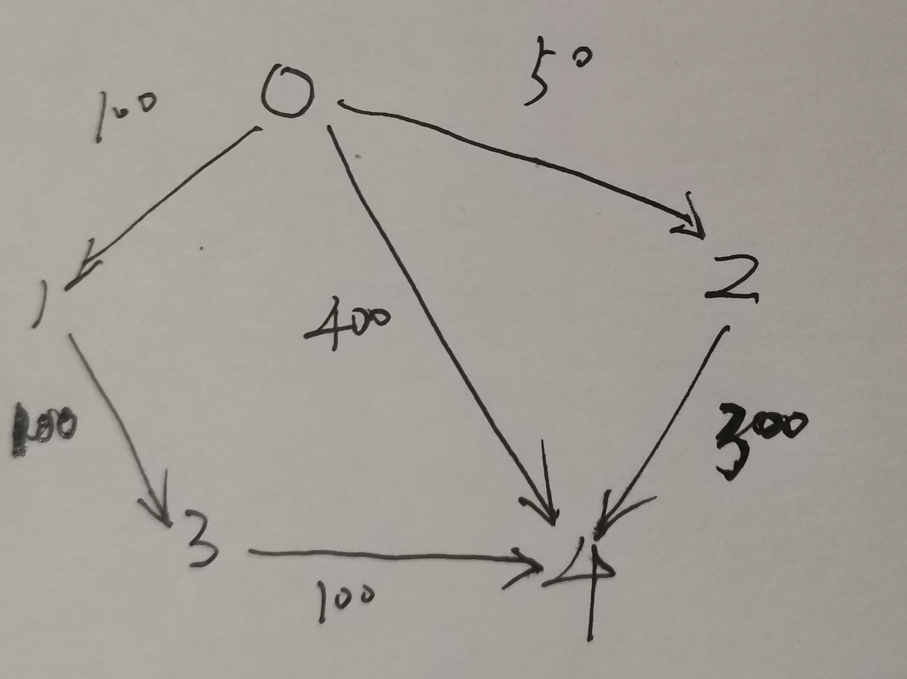

# [LeetCode-787. K 站中转内最便宜的航班](https://leetcode.cn/problems/cheapest-flights-within-k-stops/) 

这道题是为在阅读labuladong [毕 业 旅 行](https://mp.weixin.qq.com/s/D-iahj0gSs1UnDv_6KsNWQ) 时发现的，其中中进行了比较好的讲解。

需要注意"中转次数"的含义:

1、中转0次，表示直达

2、中转1次，表示两个节点之间有一个节点连接

3、理论上，一个由N个节点组成的graph，最大的中转次数为: N - 2


## dijkstra 算法

一、在`K`次中转中，能够到达的所有节点中，寻找目标节点；

二、采用greedy的方式，每次先找到的，就是最优的

三、这种解法其实是对dijkstra 算法进行了一点小变形: 增加了次数的限制。

```C++
#include <bits/stdc++.h>
using namespace std;
class Solution
{
public:
	int findCheapestPrice(int n, vector<vector<int>> &flights, int src, int dst, int k)
	{
		// 构建图
		vector<vector<int>> graph(n, vector<int>(n, 0));
		for (auto &flight : flights)
		{
			graph[flight[0]][flight[1]] = flight[2];
		}

		// 优先级队列，按照价格的最小堆
		auto cmp = [](const vector<int> &a, const vector<int> &b) -> bool
		{
			return a[1] > b[1];
		};
		priority_queue<vector<int>, deque<vector<int>>, decltype(cmp)> q(cmp);
		// 插入到数组里： 当前点，价格，最大飞行次数（K=0的时候也能至少飞一次，所以是中转次数+1）
		q.push( { src, 0, k + 1 }); // 初始化q

		while (!q.empty())
		{
			const vector<int> &curr = q.top();
			int node = curr[0];
			int price = curr[1];
			int k = curr[2];
			q.pop();

			if (node == dst)
			{
				return price;
			}

			// 判断是否还可以再飞一次
			if (k > 0)
			{
				// 遍历目前可以达到的边
				for (int i = 0; i < n; ++i)
				{
					if (graph[node][i] > 0)
					{
						q.push( { i, price + graph[node][i], k - 1 });
					}
				}
			}

		}
		return -1;
	}
};

// Driver code
int main()
{

	Solution solu;
	vector<int> nums = { 1, 3, 5, 4, 7 };
	return 0;
}
// g++ test.cpp --std=c++11 -pedantic -Wall -Wextra


```

这种解法是会超出时间限制的。


## 自顶向下DFS

这是按照 labuladong [毕 业 旅 行](https://mp.weixin.qq.com/s?__biz=MzAxODQxMDM0Mw==&mid=2247491204&idx=1&sn=3f03f4da933ffa0baf4eb05f444d85e3&scene=21#wechat_redirect) / [旅游省钱大法：加权最短路径](https://mp.weixin.qq.com/s?__biz=MzAxODQxMDM0Mw==&mid=2247491204&idx=1&sn=3f03f4da933ffa0baf4eb05f444d85e3&scene=21#wechat_redirect) 中的写法写的。

```c++
// #include <bits/stdc++.h>
#include <iostream>
#include <string>
#include <algorithm>
#include <vector>
#include <bitset>
#include <map>
#include <list>
#include <stack>
#include <unordered_map>
#include <unordered_set>
#include <queue>
#include <deque>
#include <cmath>
#include <numeric>
#include <climits>
#include <random>
// example1.cpp
// new-delete-type-mismatch error
#include <memory>
#include <vector>
using namespace std;

class Solution
{
  // 入度信息，每个节点可以有多个入度节点
  // pair.first 入度节点编号
  // pair.second 从入度节点到当前节点的边的长度
  unordered_map<int, vector<pair<int, int>>> indegree_;
  int src_; // 源头节点
public:
  int findCheapestPrice(int n, vector<vector<int>> &flights, int src, int dst, int k)
  {
    src_ = src; // 初始化
    for (auto &&filght : flights)
    {
      auto &from = filght[0];
      auto &to = filght[1];
      auto &price = filght[2];
      indegree_[to].emplace_back(from, price);
    }
    long res = dfs(dst, k + 1);
    if (res >= INT_MAX)
    {
      return -1;
    }
    else
    {
      return res;
    }
  }
  long dfs(int dst, int k)
  {
    if (dst == src_) // 已经到达了源点，显然此时就没有耗费了
    {
      return 0;
    }
    if (k == 0) // 还未到达节点，并且已经用完了，说明无法到达，返回INT_MAX肯定是能够导致它被淘汰掉的
    {
      return INT_MAX;
    }
    long cost = INT_MAX;
    if (indegree_.count(dst))
    {
      for (auto &&in : indegree_[dst])
      {
        auto &from = in.first;
        long price = in.second;
        auto subproblem = dfs(from, k - 1);
        cost = min(cost, subproblem + price);
      }
      return cost;
    }
    else // 没有入度节点，说明dst是不可达的
    {
      return INT_MAX;
    }
  }
};

int main()
{
}
// g++ test.cpp --std=c++11 -pedantic -Wall -Wextra -g

```

上述解法在如下用例超时:

```c++
17
[[0,12,28],[5,6,39],[8,6,59],[13,15,7],[13,12,38],[10,12,35],[15,3,23],[7,11,26],[9,4,65],[10,2,38],[4,7,7],[14,15,31],[2,12,44],[8,10,34],[13,6,29],[5,14,89],[11,16,13],[7,3,46],[10,15,19],[12,4,58],[13,16,11],[16,4,76],[2,0,12],[15,0,22],[16,12,13],[7,1,29],[7,14,100],[16,1,14],[9,6,74],[11,1,73],[2,11,60],[10,11,85],[2,5,49],[3,4,17],[4,9,77],[16,3,47],[15,6,78],[14,1,90],[10,5,95],[1,11,30],[11,0,37],[10,4,86],[0,8,57],[6,14,68],[16,8,3],[13,0,65],[2,13,6],[5,13,5],[8,11,31],[6,10,20],[6,2,33],[9,1,3],[14,9,58],[12,3,19],[11,2,74],[12,14,48],[16,11,100],[3,12,38],[12,13,77],[10,9,99],[15,13,98],[15,12,71],[1,4,28],[7,0,83],[3,5,100],[8,9,14],[15,11,57],[3,6,65],[1,3,45],[14,7,74],[2,10,39],[4,8,73],[13,5,77],[10,0,43],[12,9,92],[8,2,26],[1,7,7],[9,12,10],[13,11,64],[8,13,80],[6,12,74],[9,7,35],[0,15,48],[3,7,87],[16,9,42],[5,16,64],[4,5,65],[15,14,70],[12,0,13],[16,14,52],[3,10,80],[14,11,85],[15,2,77],[4,11,19],[2,7,49],[10,7,78],[14,6,84],[13,7,50],[11,6,75],[5,10,46],[13,8,43],[9,10,49],[7,12,64],[0,10,76],[5,9,77],[8,3,28],[11,9,28],[12,16,87],[12,6,24],[9,15,94],[5,7,77],[4,10,18],[7,2,11],[9,5,41]]
13
4
13
```


## 自顶向下DFS + 备忘录

```c++
// #include <bits/stdc++.h>
#include <iostream>
#include <string>
#include <algorithm>
#include <vector>
#include <bitset>
#include <map>
#include <list>
#include <stack>
#include <unordered_map>
#include <unordered_set>
#include <queue>
#include <deque>
#include <cmath>
#include <numeric>
#include <climits>
#include <random>
// example1.cpp
// new-delete-type-mismatch error
#include <memory>
#include <vector>
using namespace std;

class Solution
{
  // 入度信息，每个节点可以有多个入度节点
  // pair.first 入度节点编号
  // pair.second 从入度节点到当前节点的边的长度
  unordered_map<int, vector<pair<int, int>>> indegree_;
  int src_; // 源头节点
  // 备忘录
  // 从src到当前节点的最短距离
  vector<vector<long>> memo;

public:
  int findCheapestPrice(int n, vector<vector<int>> &flights, int src, int dst, int k)
  {
    ++k; //需要将中转次数转换为边数
    // 初始值 -1 表示还没有还没有计算过这个问题
    // 需要注意的是：k + 1,因为它的值是可以取到k的，所以需要进行下标到长度的转换，所以需要+1，否则会发生越界
    memo = vector<vector<long>>(n, vector<long>(k + 1, -1));
    src_ = src; // 初始化
    for (auto &&filght : flights)
    {
      auto &from = filght[0];
      auto &to = filght[1];
      auto &price = filght[2];
      indegree_[to].emplace_back(from, price);
    }
    long res = dfs(dst, k);
    if (res >= INT_MAX)
    {
      return -1;
    }
    else
    {
      return res;
    }
  }
  long dfs(int dst, int k)
  {
    if (dst == src_) // 已经到达了源点，显然此时就没有耗费了
    {
      return 0;
    }
    if (k == 0) // 还未到达节点，并且已经用完了，说明无法到达，返回INT_MAX肯定是能够导致它被淘汰掉的
    {
      return INT_MAX;
    }
    if (memo[dst][k] != -1)
    {
      return memo[dst][k];
    }
    long cost = INT_MAX;
    if (indegree_.count(dst))
    {
      for (auto &&in : indegree_[dst])
      {
        auto &from = in.first;
        long price = in.second;
        auto subproblem = dfs(from, k - 1);
        cost = min(cost, subproblem + price);
      }
    }
    memo[dst][k] = cost;
    return cost;
  }
};

int main()
{
  vector<vector<int>> flights{{0, 12, 28}, {5, 6, 39}, {8, 6, 59}, {13, 15, 7}, {13, 12, 38}, {10, 12, 35}, {15, 3, 23}, {7, 11, 26}, {9, 4, 65}, {10, 2, 38}, {4, 7, 7}, {14, 15, 31}, {2, 12, 44}, {8, 10, 34}, {13, 6, 29}, {5, 14, 89}, {11, 16, 13}, {7, 3, 46}, {10, 15, 19}, {12, 4, 58}, {13, 16, 11}, {16, 4, 76}, {2, 0, 12}, {15, 0, 22}, {16, 12, 13}, {7, 1, 29}, {7, 14, 100}, {16, 1, 14}, {9, 6, 74}, {11, 1, 73}, {2, 11, 60}, {10, 11, 85}, {2, 5, 49}, {3, 4, 17}, {4, 9, 77}, {16, 3, 47}, {15, 6, 78}, {14, 1, 90}, {10, 5, 95}, {1, 11, 30}, {11, 0, 37}, {10, 4, 86}, {0, 8, 57}, {6, 14, 68}, {16, 8, 3}, {13, 0, 65}, {2, 13, 6}, {5, 13, 5}, {8, 11, 31}, {6, 10, 20}, {6, 2, 33}, {9, 1, 3}, {14, 9, 58}, {12, 3, 19}, {11, 2, 74}, {12, 14, 48}, {16, 11, 100}, {3, 12, 38}, {12, 13, 77}, {10, 9, 99}, {15, 13, 98}, {15, 12, 71}, {1, 4, 28}, {7, 0, 83}, {3, 5, 100}, {8, 9, 14}, {15, 11, 57}, {3, 6, 65}, {1, 3, 45}, {14, 7, 74}, {2, 10, 39}, {4, 8, 73}, {13, 5, 77}, {10, 0, 43}, {12, 9, 92}, {8, 2, 26}, {1, 7, 7}, {9, 12, 10}, {13, 11, 64}, {8, 13, 80}, {6, 12, 74}, {9, 7, 35}, {0, 15, 48}, {3, 7, 87}, {16, 9, 42}, {5, 16, 64}, {4, 5, 65}, {15, 14, 70}, {12, 0, 13}, {16, 14, 52}, {3, 10, 80}, {14, 11, 85}, {15, 2, 77}, {4, 11, 19}, {2, 7, 49}, {10, 7, 78}, {14, 6, 84}, {13, 7, 50}, {11, 6, 75}, {5, 10, 46}, {13, 8, 43}, {9, 10, 49}, {7, 12, 64}, {0, 10, 76}, {5, 9, 77}, {8, 3, 28}, {11, 9, 28}, {12, 16, 87}, {12, 6, 24}, {9, 15, 94}, {5, 7, 77}, {4, 10, 18}, {7, 2, 11}, {9, 5, 41}};
  int n = 17;
  int src = 13;
  int dst = 13;
  int k = 13;
  Solution s;
  cout << s.findCheapestPrice(n, flights, src, dst, k) << endl;
}

// g++ test.cpp --std=c++11 -pedantic -Wall -Wextra -g

```


## 动态规划


状态:

1、k

2、节点

选择:

当有多个parent的时候，从哪个parent节点过来，这是比较特殊的，由于不同的节点，它的parent的个数不同，因此可能的选择是不同的；

### 结合具体例子来思考递归方程




### 递归方程

```
m(v, k) 表示从source节点到v节点，中转k次的最便宜的价格
Parent(v) 表示节点v的parent节点
Price(u, v) 表示从节点u到节点v的价格，其实就是图的权重
m(v, k) = min(m(v, k-1), m(Parent(v), k-1) + Price(Parent(v), v))

base case: 
1、从src到src，无论经过多少次中转都是0
2、所有直接与source节点，都不需要经过中转(k=0)，它们的最小价格是可以直接获得的。
```

解释：

1、如果能够结果k-1次到达v，那么肯定能够经过k次到达v，所以:

```
m(v, k) = m(v, k-1)
```

2、要想得到每个节点的parent，需要构建indegree table。

### 完整程序

```C++
#include <bits/stdc++.h>
using namespace std;

class Solution
{
public:
  int findCheapestPrice(int n, vector<vector<int>> &flights, int src, int dst, int k)
  {
    int col = k + 1; //列数，从0-k，一共有k+1列
    vector<vector<long>> dp(n, vector<long>(col, INT_MAX));
    // base case
    for (int i = 0; i < col; ++i)
    {
      dp[src][i] = 0; // 从src到src，无论经过多少次中转都是0
    }
    for (auto &&flight : flights)
    {
      int src_node = flight[0];  // 源节点
      int dest_node = flight[1]; // 目标节点
      int weight = flight[2];
      if (src_node == src) // 是源节点
      {
        dp[dest_node][0] = weight;
      }
    }
    for (int i = 1; i <= k; ++i)
    {
      for (auto &&flight : flights)
      {
        int src_node = flight[0];  // 源节点
        int dest_node = flight[1]; // 目标节点
        int weight = flight[2];
        dp[dest_node][i] = min({
            dp[dest_node][i],            // 自己
            dp[dest_node][i - 1],        // 前一个节点
            dp[src_node][i - 1] + weight //
        });
      }
    }
    return dp[dst][k] == INT_MAX ? -1 : dp[dst][k];
  }
};

// Driver code
int main()
{

	Solution solu;
	vector<int> nums = { 1, 3, 5, 4, 7 };
	return 0;
}
// g++ test.cpp --std=c++11 -pedantic -Wall -Wextra


```

需要注意的是一点是:

由于可能存在 `INT_MAX + weight` 而导致integer overflow，因此:

```C++
vector<vector<long>> dp(n, vector<long>(col, INT_MAX));
```

声明为`long`，这样就可以有效避免integer overflow

## [LeetCode-【中规中矩】Bellman Ford 动态规划两种写法](https://leetcode.cn/problems/cheapest-flights-within-k-stops/solution/zhong-gui-zhong-ju-bellman-ford-dong-tai-gui-hua-l/)

### 动态规划

```C++
class Solution {
public:
    int findCheapestPrice(int N, vector<vector<int>>& flights, int src, int dst, int K) {
       vector<vector<long>> dp(N, vector<long>(K + 1, INT_MAX));
       K = min(K, N - 2);
       // Base case direct flight
       dp[src][0] = 0;
       for (const auto& flight : flights) {
           auto start = flight[0];
           auto end = flight[1];
           auto price = flight[2];
           if (start == src) {
                dp[end][0] = min(dp[end][0], (long)price); 
           }
       } 

       for (int k = 1; k <= K; k++) {
            for (const auto& flight : flights) {
                auto u = flight[0];
                auto v = flight[1];
                auto w = flight[2];
                // The minimum price of reach end in k steps is the minimum of w (price) 
                // of reaching v in k - 1 steps (no need to transfer at step k) and
                // the mimimum of reaching end v in k steps.
                dp[v][k] = min({dp[v][k - 1], dp[v][k], dp[u][k - 1] + w}); 
            }
       }
       return dp[dst][K] == INT_MAX ? -1 : dp[dst][K];
    }
};

```

