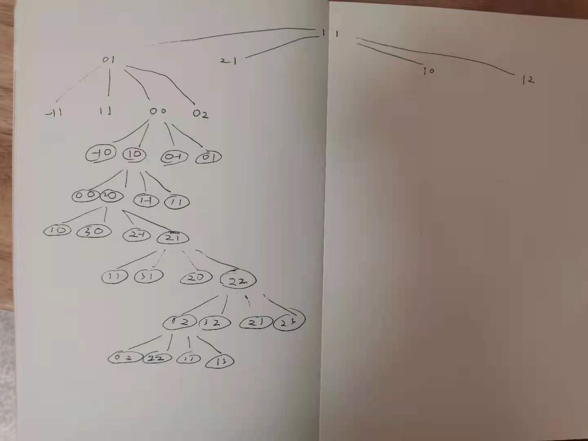

# Flood fill 泛洪算法

一、在 labuladong [Flood Fill 算法详解](https://mp.weixin.qq.com/s/Y7snQIraCC6PRhj9ZSnlzw) 中，发现了这个算法，第一感觉就是 "探针"、"试探"。

二、"泛洪"，这翻译是非常形象的

## labuladong [Flood Fill 算法详解](https://mp.weixin.qq.com/s/Y7snQIraCC6PRhj9ZSnlzw) 

为了继续深化 [框架思维](http://mp.weixin.qq.com/s?__biz=MzU0MDg5OTYyOQ==&mid=2247483857&idx=1&sn=918638e5a70e22b5b7bda9bbc5484f20&chksm=fb336193cc44e885f0524bdfe58a4e92b22a2b46017bf232b2ef91a576de648a8e61a30fd83d&scene=21#wechat_redirect)，本文讲解 FloodFill 算法的原理，以及该算法在「自动魔棒工具」和「扫雷」中的灵活应用。

### Example

> NOTE: 
>
> 原文列举了很多实用了flood fill算法的例子

#### 「颜色填充」


#### 扫雷


#### 消消乐


### 一、构建框架


以上几个例子，都可以抽象成一个二维矩阵（图片其实就是像素点矩阵），然后从某个点开始向四周扩展，直到无法再扩展为止。


矩阵，可以抽象为一幅「图」，这就是一个图的遍历问题，也就类似一个 N 叉树遍历的问题。几行代码就能解决，直接上框架：


```C++
// (x, y) 为坐标位置
void fill(int x, int y) {
    fill(x - 1, y); // 上
    fill(x + 1, y); // 下
    fill(x, y - 1); // 左
    fill(x, y + 1); // 右
}
```

#### 图遍历框架

> NOTE: 
>
> 一、原文并没有点明的是: 本文中的"二维矩阵中遍历"其实是graph traversal 图遍历，因此，它需要考虑图遍历中的circle问题，circle问题这会导致deadloop、infinit recursion，因此需要考虑一种有效的去重机制

**这个框架可以解决几乎所有在二维矩阵中遍历的问题**，说得高端一点，这就叫深度优先搜索（Depth First Search，简称 DFS），说得简单一点，这就叫四叉树遍历框架。坐标 (x, y) 就是 root，四个方向就是 root 的四个子节点。


#### [LeetCode-733. 图像渲染](https://leetcode.cn/problems/flood-fill/) 简单

下面看一道 LeetCode 题目，其实就是让我们来实现**「颜色填充」**功能。

> NOTE: 
>
> 一、[LeetCode-733. 图像渲染](https://leetcode.cn/problems/flood-fill/) 简单
>
> 二、这道题，其实也是可以使用BFS来解决的，但是BFS需要queue，空间复杂的更高


根据上篇文章 [二叉搜索树操作集锦](http://mp.weixin.qq.com/s?__biz=MzU0MDg5OTYyOQ==&mid=2247483891&idx=1&sn=0e7ef14e53e38649f09dea5c89058cb4&chksm=fb3361b1cc44e8a7c38a9bf3bf24408a2891ac885d242c5c3a6966f25097aec859c3406e6c11&scene=21#wechat_redirect)，我们讲了「树」算法设计的一个总路线，今天就可以直接套用到 FloodFill 算法中：


只要你能够理解这段代码，一定要给你鼓掌，给你 99 分，因为你对「框架思维」的掌控已经炉火纯青，此算法已经 cover 了 99% 的情况，仅有一个细节问题没有解决，就是当 origColor 和 newColor 相同时，会陷入**无限递归**。

> NOTE: 
>
> 1、本文中的"二维矩阵中遍历"其实是graph traversal 图遍历，因此，它需要考虑图遍历中的circle问题，circle问题这会导致deadloop、infinit recursion，因此需要考虑一种有效的去重机制；后面开始讨论有效的去重机制

### 二、研究细节

为什么会陷入无限递归呢，很好理解，因为每个坐标都要搜索上下左右，那么对于一个坐标，一定也会被上下左右的坐标多次重复搜索。**被重复搜索时，必须保证递归函数能够能正确地退出，否则就会陷入死循环。**

#### newColor 和 origColor 不同时

为什么 newColor 和 origColor 不同时算法是正确的呢？把算法流程画个图理解一下：

> NOTE: 
>
> 一、此处是比较容易理解的，下面的逻辑避免了这种情况:
>
> ```C++
> 		if (image[x][y] != oldColor)
> 			return;
> ```
>
> 

#### newColor 和 origColor 相同时

> NOTE: 
>
> 一、如果newColor 和 origColor相同，不执行算法就可以了，可以在调用fill前做一下判断，[LeetCode-图像渲染](https://leetcode.cn/problems/flood-fill/solution/tu-xiang-xuan-ran-by-leetcode-solution/) 官方解题中给出的就是这种方法。
>
> 二、作者提出的是一些其他的避免"死循环、无限递归"的方式、技巧

但是，如果说 origColor 和 newColor 一样，这个 if 语句就无法让 `fill(1, 1)*` 正确退出，而是开启了下面的重复递归，形成了死循环。


### 三、处理细节

如何避免上述问题的发生，最容易想到的就是用一个和 image 一样大小的二维 bool 数组记录走过的地方，一旦发现重复探索立即 return。

#### Visited array

> NOTE: 
>
> 一、graph traversal中，最最常用的一种方法: visited array

```c++
// 出界：超出数组边界
if (!inArea(image, x, y)) return;
// 碰壁：遇到其他颜色，超出 origColor 区域
if (image[x][y] != origColor) return;
// 已探索过的 origColor 区域
if (visited[x][y]) return;

visited[x][y] = true;
image[x][y] = newColor;/* 遍历框架，上下左右 */
```

完全 OK，这也是处理「图」的一种常用手段。不过对于此题，不用开数组，我们有一种更好的方法，那就是回溯算法。

#### Backtrack回溯

前文 [回溯算法详解](http://mp.weixin.qq.com/s?__biz=MzU0MDg5OTYyOQ==&mid=2247483841&idx=1&sn=9819393f9142892312fa3aeba173c879&chksm=fb336183cc44e895b7e7a29ec52f2504a1a6aa925655bcf129f1c215a376fa67c302d747f253&scene=21#wechat_redirect) 讲过，这里不再赘述，直接套回溯算法框架：


这种解决方法是最常用的，相当于使用一个特殊值 -1 代替 visited 数组的作用，达到不走回头路的效果。为什么是 -1，因为题目中说了颜色取值在 0 - 65535 之间，所以 -1 足够特殊，能和颜色区分开。

### 四、拓展延伸：自动魔棒工具和扫雷

#### 「自动魔棒工具」

> NOTE: 
>
> 1、这个是相对容易的

显然，这个算法肯定是基于 FloodFill 算法的，但有两点不同：首先，背景色是蓝色，但不能保证都是相同的蓝色，毕竟是像素点，可能存在肉眼无法分辨的深浅差异，而我们希望能够忽略细微的颜色差异差异。第二，FloodFill 算法是「区域填充」，这里是想找到 origColor 区域的边界，可以抽象成「边界填充」。


对于第一个问题，很好解决，可以设置一个阈值 threshold，在阈值范围内波动的颜色都视为 origColor：


```C++
if (Math.abs(image[x][y] - origColor) > threshold)
    return; // 遇到其他颜色
```


#### 最外圈像素点染色

> NOTE: 
>
> 一、这个是有些困难的

对于第二个问题，我们首先明确问题：不要把 origColor 区域内所有像素点都染色，而是只给区域最外圈像素点染色。然后，我们分析，如何才能仅给外围染色，即如何才能找到最外围坐标，最外围坐标有什么特点？


可以发现，origColor 区域内部的坐标四面一定都是 origColor，而区域边界上的坐标，至少有一个方向不是 origColor，这就是解决问题的关键。保持框架不变，使用 visited 数组记录已搜索坐标，主要代码如下：


> NOTE: 
>
> 一、`fill`函数的返回值表示的是当前节点是否是在**连通分量**中，需要注意的是，对于`visited`为`true`的，也要返回1，说明它是在**连通分量**中的。
>
> 二、我第一次尝试时，写出的程序如下: 
>
> ```C++
> 
> 	int fill(vector<vector<int>> &image, int x, int y, int oldColor, int newColor, vector<vector<bool>> &visited)
> 	{
> 		if (!inArea(image, x, y))
> 			return 0;
> 		if (image[x][y] != oldColor)
> 			return 0;
> 		if (visited[x][y])
> 			return 1;
> 		visited[x][y] = true;
> 		int surround = fill(image, x - 1, y, oldColor, newColor, visited) + fill(image, x + 1, y, oldColor, newColor, visited) + fill(image, x, y - 1, oldColor, newColor, visited) + fill(image, x, y + 1, oldColor, newColor, visited);
> 		if (surround < 4)
> 		{
> 			image[x][y] = newColor;
> 		}
> 		return 1;
> 	}
> ```
>
> 关键的差异点在于: 
>
> ```C++
> 		if (!inArea(image, x, y))
> 			return 0;
> 		if (image[x][y] != oldColor)
> 			return 0;
> 		if (visited[x][y])
> 			return 1;
> ```
>
> 即先判断 `if (image[x][y] != oldColor)` 然后判断 `if (visited[x][y])`，最终提交上去，在如下测试用例时，出现了错误:
>
> ```C++
> [[1,1,1],[1,1,1],[1,1,1]]
> 1
> 1
> 2
> 输出: [[2,2,2],[2,1,2],[2,2,2]]
> 预期输出: [[2,2,2],[2,1,2],[2,2,2]]
> ```
>
> 后来经过分析: 对于一个连通的、处于边界的节点，由于它的颜色已经被改变了(深度优先)，因此`(image[x][y] != oldColor)`，此时如果函数返回为0，则显然是和连通的事实相违背。因此，需要先判断 `if (visited[x][y])`，然后判断`if (image[x][y] != oldColor)`。
>
> 三、完整的、正确的C++source code
>
> ```C++
> #include <bits/stdc++.h>
> using namespace std;
> class Solution
> {
> public:
> 	vector<vector<int>> colorBorder(vector<vector<int>> &grid, int r0, int c0, int color)
> 	{
> 		vector<vector<bool>> visited { grid.size() };
> 		for (auto &&v : visited)
> 		{
> 			v = vector<bool>(grid[0].size(), false);
> 		}
> 		int oldColor = grid[r0][c0]; // 旧颜色
> 		fill(grid, r0, c0, oldColor, color, visited);
> 		return grid;
> 	}
> 	/**
> 	 * @brief
> 	 *
> 	 * @param image
> 	 * @param x
> 	 * @param y
> 	 * @param newColor
> 	 */
> 	int fill(vector<vector<int>> &image, int x, int y, int oldColor, int newColor, vector<vector<bool>> &visited)
> 	{
> 		if (!inArea(image, x, y))
> 			return 0;
> 		if (visited[x][y])
> 			return 1;
> 		if (image[x][y] != oldColor)
> 			return 0;
> 
> 		visited[x][y] = true;
> 		int surround = fill(image, x - 1, y, oldColor, newColor, visited) + fill(image, x + 1, y, oldColor, newColor, visited) + fill(image, x, y - 1, oldColor, newColor, visited) + fill(image, x, y + 1, oldColor, newColor, visited);
> 		cout << surround << endl;
> 		if (surround < 4)
> 		{
> 			cout << x << "," << y << endl;
> 			image[x][y] = newColor;
> 		}
> 		return 1;
> 	}
> 	bool inArea(vector<vector<int>> &image, int x, int y)
> 	{
> 		return (x >= 0 && x < image.size()) && (y >= 0 && y < image[0].size());
> 	}
> };
> int main()
> {
> 	vector<vector<int>> image { { 1, 1, 1 }, { 1, 1, 1 }, { 1, 1, 1 } };
> 	Solution s;
> 	s.colorBorder(image, 1, 1, 2);
> 
> }
> // g++ test.cpp --std=c++11 -pedantic -Wall -Wextra
> 
> 
> ```
>
> 下面是recursion activation tree:
>
> 


> NOTE: 
>
> 对于上述code的理解，需要画出recursion activation tree，我们知道，recursion function执行的是DFS，
>
> 在进入子树前，先将当前节点的visited状态置位true。因此后续在遇到这个节点的时候，就不会再处理它了。
>
> 上述code会不断地DFS，直到边界node，然后执行如下code:
>
> ```C++
> 		if (surround < 4)
> 		{
> 			image[x][y] = newColor;
> 		}
> ```
>
> 它不能够使用回溯法来防止dead recursion的原因是: 它不能对所有的code染色，只能够对边界code染色。


## wikipedia [Flood fill](https://en.wikipedia.org/wiki/Flood_fill)

