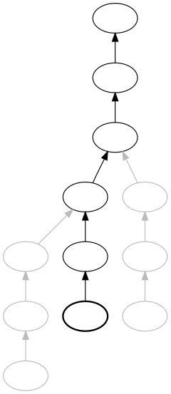

# Parent pointer tree

## wikipedia [Parent pointer tree](https://en.wikipedia.org/wiki/Parent_pointer_tree)

In [computer science](https://en.wikipedia.org/wiki/Computer_science), an **in-tree** or **parent pointer tree** is an *N*-ary [tree data structure](https://en.wikipedia.org/wiki/Tree_data_structure) in which each node has a [pointer](https://en.wikipedia.org/wiki/Pointer_(computer_programming)) to its [parent node](https://en.wikipedia.org/wiki/Parent_node), but no pointers to [child nodes](https://en.wikipedia.org/wiki/Child_node). When used to implement a set of [stacks](https://en.wikipedia.org/wiki/Stack_(abstract_data_type)), the structure is called a **spaghetti stack**, **cactus stack** or **sahuaro stack** (after the [sahuaro](https://en.wikipedia.org/wiki/Sahuaro), a kind of cactus).[[1\]](https://en.wikipedia.org/wiki/Parent_pointer_tree#cite_note-1) Parent pointer trees are also used as [disjoint-set data structures](https://en.wikipedia.org/wiki/Disjoint-set_data_structure).

The structure can be regarded as a set of [singly linked lists](https://en.wikipedia.org/wiki/Singly_linked_list) that [share](https://en.wikipedia.org/w/index.php?title=Structure_sharing&action=edit&redlink=1) part of their structure, in particular, their tails. From any node, one can traverse to ancestors of the node, but not to any other node.

> Spaghetti stack with an "active" stack frame highlighted

### Use in compilers

A [compiler](https://en.wikipedia.org/wiki/Compiler) for a language such as [C](https://en.wikipedia.org/wiki/C_(programming_language)) creates a spaghetti stack as it opens and closes [symbol tables](https://en.wikipedia.org/wiki/Symbol_table) representing block [scopes](https://en.wikipedia.org/wiki/Scope_(computer_science)). When a new block scope is opened, a symbol table is pushed onto a stack. When the closing curly brace is encountered, the scope is closed and the symbol table is popped. But that symbol table is remembered, rather than destroyed. And of course it remembers its higher level "parent" symbol table and so on. Thus when the compiler is later performing translations over the [abstract syntax tree](https://en.wikipedia.org/wiki/Abstract_syntax_tree), for any given expression, it can fetch the symbol table representing that expression's environment and can resolve references to identifiers. If the expression refers to a variable X, it is first sought after in the leaf symbol table representing the inner-most lexical scope, then in the parent and so on.