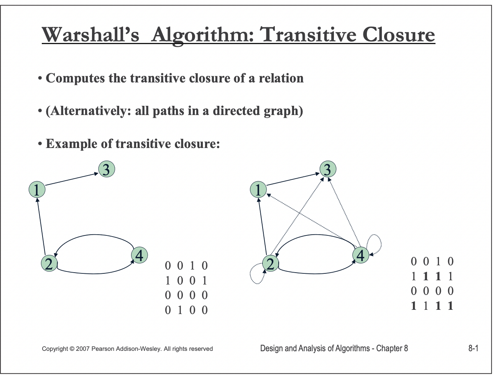
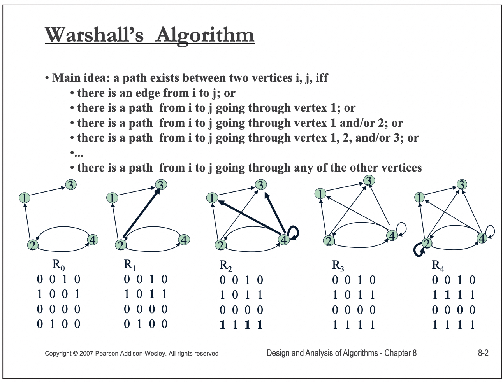
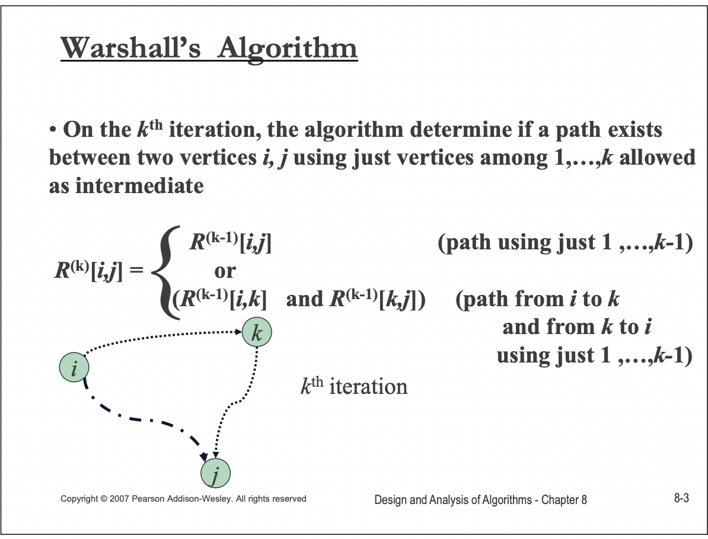
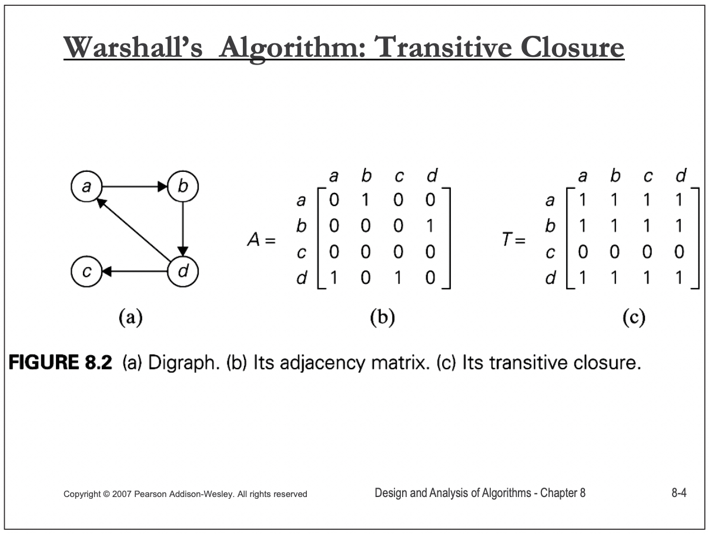
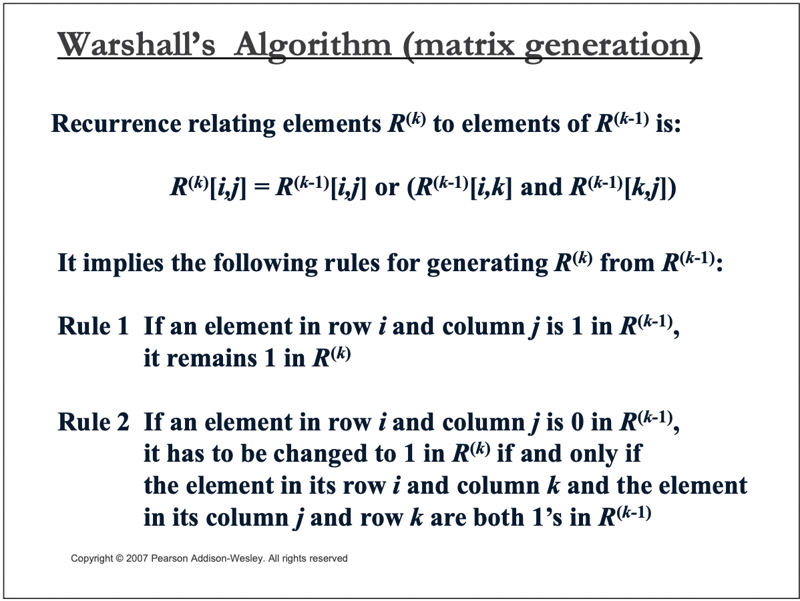
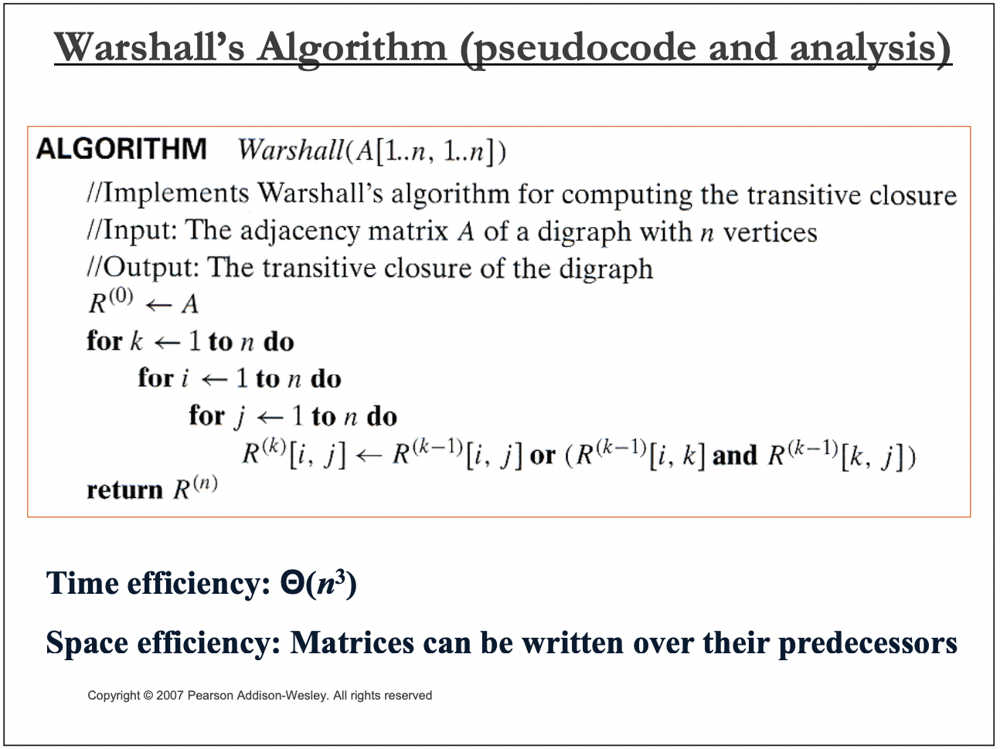

## winona [CS 440 Theory of Algorithms / CS 468 Algorithms in Bioinformatics](https://cs.winona.edu/lin/cs440/ch08-2.pdf)

> NOTE: 
>
> 一、在javatpoint [Warshall's Algorithm](https://www.javatpoint.com/warshalls-algorithm) 中，对这个PPT的内容进行了整理

### What is transitive closure?



> NOTE: 在下一页中对path有着更好的说明




> NOTE: 
>
> 一、简而言之: 两个节点之间存在path有两种情况:
>
> 1、两个节点直接相连
>
> 2、两个节点间接相连: 通过其它中间节点连接，上述"going through"描述的就是间接链接
>
> 这两种情况，只要满足一个即可，因此逻辑关系使用 `OR` 。
>
> 

### Warshall’s Algorithm



> NOTE: 第一次看上述公式会对$R^{(k)}$ 、$R^{(k-1)}$ 中的 $k$ 、$k-1$ 不理解，其实结合后面"Implementation"章节的例子后就能够很好地理解了，加上 $k$ 、$k-1$ 的目的是表达本轮、上一轮的状态值，或者说是为了表达: 本轮的值是基于之前的值计算而来的。






### Warshall’s Algorithm (pseudocode and analysis)




## Warshall’s algorithm code


```c++
#include <iostream>
#include <vector>

void warshal(std::vector<std::vector<bool>> &graph, int n) {
    for (int k = 0; k < n; k++) {
        for (int i = 0; i < n; i++) {
            for (int j = 0; j < n; j++) {
                graph[i][j] = graph[i][j] || (graph[i][k] && graph[k][j]);
            }
        }
    }
}

void print_graph(std::vector<std::vector<bool>> &graph) {
    for (auto &&row: graph) {
        for (auto &&col: row) {
            std::cout << col << ",";
        }
        std::cout << std::endl;
    }
}

int main() {
    std::vector<std::vector<bool>> g{
            {0, 1, 0, 0},
            {0, 0, 0, 1},
            {0, 0, 0, 0},
            {1, 0, 1, 0} //
    };
    std::cout << "before:" << std::endl;
    print_graph(g);

    warshal(g, g[0].size());

    std::cout << "after:" << std::endl;
    print_graph(g);
}
// g++ test.cpp --std=c++11 -pedantic -Wall -Wextra

```

上述代码源自: scanftree [C Program to implement Warshall’s Algorithm](https://scanftree.com/programs/c/c-program-to-implement-warshalls-algorithm/)


