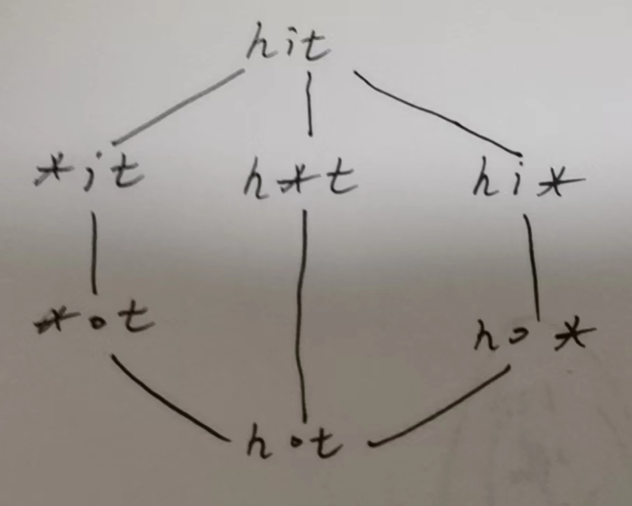

# [LeetCode-127. 单词接龙-困难](https://leetcode.cn/problems/word-ladder/) 

一、这是在Google "bidirectional bfs - leetcode"时发现的，这道题和 [LeetCode-752. 打开转盘锁-中等](https://leetcode.cn/problems/open-the-lock/) 非常类似。

二、这个题中的graph是典型的undirected graph，这样才能够bidirectional-BFS

三、这道题提供了BFS的新写法: 

它使用 `vector<int> dis(nodeNum, INT_MAX);` 而没有使用 `visited`

四、将string映射到ID

## 我的解题


## [LeetCode-官方解题](https://leetcode.cn/problems/word-ladder/solution/dan-ci-jie-long-by-leetcode-solution/)


我们可以把每个单词都抽象为一个点，如果两个单词可以只改变一个字母进行转换，那么说明他们之间有一条双向边。因此我们只需要把满足转换条件的点相连，就形成了一张**图**。

基于该图，我们以 `beginWord` 为图的起点，以 `endWord` 为终点进行**广度优先搜索**，寻找 `beginWord` 到 `endWord` 的最短路径。

### **算法**

首先为了方便表示，我们先给每一个单词标号，即给每个单词分配一个 `id`。创建一个由单词 `word` 到 `id` 对应的映射 `wordId`，并将 `beginWord` 与 `wordList` 中所有的单词都加入这个映射中。之后我们检查 `endWord` 是否在该映射内，若不存在，则输入无解。我们可以使用**哈希表**实现上面的映射关系。

我们可以创建虚拟节点。对于单词 `hit`，我们创建三个虚拟节点 `*it`、`h*t`、`hi*`，并让 `hit` 向这三个虚拟节点分别连一条边即可。如果一个单词能够转化为 `hit`，那么该单词必然会连接到这三个虚拟节点之一。对于每一个单词，我们枚举它连接到的虚拟节点，把该单词对应的 `id` 与这些虚拟节点对应的 `id` 相连即可。

最后我们将起点加入队列开始广度优先搜索，当搜索到终点时，我们就找到了最短路径的长度。意因为添加了虚拟节点，所以我们得到的距离为实际最短路径长度的两倍。同时我们并未计算起点对答案的贡献，所以我们应当返回距离的一半再加一的结果。

> NOTE:
>
> 一、上面这段话中的最后一句: "同时我们并未计算起点对答案的贡献，所以我们应当返回距离的一半再加一的结果" 其实是比较有误导性的，首先由于增加了虚拟节点，那么两个点之间的距离肯定是翻倍的，另外这道题要求解的不是最短距离，而是最短系列的长度，这个最短系列的长度其实等于最短距离加上一的，这其实就是三个点可以形成两条边，而这道题要求解的是点的个数。下面是示意图:
>
> 
>
> 

### BFS

```C++
// #include <bits/ne_stdc++.h>
#include <iostream>
#include <string>
#include <algorithm>
#include <vector>
#include <bitset>
#include <map>
#include <set>
#include <list>
#include <stack>
#include <unordered_map>
#include <unordered_set>
#include <queue>
#include <deque>
#include <cmath>
#include <numeric>
#include <climits>
#include <random>
#include <memory>

using namespace std;

class Solution
{
  unordered_map<string, int> word2id;
  std::vector<std::vector<int>> edges;
  int wordCnt = 0;

private:
  void addNode(const string &word)
  {
    if (!word2id.count(word))
    {
      word2id[word] = wordCnt++;
      edges.emplace_back();
    }
  }
  void addWord(string &word)
  {
    addNode(word);
    int id1 = word2id[word];
    for (auto &&c : word)
    {
      auto tmp = c;
      c = '*';
      addNode(word);
      int id2 = word2id[word];
      edges[id1].push_back(id2);
      edges[id2].push_back(id1);
      c = tmp;
    }
  }

public:
  int ladderLength(string beginWord, string endWord, vector<string> &wordList)
  {
    // create graph
    addWord(beginWord);
    for (auto &&word : wordList)
    {
      addWord(word);
    }
    if (!word2id.count(endWord))
    {
      return 0;
    }
    // bfs
    int steps = bfs(beginWord, endWord) / 2;
    if (steps)
    {
      return steps + 1;
    }
    else
    {
      return 0;
    }
  }

  int bfs(string &beginWord, string &endWord)
  {
    vector<int> dis(wordCnt, INT_MAX);
    queue<int> q;
    int beginId = word2id[beginWord], endId = word2id[endWord];
    dis[beginId] = 0;
    q.push(beginId);
    while (!q.empty())
    {
      auto top = q.front();
      q.pop();
      if (top == endId)
      {
        return dis[top];
      }
      for (auto &&nextNode : edges[top])
      {
        if (dis[nextNode] == INT_MAX)
        {
          dis[nextNode] = dis[top] + 1;
          q.push(nextNode);
        }
      }
    }
    return 0;
  }
};

int main()
{
  string beginWord = "hit";
  string endWord = "cog";
  vector<string> wordList{"hot", "dot", "dog", "lot", "log", "cog"};
  Solution s;
  cout << s.ladderLength(beginWord, endWord, wordList) << endl;
}
// g++ test.cpp --std=c++11 -pedantic -Wall -Wextra

```


### bidirectional BFS

