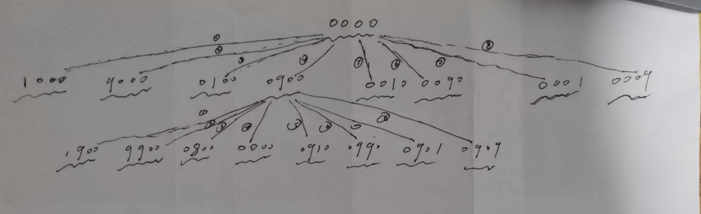

# [LeetCode-752. 打开转盘锁-中等](https://leetcode.cn/problems/open-the-lock/) 


## 我的解题

这道题是在阅读 labuladong [BFS 算法框架套路详解](https://mp.weixin.qq.com/s/WH_XGm1-w5882PnenymZ7g) 时发现的，它的典型的state- space-search，"每次旋转都只能旋转一个拨轮的一位数字"，在每个拨轮有如下两个选择:

1、上拨

2、下拨

它的state-space如下: 



可以看到，它是一棵"八叉树"，上述state-space罗列了它的所有的可能state，这些state之间的转换是按照题目要求的"每次旋转都只能旋转一个拨轮的一位数字"而生成的，显然实际的旋转也是需要按照这个规则进行，所以上述state-space是正确的，题目要求的最短路径其实就是从source到goal的最短路径，显然这是可以通过BFS实现的。


```C++
#include <bits/stdc++.h>
using namespace std;
class Solution
{
public:
	int openLock(vector<string> &deadends, string target)
	{
		unordered_set<string> deadend_set;
		deadend_set.insert(deadends.begin(), deadends.end());

		string start = "0000"; // 起始

		queue<string> q;
		q.push(start);

		unordered_set<string> vis;
		vis.insert(start);

		int depth = 1;
		while (!q.empty())
		{
			int sz = q.size();
			for (int i = 0; i < sz; ++i)
			{
				string cur = q.front();
				q.pop();
				if (cur == target)
				{
					return depth - 1;
				}
				if (deadend_set.count(cur)) // 是deadend，需要摒弃
				{
					continue;
				}
				for (int i = 0; i < 4; ++i)
				{
					string newNode = AddOne(cur, i);
					if (!vis.count(newNode))
					{
						q.push(newNode);
						vis.emplace(newNode);
					}
					newNode = MinusOne(cur, i);
					if (!vis.count(newNode))
					{
						q.push(newNode);
						vis.emplace(newNode);
					}
				}

			}
			++depth;
		}
		return -1;
	}

	string AddOne(string s, int location)
	{
		if (s[location] == '9')
		{
			s[location] = '0';
		}
		else
		{
			s[location] += 1;
		}
		return s;
	}
	string MinusOne(string s, int location)
	{
		if (s[location] == '0')
		{
			s[location] = '9';
		}
		else
		{
			s[location] -= 1;
		}
		return s;
	}
};

// Driver code
int main()
{

	Solution solu;
	vector<int> nums = { 1, 3, 5, 4, 7 };
	return 0;
}
// g++ test.cpp --std=c++11 -pedantic -Wall -Wextra


```


## [LeetCode-【宫水三叶】一题三解：「双向 BFS」& 「AStar 算法」&「IDA* 算法」](https://leetcode.cn/problems/open-the-lock/solution/gong-shui-san-xie-yi-ti-shuang-jie-shuan-wyr9/)

> NOTE: 这篇文章非常好。

回到本题，根据题意，可以确定这是一个「最短路/最小步数」问题。

此类问题，通常我们会使用「BFS」求解，但朴素的 BFS 通常会带来搜索空间爆炸问题。

> NOTE: 
>
> 朴素BFS的缺陷: 空间爆炸。

### 双向 BFS

我们知道，递归树的展开形式是一棵多阶树。

使用朴素 BFS 进行求解时，队列中最多会存在“两层”的搜索节点。

因此搜索空间的上界取决于 **目标节点所在的搜索层次的深度所对应的宽度**。

> NOTE: 
>
> 一、上面这段话所描述的其实是BFS的space-complexity


下图展示了朴素 BFS 可能面临的搜索空间爆炸问题：


**在朴素的 BFS 实现中，空间的瓶颈主要取决于搜索空间中的最大宽度**。

那么有没有办法让我们不使用这么宽的搜索空间，同时又能保证搜索到目标结果呢？

「双向 BFS」 可以很好的解决这个问题：

**同时从两个方向开始搜索，一旦搜索到相同的值，意味着找到了一条联通起点和终点的最短路径。**

对于「有解」、「有一定数据范围」同时「层级节点数量以**倍数**或者**指数**级别增长」的情况，「双向 BFS」的搜索空间通常只有「朴素 BFS」的空间消耗的几百分之一，甚至几千分之一。


「双向 BFS」的基本实现思路如下：

1、创建「两个队列」分别用于两个方向的搜索；

2、创建「两个哈希表」用于「解决相同节点重复搜索」和「记录转换次数」；

3、为了尽可能让两个搜索方向“平均”，每次从队列中取值进行扩展时，先判断哪个队列容量较少；

4、如果在搜索过程中「搜索到对方搜索过的节点」，说明找到了最短路径。

「双向 BFS」基本思路对应的伪代码大致如下：

```java
d1、d2 为两个方向的队列
m1、m2 为两个方向的哈希表，记录每个节点距离起点的
    
// 只有两个队列都不空，才有必要继续往下搜索
// 如果其中一个队列空了，说明从某个方向搜到底都搜不到该方向的目标节点
while(!d1.isEmpty() && !d2.isEmpty()) {
    if (d1.size() < d2.size()) {
        update(d1, m1, m2);
    } else {
        update(d2, m2, m1);
    }
}

// update 为将当前队列 d 中包含的元素取出，进行「一次完整扩展」的逻辑（按层拓展）
void update(Deque d, Map cur, Map other) {}

```

回到本题，我们看看如何使用「双向 BFS」进行求解。

### Java

```java
class Solution {
    String t, s;
    Set<String> set = new HashSet<>();
    public int openLock(String[] _ds, String _t) {
        s = "0000";
        t = _t;
        if (s.equals(t)) return 0;
        for (String d : _ds) set.add(d);
        if (set.contains(s)) return -1;
        int ans = bfs();
        return ans;
    }
    int bfs() {
        // d1 代表从起点 s 开始搜索（正向）
        // d2 代表从结尾 t 开始搜索（反向）
        Deque<String> d1 = new ArrayDeque<>(), d2 = new ArrayDeque<>();
        /*
         * m1 和 m2 分别记录两个方向出现的状态是经过多少次转换而来
         * e.g.
         * m1 = {"1000":1} 代表 "1000" 由 s="0000" 旋转 1 次而来
         * m2 = {"9999":3} 代表 "9999" 由 t="9996" 旋转 3 次而来
         */
        Map<String, Integer> m1 = new HashMap<>(), m2 = new HashMap<>();
        d1.addLast(s);
        m1.put(s, 0);
        d2.addLast(t);
        m2.put(t, 0);

        /*
         * 只有两个队列都不空，才有必要继续往下搜索
         * 如果其中一个队列空了，说明从某个方向搜到底都搜不到该方向的目标节点
         * e.g. 
         * 例如，如果 d1 为空了，说明从 s 搜索到底都搜索不到 t，反向搜索也没必要进行了
         */
        while (!d1.isEmpty() && !d2.isEmpty()) {
            int t = -1;
            if (d1.size() <= d2.size()) {
                t = update(d1, m1, m2);
            } else {
                t = update(d2, m2, m1);
            }
            if (t != -1) return t;
        }
        return -1;       
    }
    int update(Deque<String> deque, Map<String, Integer> cur, Map<String, Integer> other) {
        int m = deque.size();
        while (m-- > 0) {
            String poll = deque.pollFirst();
            char[] pcs = poll.toCharArray();
            int step = cur.get(poll);
            // 枚举替换哪个字符
            for (int i = 0; i < 4; i++) {
                // 能「正向转」也能「反向转」，这里直接枚举偏移量 [-1,1] 然后跳过 0
                for (int j = -1; j <= 1; j++) {
                    if (j == 0) continue;

                    // 求得替换字符串 str
                    int origin = pcs[i] - '0';
                    int next = (origin + j) % 10;
                    if (next == -1) next = 9;

                    char[] clone = pcs.clone();
                    clone[i] = (char)(next + '0');
                    String str = String.valueOf(clone);

                    if (set.contains(str)) continue;
                    if (cur.containsKey(str)) continue;

                    // 如果在「另一方向」找到过，说明找到了最短路，否则加入队列
                    if (other.containsKey(str)) { 
                        return step + 1 + other.get(str);
                    } else {
                        deque.addLast(str);
                        cur.put(str, step + 1);
                    }
                }
            }
        }
        return -1;
    }
}

```

> NOTE:
>
> 一、`Map<String, Integer> m1 = new HashMap<>(), m2 = new HashMap<>();`
>
> 上述`m1`、`m2` 就是visited set，它们既起到了去重的作用又起到了记录距离值的作用。

### C++

```C++
class Solution
{
public:
  string src, target_;
  unordered_set<string> deadend_set;
  int openLock(vector<string> &deadends, string target)
  {
    src = "0000";
    target_ = target;
    if (src == target_)
    {
      return 0;
    }
    for (const auto &d : deadends)
    {
      deadend_set.insert(d);
    }
    if (deadend_set.count(src))
    {
      return -1;
    }
    int ans = bfs();
    return ans;
  }
  int bfs()
  {
    queue<string> q1, q2;
    unordered_map<string, int> m1, m2;
    q1.push(src);
    m1[src] = 0;
    q2.push(target_);
    m2[target_] = 0;
    while (q1.size() && q2.size())
    {
      int t = -1;
      if (q1.size() <= q2.size())
      {
        t = update(q1, m1, m2);
      }
      else
      {
        t = update(q2, m2, m1);
      }
      if (t != -1)
        return t;
    }
    return -1;
  }
  /**
   * @brief q1, q2两个queue的expand都可以使用这个函数来进行实现
   *
   * @param q
   * @param cur
   * @param other
   * @return int
   */
  int update(queue<string> &q, unordered_map<string, int> &cur, unordered_map<string, int> &other)
  {
    int m = q.size();
    while (m-- > 0)
    {
      string t = q.front();
      q.pop();
      int step = cur[t];
      for (int i = 0; i < 4; i++)
      {
        for (int j = -1; j <= 1; j++)
        {
          if (j == 0)
            continue;
          int origin = t[i] - '0';
          int next = (origin + j) % 10;
          if (next == -1)
            next = 9;
          string copy = t;
          copy[i] = '0' + next;
          if (deadend_set.count(copy) || cur.count(copy))
          {
            continue;
          }
          if (other.count(copy)) // 两者meet了
          {
            return step + 1 + other[copy];
          }
          else
          {
            q.push(copy);
            cur[copy] = step + 1;
          }
        }
      }
    }
    return -1;
  }
};

```


## [LeetCode-【中规中矩】752. 打开转盘锁（宽度优先搜索）](https://leetcode.cn/problems/open-the-lock/solution/zhong-gui-zhong-ju-kuan-du-you-xian-sou-suo-by-jyj/)


```C++
// With deadends
class Solution {
public:
    int openLock(vector<string>& deadends, string target) {
        queue<string> q{{"0000"}};
        unordered_set<string> visited;
        unordered_set<string> deads(deadends.begin(), deadends.end());

        int steps = 0;
        while (!q.empty()) {
            int size = q.size();
            while (size--) {
                auto cur = q.front(); q.pop();
                if (cur == target) {
                    return steps;
                }

                if (deads.count(cur) || visited.count(cur)) { //只多了前半部分的check deadends
                    continue;
                }
                visited.insert(cur);

                for (int i = 0; i < 4; i++) {
                    q.push(plusOne(cur, i));
                    q.push(minusOne(cur, i));
                }
            }
            steps++;
        }

        return -1;
    }

private:
    string plusOne(string cur, int j) {
        auto res = cur;
        res[j] = ((res[j] - '0' + 1) % 10) + '0';
        return res;
    }

    string minusOne(string cur, int j) {
        auto res = cur;
        res[j] = ((res[j] - '0' - 1 + 10) % 10) + '0';
        return res;
    }
};

```


## [LeetCode-C++ BFS 转动开锁](https://leetcode.cn/problems/open-the-lock/solution/c-bfs-jie-jue-zhuan-dong-kai-suo-by-bei-lpvye/)

```C++
class Solution {
public:
    int openLock(vector<string>& deadends, string target) {
        // 哈希表vis中存储不可能入队的结点，包括deadends和已访问过的结点
        unordered_set<string> vis;
        vis.insert(deadends.begin(), deadends.end()); 
        if(vis.count("0000")) 
            return -1;
        int step = 0;
        queue<string> st;
        st.push("0000");
        while(!st.empty()){            
            int length = st.size();
            for(int i = 0; i < length; i++){
                string curr = st.front();
                st.pop();
                // 找到目标元素，直接返回答案
                if(curr == target)
                    return step;
                // 处理curr周围的八个相邻结点
                for(int j = 0; j < 4; ++j){
                    // 自增1与自减1
                    for(int t = -1; t < 2; t += 2){
                        // 完美的字符处理方式，利用ascⅡ码之差之后加上t并取余作为新得到的整型，然后再加上0的ascⅡ码值返回字符
                        char a = (curr[j] -'0' + 10 + t) % 10 + '0';
                        string newOne = curr;
                        newOne[j] = a;
                        // 若哈希集中找不到此状态，则加入哈希集同时入队
                        if(!vis.count(newOne)){
                            st.push(newOne);
                            vis.emplace(newOne);
                        }
                    }                 
                }
            }
            // 本层队列中元素处理完成，到达下一转动步数，步数加1
            step++;
        }
        return -1;
    }
};

```


## 两种往visited array中添加节点的方式


1、先判断是否visited，如果是，则不入queue

" [LeetCode-752. 打开转盘锁-中等](https://leetcode.cn/problems/open-the-lock/) # 我的解"题中，就是采用的这种方式

2、先入queue，然后再入visited

"[LeetCode【中规中矩】752. 打开转盘锁（宽度优先搜索）](https://leetcode.cn/problems/open-the-lock/solution/zhong-gui-zhong-ju-kuan-du-you-xian-sou-suo-by-jyj/) "中，就是使用的这种方式


