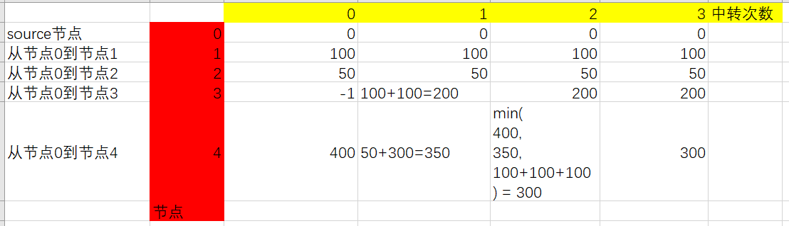

# LeetCode [787. K 站中转内最便宜的航班](https://leetcode-cn.com/problems/cheapest-flights-within-k-stops/) 

需要注意"中转次数"的含义:

1、中转0次，表示直达

2、中转1次，表示两个节点之间有一个节点连接

3、理论上，一个由N个节点组成的graph，最大的中转次数为: N - 2


## 我的解题: dijkstra 算法

一、在`K`次中转中，能够到达的所有节点中，寻找目标节点；

二、采用greedy的方式，每次先找到的，就是最优的

三、这种解法其实是对dijkstra 算法进行了一点小变形: 增加了次数的限制。

```C++
#include <bits/stdc++.h>
using namespace std;
class Solution
{
public:
	int findCheapestPrice(int n, vector<vector<int>> &flights, int src, int dst, int k)
	{
		// 构建图
		vector<vector<int>> graph(n, vector<int>(n, 0));
		for (auto &flight : flights)
		{
			graph[flight[0]][flight[1]] = flight[2];
		}

		// 优先级队列，按照价格的最小堆
		auto cmp = [](const vector<int> &a, const vector<int> &b) -> bool
		{
			return a[1] > b[1];
		};
		priority_queue<vector<int>, deque<vector<int>>, decltype(cmp)> q(cmp);
		// 插入到数组里： 当前点，价格，最大飞行次数（K=0的时候也能至少飞一次，所以是中转次数+1）
		q.push( { src, 0, k + 1 }); // 初始化q

		while (!q.empty())
		{
			const vector<int> &curr = q.top();
			int node = curr[0];
			int price = curr[1];
			int k = curr[2];
			q.pop();

			if (node == dst)
			{
				return price;
			}

			// 判断是否还可以再飞一次
			if (k > 0)
			{
				// 遍历目前可以达到的边
				for (int i = 0; i < n; ++i)
				{
					if (graph[node][i] > 0)
					{
						q.push( { i, price + graph[node][i], k - 1 });
					}
				}
			}

		}
		return -1;
	}
};

// Driver code
int main()
{

	Solution solu;
	vector<int> nums = { 1, 3, 5, 4, 7 };
	return 0;
}
// g++ test.cpp --std=c++11 -pedantic -Wall -Wextra


```

这种解法是会超出时间限制的。


## 我的解题: 动态规划

状态:

1、k

2、节点

选择:

当有多个parent的时候，从哪个parent节点过来，这是比较特殊的，由于不同的节点，它的parent的个数不同，因此可能的选择是不同的；

### 结合具体例子来思考递归方程





### 递归方程

```
m(v, k) 表示从source节点到v节点，中转k次的最便宜的价格
Parent(v) 表示节点v的parent节点
Price(u, v) 表示从节点u到节点v的价格，其实就是图的权重
m(v, k) = min(m(v, k-1), m(Parent(v), k-1) + Price(Parent(v), v))

base case:

所有直接与source节点，都不需要经过中转(k=0)，它们的最小价格是可以直接获得的。

```

解释：

1、如果能够结果k-1次到达v，那么肯定能够经过k次到达v，所以:

```
m(v, k) = m(v, k-1)
```


### 完整程序

```C++
#include <bits/stdc++.h>
using namespace std;
class Solution
{
public:
	int findCheapestPrice(int n, vector<vector<int>> &flights, int src, int dst, int k)
	{
		int col = k + 1; //列数，从0-k，一共有k+1列
		vector<vector<long>> dp(n, vector<long>(col, INT_MAX));
		// base case
		for (int i = 0; i < col; ++i)
		{
			dp[src][i] = 0; // 从src到src，它的价格是0
		}
		for (auto &&flight : flights)
		{
			int src_node = flight[0]; // 源节点
			int dest_node = flight[1]; // 目标节点
			int weight = flight[2];
			if (src_node == src) // 是源节点
			{
				dp[dest_node][0] = weight;
			}
		}
		for (int i = 1; i <= k; ++i)
		{
			for (auto &&flight : flights)
			{
				int src_node = flight[0]; // 源节点
				int dest_node = flight[1]; // 目标节点
				int weight = flight[2];
				dp[dest_node][i] = min( { dp[dest_node][i - 1], dp[dest_node][i], dp[src_node][i - 1] + weight });
			}
		}
		return dp[dst][k] == INT_MAX ? -1 : dp[dst][k];
	}
};

// Driver code
int main()
{

	Solution solu;
	vector<int> nums = { 1, 3, 5, 4, 7 };
	return 0;
}
// g++ test.cpp --std=c++11 -pedantic -Wall -Wextra


```

需要注意的是一点是:

由于可能存在 `INT_MAX + weight` 而导致integer overflow，因此:

```C++
vector<vector<long>> dp(n, vector<long>(col, INT_MAX));
```

声明为`long`，这样就可以有效避免integer overflow

## leetcode [【中规中矩】Bellman Ford 动态规划两种写法](https://leetcode-cn.com/problems/cheapest-flights-within-k-stops/solution/zhong-gui-zhong-ju-bellman-ford-dong-tai-gui-hua-l/)

### 动态规划

```C++
class Solution {
public:
    int findCheapestPrice(int N, vector<vector<int>>& flights, int src, int dst, int K) {
       vector<vector<long>> dp(N, vector<long>(K + 1, INT_MAX));
       K = min(K, N - 2);
       // Base case direct flight
       dp[src][0] = 0;
       for (const auto& flight : flights) {
           auto start = flight[0];
           auto end = flight[1];
           auto price = flight[2];
           if (start == src) {
                dp[end][0] = min(dp[end][0], (long)price); 
           }
       } 

       for (int k = 1; k <= K; k++) {
            for (const auto& flight : flights) {
                auto u = flight[0];
                auto v = flight[1];
                auto w = flight[2];
                // The minimum price of reach end in k steps is the minimum of w (price) 
                // of reaching v in k - 1 steps (no need to transfer at step k) and
                // the mimimum of reaching end v in k steps.
                dp[v][k] = min({dp[v][k - 1], dp[v][k], dp[u][k - 1] + w}); 
            }
       }
       return dp[dst][K] == INT_MAX ? -1 : dp[dst][K];
    }
};

```

