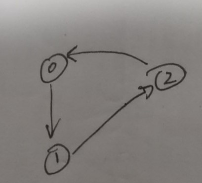

# Topological sorting

素材: 

labuladong [拓扑排序，YYDS！](https://mp.weixin.qq.com/s/7nP92FhCTpTKIAplj_xWpA)

jianshu [拓扑排序(一)——有向图成环检测](https://www.jianshu.com/p/d6042b659f70)

csdn [[ZZ]如何判断有向图是否成环](https://blog.csdn.net/leonsc/article/details/5973209)

csdn [数据结构 图 有向无环图](https://blog.csdn.net/nomad2/article/details/1559664)

csdn [拓扑排序判断有向图是否成环](https://blog.csdn.net/qq_40642465/article/details/80670269)


## wikipedia [Topological sorting](https://en.wikipedia.org/wiki/Topological_sorting)

In [computer science](https://en.wikipedia.org/wiki/Computer_science), a **topological sort** or **topological ordering** of a [directed graph](https://en.wikipedia.org/wiki/Directed_graph) is a [linear ordering](https://en.wikipedia.org/wiki/Total_order) of its [vertices](https://en.wikipedia.org/wiki/Vertex_(graph_theory)) such that for every directed edge *uv* from vertex *u* to vertex *v*, *u* comes before *v* in the ordering. 

> NOTE: linear ordering是一个logical structure

For instance, the vertices of the graph may represent tasks to be performed, and the edges may represent constraints that one task must be performed before another; in this application, a topological ordering is just a valid sequence for the tasks. 

> NOTE: 上述是典型的dependency graph

A topological ordering is possible if and only if the graph has no [directed cycles](https://en.wikipedia.org/wiki/Directed_cycle), that is, if it is a [directed acyclic graph](https://en.wikipedia.org/wiki/Directed_acyclic_graph) (DAG). Any DAG has at least one topological ordering, and [algorithms](https://en.wikipedia.org/wiki/Algorithm) are known for constructing a topological ordering of any DAG in [linear time](https://en.wikipedia.org/wiki/Linear_time). Topological sorting has many applications especially in ranking problems such as [feedback arc set](https://en.wikipedia.org/wiki/Feedback_arc_set).

## Algorithms

### DFS VS BFS

两种算法:DFS和BFS，相比之下，BFS是更加容易理解的，因为它是符合我们直接进行topological sorting的顺序的。

使用 "入度" 和 "长度"概念来对DFS和BFS进行理解:

|                 | BFS                                                          | DFS                                                          |
| --------------- | ------------------------------------------------------------ | ------------------------------------------------------------ |
|                 | 一个node，如果它的 "入度"  为0，则表示它没有依赖其他节点，它是**低阶课程**，应该优先学习 | 一个node，如果它的 "出度"  为0，则表示没有其它节点依赖它，它是**高阶课程**，应该最后学习 |
|                 | BFS优先寻找**低阶课程**，将它放到**队首**；                  | DFS优先寻找**高阶课程**，将它放到**栈底**；                  |
|                 | BFS中只需要**入度**即可: 它根据**入度**来寻找**低阶课程**；某个节点的入度如果非0，则表示它存在依赖； | DFS中只需要**出度**即可: 它根据**出度**来寻找**高阶课程**；  |
| data structure  | BFS使用queue；                                               | DFS使用stack；                                               |
| circle deadloop | BFS不需要处理circle deadloop                                 | DFS需要处理circle deadloop: 如果存在circle，那么在DFS circle的时候，肯定会回到原点，因此可以据此来判定是否有circle，一旦有circle，则直接break即可。 |
|                 | BFS其实是**正向排序**，它借助queue；                         | DFS其实是**逆向排序**，再借助stack进行逆向，从而可以得到正确的顺序 |
|                 |                                                              |                                                              |


### BFS / Kahn's algorithm

Q: 为什么不需要visited set？

A: Kahn's algorithm往队列中增加node是有条件的: 只有当in-degree为0的时候它才会往队列中插入node，而不是像普通的BFS那样碰到就插入，对于存在circle的graph，in-degree永远都不可能为0，所以会导致算法直接退出，所以它可以检测是否有环(cycle detection)。

在dependency graph中，in-degree就表示依赖。

One of these algorithms, first described by [Kahn (1962)](https://en.wikipedia.org/wiki/Topological_sorting#CITEREFKahn1962), works by choosing vertices in the same order as the eventual topological sort.[[2\]](https://en.wikipedia.org/wiki/Topological_sorting#cite_note-Kahn-2) First, find a list of **"start nodes"** that have no incoming edges and insert them into a set S; at least one such node must exist in a non-empty (finite) acyclic graph. Then:

```pseudocode
L ← Empty list that will contain the sorted elements
S ← Set of all nodes with no incoming edge

while S is not empty do
    remove a node n from S
    add n to L
    for each node m with an edge e from n to m do
        remove edge e from the graph
        if m has no other incoming edges then
            insert m into S

if graph has edges then
    return error   (graph has at least one cycle)
else 
    return L   (a topologically sorted order)
```

If the graph is a [DAG](https://en.wikipedia.org/wiki/Directed_acyclic_graph), a solution will be contained in the list L (although the solution is not necessarily unique). Otherwise, the graph must have at least one cycle and therefore a topological sort is impossible.

#### gpt-4o

**Kahn's Algorithm** is a popular method for performing **topological sorting** on a **Directed Acyclic Graph (DAG)**. **Topological sorting** is a linear ordering of vertices such that for every directed edge \( $u \rightarrow v$ \), vertex \( u \) comes before vertex \( v \) in the ordering.

##### Steps of Kahn's Algorithm

1. **Calculate In-Degree**:
   - Compute the **in-degree** (number of **incoming edges**) for each vertex in the graph.

2. **Initialize Queue**:
   - Initialize a queue and enqueue all vertices with in-degree 0 (i.e., vertices with no incoming edges).

3. **Process Queue**:
   - While the queue is not empty:
     - Dequeue a vertex \( u \) from the queue and add it to the **topological order**.
     - For each outgoing edge \( $u \rightarrow v$ \):
       - Decrease the **in-degree** of vertex \( v \) by 1.
       - If the in-degree of vertex \( v \) becomes 0, enqueue \( v \).

4. **Check for Cycles**:
   - If the number of vertices in the **topological order** is less than the total number of vertices in the graph, the graph contains a cycle, and **topological sorting** is not possible.

##### Example Code

Here is a Python implementation of Kahn's Algorithm:

```python
from collections import deque
from typing import *


def kahn_topological_sort(graph: Dict):
    # Step 1: Calculate in-degree of each vertex
    in_degree: Dict = {u: 0 for u in graph}
    for u in graph:
        for v in graph[u]:
            in_degree[v] += 1

    # Step 2: Initialize queue with vertices having in-degree 0
    queue = deque([u for u in graph if in_degree[u] == 0])

    topological_order = []

    # Step 3: Process the queue
    while queue:
        u = queue.popleft()
        topological_order.append(u)

        # Decrease the in-degree of all adjacent vertices
        for v in graph[u]:
            in_degree[v] -= 1
            if in_degree[v] == 0:
                queue.append(v)

    # Step 4: Check for cycles
    if len(topological_order) == len(graph):
        return topological_order
    else:
        raise ValueError("The graph contains a cycle, and topological sorting is not possible.")


def main():
    # Example graph represented as an adjacency list
    graph = {
        'A': ['C'],
        'B': ['C', 'D'],
        'C': ['E'],
        'D': ['F'],
        'E': ['H', 'F'],
        'F': ['G'],
        'G': [],
        'H': []
    }

    try:
        topological_order = kahn_topological_sort(graph)
        print("Topological Order:", topological_order)
    except ValueError as e:
        print(e)


if __name__ == "__main__":
    main()

```

##### Explanation

1. **Graph Representation**:
   - The graph is represented as an adjacency list using a dictionary where each key is a vertex, and the corresponding value is a list of adjacent vertices.

2. **Calculate In-Degree**:
   - Initialize the in-degree of each vertex to 0.
   - Iterate through the graph to compute the in-degree of each vertex.

3. **Initialize Queue**:
   - Use a deque (double-ended queue) to store vertices with in-degree 0.

4. **Process Queue**:
   - Dequeue a vertex, add it to the topological order, and decrease the in-degree of its adjacent vertices.
   - If the in-degree of an adjacent vertex becomes 0, enqueue it.

5. **Check for Cycles**:
   - If the length of the topological order is less than the number of vertices in the graph, a cycle exists, and topological sorting is not possible.

##### Running the Code

When you run the code, it will output the topological order of the given graph:

```
Topological Order: ['A', 'B', 'C', 'D', 'E', 'H', 'F', 'G']
```

##### Summary

- **Kahn's Algorithm**: A method for topological sorting of a DAG using in-degree and a queue.
- **Steps**: Calculate in-degree, initialize queue, process queue, and check for cycles.
- **Implementation**: The provided Python code demonstrates the algorithm with an example graph.

This implementation provides a clear and efficient way to perform topological sorting on a DAG using Kahn's Algorithm.


### DFS

eli.thegreenplace [Directed graph traversal, orderings and applications to data-flow analysis](https://eli.thegreenplace.net/2015/directed-graph-traversal-orderings-and-applications-to-data-flow-analysis/) 

> In fact, the RPO of a DAG has another name - *topological sort*.

#### gpt-4o: topological sorting with cycle detection by dfs  python

**Topological sorting** of a **Directed Acyclic Graph (DAG)** can be performed using **Depth-First Search (DFS)**. However, if the graph contains cycles, topological sorting is not possible. Therefore, we need to include **cycle detection** in our DFS-based topological sorting algorithm.

##### Steps of Topological Sorting with Cycle Detection Using DFS

1. **Initialize Data Structures**:
   - Use a set to keep track of visited vertices.
   - Use a set to keep track of vertices in the current recursion stack (to detect cycles).
   - Use a list to store the topological order.

2. **DFS Function with Cycle Detection**:
   - Implement a recursive DFS function that visits each vertex and its adjacent vertices.
   - If a vertex is encountered that is already in the current recursion stack, a cycle is detected.
   - Once all adjacent vertices of a vertex are visited, add the vertex to the topological order list.

3. **Main Function**:
   - Iterate through all vertices and call the DFS function for each unvisited vertex.
   - If a cycle is detected during the DFS, raise an exception or handle it appropriately.
   - After all vertices are processed, the topological order list will contain the vertices in reverse order.

##### Example Code

Here is a Python implementation of topological sorting with cycle detection using DFS:

```python
def dfs(graph, node, visited, rec_stack, topological_order):
    """
    Perform DFS on the graph starting from the given node with cycle detection.

    :param graph: Dictionary representing the adjacency list of the graph.
    :param node: The starting node for DFS.
    :param visited: Set to keep track of visited nodes.
    :param rec_stack: Set to keep track of nodes in the current recursion stack.
    :param topological_order: List to store the topological order.
    :return: True if a cycle is detected, False otherwise.
    """
    visited.add(node)  # Mark the node as visited
    rec_stack.add(node)  # Add the node to the recursion stack

    for neighbor in graph[node]:
        if neighbor not in visited:
            if dfs(graph, neighbor, visited, rec_stack, topological_order):
                return True
        elif neighbor in rec_stack:
            return True  # Cycle detected

    rec_stack.remove(node)  # Remove the node from the recursion stack
    topological_order.append(node)  # Add the node to the topological order
    return False

def topological_sort_dfs(graph):
    """
    Perform topological sorting on the graph using DFS with cycle detection.

    :param graph: Dictionary representing the adjacency list of the graph.
    :return: List representing the topological order.
    :raises ValueError: If the graph contains a cycle.
    """
    visited = set()  # Set to keep track of visited nodes
    rec_stack = set()  # Set to keep track of nodes in the current recursion stack
    topological_order = []  # List to store the topological order

    # Call DFS for each unvisited vertex
    for node in graph:
        if node not in visited:
            if dfs(graph, node, visited, rec_stack, topological_order):
                raise ValueError("The graph contains a cycle, and topological sorting is not possible.")

    # The topological order list contains the topological order in reverse
    return topological_order[::-1]

def main():
    # Example graph represented as an adjacency list
    graph = {
        'A': ['C'],
        'B': ['C', 'D'],
        'C': ['E'],
        'D': ['F'],
        'E': ['H', 'F'],
        'F': ['G'],
        'G': [],
        'H': []
    }

    try:
        topological_order = topological_sort_dfs(graph)
        print("Topological Order:", topological_order)
    except ValueError as e:
        print(e)

if __name__ == "__main__":
    main()
```

##### Explanation

1. **Graph Representation**:
   - The graph is represented as an adjacency list using a dictionary where each key is a vertex, and the corresponding value is a list of adjacent vertices.

2. **DFS Function with Cycle Detection**:
   - The `dfs` function takes the graph, the current node, the set of visited nodes, the recursion stack, and the topological order list as arguments.
   - It marks the current node as visited and adds it to the recursion stack.
   - It recursively visits all unvisited neighbors. If a neighbor is already in the recursion stack, a cycle is detected.
   - After visiting all neighbors, it removes the current node from the recursion stack and adds it to the topological order list.

3. **Topological Sort Function**:
   - The `topological_sort_dfs` function initializes the visited set, the recursion stack, and the topological order list.
   - It iterates through all vertices and calls the `dfs` function for each unvisited vertex.
   - If a cycle is detected during the DFS, it raises a `ValueError`.
   - The topological order list contains the topological order in reverse, so it returns the reversed list.

4. **Main Function**:
   - Initializes the graph and calls the `topological_sort_dfs` function.
   - Prints the topological order or the error message if a cycle is detected.

##### Running the Code

When you run the code, it will output the topological order of the given graph:

```
Topological Order: ['B', 'D', 'A', 'C', 'E', 'H', 'F', 'G']
```

If the graph contains a cycle, it will raise an exception and print the error message:

```
The graph contains a cycle, and topological sorting is not possible.
```

##### Summary

- **Topological Sorting with Cycle Detection Using DFS**: A method for topological sorting of a DAG with cycle detection using a recursive DFS approach.
- **Steps**: Initialize data structures, implement DFS function with cycle detection, and call DFS for each unvisited vertex.
- **Implementation**: The provided Python code demonstrates the algorithm with an example graph.

This implementation provides a clear and efficient way to perform topological sorting on a DAG with cycle detection using a DFS approach.


## LeetCode-课程表系列

| LeetCode                                                     | 算法 |
| ------------------------------------------------------------ | ---- |
| [LeetCode-207. 课程表](https://leetcode.cn/problems/course-schedule/) |      |
| [LeetCode-210. 课程表 II](https://leetcode.cn/problems/course-schedule-ii/) |      |
| [LeetCode-630. 课程表 III](https://leetcode.cn/problems/course-schedule-iii/) |      |
| [LeetCode-1462. 课程表 IV](https://leetcode.cn/problems/course-schedule-iv/) |      |

Dependency graph模型:

首先需要根据 `prerequisites` 数组构建出dependency graph，这样能够找到它的相邻节点，原味给出的解法中都是使用的**adjacent list**，题目描述如下:

> 在选修某些课程之前需要一些先修课程。 先修课程按数组 prerequisites 给出，其中 prerequisites[i] = [ai, bi] ，表示如果要学习课程 ai 则 必须 先学习课程  bi 。

则说明在dependency graph中，存在从bi->ai的边，也就说明ai位于bi的adjacency list中，在dependency graph中，in-degree就表示依赖。


## [LeetCode-207. 课程表](https://leetcode.cn/problems/course-schedule/) 


### [力扣官方题解](https://leetcode.cn/problems/course-schedule/solution/ke-cheng-biao-by-leetcode-solution/)

> NOTE: 这个题只需要判断是否存在circle，即circle detection
>

1、如果图 `G` 中存在环（即图 `G` 不是「有向无环图」），那么图 `G` 不存在**拓扑排序**。

这是因为假设图中存在环 $x_1, x_2, \cdots, x_n, x_1$ ，那么 $x_1$ 在排列中必须出现在 $x_n$的前面，但 $x_n$ 同时也必须出现在 $x_1$  的前面，因此不存在一个满足要求的排列，也就不存在拓扑排序；

> NOTE: 上述使用的是反证法: 自相矛盾，在实现topological sorting的时候，一个非常重要的问题是circle，一旦有circle则无法进行topological sorting
>

2、如果图 $G$ 是有向无环图，那么它的拓扑排序可能不止一种。举一个最极端的例子，如果图 $G$ 值包含 $n$ 个节点却没有任何边，那么任意一种编号的排列都可以作为拓扑排序。

#### 方法一：深度优先搜索

#### **算法**

对于图中的任意一个节点，它在搜索的过程中有**三种状态**，即：

1、「未搜索」：我们还没有搜索到这个节点；

2、**「搜索中」**：我们搜索过这个节点，但还没有回溯到该节点，即该节点还没有入栈，还有相邻的节点没有搜索完成）；

3、「已完成」：我们搜索过并且回溯过这个节点，即该节点已经入栈，并且所有该节点的相邻节点都出现在栈的更底部的位置，满足拓扑排序的要求。

> NOTE: 
>
> 一、难点在于三种状态的处理
>
> 所谓的"搜索"，其实就是是否access、traverse、visited了这个节点:
>
> "**「搜索中」**" 表示 已经访问了这个节点，查看下面的code可知，它使用 `visited` array来记录节点的状态

通过上述的三种状态，我们就可以给出使用**深度优先搜索**得到**拓扑排序**的算法流程，在每一轮的搜索开始时，我们任取一个**「未搜索」**的节点开始进行深度优先搜索。

一、我们将当前搜索的节点 u 标记为**「搜索中」**，遍历该节点的每一个相邻节点 vv：

1、如果 v 为「未搜索」，那么我们开始搜索 v，待搜索完成回溯到 u；

2、如果 v 为「搜索中」，那么我们就找到了图中的一个环，因此是不存在拓扑排序的；

> NOTE: 
>
> 一、这是难以理解的地方，为什么呢？首先画个带环的图看看: 
>
> 
>
> 其中 简单理解是: 如果graph中存在circle，那么再DFS circle的时候，一定会回到原点，这种情况就是2中描述的情形。这是DFS graph中常用的通过`visited` array来判断是否存在环的方法。
>
> 这是典型的DFS判断graph中是否存在circle的情况，一般称之为为circle detection，因此这一步是这个算法的关键所在。

3、如果 v 为「已完成」，那么说明 v 已经在栈中了，而 u 还不在栈中，因此 u 无论何时入栈都不会影响到 (u, v)(u,v) 之前的拓扑关系，以及不用进行任何操作。

当 u 的所有相邻节点都为「已完成」时，我们将 u 放入栈中，并将其标记为「已完成」。

```C++
#include <vector>
#include <queue>
#include <iostream>
using namespace std;

class Solution {
private:
	vector<vector<int>> edges; // adjacency list
	vector<int> visited;
	bool valid = true;

public:
	void dfs(int u) {
		visited[u] = 1;
		for (int v : edges[u]) {
			if (visited[v] == 0) {
				dfs(v);
				if (!valid) {
					return;
				}
			}
			else if (visited[v] == 1) {
				valid = false;
				return;
			}
		}
		visited[u] = 2;
	}

	bool canFinish(int numCourses, vector<vector<int>>& prerequisites) {
		edges.resize(numCourses);
		visited.resize(numCourses);
		// 构建dependency graph
		for (const auto& info : prerequisites) {
			edges[info[1]].push_back(info[0]);
		}
		// 外面的这个for循环是非常有必要的，因为可能是非联通图，如果不加for的话，可能导致部分图未处理
		for (int i = 0; i < numCourses && valid; ++i) {
			if (!visited[i]) {
				dfs(i);
			}
		}
		return valid;
	}
};


int main()
{
	Solution s;
	int numCourses = 2;
	vector<vector<int>> prerequisites{ {1,0} };
	cout << s.canFinish(numCourses, prerequisites) << endl;
}

```


### BFS

```python
from collections import defaultdict, deque
from typing import *


class Solution:
    def canFinish(self, numCourses: int, prerequisites: List[List[int]]) -> bool:
        graph = defaultdict(list)
        for prep in prerequisites:
            graph[prep[1]].append(prep[0])
        for i in range(numCourses):
            if i not in graph:
                graph[i] = []
        in_degree = {node: 0 for node in graph}
        for node in graph:
            for adj_node in graph[node]:
                in_degree[adj_node] += 1
        q = deque([node for node in graph if in_degree[node] == 0])
        cnt = 0
        while q:
            node = q.popleft()
            cnt += 1
            for adj_node in graph[node]:
                in_degree[adj_node] -= 1
                if in_degree[adj_node] == 0:
                    q.append(adj_node)
        return cnt == numCourses

```


## [LeetCode-210. 课程表 II](https://leetcode.cn/problems/course-schedule-ii/)


### BFS

````python
from collections import defaultdict, deque
from typing import *


class Solution:
    def findOrder(self, numCourses: int, prerequisites: List[List[int]]) -> List[int]:
        topo_order = []
        graph = defaultdict(list)
        in_degree = [0] * numCourses
        for prep in prerequisites:
            graph[prep[1]].append(prep[0])
            in_degree[prep[0]] += 1
        q = deque([node for node in range(numCourses) if in_degree[node] == 0])
        while q:
            node = q.popleft()
            topo_order.append(node)
            for adj_node in graph.get(node, []):
                in_degree[adj_node] -= 1
                if in_degree[adj_node] == 0:
                    q.append(adj_node)
        if len(topo_order) == numCourses:
            return topo_order
        else:
            return []

````


## [LeetCode-630. 课程表 III](https://leetcode.cn/problems/course-schedule-iii/)


## [LeetCode-1462. 课程表 IV](https://leetcode.cn/problems/course-schedule-iv/)

