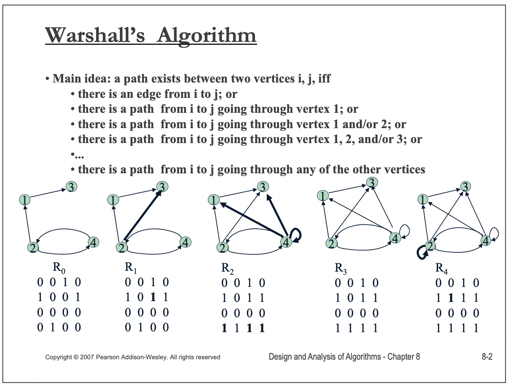

# Transitive closure

“closure"是”close“的名词形式。这个词在阅读过程中经常碰到，本文对它进行总结:

1、需要注意的是 [Closure (mathematics)](https://en.wikipedia.org/wiki/Closure_(mathematics)) 和 [Closure (computer programming)](https://en.wikipedia.org/wiki/Closure_(computer_programming)) 是两个完全不同的概念，不能够弄混。 

## Closure (mathematics)

- 在龙书中有关于闭包的描述
- 在离散数学的关系章节中有闭包的描述
- [Kleene star](https://en.wikipedia.org/wiki/Kleene_star)
- [Context-free grammar](https://en.wikipedia.org/wiki/Context-free_grammar#Closure_properties)中也有关于closure的描述
- 从[Formation rule](https://en.wikipedia.org/wiki/Formation_rule)/[Production rule](https://en.wikipedia.org/wiki/Production_(computer_science))的角度来看待闭包
- 从逻辑学推导的角度来看待闭包

我一直想要搞清楚的closure就是基于逻辑推导和集合论的。

[Set theory](https://en.wikipedia.org/wiki/Set_theory)是数学的基石所在，很多其他数学学科都是建立在它的基础之上。

### wikipedia [Closure (mathematics)](https://en.wikipedia.org/wiki/Closure_(mathematics))

> NOTE: 下面是我的一些理解:
>
> 1、重复运用一个relation，从而形成一条path。
>
> 

A [set](https://en.wikipedia.org/wiki/Set_(mathematics)) is **closed** under an [operation](https://en.wikipedia.org/wiki/Operation_(mathematics)) if performance of that operation on members of the set always produces a member of that set. 

#### Examples

1、[Recursive definition](https://en.wikipedia.org/wiki/Recursive_definition)

2、The [transitive closure](https://en.wikipedia.org/wiki/Transitive_set#Transitive_closure) of a [set](https://en.wikipedia.org/wiki/Set_(mathematics)).

3、In [formal languages](https://en.wikipedia.org/wiki/Formal_language), the [Kleene closure](https://en.wikipedia.org/wiki/Kleene_closure) of a language

## Transitive closure

一、在 [**TensorFlow: Large-Scale Machine Learning on Heterogeneous Distributed Systems**](http://download.tensorflow.org/paper/whitepaper2015.pdf) 中提及了**transitive closure：** 

> the TensorFlow implementation can compute the **transitive closure** of all nodes that must be executed in order to compute the outputs that were requested

二、在 https://cwiki.apache.org/confluence/display/ZOOKEEPER/PoweredBy 中也是用了transitive closure这个词语

### wikipedia [Transitive_closure](https://en.wikipedia.org/wiki/Transitive_closure)

#### Algorithms

The problem can also be solved by the [Floyd–Warshall algorithm](https://en.wikipedia.org/wiki/Floyd–Warshall_algorithm), or by repeated [breadth-first search](https://en.wikipedia.org/wiki/Breadth-first_search) or [depth-first search](https://en.wikipedia.org/wiki/Depth-first_search) starting from each node of the graph.

> NOTE: 
>
> 一、"repeated [breadth-first search](https://en.wikipedia.org/wiki/Breadth-first_search) or [depth-first search](https://en.wikipedia.org/wiki/Depth-first_search) starting from each node of the graph"
>
> 注意，需要为每个node都执行一次。
>
> 二、关于 Warshall’s Algorithm 的详细内容，winona [CS 440 Theory of Algorithms / CS 468 Algorithms in Bioinformatics](https://cs.winona.edu/lin/cs440/ch08-2.pdf) 中有着更好的描述
>
> 

### winona [CS 440 Theory of Algorithms / CS 468 Algorithms in Bioinformatics](https://cs.winona.edu/lin/cs440/ch08-2.pdf)

> NOTE: 在下一页中对path有着更好的说明

> NOTE: 
>
> 一、简而言之: 两个节点之间存在path有两种情况:
>
> 1、两个节点直接相连
>
> 2、两个节点间接相连: 通过其它中间节点连接，上述"going through"描述的就是间接链接
>
> 这两种情况，只要满足一个即可，因此逻辑关系使用 `OR` 。
>
> 

