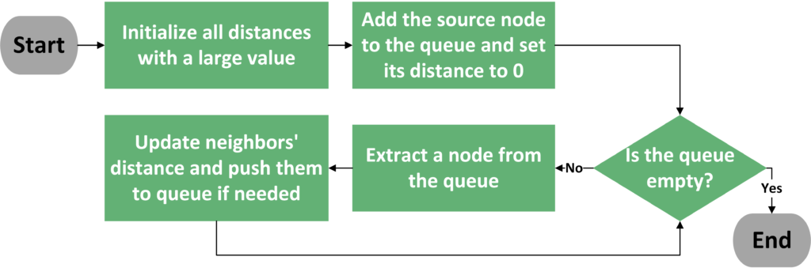

# Breadth-first search

一、labuladong 

1、labuladong [我写了一个模板，把 Dijkstra 算法变成了默写题](https://mp.weixin.qq.com/s?__biz=MzAxODQxMDM0Mw==&mid=2247492167&idx=1&sn=bc96c8f97252afdb3973c7d760edb9c0&scene=21#wechat_redirect)

> NOTE: 这篇文章中给出来具体的code

```java
// 输入起点，进行 BFS 搜索
int BFS(Node start) {
    Queue<Node> q; // 核心数据结构
    Set<Node> visited; // 避免走回头路

    q.offer(start); // 将起点加入队列
    visited.add(start);

    int step = 0; // 记录搜索的步数
    while (q not empty) {
        int sz = q.size();
        /* 将当前队列中的所有节点向四周扩散一步 */
        for (int i = 0; i < sz; i++) {
            Node cur = q.poll();
            printf("从 %s 到 %s 的最短距离是 %s", start, cur, step);

            /* 将 cur 的相邻节点加入队列 */
            for (Node x : cur.adj()) {
                if (x not in visited) {
                    q.offer(x);
                    visited.add(x);
                }
            }
        }
        step++;
    }
}
```

再加上 BFS 算法利用`for`循环一层一层向外扩散的逻辑和`visited`集合防止走回头路的逻辑，当你每次从队列中拿出节点`cur`的时候，从`start`到`cur`的最短权重就是`step`记录的步数。

2、labuladong [BFS 算法框架套路详解](https://mp.weixin.qq.com/s/WH_XGm1-w5882PnenymZ7g) 

3、labuladong [益智游戏克星：BFS暴力搜索算法](https://mp.weixin.qq.com/s/Xn-oW7QRu8spYzL3B6zLxw)

二、geeksforgeeks [Depth First Search or DFS for a Graph](https://www.geeksforgeeks.org/depth-first-search-or-dfs-for-a-graph/)


## wikipedia [Breadth-first search](https://en.wikipedia.org/wiki/Breadth-first_search)

**Breadth-first search** (**BFS**) is an [algorithm](https://en.wikipedia.org/wiki/Algorithm) for traversing or searching [tree](https://en.wikipedia.org/wiki/Tree_(data_structure)) or [graph](https://en.wikipedia.org/wiki/Graph_(data_structure)) data structures. It starts at the [tree root](https://en.wikipedia.org/wiki/Tree_(data_structure)#Terminology) (or some arbitrary node of a graph, sometimes referred to as a 'search key'[[1\]](https://en.wikipedia.org/wiki/Breadth-first_search#cite_note-1)), and explores all of the neighbor nodes at the present depth prior to moving on to the nodes at the next depth level.

> NOTE: 
>
> 1、"level"让我想到了hierarchy

### Pseudocode

**Input**: A graph *G* and a *starting vertex* *root* of *G*

**Output**: Goal state. The *parent* links trace the shortest path back to *root*[[7\]](https://en.wikipedia.org/wiki/Breadth-first_search#cite_note-7)

```pseudocode
 1  procedure BFS(G, root) is
 2      let Q be a queue
 3      label root as discovered
 4      Q.enqueue(root)
 5      while Q is not empty do
 6          v := Q.dequeue()
 7          if v is the goal then
 8              return v
 9          for all edges from v to w in G.adjacentEdges(v) do
10              if w is not labeled as discovered then
11                  label w as discovered
12                  Q.enqueue(w)
```


### Applications

Breadth-first search can be used to solve many problems in graph theory, for example:

1、Copying [garbage collection](https://en.wikipedia.org/wiki/Garbage_collection_(computer_science)), [Cheney's algorithm](https://en.wikipedia.org/wiki/Cheney's_algorithm)

2、Finding the [shortest path](https://en.wikipedia.org/wiki/Shortest_path) between two nodes *u* and *v*, with path length measured by number of edges (an advantage over [depth-first search](https://en.wikipedia.org/wiki/Depth-first_search))[[12\]](https://en.wikipedia.org/wiki/Breadth-first_search#cite_note-12)

> NOTE: 
>
> 一、BFS-VS-DFS
>
> 二、关于此，参见:
>
> 1、`BFS-shortest-path`

3、[(Reverse) Cuthill–McKee](https://en.wikipedia.org/wiki/Cuthill–McKee_algorithm) mesh numbering

4、[Ford–Fulkerson method](https://en.wikipedia.org/wiki/Ford–Fulkerson_algorithm) for computing the [maximum flow](https://en.wikipedia.org/wiki/Maximum_flow_problem) in a [flow network](https://en.wikipedia.org/wiki/Flow_network)

5、Serialization/Deserialization of a binary tree vs serialization in sorted order, allows the tree to be re-constructed in an efficient manner.

6、Construction of the *failure function* of the [Aho-Corasick](https://en.wikipedia.org/wiki/Aho-Corasick) pattern matcher.

7、Testing [bipartiteness of a graph](https://en.wikipedia.org/wiki/Bipartite_graph#Testing_bipartiteness).


## Queue machine

使用BFS的算法其实非常类似于queue machine，这是和[stack machine](https://en.wikipedia.org/wiki/Stack_machine)相对应的。在 baeldung [Difference Between BFS and Dijkstra’s Algorithms](https://www.baeldung.com/cs/graph-algorithms-bfs-dijkstra) 中，对queue machine的流程图有着非常好的描述:


> 


### 使用BFS的图类算法

使用BFS的图类算法:

1、[Topological sorting](https://en.wikipedia.org/wiki/Topological_sorting)

2、[Dijkstra’s algorithm](https://en.wikipedia.org/wiki/Dijkstra%27s_algorithm)

算法都非常类似于一个机器，加入一点原料后，开始运转。


## BFS-shortest-path

素材:

一、labuladong 

1、labuladong [我写了一个模板，把 Dijkstra 算法变成了默写题](https://mp.weixin.qq.com/s?__biz=MzAxODQxMDM0Mw==&mid=2247492167&idx=1&sn=bc96c8f97252afdb3973c7d760edb9c0&scene=21#wechat_redirect)

> NOTE: 这篇文章中给出来具体的code

```java
// 输入起点，进行 BFS 搜索
int BFS(Node start) {
    Queue<Node> q; // 核心数据结构
    Set<Node> visited; // 避免走回头路

    q.offer(start); // 将起点加入队列
    visited.add(start);

    int step = 0; // 记录搜索的步数
    while (q not empty) {
        int sz = q.size();
        /* 将当前队列中的所有节点向四周扩散一步 */
        for (int i = 0; i < sz; i++) {
            Node cur = q.poll();
            printf("从 %s 到 %s 的最短距离是 %s", start, cur, step);

            /* 将 cur 的相邻节点加入队列 */
            for (Node x : cur.adj()) {
                if (x not in visited) {
                    q.offer(x);
                    visited.add(x);
                }
            }
        }
        step++;
    }
}
```

再加上 BFS 算法利用`for`循环一层一层向外扩散的逻辑和`visited`集合防止走回头路的逻辑，当你每次从队列中拿出节点`cur`的时候，从`start`到`cur`的最短权重就是`step`记录的步数。

2、labuladong [BFS 算法框架套路详解](https://mp.weixin.qq.com/s/WH_XGm1-w5882PnenymZ7g) 

3、labuladong [益智游戏克星：BFS暴力搜索算法](