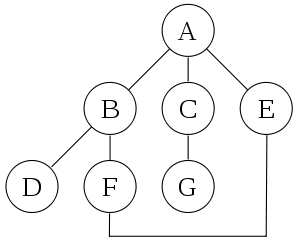

# Depth-first search


## wikipedia [Depth-first search](https://en.wikipedia.org/wiki/Depth-first_search)

**Depth-first search** (**DFS**) is an [algorithm](https://en.wikipedia.org/wiki/Algorithm) for traversing or searching [tree](https://en.wikipedia.org/wiki/Tree_data_structure) or [graph](https://en.wikipedia.org/wiki/Graph_(data_structure)) data structures. The algorithm starts at the [root node](https://en.wikipedia.org/wiki/Tree_(data_structure)#Terminology) (selecting some arbitrary node as the root node in the case of a graph) and explores as far as possible along each branch before **backtracking**.


### Properties

#### The [time](https://en.wikipedia.org/wiki/Time_complexity) and [space](https://en.wikipedia.org/wiki/Memory_management) analysis of DFS

### Example

### Pseudocode

**Input**: A graph *G* and a vertex *v* of G

**Output**: All vertices reachable from *v* labeled as discovered

#### Recursive implementation 

A recursive implementation of DFS:[[5\]](https://en.wikipedia.org/wiki/Depth-first_search#cite_note-5)

```pseudocode
procedure DFS(G, v) is
    label v as discovered
    for all directed edges from v to w that are in G.adjacentEdges(v) do
        if vertex w is not labeled as discovered then
            recursively call DFS(G, w)
```

> NOTE: 
>
> 1、上述code，并没有使用algorithm，仅仅是traverse

The order in which the vertices are discovered by this algorithm is called the [lexicographic order](https://en.wikipedia.org/wiki/Lexicographical_order).

#### Non-recursive implementation 

A non-recursive implementation of DFS with worst-case space complexity $O(|E|)$, with the possibility of duplicate vertices on the stack:[[6\]](https://en.wikipedia.org/wiki/Depth-first_search#cite_note-6)

> NOTE: 
>
> 1、"duplicate vertices on the stack"要如何理解？后面会进行分析
>
> 2、对于已经标注过的node

```pseudocode
procedure DFS_iterative(G, v) is
    let S be a stack
    S.push(v)
    while S is not empty do
        v = S.pop()
        if v is not labeled as discovered then
            label v as discovered
            for all edges from v to w in G.adjacentEdges(v) do 
                S.push(w)
```

#### 比较

These two variations of DFS visit the neighbors of each vertex in the opposite order from each other: 

the first neighbor of *v* visited by the recursive variation is the first one in the list of adjacent edges, while in the iterative variation the first visited neighbor is the last one in the list of adjacent edges. 

The recursive implementation will visit the nodes from the example graph in the following order: A, B, D, F, E, C, G. 

The non-recursive implementation will visit the nodes as: A, E, F, B, D, C, G.




The non-recursive implementation is similar to [breadth-first search](https://en.wikipedia.org/wiki/Breadth-first_search) but differs from it in two ways:

1、it uses a stack instead of a queue, and

2、it delays checking whether a vertex has been discovered until the vertex is popped from the stack rather than making this check before adding the vertex.

> NOTE: 
>
> 1、如果"making this check before adding the vertex"会怎样？

If *G* is a [tree](https://en.wikipedia.org/wiki/Tree_(data_structure)), replacing the queue of the breadth-first search algorithm with a stack will yield a depth-first search algorithm. For general graphs, replacing the stack of the iterative depth-first search implementation with a queue would also produce a breadth-first search algorithm, although a somewhat nonstandard one.[[7\]](https://en.wikipedia.org/wiki/Depth-first_search#cite_note-7)

#### Another possible implementation of iterative depth-first search

Another possible implementation of iterative depth-first search uses a stack of [iterators](https://en.wikipedia.org/wiki/Iterator) of the list of neighbors of a node, instead of a stack of nodes. This yields the same traversal as recursive DFS.[[8\]](https://en.wikipedia.org/wiki/Depth-first_search#cite_note-8)

```pseudocode
procedure DFS_iterative(G, v) is
    let S be a stack
    S.push(iterator of G.adjacentEdges(v))
    while S is not empty do
        if S.peek().hasNext() then
            w = S.peek().next()
            if w is not labeled as discovered then
                label w as discovered
                S.push(iterator of G.adjacentEdges(w))
        else
            S.pop()
```

> NOTE: 
>
> 1、上述code如何理解？

### Applications

Algorithms that use depth-first search as a building block include:

#### Connected components

1、Finding [connected components](https://en.wikipedia.org/wiki/Connected_component_(graph_theory)).

> NOTE: 
>
> 1、暂时没有接触


2、Finding 2-(edge or vertex)-connected components.

3、Finding 3-(edge or vertex)-connected components.

4、Finding [strongly connected components](https://en.wikipedia.org/wiki/Strongly_connected_components).

#### Topological sorting

1、[Topological sorting](https://en.wikipedia.org/wiki/Topological_sorting)

> NOTE: 
>
> 参见`Topological-sorting`章节

#### Bridges

1、Finding the [bridges](https://en.wikipedia.org/wiki/Bridge_(graph_theory)#Bridge-finding_algorithm) of a graph.

#### Generating words

Generating words in order to plot the [limit set](https://en.wikipedia.org/wiki/Limit_set) of a [group](https://en.wikipedia.org/wiki/Group_(mathematics)).

#### Planarity testing

[Planarity testing](https://en.wikipedia.org/wiki/Planarity_testing).[[9\]](https://en.wikipedia.org/wiki/Depth-first_search#cite_note-9)[[10\]](https://en.wikipedia.org/wiki/Depth-first_search#cite_note-10)

#### Backtracking

Solving puzzles with only one solution, such as [mazes](https://en.wikipedia.org/wiki/Maze). (DFS can be adapted to find all solutions to a maze by only including nodes on the current path in the visited set.)


> NOTE: 
>
> 1、其实就是回溯法，参见`Backtracking`章节

#### Maze generation

[Maze generation](https://en.wikipedia.org/wiki/Maze_generation) may use a randomized depth-first search.

 

#### Biconnectivity 

> NOTE: 
>
> 1、"双连接性"

Finding [biconnectivity in graphs](https://en.wikipedia.org/wiki/Biconnected_graph).


## LeetCode


迷宫系列

