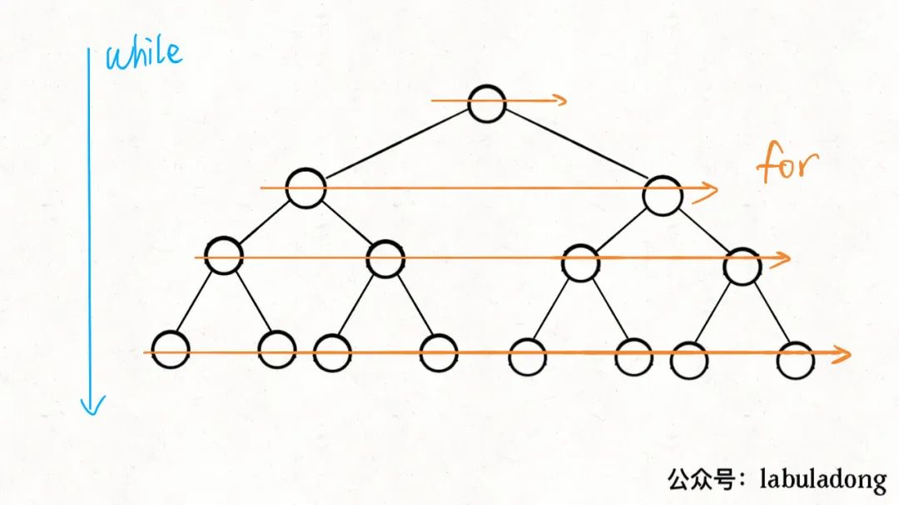

# Traverse graph

素材一:wikipedia [Transitive closure](https://en.wikipedia.org/wiki/Transitive_closure) :

> The problem can also be solved by the [Floyd–Warshall algorithm](https://en.wikipedia.org/wiki/Floyd–Warshall_algorithm), or by repeated [breadth-first search](https://en.wikipedia.org/wiki/Breadth-first_search) or [depth-first search](https://en.wikipedia.org/wiki/Depth-first_search) starting from each node of the graph.

其实上面这段话总结了三种travers graph的algorithm paradigms: 

- [Floyd–Warshall algorithm](https://en.wikipedia.org/wiki/Floyd–Warshall_algorithm) 所代表的"node-wise-$O(N^2)$ traverse"
- repeated-BFS
- repeated-DFS

素材二: 又联想到 [LeetCode-743. 网络延迟时间](https://leetcode.cn/problems/network-delay-time/) # [五种最短路径算法总结](https://leetcode.cn/problems/network-delay-time/solution/dirkdtra-by-happysnaker-vjii/) 中总结了多种解决单源最短路径的算法，其中包括  [Floyd–Warshall algorithm](https://en.wikipedia.org/wiki/Floyd–Warshall_algorithm)、Dijkstra(BFS)、DFS。

"穷举是解决所有问题的基石"，对于graph的各种问题亦是如此，从目前接触的各种graph algorithm，它们大多数都是基于对graph的traverse，所不同的是travers的方式不同，总的来说，是可以归入到如下paradigm的:

一. node-wise-$O(N^2)$ traverse

这是最最暴力的穷举方式，典型的代表是Floyd–Warshall-algorithm

二. repeated-BFS-queue-machine

1. [Dijkstra's algorithm](https://en.wikipedia.org/wiki/Dijkstra's_algorithm)

三. repeated-DFS-stack-machine	


|                                                              |                  |                                                              | data structure   |
| ------------------------------------------------------------ | ---------------- | ------------------------------------------------------------ | ---------------- |
|                                                              |                  |                                                              |                  |
| [Prim算法](https://leetcode.cn/problems/min-cost-to-connect-all-points/solution/prim-and-kruskal-by-yexiso-c500/) | 以**顶点**为基础 | 和Dijkstra's algorithm非常类似，以greedy的方式不断地扩展，并且它也可以使用`priority_queue`来进行优化。 | `priority_queue` |
| [Kruskal](https://leetcode.cn/problems/min-cost-to-connect-all-points/solution/prim-and-kruskal-by-yexiso-c500/) | 以**边**为基础   |                                                              | union-find-set   |


## wikipedia [Graph traversal](https://en.wikipedia.org/wiki/Graph_traversal)

In [computer science](https://en.wikipedia.org/wiki/Computer_science), **graph traversal** (also known as **graph search**) refers to the process of visiting (checking and/or updating) each vertex in a [graph](https://en.wikipedia.org/wiki/Graph_(discrete_mathematics)). Such traversals are classified by the order in which the vertices are visited. [Tree traversal](https://en.wikipedia.org/wiki/Tree_traversal) is a special case of graph traversal.

> NOTE: 
>
> 1. 其实traversal就是search 

### Redundancy

Unlike tree traversal, graph traversal may require that some vertices be visited more than once, since it is not necessarily known before transitioning to a vertex that it has already been explored. As graphs become more [dense](https://en.wikipedia.org/wiki/Dense_graph), this redundancy becomes more prevalent(普遍), causing computation time to increase; as graphs become more sparse, the opposite holds true.

> NOTE: 
>
> 1. dense and sparse

Thus, it is usually necessary to remember which vertices have already been explored by the algorithm, so that vertices are revisited as infrequently as possible (or in the worst case, to prevent the traversal from continuing indefinitely(其实就是**dead loop**)). This may be accomplished by associating each vertex of the graph with a "color" or "visitation" state during the traversal, which is then checked and updated as the algorithm visits each vertex. If the vertex has already been visited, it is ignored and the path is pursued(追踪) no further; otherwise, the algorithm checks/updates the vertex and continues down its current path.

> NOTE: 
>
> 1. 在graph traversal中，为了避免由于circle而导致的dead loop，graph traversal algorithm普遍采用的是“标记已经visit过的vertex，对于已经visit过的vertex，再次遇到的时候，直接pass掉”。

Several special cases of graphs imply(蕴含) the visitation of other vertices in their structure, and thus do not require that visitation be explicitly recorded during the traversal. An important example of this is a tree: during a traversal it may be assumed that all "ancestor" vertices of the current vertex (and others depending on the algorithm) have already been visited. Both the [depth-first](https://en.wikipedia.org/wiki/Depth-first_search) and [breadth-first graph searches](https://en.wikipedia.org/wiki/Breadth-first_search) are adaptations of tree-based algorithms, distinguished primarily by the lack of a structurally determined "root" vertex and the addition of a data structure to record the traversal's visitation state.

> NOTE: 
>
> 1. 翻译如下:
>
> "图的一些特殊情况暗示了对其结构中的其他顶点的访问，因此不需要在遍历过程中明确地记录访问。
> 一个重要的例子是树:在遍历过程中，可以假设当前顶点的所有“祖先”顶点(以及其他取决于算法的顶点)都已经访问过了。
> 深度优先和宽度优先图搜索都是基于树的算法的适应，主要区别在于缺乏一个结构上确定的“根”顶点和添加一个数据结构来记录遍历的访问状态。"

### Graph traversal algorithms

- DFS=Depth-first search

- BFS=Breadth-first search


## BFS

---

> References: 
>
> - wikipedia [Breadth-first search](https://en.wikipedia.org/wiki/Breadth-first_search) 
>
> - labuladong [我写了一个模板，把 Dijkstra 算法变成了默写题](https://mp.weixin.qq.com/s?__biz=MzAxODQxMDM0Mw==&mid=2247492167&idx=1&sn=bc96c8f97252afdb3973c7d760edb9c0&scene=21#wechat_redirect) 
>
> - medium [Top 25 Breadth First Search (BFS) Practice Problems](https://medium.com/techie-delight/top-20-breadth-first-search-bfs-practice-problems-ac2812283ab1)
>
> - labuladong 
>
>   - [BFS 算法框架套路详解](https://mp.weixin.qq.com/s/WH_XGm1-w5882PnenymZ7g) (相比之下，这篇文章不及下面这篇)
>   -  [我写了一个模板，把 Dijkstra 算法变成了默写题](https://mp.weixin.qq.com/s?__biz=MzAxODQxMDM0Mw==&mid=2247492167&idx=1&sn=bc96c8f97252afdb3973c7d760edb9c0&scene=21#wechat_redirect) 
>   - [益智游戏克星：BFS暴力搜索算法](https://mp.weixin.qq.com/s/Xn-oW7QRu8spYzL3B6zLxw)
>
> - geeksforgeeks [Depth First Search or DFS for a Graph](https://www.geeksforgeeks.org/depth-first-search-or-dfs-for-a-graph/)
>
>   

---


### wikipedia [Breadth-first search](https://en.wikipedia.org/wiki/Breadth-first_search) 


#### Pseudocode

**Input**: A graph *G* and a *starting vertex* *root* of *G*

**Output**: Goal state. The *parent* links trace the shortest path back to *root*[[7\]](https://en.wikipedia.org/wiki/Breadth-first_search#cite_note-7)

```pseudocode
 1  procedure BFS(G, root) is
 2      let Q be a queue
 3      label root as explored
 4      Q.enqueue(root)
 5      while Q is not empty do
 6          v := Q.dequeue()
 7          if v is the goal then
 8              return v
 9          for all edges from v to w in G.adjacentEdges(v) do
10              if w is not labeled as explored then
11                  label w as explored
12                  w.parent := v # trace the shortest path
13                  Q.enqueue(w)
```

> NOTE: 典型的eager mode

### Implementation

根据是否将`adj_node`/queue中的node设置为explored状态(visited set来实现，为了便于区分使用explored而非visited这个词语)，将BFS算法分为eager、lazy两种实现方式:

|      | Eager                                 | Lazy                                            |
| ---- | ------------------------------------- | ----------------------------------------------- |
| 1    | Eager mark explored                   | Lazy mark explored                              |
| 2    | 将`adj_node`直接设置为explored状态    | 在执行visitor后，将`adj_node` 设置为visited状态 |
| 3    | 只允许explored状态的node进入到queue中 |                                                 |


```python
import unittest
from collections import deque
from typing import Dict, List, Callable


class DirectedUnweightedGraphInAdjacencyList:
    """
    1、以adjacency list实现directed unweighted graph
    2、https://www.python.org/doc/essays/graphs/
    """

    def __init__(self, graph: Dict[str, List[str]]):
        self.graph = graph

    def bfs_eager_mark_visited(self, start: str, visitor: Callable = print) -> List[str]:
        """

        :param visitor:
        :param start:
        :return:
        """
        q = deque()
        explored_set = set()
        visited_nodes = []  # 按照visitor顺序保存所有的node

        q.append(start)
        explored_set.add(start)

        while q:
            size = len(q)
            for _ in range(size):
                cur_node = q.popleft()
                visitor(cur_node)
                visited_nodes.append(cur_node)
                # 使用self.graph.get(cur_node, [])保证cur_node没有adj nodes时程序正常运行
                for adj_node in filter(lambda next_node: next_node not in explored_set, self.graph.get(cur_node, [])):
                    q.append(adj_node)
                    explored_set.add(adj_node)
        return visited_nodes

    def bfs_lazy_mark_visited(self, start: str, visitor: Callable = print) -> List[str]:
        # Create a queue and enqueue the starting node
        q = deque([start])
        # This list will keep track of all visited nodes
        visited_set = set()
        visited_nodes = []

        # Loop as long as there are nodes in the queue
        while q:
            # Dequeue a node from the queue
            cur_node = q.popleft()
            # If the node has not been visited, add it to the visited list
            if cur_node not in visited_set:
                visited_set.add(cur_node)
                visitor(cur_node)
                visited_nodes.append(cur_node)
                # Enqueue all neighboring nodes
                for adj_node in self.graph.get(cur_node, []):
                    q.append(adj_node)

        # Return the list of visited nodes
        return visited_nodes


class TestBFSAlgorithm(unittest.TestCase):
    def test_shortest_path_to_all_node(self):
        # Graph represented as an adjacency list
        graph = {
            'A': ['B', 'C'],
            'B': ['D', 'E'],
            'C': ['F'],
            'D': [],
            'E': ['F'],
            'F': []
        }
        directed_unweighted_graph_in_adj_list = DirectedUnweightedGraphInAdjacencyList(graph)
        source = 'A'
        nodes1 = directed_unweighted_graph_in_adj_list.bfs_eager_mark_visited(source)
        nodes2 = directed_unweighted_graph_in_adj_list.bfs_lazy_mark_visited(source)
        self.assertEqual(len(nodes1), 6)
        self.assertEqual(nodes1, ['A', 'B', 'C', 'D', 'E', 'F'])
        self.assertEqual(nodes1, nodes2)


if __name__ == '__main__':
    unittest.main()

```

上面展示了两种BFS的写法，两种往visited set中添加节点的方式。


#### Eager mark explored

在下面文章中，展示了这种写法:

- wikipedia [Breadth-first search](https://en.wikipedia.org/wiki/Breadth-first_search) 
- [labuladong 我写了一个模板，把 Dijkstra 算法变成了默写题](https://mp.weixin.qq.com/s?__biz=MzAxODQxMDM0Mw==&mid=2247492167&idx=1&sn=bc96c8f97252afdb3973c7d760edb9c0&scene=21#wechat_redirect) 


[labuladong 我写了一个模板，把 Dijkstra 算法变成了默写题](https://mp.weixin.qq.com/s?__biz=MzAxODQxMDM0Mw==&mid=2247492167&idx=1&sn=bc96c8f97252afdb3973c7d760edb9c0&scene=21#wechat_redirect):  

其中对queue machine有着非常好的描述，下面的图展示了"while-从上到下+for-同层从左到右"，这篇文章对BFS binary tree、BFS multiple tree、BFS graph都进行了介绍




```java
// 输入起点，进行 BFS 搜索
int BFS(Node start) {
    Queue<Node> q; // 核心数据结构
    Set<Node> visited; // 避免走回头路

    q.offer(start); // 将起点加入队列
    visited.add(start);

    int step = 0; // 记录搜索的步数
    while (q not empty) {
        int sz = q.size();
        /* 将当前队列中的所有节点向四周扩散一步 */
        for (int i = 0; i < sz; i++) {
            Node cur = q.poll();
            printf("从 %s 到 %s 的最短距离是 %s", start, cur, step);

            /* 将 cur 的相邻节点加入队列 */
            for (Node x : cur.adj()) {
                if (x not in visited) {
                    q.offer(x);
                    visited.add(x);
                }
            }
        }
        step++;
    }
}
```

再加上 BFS 算法利用`for`循环一层一层向外扩散的逻辑和`visited`集合防止走回头路的逻辑，当你每次从队列中拿出节点`cur`的时候，从`start`到`cur`的最短权重就是`step`记录的步数。


#### Lazy mark visited

这种写法我时在使用chatGTP发现的，相比于eager，它更加简单，它采用的是"If the node has not been visited, add it to the visited list"。

虽然explored state的node可以重复进入到queue中，但是它使用visited set避免了重复visit一个node


#### Eager VS Lazy

(visit node、expand node to queue(explore))，因此可以在这两个地方进行去重:

Eager 是在expand node to queue的地方进行去重，它是只要碰到node，就将它放到eexploded set中，它能够避免node重复进入到queue中；

Lazy 是在visit node的时候进行去重；

它们两者之间的差异最能够在使用BFS构建 [spanning tree](https://en.wikipedia.org/wiki/Spanning_tree) 中显现出来: 一个node，如果能够通过多个node到达，由于lazy写法只有当这个node被vista的时候才会将它进行标记，那么它可能多次进入到queue中，对于向spanning tree construction问题，它就不适用了。而eager写法中，只要被explore，就将它进行标记，即使有多个node能够到达它，那么它依然只会被处理一次。

Eager mode的优势:

- queue中的元素都是explored状态的; queue和explored状态保持一致
- 能够正确实现"BFS构建 [spanning tree](https://en.wikipedia.org/wiki/Spanning_tree)"算法
- 能够正确实现BFS shortest path，能够准确计算"最短步数"


综上所述，后续使用eager作为BFS graph的实现方式。

### Applications

Breadth-first search can be used to solve many problems in graph theory, for example:

- Copying [garbage collection](https://en.wikipedia.org/wiki/Garbage_collection_(computer_science)), [Cheney's algorithm](https://en.wikipedia.org/wiki/Cheney's_algorithm)

- Finding the [shortest path](https://en.wikipedia.org/wiki/Shortest_path) between two nodes *u* and *v*, with path length measured by number of edges (an advantage over [depth-first search](https://en.wikipedia.org/wiki/Depth-first_search))[[12\]](https://en.wikipedia.org/wiki/Breadth-first_search#cite_note-12) 

  > NOTE: 
  >
  > 一. 关于此，参见:
  >
  > 1. `BFS-shortest-path` 章节
  >
  > 二. [Dijkstra’s algorithm](https://en.wikipedia.org/wiki/Dijkstra%27s_algorithm) 可以看作是一种BFS 

- [(Reverse) Cuthill–McKee](https://en.wikipedia.org/wiki/Cuthill–McKee_algorithm) mesh numbering

- [Ford–Fulkerson method](https://en.wikipedia.org/wiki/Ford–Fulkerson_algorithm) for computing the [maximum flow](https://en.wikipedia.org/wiki/Maximum_flow_problem) in a [flow network](https://en.wikipedia.org/wiki/Flow_network)

- Serialization/Deserialization of a binary tree vs serialization in sorted order, allows the tree to be re-constructed in an efficient manner.

- Construction of the *failure function* of the [Aho-Corasick](https://en.wikipedia.org/wiki/Aho-Corasick) pattern matcher.

- Testing [bipartiteness of a graph](https://en.wikipedia.org/wiki/Bipartite_graph#Testing_bipartiteness).

- [Topological sorting](https://en.wikipedia.org/wiki/Topological_sorting)

  > NOTE: 这是最适合用graph BFS的问题

- 需要验证只有沿着一条边才能够进入到目标边，使用BFS进行反向查找 

```Java
    private boolean isInLinkLaneGroupValid() {
        if (!isFound()) {
            return false;
        }
        Set<UnimapLaneGroup> visited = new HashSet<>(); // 防止dead loop
        Queue<UnimapLaneGroup> q = new LinkedList<>();
        q.add(inLinkLaneGroup);
        visited.add(inLinkLaneGroup);
        while (!q.isEmpty()) {
            int cnt = q.size();
            if (cnt > 1) {
                return false;
            }
            while (cnt > 0) {
                UnimapLaneGroup laneGroup = q.poll();
                Arrays.stream(laneGroup.getPrevLaneGroups())
                        .filter(prevLaneGroup ->
                                LaneGroupUtil.isInCrossArea(prevLaneGroup)
                                        && isSameLinkKindAsEnterLaneGroup(prevLaneGroup)
                                        && !visited.contains(prevLaneGroup)
                        )
                        .forEach(prevLaneGroup -> {
                            q.add(prevLaneGroup);
                            visited.add(prevLaneGroup);
                        });
                --cnt;
            }
        }
        return true;
    }
```

- [spanning tree](https://en.wikipedia.org/wiki/Spanning_tree#Algorithms) (参见 `Spanning-tree` 章节)


### Complexity

#### Space complexity

[LeetCode-【宫水三叶】一题三解：「双向 BFS」& 「AStar 算法」&「IDA* 算法」](https://leetcode.cn/problems/open-the-lock/solution/gong-shui-san-xie-yi-ti-shuang-jie-shuan-wyr9/)

> 使用朴素 BFS 进行求解时，队列中最多会存在“两层”的搜索节点。
>
> 因此搜索空间的上界取决于 **目标节点所在的搜索层次的深度所对应的宽度**。


## DFS

DFS graph的时候，recursion 的 stop condition是visited set

### wikipedia [Depth-first search](https://en.wikipedia.org/wiki/Depth-first_search)

**Depth-first search** (**DFS**) is an [algorithm](https://en.wikipedia.org/wiki/Algorithm) for traversing or searching [tree](https://en.wikipedia.org/wiki/Tree_data_structure) or [graph](https://en.wikipedia.org/wiki/Graph_(data_structure)) data structures. The algorithm starts at the [root node](https://en.wikipedia.org/wiki/Tree_(data_structure)#Terminology) (selecting some arbitrary node as the root node in the case of a graph) and explores as far as possible along each branch before **backtracking**.


#### Pseudocode

**Input**: A graph *G* and a vertex *v* of G

**Output**: All vertices reachable from *v* labeled as discovered

##### Recursive implementation 

A recursive implementation of DFS:[[5\]](https://en.wikipedia.org/wiki/Depth-first_search#cite_note-5)

```pseudocode
procedure DFS(G, v) is
    label v as discovered
    for all directed edges from v to w that are in G.adjacentEdges(v) do
        if vertex w is not labeled as discovered then
            recursively call DFS(G, w)
```

> NOTE: 
>
> 1、上述code，并没有使用algorithm，仅仅是traverse

The order in which the vertices are discovered by this algorithm is called the [lexicographic order](https://en.wikipedia.org/wiki/Lexicographical_order).

##### Non-recursive implementation 

A non-recursive implementation of DFS with worst-case space complexity $O(|E|)$, with the possibility of duplicate vertices on the stack:[[6\]](https://en.wikipedia.org/wiki/Depth-first_search#cite_note-6)

> NOTE: 
>
> 1、"duplicate vertices on the stack"要如何理解？后面会进行分析
>
> 2、对于已经标注过的node

```pseudocode
procedure DFS_iterative(G, v) is
    let S be a stack
    S.push(v)
    while S is not empty do
        v = S.pop()
        if v is not labeled as discovered then
            label v as discovered
            for all edges from v to w in G.adjacentEdges(v) do 
                S.push(w)
```

##### 比较

These two variations of DFS visit the neighbors of each vertex in the opposite order from each other: 

the first neighbor of *v* visited by the recursive variation is the first one in the list of adjacent edges, while in the iterative variation the first visited neighbor is the last one in the list of adjacent edges. 

The recursive implementation will visit the nodes from the example graph in the following order: A, B, D, F, E, C, G. 

The non-recursive implementation will visit the nodes as: A, E, F, B, D, C, G.


The non-recursive implementation is similar to [breadth-first search](https://en.wikipedia.org/wiki/Breadth-first_search) but differs from it in two ways:

1、it uses a stack instead of a queue, and

2、it delays checking whether a vertex has been discovered until the vertex is popped from the stack rather than making this check before adding the vertex.

> NOTE: 
>
> 1、如果"making this check before adding the vertex"会怎样？

If *G* is a [tree](https://en.wikipedia.org/wiki/Tree_(data_structure)), replacing the queue of the breadth-first search algorithm with a stack will yield a depth-first search algorithm. For general graphs, replacing the stack of the iterative depth-first search implementation with a queue would also produce a breadth-first search algorithm, although a somewhat nonstandard one.[[7\]](https://en.wikipedia.org/wiki/Depth-first_search#cite_note-7)

##### Another possible implementation of iterative depth-first search

Another possible implementation of iterative depth-first search uses a stack of [iterators](https://en.wikipedia.org/wiki/Iterator) of the list of neighbors of a node, instead of a stack of nodes. This yields the same traversal as recursive DFS.[[8\]](https://en.wikipedia.org/wiki/Depth-first_search#cite_note-8)

```pseudocode
procedure DFS_iterative(G, v) is
    let S be a stack
    S.push(iterator of G.adjacentEdges(v))
    while S is not empty do
        if S.peek().hasNext() then
            w = S.peek().next()
            if w is not labeled as discovered then
                label w as discovered
                S.push(iterator of G.adjacentEdges(w))
        else
            S.pop()
```


#### Applications

Algorithms that use depth-first search as a building block include:

##### Connected components

1. Finding [connected components](https://en.wikipedia.org/wiki/Connected_component_(graph_theory)).

2. Finding 2-(edge or vertex)-connected components.

3. Finding 3-(edge or vertex)-connected components.

4. Finding [strongly connected components](https://en.wikipedia.org/wiki/Strongly_connected_components).

##### Topological sorting

[Topological sorting](https://en.wikipedia.org/wiki/Topological_sorting)

> NOTE: 参见`Topological-sorting`章节

##### Bridges

Finding the [bridges](https://en.wikipedia.org/wiki/Bridge_(graph_theory)#Bridge-finding_algorithm) of a graph.

##### Generating words

Generating words in order to plot the [limit set](https://en.wikipedia.org/wiki/Limit_set) of a [group](https://en.wikipedia.org/wiki/Group_(mathematics)).

##### Planarity testing

[Planarity testing](https://en.wikipedia.org/wiki/Planarity_testing).[[9\]](https://en.wikipedia.org/wiki/Depth-first_search#cite_note-9)[[10\]](https://en.wikipedia.org/wiki/Depth-first_search#cite_note-10)

##### Backtracking

Solving puzzles with only one solution, such as [mazes](https://en.wikipedia.org/wiki/Maze). (DFS can be adapted to find all solutions to a maze by only including nodes on the current path in the visited set.)

> NOTE: 其实就是回溯法，参见`Backtracking`章节

##### Maze generation

[Maze generation](https://en.wikipedia.org/wiki/Maze_generation) may use a randomized depth-first search.

##### Biconnectivity 

> NOTE: 
>
> 1、"双连接性"

Finding [biconnectivity in graphs](https://en.wikipedia.org/wiki/Biconnected_graph).


### Implementation


#### Spanning tree

```python
import unittest
from typing import *


class DirectedUnweightedGraphInAdjacencyList:
    """
    1、以adjacency list实现directed unweighted graph
    2、https://www.python.org/doc/essays/graphs/
    """

    def __init__(self, graph: Dict[Union[str, int], List[Union[str, int]]]):
        self.graph = graph

    def construct_spanning_tree_by_dfs(self,
                                       start: Union[str, int],
                                       visited_set=None,
                                       spanning_tree=None) -> List[Tuple]:

        if visited_set is None:
            visited_set = set()
        if spanning_tree is None:
            spanning_tree = []

        if start not in visited_set:
            visited_set.add(start)
            for adj_node in filter(lambda next_node: next_node not in visited_set, self.graph.get(start, [])):
                spanning_tree.append((start, adj_node))
                self.construct_spanning_tree_by_dfs(adj_node, visited_set, spanning_tree)

        return spanning_tree


class TestSpanningTreeConstructionAlgorithm(unittest.TestCase):
    def test_spanning_tree_constructed_by_bfs(self):
        # Graph represented as an adjacency list
        graph = {
            0: [1, 2],
            1: [0, 2, 3],
            2: [0, 1, 4],
            3: [1],
            4: [2]
        }
        directed_unweighted_graph_in_adj_list = DirectedUnweightedGraphInAdjacencyList(graph)
        source = 1
        spanning_tree1 = directed_unweighted_graph_in_adj_list.construct_spanning_tree_by_dfs(
            source)
        print(f'spanning_tree1:{spanning_tree1}')

        self.assertEqual(len(spanning_tree1), 4)


if __name__ == '__main__':
    unittest.main()

```

#### [LeetCode-133. Clone Graph-Medium](https://leetcode.cn/problems/clone-graph/) 

```python
from typing import *


# Definition for a Node.
class Node:
    def __init__(self, val=0, neighbors=None):
        self.val = val
        self.neighbors = neighbors if neighbors is not None else []


class Solution:

    def cloneGraph(self, node: Optional['Node']) -> Optional['Node']:
        new_node_map = {}
        return self.dfs(node, new_node_map)

    def dfs(self, node: Optional['Node'], new_node_map: Dict[Node, Node]) -> Optional['Node']:
        if node is None:
            return None
        elif node in new_node_map:
            return new_node_map[node]
        else:
            new_node = Node(node.val)
            new_node_map[node] = new_node
            if node.neighbors:
                new_node.neighbors = [new_neighbor for new_neighbor in [
                    self.dfs(neighbor, new_node_map) for neighbor in node.neighbors
                ] if new_neighbor is not None]
            return new_node


if __name__ == '__main__':
    n1 = Node(1)
    n2 = Node(2)
    n3 = Node(3)
    n4 = Node(4)
    n1.neighbors = [n2, n4]
    n2.neighbors = [n1, n3]
    n3.neighbors = [n2, n4]
    n4.neighbors = [n1, n3]
    solu = Solution()
    solu.cloneGraph(n1)

```


## Node-wise-$O(N^2)$​ traverse


## Graph traversal VS tree traversal

参见 `Graph&tree&list` 章节。


## Circle

并不是所有的情况下都需要处理circle

dead loop

visited path

visted set

在求解最优值的时候，比如最短路径，如果edge都是positive的，那么这种情况下其实并不需要显式地处理circle，因为最优值的目标就能够避免重复选择路径。

### Visited set/Explored set

1、在graph traversal中，为了避免由于circle而导致的dead loop，graph traversal algorithm普遍采用的是“标记已经visited vertex，对于visited vertex，再次遇到的时候，直接pass掉”。

2、对于graph中的一个node，可能有多条path通向它，在对它进行traverse的时候，为了避免重复，因此需要标注它是否已经被访问了。

> NOTE: 
>
> 1、在tree中，到达一个node，仅仅只有一条path，这是唯一的。

3、采用哪种标注策略呢？

对于采用recursive implementation，由于它本身就是深度优先的，因此，它的标注策略是非常简单的；

对于采用iterative implementation，因此，需要由programmer进行控制:

a、对于DFS: 如果current node没有被标注，则将它的所有的descendant全部都push到explicit stack中后，才算这个node被visit了

b、对于BFS: 对于current node的所有的descendant，只要没有被标准，就enqueue。

4、将它标注为visited，就相当于在tree traversal中，调用了visit function。


