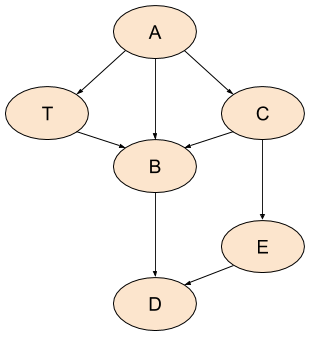

# eli.thegreenplace [Directed graph traversal, orderings and applications to data-flow analysis](https://eli.thegreenplace.net/2015/directed-graph-traversal-orderings-and-applications-to-data-flow-analysis/) 


## Depth-first search and pre-order

Here is a simple implementation of DFS in Python (the full code is [available here](https://github.com/eliben/code-for-blog/blob/main/2015/traversals.py)):

```python
def dfs(graph, root, visitor):
    """DFS over a graph.

    Start with node 'root', calling 'visitor' for every visited node.
    """
    visited = set()
    def dfs_walk(node):
        visited.add(node)
        visitor(node)
        for succ in graph.successors(node):
            if not succ in visited:
                dfs_walk(succ)
    dfs_walk(root)
```

This is the baseline implementation, and we'll see a few variations on it to implement different orderings and algorithms. You may think that, due to the way the algorithm is structured, it implements **pre-order traversal**. It certainly looks like it. In fact, *pre-order traversal on graphs is defined as the order in which the aforementioned DFS algorithm visited the nodes*. However, there's a subtle(微妙不易察觉的) but important difference from **tree pre-order**. Whereas in trees, we may assume that in pre-order traversal we always see a node before all its successors, this isn't true for graph pre-order. Consider this graph:

> NOTE:
>
> 1. "*pre-order traversal on graphs is defined as the order in which the aforementioned DFS algorithm visited the nodes*"这段话是对pre-order traversal进行定义




If we print the nodes in the order visited by DFS, we may get something like: A, C, B, D, E, T. So B comes before T, even though B is T's successor [[1\]](https://eli.thegreenplace.net/2015/directed-graph-traversal-orderings-and-applications-to-data-flow-analysis/#footnote-1).

We'll soon see that other orderings *do* provide some useful guarantees.

## Post-order and reverse post-order

To present other orderings and algorithms, we'll take the `dfs` function above and tweak it slightly. Here's a post-order walk. It has the same general structure as `dfs`, but it manages additional information (`order` list) and doesn't call a visitor function:

```python
def postorder(graph, root):
    """Return a post-order ordering of nodes in the graph."""
    visited = set()
    order = []
    def dfs_walk(node):
        visited.add(node)
        for succ in graph.successors(node):
            if not succ in visited:
                dfs_walk(succ)
        order.append(node)
    dfs_walk(root)
    return order
```

This algorithm adds a node to the `order` list when its traversal is fully finished; that is, when all its **outgoing edges** have been visited. Unlike pre-order, here it's actually ensured - in the absence of cycles - that for two nodes V and W, if there is a path from W to V in the graph, then V comes before W in the list. 

**Reverse post-order (RPO)** is exactly what its name implies. It's the reverse of the list created by **post-order traversal**. In **reverse post-order**, if there is a path from V to W in the graph, V appears before W in the list. Note that this is actually a useful guarantee - we see a node before we see any other nodes reachable from it; for this reason, RPO is useful in many algorithms.

Let's see the orderings produced by **pre-order**, **post-order** and RPO for our sample DAG:

- Pre-order: A, C, B, D, E, T
- Post-order: D, B, E, C, T, A
- RPO: A, T, C, E, B, D

This example should help dispel(驱散) a common confusion about these traversals - *RPO is not the same as pre-order*. While **pre-order** is simply the order in which DFS visits a graph, **RPO** actually guarantees that we see a node before all of its **successors** (again, this is in the absence of cycles, which we'll deal with later). So if you have an algorithm that needs this guarantee and you could simply use **pre-order** on trees, when you're dealing with DAGs it's RPO, not pre-order, that you're looking for.

## Topological sort

In fact, the RPO of a DAG has another name - ***topological sort***. Indeed, listing a DAG's nodes such that a node comes before all its successors is precisely what sorting it topologically means. If nodes in the graph represent operations and edges represent dependencies between them (an edge from V to W meaning that V must happen before W) then **topological sort** gives us an order in which we can run the operations such that all the dependencies are satisfied (no operation runs before its dependencies).

## DAGs with multiple roots

So far the examples and algorithms demonstrated here show graphs that have a single, identifiable root node. This is not always the case for realistic graphs, though it *is* most likely the case for graphs used in compilation because a program has a **single entry function** (for call graphs) and a function has a **single entry instruction** or basic block (for control-flow and data-flow analyses of functions).

Once we leave the concept of "one root to rule them all" behind, it's not even clear how to traverse a graph like the example used in the article so far. Why start from node A? Why not B? And how would the traversal look if we did start from B? We'd then only be able to discover B itself and D, and would have to restart to discover other nodes.