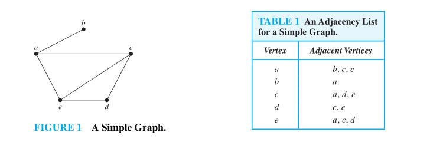
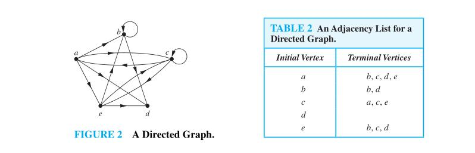

# Adjacency list

## wikipedi [Adjacency list](https://en.wikipedia.org/wiki/Adjacency_list)

## discrete book 10.3 Representing Graphs and Graph Isomorphism

> NOTE: "isomorphism" 的意思是: "同构"

> NOTE: adjacent vertices

> NOTE: terminal vertices