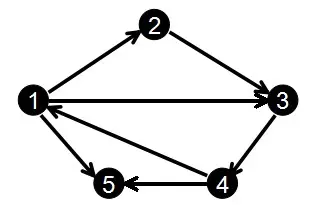

# [jianshu-前向星与链式前向星](https://www.jianshu.com/p/107a645797a6)

今天学习了**前向星**这种数据结构，**前向星**是一种非常节省空间的存图方式，在ACM比赛中，常见的的存图方式有三种:

一、邻接矩阵(adjacency matrix)，即用二维数组实现，`G[u][v]`为`<u,v>`边的权值。**邻接矩阵**适用于存储稠密图，点不多而边很多的时候，邻接矩阵的优点是好写，可读性高，方便删除边。

二、邻接表(adjacency list)，一般用`vector<edge>G[MAXN_V]`模拟邻接表，邻接表适用于疏密图，相比于邻接矩阵节省空间。

> NOTE:
>
> 一、adjacency list记录以该点为起点所关联的多条边，所以它使用的是`vector`

其优点是写起来快，可读性高，方便执行STL中的一些函数。

三、前向星

## 前向星

前向星是一种特殊的**边集数组**,我们把边集数组中的每一条边按照起点从小到大排序,如果起点相同就按照终点从小到大排序,并记录下以某个点为起点的所有边在数组中的起始位置和存储长度,那么前向星就构造好了.

1、用 `len[i]`   记录所有以 `i` 为起点的边的个数(等于它们在数组中的存储长度)

2、用 `head[i]` 记录所有以 `i` 为起点的边在数组中的第一个存储位置

3、用 edge array ( `std::array<n, edge>` )保存所有的边

> NOTE:
>
> 一、显然前向星能够解决一个点关联多条边的要求
>
> 1、所有的edge按照如下排序方式(二级排序)依次存放在edge array中:
>
> 第一级: 所有的点ID从大到小进行排序 
>
> 第二级: 所有以 `i` 为起点的边按照终点ID从大到小进行排序 
>
> 2、`head[i]` 相当于是index，能够保证能够快速的找到edge
>
> 

劣势: 利用**前向星**会有排序操作,如果用快排时间至少为O(nlog(n))


### Example





我们输入边的顺序为:1 2、2 3、3 4、1 3、4 1、1 5、 4 5

```c++
std::pair<int,int>G[MAXN_E];
```

用pair存储并排序后得到:

```c
G[0]=(1,2);  
G[1]=(1,3);
G[2]=(1,5);
G[3]=(2,3);
G[4]=(3,4);
G[5]=(4,1);
G[6]=(4,5);
```

head数组和len数组为:
```
head[1]=0;  
head[2]=3;  
head[3]=4;   
head[4]=5;   
head[5]=-1;
```

````
len[1]=3;   
len[2]=1;   
len[3]=1;    
len[4]=2;     
len[5]=0;
````


## 链式前向星

如果用**链式前向星**,加入`next`索引模拟指针指向下一个点的位置，就可以避免排序.

> NOTE:
>
> 一、通过next index将属于同一个节点的多条边给串联起来，非常简单而巧妙
>
> 1、用 edge array ( `std::array<n, edge>` )保存所有的边
>
> 2、用 `head[i]` 记录所有以 `i` 为起点的边在数组中的第一个存储位置

建立结构体为：

```c++
struct edge
{
    int to;//边的终点
    int value;//边的权值
    int next;//表示与第i条边同起点的下一条边的存储位置
};
```

另外还有一个数组 `head[]`,它是用来表示以 `i` 为起点的索引的第一条边存储的位置,实际上你会发现这里的第一条边存储的位置其实在以`i`为起点的所有边的最后输入的那个编号.

如果按照索引顺序，next表示下一条边的存储位置，如果按照添加顺序，`next` 即为上一条添加的边的位置。

所以我们可以得到，**输入顺序**和**存图顺序**或者说是**遍历顺序**是相反的。还是上面的图，我们定义全局变量`int cnt=0;`，并将`head[]`初始化为`-1`；

```c++
// u: 边的起点
// v: 边的终点
// w: 边的权重
void addedge(int u,int v,int w)
{
    e[cnt].value=w;
    e[cnt].to=v;
    e[cnt].next=head[u];
    head[u]=cnt++;
}
```

