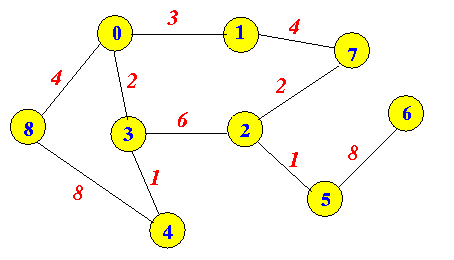
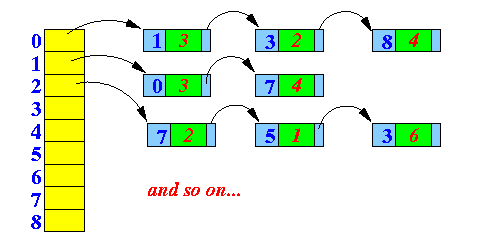
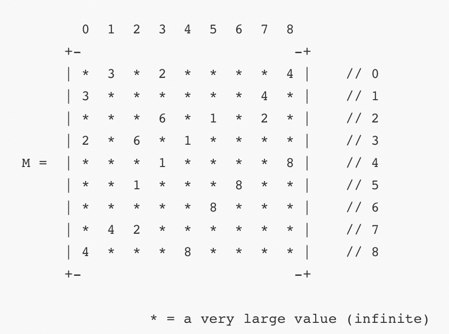
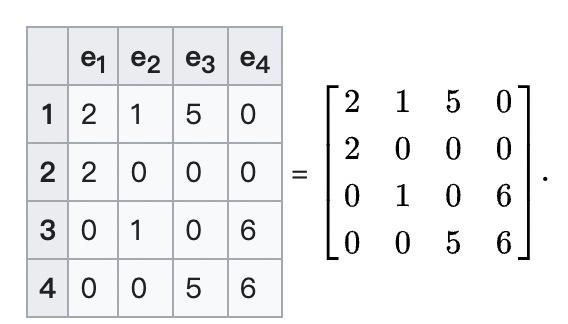
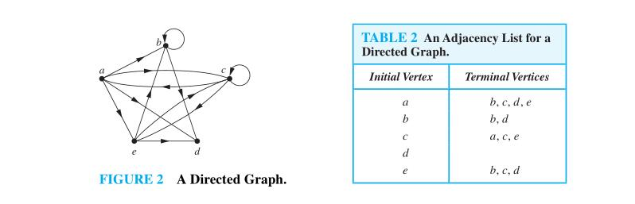

# Graph representation

---

> References: 
>
> mathcs.emory [Representing weighted graphs](http://www.mathcs.emory.edu/~cheung/Courses/171/Syllabus/11-Graph/weighted.html)
>
> khanacademy [Representing graphs](https://www.khanacademy.org/computing/computer-science/algorithms/graph-representation/a/representing-graphs) 
>
> wikipedia [Graph (abstract data type)#Representations](https://en.wikipedia.org/wiki/Graph_(abstract_data_type)) 

---


一. 从relation的角度来分析graph representation

可以使用graph来表示relation，而graph representation同样需要是基于vertex、edge之间的**relation**，graph的各种representation主要是基于如下两种relation:

| relation                                                     |                                 |
| ------------------------------------------------------------ | ------------------------------- |
| adjacency                                                    | relation of vertex-vertex pairs |
| [incidence(graph)](https://en.wikipedia.org/wiki/Incidence_(graph)) | relation of vertex-edge pairs   |

需要注意的是，"[incidence(graph)](https://en.wikipedia.org/wiki/Incidence_(graph))"在graph语境中特指"relation of vertex-edge"，在其它语境中，它有着更加宽泛的含义(可以描述任何两类事物之间的**关联关系**)，关于此，在 [wikipedia-Incidence matrix](https://en.wikipedia.org/wiki/Incidence_matrix) 中有着很好的说明:

> In [mathematics](https://en.wikipedia.org/wiki/Mathematics), an **incidence matrix** is a [logical matrix](https://en.wikipedia.org/wiki/Logical_matrix) that shows the relationship between two classes of objects, usually called an [incidence relation](https://en.wikipedia.org/wiki/Incidence_(geometry)). If the first class is *X* and the second is *Y*, the matrix has one row for each element of *X* and one column for each element of *Y*. The entry in row *x* and column *y* is 1 if *x* and *y* are related (called *incident* in this context) and 0 if they are not. There are variations;


二. 

graph star: 

保存图时，需要考虑的一个问题是: 一个点可以关联多条边/点，即 [star](https://en.wikipedia.org/wiki/Star_(graph_theory))  。

三、根据问题灵活的选择graph representation

1、以vertex视角:

vertex+(in-edges)+(out-edges)

这种方式是我在做拓扑检查的时候采用的一种graph representation，它和 [Adjacency list](https://en.wikipedia.org/wiki/Adjacency_list) （邻接链表）有点类似。

素材:


## wikipedia [Graph (abstract data type)#Representations](https://en.wikipedia.org/wiki/Graph_(abstract_data_type)) 

| 表示方式                                                     | example                                                      | representation              |
| ------------------------------------------------------------ | ------------------------------------------------------------ | --------------------------- |
| [Adjacency list](https://en.wikipedia.org/wiki/Adjacency_list) （邻接链表） |                                           |    |
| [Adjacency matrix](https://en.wikipedia.org/wiki/Adjacency_matrix) （邻接矩阵） |                                           |   |
| [Incidence matrix](https://en.wikipedia.org/wiki/Incidence_matrix) （关联矩阵） | [](https://en.wikipedia.org/wiki/File:Weighted_undirected_graph.svg) |  |

> NOTE: 
>
> 一、上述三种方式都能够表示weighed graph和unweighted graph。
>
> 二、在原文中还给出了在使用上述三种表示方式下执行一些典型操作时的算法复杂度。

## Adjacency list


### wikipedia [Adjacency list](https://en.wikipedia.org/wiki/Adjacency_list) 

> NOTE:
>
> 一、"adjacency list" 的意思是 "邻接表"


[](https://en.wikipedia.org/wiki/File:Simple_cycle_graph.svg)


|      |             |      |
| ---- | ----------- | ---- |
| a    | adjacent to | b,c  |
| b    | adjacent to | a,c  |
| c    | adjacent to | a,b  |

#### Implementation details

An adjacency list representation for a graph associates each vertex in the graph with the collection of its neighboring vertices or edges. There are many variations of this basic idea, differing in the details of how they implement the association between vertices and collections, in how they implement the collections, in whether they include both vertices and edges or only vertices as first class objects, and in what kinds of objects are used to represent the vertices and edges.

1、An implementation suggested by [Guido van Rossum](https://en.wikipedia.org/wiki/Guido_van_Rossum) uses a [hash table](https://en.wikipedia.org/wiki/Hash_table) to associate each vertex in a graph with an [array](https://en.wikipedia.org/wiki/Array_data_structure) of adjacent vertices. In this representation, a vertex may be represented by any hashable object. There is no explicit representation of edges as objects.

> NOTE:
>
> 一. [Python Patterns - Implementing Graphs](https://www.python.org/doc/essays/graphs/)

2、Cormen et al. suggest an implementation in which the vertices are represented by index numbers.[[2\]](https://en.wikipedia.org/wiki/Adjacency_list#cite_note-2) Their representation uses an array indexed by vertex number, in which the array cell for each vertex points to a [singly linked list](https://en.wikipedia.org/wiki/Singly_linked_list) of the neighboring vertices of that vertex. In this representation, the nodes of the singly linked list may be interpreted as edge objects; however, they do not store the full information about each edge (they only store one of the two endpoints of the edge) and in undirected graphs there will be two different linked list nodes for each edge (one within the lists for each of the two endpoints of the edge).

3、The [object oriented](https://en.wikipedia.org/wiki/Object_oriented) incidence list structure suggested by Goodrich and Tamassia has special classes of vertex objects and edge objects. Each vertex object has an instance variable pointing to a collection object that lists the neighboring edge objects. In turn, each edge object points to the two vertex objects at its endpoints.[[3\]](https://en.wikipedia.org/wiki/Adjacency_list#cite_note-A-3) This version of the adjacency list uses more memory than the version in which adjacent vertices are listed directly, but the existence of explicit edge objects allows it extra flexibility in storing additional information about edges.

### discrete book 10.3 Representing Graphs and Graph Isomorphism

> NOTE: "isomorphism" 的意思是: "同构"


> NOTE: adjacent vertices




> NOTE: terminal vertices

### Data structures

#### Unweighted directed  graph

1、可以看作是weight=1的weighted directed graph

1、dict of list

[Python Patterns - Implementing Graphs](https://www.python.org/doc/essays/graphs/) 

```c++
import unittest
from collections import deque
from typing import Dict, List, Optional


class DirectedUnweightedGraphInAdjacencyList:
    """
    1、以adjacency list实现directed unweighted graph
    2、https://www.python.org/doc/essays/graphs/
    """

    def __init__(self, graph: Dict[str, List[str]]):
        self.graph = graph

    def find_path_dfs(self, start, end) -> List[str]:
        return self.__find_path_dfs_impl__(start, end)

    def __find_path_dfs_impl__(self, start, end, path=[]) -> Optional[List[str]]:
        """
        1、可能找不到从start到end的path，所以需要通过返回值来表示是否找到了path
        2、需要注意它避免dead loop的方式，它没有使用visited set，而是直接基于path
        :param start:
        :param end:
        :param path:
        :return: 如果找到了从start到end的path，则返回path，否则返回None
        """
        path = path + [start]
        if start == end:
            return path
        if start not in self.graph:
            return None
        for adj_node in self.graph[start]:  # move next
            if adj_node not in path:
                new_path = self.__find_path_dfs_impl__(adj_node, end, path)
                if new_path:
                    return new_path
        return None

    def find_all_paths_dfs(self, start, end) -> List[List[str]]:
        return self.__find_all_paths_dfs_impl__(start, end)

    def __find_all_paths_dfs_impl__(self, start, end, path=[]):
        path = path + [start]
        if start == end:
            return [path]
        if start not in self.graph:
            return []
        paths = []
        for node in self.graph[start]:  # move next
            if node not in path:
                paths.append(self.__find_path_dfs_impl__(node, end, path))
        return paths

    def find_shortest_path_dfs(self, start: str, end: str):
        return self.__find_shortest_path_dfs_impl__(start, end)

    def __find_shortest_path_dfs_impl__(self, start, end, path=[]):
        """

        :param start:
        :param end:
        :return:
        """
        path = path + [start]
        if start == end:
            return path
        if start not in self.graph:
            return None
        shortest = None
        for node in self.graph[start]:
            if node not in path:
                new_path = self.__find_shortest_path_dfs_impl__(node, end, path)
                if new_path:
                    if not shortest or len(new_path) < len(shortest):
                        shortest = new_path
        return shortest

    def find_path_bfs(self, start: str, end: str) -> Optional[List[str]]:
        """

        :param start:
        :param end:
        :return:
        """

    def find_shortest_path_bfs(self, start, end):
        dist = {start: [start]}
        q = deque(start)
        while len(q):
            at = q.popleft()
            for next_node in self.graph[at]:
                if next_node not in dist:
                    dist[next_node] = [dist[at], next_node]
                    q.append(next_node)
        return dist.get(end)


class TestStringMethods(unittest.TestCase):

    def test_find_path_dfs(self):
        self.graph = DirectedUnweightedGraphInAdjacencyList(
            {'A': ['B', 'C'],
             'B': ['C', 'D'],
             'C': ['D'],
             'D': ['C'],
             'E': ['F'],
             'F': ['C']}
        )
        start = 'A'
        end = 'C'
        path = self.graph.find_path_dfs(start, end)
        print(path)
        self.assertEqual(len(path), 3)
        self.assertEqual(path[0], start)
        self.assertEqual(path[-1], end)

    def test_find_all_paths_dfs(self):
        self.graph = DirectedUnweightedGraphInAdjacencyList(
            {'A': ['B', 'C'],
             'B': ['C', 'D'],
             'C': ['D'],
             'D': ['C'],
             'E': ['F'],
             'F': ['C']}
        )
        start = 'A'
        end = 'C'
        paths = self.graph.find_all_paths_dfs(start, end)
        print(paths)
        self.assertEqual(len(paths), 2)
        for path in paths:
            self.assertEqual(path[0], start)
            self.assertEqual(path[-1], end)

    def test_find_shortest_path_dfs(self):
        self.graph = DirectedUnweightedGraphInAdjacencyList(
            {'A': ['B', 'C'],
             'B': ['C', 'D'],
             'C': ['D'],
             'D': ['C'],
             'E': ['F'],
             'F': ['C']}
        )
        start = 'A'
        end = 'C'
        path = self.graph.find_shortest_path_dfs(start, end)
        print(path)
        self.assertEqual(len(path), 2)
        self.assertEqual(path[0], start)
        self.assertEqual(path[-1], end)


if __name__ == '__main__':
    unittest.main()

```

#### Weighted directed graph

weighted-directed-graph=DFA: 

- 描述的是一个状态(source start node)在某个输入(weight)下转移到另外一个状态(target end node)

- 描述的是一个状态(source start node)以某个代价(weight)下转移到另外一个状态(target end node)


## Adjacency matrix

### wikipedia [Adjacency matrix](https://en.wikipedia.org/wiki/Adjacency_matrix)

In [graph theory](https://en.wikipedia.org/wiki/Graph_theory) and [computer science](https://en.wikipedia.org/wiki/Computer_science), an **adjacency matrix** is a [square matrix](https://en.wikipedia.org/wiki/Square_matrix) used to represent a finite [graph](https://en.wikipedia.org/wiki/Graph_(discrete_mathematics)). The elements of the [matrix](https://en.wikipedia.org/wiki/Matrix_(mathematics)) indicate whether pairs of [vertices](https://en.wikipedia.org/wiki/Vertex_(graph_theory)) are [adjacent](https://en.wikipedia.org/wiki/Neighbourhood_(graph_theory)) or not in the graph.


#### Example


Representation:

```

           0  1  2  3  4  5  6  7  8
         +-                         -+
         | *  3  *  2  *  *  *  *  4 |    // 0         
         | 3  *  *  *  *  *  *  4  * |    // 1
         | *  *  *  6  *  1  *  2  * |    // 2
         | 2  *  6  *  1  *  *  *  * |    // 3
    M =  | *  *  *  1  *  *  *  *  8 |    // 4
         | *  *  1  *  *  *  8  *  * |    // 5
         | *  *  *  *  *  8  *  *  * |    // 6
         | *  4  2  *  *  *  *  *  * |    // 7
         | 4  *  *  *  8  *  *  *  * |    // 8
         +-                         -+

                   * = a very large value (infinite)
```

### Data structures

一、2D array

Class used to represent a graph using an adjacency matrix:

```java
   public class Graph
   {

      /* =======================================
         The edges of the graph
         ======================================= */
      double[][] M;      // M[i][j] = weight of edge (i,j)      

      ...
   }
```

二、DLX

DLX可以用来存储sparse generic incidence matrix，而adjacency matrix属于generic incident matrix的一种，所以DLX也可以用于存储incidence matrix。 

## Incidence matrix

一、是在学习boost [IncidenceGraph](https://www.boost.org/doc/libs/1_73_0/libs/graph/doc/IncidenceGraph.html)时，想到的incidence matrix。

二、"incidence matrix"的意思是: "邻接矩阵"。


### wikipedia [Incidence matrix](https://en.wikipedia.org/wiki/Incidence_matrix)


### Data structures

一、2D array


二、DLX

## Summary

### Weighted graph 如何表示两点不相连？

一、Incidence-matrix、Adjacency-matrix

通过特殊值来标记不相连，一般有如下选择: 

|           | 解释               | 适用场景         |
| --------- | ------------------ | ---------------- |
| infinite  | a very large value | 目标值是最大值时 |
| -infinite | a very small value | 目标值是最小值时 |

这种表示方式在一定程度上是能够简化程序的，典型的例子就是使用 [Floyd–Warshall algorithm](https://en.wikipedia.org/wiki/Floyd%E2%80%93Warshall_algorithm) 算法解 [LeetCode-743. 网络延迟时间](https://leetcode.cn/problems/network-delay-time/) ，下面完整代码:

```c++
class Solution
{
public:
  int networkDelayTime(vector<vector<int>> &times, int n, int k)
  {
    vector<vector<int>> dp(n + 1, vector<int>(n + 1, INT_MAX / 2)); // 节点的标号是从1开始的，所以使用n+1
    for (auto &it : times)
      dp[it[0]][it[1]] = it[2];
    for (int i = 1; i <= n; i++)
      dp[i][i] = 0; //自己到自己为0

    for (int i = 1; i <= n; i++) // 节点的标号是从1开始的
    {
      for (int j = 1; j <= n; j++)
      {
        for (int k = 1; k <= n; k++) // 中转节点
        {
          dp[i][j] = min(dp[i][j], dp[i][k] + dp[k][j]);
        }
      }
    }
    int ret = 0;
    for (int i = 1; i <= n; i++)
      ret = max(ret, dp[k][i]);
    return ret == INT_MAX / 2 ? -1 : ret;
  }
};
```


二、Adjacency-list

这种表示方式相对比较简单: 如果"adjacent vertices" 或者 "terminal vertices" 中不包含目标节点，那么就不相连。

