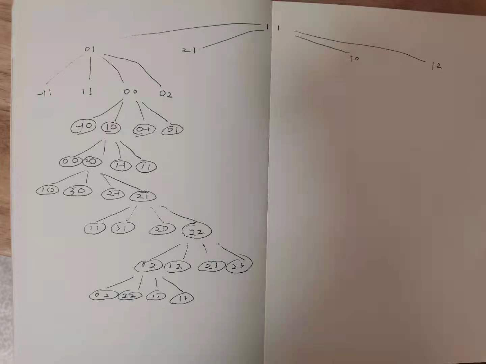

# labuladong [Flood Fill 算法详解](https://mp.weixin.qq.com/s/Y7snQIraCC6PRhj9ZSnlzw) 

为了继续深化 [框架思维](http://mp.weixin.qq.com/s?__biz=MzU0MDg5OTYyOQ==&mid=2247483857&idx=1&sn=918638e5a70e22b5b7bda9bbc5484f20&chksm=fb336193cc44e885f0524bdfe58a4e92b22a2b46017bf232b2ef91a576de648a8e61a30fd83d&scene=21#wechat_redirect)，本文讲解 FloodFill 算法的原理，以及该算法在「自动魔棒工具」和「扫雷」中的灵活应用。


### Example

> NOTE: 
>
> 原文列举了很多实用了flood fill算法的例子

#### 「颜色填充」


#### 扫雷


#### 消消乐


### 一、构建框架


以上几个例子，都可以抽象成一个二维矩阵（图片其实就是像素点矩阵），然后从某个点开始向四周扩展，直到无法再扩展为止。


矩阵，可以抽象为一幅「图」，这就是一个图的遍历问题，也就类似一个 N 叉树遍历的问题。几行代码就能解决，直接上框架：


```C++
// (x, y) 为坐标位置
void fill(int x, int y) {
    fill(x - 1, y); // 上
    fill(x + 1, y); // 下
    fill(x, y - 1); // 左
    fill(x, y + 1); // 右
}
```

#### 图遍历框架

> NOTE: 
>
> 一、原文并没有点明的是: 本文中的"二维矩阵中遍历"其实是graph traversal 图遍历，因此，它需要考虑图遍历中的circle问题，circle问题这会导致deadloop、infinit recursion，因此需要考虑一种有效的去重机制

**这个框架可以解决几乎所有在二维矩阵中遍历的问题**，说得高端一点，这就叫深度优先搜索（Depth First Search，简称 DFS），说得简单一点，这就叫四叉树遍历框架。坐标 (x, y) 就是 root，四个方向就是 root 的四个子节点。


#### [LeetCode-733. 图像渲染-简单](https://leetcode.cn/problems/flood-fill/) 

下面看一道 LeetCode 题目，其实就是让我们来实现**「颜色填充」**功能。

> NOTE: 
>
> 一、[LeetCode-733. 图像渲染-简单](https://leetcode.cn/problems/flood-fill/) 
>
> 二、这道题，其实也是可以使用BFS来解决的，但是BFS需要queue，空间复杂的更高


根据上篇文章 [二叉搜索树操作集锦](http://mp.weixin.qq.com/s?__biz=MzU0MDg5OTYyOQ==&mid=2247483891&idx=1&sn=0e7ef14e53e38649f09dea5c89058cb4&chksm=fb3361b1cc44e8a7c38a9bf3bf24408a2891ac885d242c5c3a6966f25097aec859c3406e6c11&scene=21#wechat_redirect)，我们讲了「树」算法设计的一个总路线，今天就可以直接套用到 FloodFill 算法中：


只要你能够理解这段代码，一定要给你鼓掌，给你 99 分，因为你对「框架思维」的掌控已经炉火纯青，此算法已经 cover 了 99% 的情况，仅有一个细节问题没有解决，就是当 origColor 和 newColor 相同时，会陷入**无限递归**。

> NOTE: 
>
> 1、本文中的"二维矩阵中遍历"其实是graph traversal 图遍历，因此，它需要考虑图遍历中的circle问题，circle问题这会导致deadloop、infinit recursion，因此需要考虑一种有效的去重机制；后面开始讨论有效的去重机制

### 二、研究细节

为什么会陷入无限递归呢，很好理解，因为每个坐标都要搜索上下左右，那么对于一个坐标，一定也会被上下左右的坐标多次重复搜索。**被重复搜索时，必须保证递归函数能够能正确地退出，否则就会陷入死循环。**

#### newColor 和 origColor 不同时

为什么 newColor 和 origColor 不同时算法是正确的呢？把算法流程画个图理解一下：

> NOTE: 
>
> 一、此处是比较容易理解的，下面的逻辑避免了这种情况:
>
> ```C++
> 		if (image[x][y] != oldColor)
> 			return;
> ```
>
> 

#### newColor 和 origColor 相同时

> NOTE: 
>
> 一、如果newColor 和 origColor相同，不执行算法就可以了，可以在调用fill前做一下判断，[LeetCode-图像渲染](https://leetcode.cn/problems/flood-fill/solution/tu-xiang-xuan-ran-by-leetcode-solution/) 官方解题中给出的就是这种方法。
>
> 二、作者提出的是一些其他的避免"死循环、无限递归"的方式、技巧

但是，如果说 origColor 和 newColor 一样，这个 if 语句就无法让 `fill(1, 1)*` 正确退出，而是开启了下面的重复递归，形成了死循环。


### 三、处理细节

如何避免上述问题的发生，最容易想到的就是用一个和 image 一样大小的二维 bool 数组记录走过的地方，一旦发现重复探索立即 return。

#### Visited array

> NOTE: 
>
> 一、graph traversal中，最最常用的一种方法: visited array

```c++
// 出界：超出数组边界
if (!inArea(image, x, y)) return;
// 碰壁：遇到其他颜色，超出 origColor 区域
if (image[x][y] != origColor) return;
// 已探索过的 origColor 区域
if (visited[x][y]) return;

visited[x][y] = true;
image[x][y] = newColor;/* 遍历框架，上下左右 */
```

完全 OK，这也是处理「图」的一种常用手段。不过对于此题，不用开数组，我们有一种更好的方法，那就是回溯算法。

#### Backtrack回溯

前文 [回溯算法详解](http://mp.weixin.qq.com/s?__biz=MzU0MDg5OTYyOQ==&mid=2247483841&idx=1&sn=9819393f9142892312fa3aeba173c879&chksm=fb336183cc44e895b7e7a29ec52f2504a1a6aa925655bcf129f1c215a376fa67c302d747f253&scene=21#wechat_redirect) 讲过，这里不再赘述，直接套回溯算法框架：


这种解决方法是最常用的，相当于使用一个特殊值 -1 代替 visited 数组的作用，达到不走回头路的效果。为什么是 -1，因为题目中说了颜色取值在 0 - 65535 之间，所以 -1 足够特殊，能和颜色区分开。


### 四、拓展延伸：自动魔棒工具和扫雷

#### 「自动魔棒工具」

> NOTE: 
>
> 1、这个是相对容易的

显然，这个算法肯定是基于 FloodFill 算法的，但有两点不同：首先，背景色是蓝色，但不能保证都是相同的蓝色，毕竟是像素点，可能存在肉眼无法分辨的深浅差异，而我们希望能够忽略细微的颜色差异差异。第二，FloodFill 算法是「区域填充」，这里是想找到 origColor 区域的边界，可以抽象成「边界填充」。


对于第一个问题，很好解决，可以设置一个阈值 threshold，在阈值范围内波动的颜色都视为 origColor：


```C++
if (Math.abs(image[x][y] - origColor) > threshold)
    return; // 遇到其他颜色
```


#### 最外圈像素点染色

> NOTE: 
>
> 一、这个是有些困难的
>
> [LeetCode-1034. 边框着色-中等](https://leetcode.cn/problems/coloring-a-border/) 
>
> 

对于第二个问题，我们首先明确问题：不要把 `origColor` 区域内所有像素点都染色，而是只给区域最外圈像素点染色。然后，我们分析，如何才能仅给外围染色，即如何才能找到最外围坐标，最外围坐标有什么特点？


可以发现，`origColor` 区域内部的坐标四面一定都是 `origColor`，而区域边界上的坐标，至少有一个方向不是 `origColor`，这就是解决问题的关键。保持框架不变，使用 `visited` 数组记录已搜索坐标，主要代码如下：


> NOTE: 
>
> 一、[LeetCode-1034. 边框着色-中等](https://leetcode.cn/problems/coloring-a-border/) 的难度其实是不低的，它需要我们完成两件事:
>
> 1、定位connected component的边界
>
> 2、更新颜色
>
> 上述code虽然剪短，但是却蕴含玄机: 
>
> a、`fill` 函数的返回值表示的是当前节点是否是在**连通分量**中
>
> b、这两道题是非常好的对比: 
>
> 它们都需要考虑的一个共同问题是: 如何判断当前节点是否位于connected component中(两道题都是使用的 `if (image[x][y] != oldColor)` 来作为判断条件)，在成功判定后，需要对当前节点的颜色进行更新，需要注意的是: 这种**对原始数据进行更新的做法是需要考虑更新后是否会影响前面的判断**(在 [LeetCode-1034. 边框着色-中等](https://leetcode.cn/problems/coloring-a-border/)  中就会设计到这个问题)。
>
> [LeetCode-733. 图像渲染-简单](https://leetcode.cn/problems/flood-fill/) 中会对原始数据进行了修改，只要当前节点位于connected component中就执行更新，它通过如下条件来判断当前节点是否位于connected component中:
>
> ```c++
> if (image[x][y] != oldColor)
> ```
>
> 当一个节点的颜色被更新后，显然上述判断是会返回false的，即认为它不属于**原来的connected component**中，所以在此遇到这个节点的时候，它不会执行更新，这样的逻辑其实是复合条件的。
>
> [LeetCode-1034. 边框着色-中等](https://leetcode.cn/problems/coloring-a-border/) 中会对原始数据进行修改，但是它是有**条件**(connected component的边界)的更新，它的判定条件是节点当前节点的四周的四个节点中，最多只有三个节点**现在**或者**曾经**位于**原来的connected component**中，需要注意的是: 这里的判断条件是 "**现在**或者**曾经**"，这是因为对于位于边界的多个相邻的节点，如果其中一个被更新了，那么它的相邻的节点在执行自己的更新的判定的时候，是需要查询它曾经是否属于原来的connected component的才能够准确地判断自己是否位于边界。那如何来实现呢？有如下两种方式: 
>
> 1、使用`visited` array记录visited过的、位于**原来的connected component**中的节点，需要注意的是，在实现的时候，需要注意它和 `if (image[x][y] != oldColor)` 哪个在前哪个在后
>
> 2、判断当前节点的值是否等于update value，如果等于，那么这个节点肯定是 visited过的、位于**原来的connected component**中的节点
>
> 二、我第一次尝试时，写出的程序如下: 
>
> ```C++
> #include <vector>
> 
> using namespace std;
> 
> class Solution {
> public:
>  vector<vector<int>> colorBorder(vector<vector<int>> &grid, int r0, int c0, int color) {
>      vector<vector<bool>> visited{grid.size()};
>      for (auto &&v: visited) {
>          v = vector<bool>(grid[0].size(), false);
>      }
>      int oldColor = grid[r0][c0]; // 旧颜色
>      fill(grid, r0, c0, oldColor, color, visited);
>      return grid;
>  }
> 
>  /**
>      * @brief
>      *
>      * @param image
>      * @param x
>      * @param y
>      * @param newColor
>      */
>     int fill(vector<vector<int>> &image, int x, int y, int oldColor, int newColor, vector<vector<bool>> &visited) {
>         if (!inArea(image, x, y)) {
>             return 0;
>         }
>         if (image[x][y] != oldColor) {
>             return 0;
>         }
>         if (visited[x][y]) {
>             return 1;
>         }
>         visited[x][y] = true;
>         int surround = fill(image, x - 1, y, oldColor, newColor, visited) +
>                        fill(image, x + 1, y, oldColor, newColor, visited) +
>                        fill(image, x, y - 1, oldColor, newColor, visited) +
>                        fill(image, x, y + 1, oldColor, newColor, visited);
>         if (surround < 4) {
>             image[x][y] = newColor;
>         }
>         return 1;
>     }
> 
>     bool inArea(vector<vector<int>> &image, int x, int y) {
>         return (x >= 0 && x < image.size()) && (y >= 0 && y < image[0].size());
>     }
> };
> 
> int main() {
>     vector<vector<int>> image{{1, 1, 1},
>                               {1, 1, 1},
>                               {1, 1, 1}};
>     Solution s;
>     s.colorBorder(image, 1, 1, 2);
> 
> }
> // g++ test.cpp --std=c++11 -pedantic -Wall -Wextra
> 
> 
> ```
>
> 关键的差异点在于: 
>
> ```C++
> 		if (!inArea(image, x, y))
> 			return 0;
> 		if (image[x][y] != oldColor)
> 			return 0;
> 		if (visited[x][y])
> 			return 1;
> ```
>
> 即先判断 `if (image[x][y] != oldColor)` 然后判断 `if (visited[x][y])`，最终提交上去，在如下测试用例时，出现了错误:
>
> ```C++
> [[1,1,1],[1,1,1],[1,1,1]]
> 1
> 1
> 2
> 输出: [[2,2,2],[2,1,2],[2,2,2]]
> 预期输出: [[2,2,2],[2,1,2],[2,2,2]]
> ```
>
> 后来经过分析: 对于一个连通的、处于边界的节点，由于它的颜色已经被改变了(深度优先)，因此`(image[x][y] != oldColor)`，此时如果函数返回为0，则显然是和连通的事实相违背。因此，需要先判断 `if (visited[x][y])`，然后判断`if (image[x][y] != oldColor)`。
>
> 三、完整的、正确的C++source code
>
> ```C++
> #include <vector>
> 
> using namespace std;
> 
> class Solution {
> public:
>     vector<vector<int>> colorBorder(vector<vector<int>> &grid, int r0, int c0, int color) {
>         vector<vector<bool>> visited{grid.size()};
>         for (auto &&v: visited) {
>             v = vector<bool>(grid[0].size(), false);
>         }
>         int oldColor = grid[r0][c0]; // 旧颜色
>         fill(grid, r0, c0, oldColor, color, visited);
>         return grid;
>     }
> 
>     /**
>      * @brief
>      *
>      * @param image
>      * @param x
>      * @param y
>      * @param newColor
>      */
>     int fill(vector<vector<int>> &image, int x, int y, int oldColor, int newColor, vector<vector<bool>> &visited) {
>         if (!inArea(image, x, y)) {
>             return 0;
>         }
>         if (visited[x][y]) {
>             return 1;
>         }
>         if (image[x][y] != oldColor) {
>             return 0;
>         }
> 
>         visited[x][y] = true;
>         int surround = fill(image, x - 1, y, oldColor, newColor, visited) +
>                        fill(image, x + 1, y, oldColor, newColor, visited) +
>                        fill(image, x, y - 1, oldColor, newColor, visited) +
>                        fill(image, x, y + 1, oldColor, newColor, visited);
>         if (surround < 4) { // 只有边界才更新颜色
>             image[x][y] = newColor;
>         }
>         return 1;
>     }
> 
>     bool inArea(vector<vector<int>> &image, int x, int y) {
>         return (x >= 0 && x < image.size()) && (y >= 0 && y < image[0].size());
>     }
> };
> 
> int main() {
>     vector<vector<int>> image{{1, 1, 1},
>                               {1, 1, 1},
>                               {1, 1, 1}};
>     Solution s;
>     s.colorBorder(image, 1, 1, 2);
> 
> }
> // g++ test.cpp --std=c++11 -pedantic -Wall -Wextra
> 
> 
> ```
>
> 下面是recursion activation tree:
>
> 


> NOTE: 
>
> 对于上述code的理解，需要画出recursion activation tree，我们知道，recursion function执行的是DFS，
>
> 在进入子树前，先将当前节点的visited状态置位true。因此后续在遇到这个节点的时候，就不会再处理它了。
>
> 上述code会不断地DFS，直到边界node，然后执行如下code:
>
> ```C++
> 		if (surround < 4)
> 		{
> 			image[x][y] = newColor;
> 		}
> ```
>
> 它不能够使用回溯法来防止dead recursion的原因是: 它不能对所有的code染色，只能够对边界code染色。

